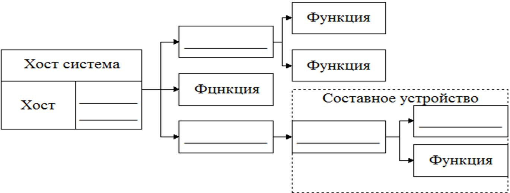
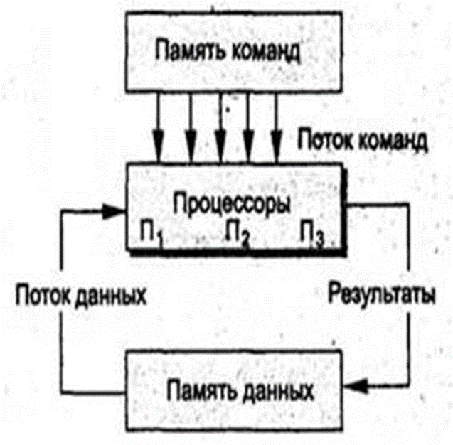
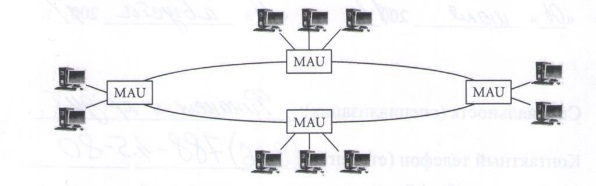
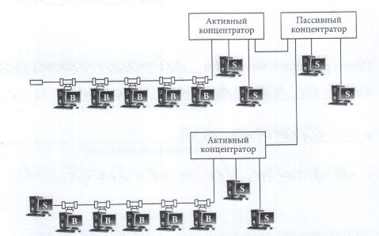
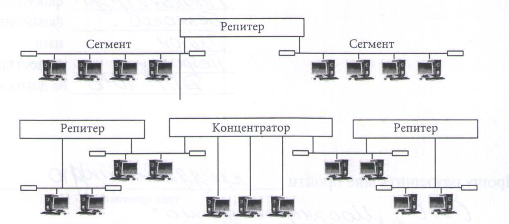
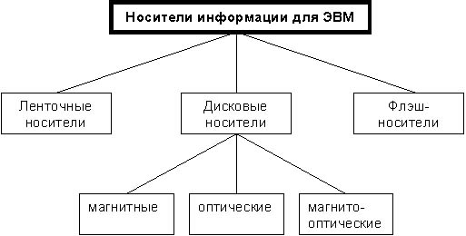

## Методички

### Информатика

- [Информатика и информационно-коммутационные технологии. Часть 1](http://e-biblio.ru/book/bib/01_informatika/informatica/sg/sg_part1.html)
- [Информатика и информационно-коммутационные технологии. Часть 2](http://e-biblio.ru/book/bib/01_informatika/informatica/sg/sg_part2.html)
- [Вычислительные системы, сети и телекоммуникации](http://e-biblio.ru/book/bib/01_informatika/vychislit_sistemy_&_seti/sg.html)
- [Программная инженерия](http://e-biblio.ru/book/bib/01_informatika/prog_ingeneriya/sg.html)
- [Информационные системы и технологии](http://e-biblio.ru/book/bib/01_informatika/informacionnye_sistemy_i_texnologii/sg.html)
- [Интеоектуальные информационные системы](http://e-biblio.ru/book/bib/01_informatika/intellekt_inf_systems/sg.html)
- [Сервисный подход в управлении ИТ](http://e-biblio.ru/book/bib/01_informatika/service_podhod_v_upravlenii_IT/sg.html)
- [Теория программирования 1](http://e-biblio.ru/book/bib/01_informatika/ProgBK_pt2/Book_teria_prog_1.html)
- [Теория программирования 2](http://e-biblio.ru/book/bib/01_informatika/ProgBK_pt2/Book_teria_prog_2.html)
- [Технические средства информатизации](http://e-biblio.ru/book/bib/01_informatika/Tehnich_sredstva_inform/sg.htm)

### Экономика

- [Экономика](http://e-biblio.ru/book/bib/09_ekonomika/economica/sg.html)
- [Иммитационное моделирование экономических процессов](http://e-biblio.ru/book/bib/09_ekonomika/imitac_modelir_econom_processov/sg.html)
- [Теория экономических информационных систем](http://e-biblio.ru/book/bib/09_ekonomika/teor_econom_inform_system/sg.html)
- [Финансовый менеджмент](http://e-biblio.ru/book/bib/09_ekonomika/finansovyj_menegment/sg.html)
- [Сетевая экономика](http://www.e-biblio.ru/book/bib/09_ekonomika/setevaya_ekonomika/YP.html)
- [Электронная коменрция](md/books/7cb0e2ceaab67895c7f03c42a467b97a.pdf)
- [Мировая экономика](http://www.e-biblio.ru/book/bib/09_ekonomika/mir_econom/sg.html)
- [Макроэкономика](http://www.e-biblio.ru/book/bib/09_ekonomika/Makroekonomika/new/sg.html)
- [Экономика для менеджеров](http://e-biblio.ru/book/bib/Sinergia/ek-managment/sg.html)

**1. Теоретические вопросы на знание базовых понятий и принципов**

1. +- [Понятия: данные, информация, знания. Свойства информации.](#q1-1)
2. -- [Понятие файловой системы. Отличие файловых систем друг от друга.](#q1-2)
3. ++ [Назначение центрального процессора. Внутренняя организация процессора. микропроцессоров. Понятие конвейеризации. Системы команд и прерываний. Современные модели микропроцессоров для ПК](#q1-3)
4. ++ [Составные части операционной системы отдельного компьютера.](#q1-4)
5. ++ [Многоуровневая, клиент-серверная и файл-серверная технологии. Blade серверы.](#q1-5)
6. +- [Компьютерные вирусы: определение, классификация по среде «обитания» и способам заражения.](#q1-6)
7. +- [Антивирусные программы: классификация и принципы работы.](#q1-7)
8. +- [Программы сжатия данных: возможности и принципы работы.](#q1-8)
9. +- [Понятие архитектуры информационной системы и АРМ.](#q1-9)
10. +- [Базовые компоненты универсального компьютера архитектуры Джон Фон-Неймана. Основной принцип построения ЭВМ.](#q1-10)
11. +- [Общие принципы подключения и работы периферийных устройств.](#q1-11)
12. [Принципы хранения данных на твердотельных, магнитных и оптических носителях.](#q1-12)
13. [Основные принципы построения компьютерных сетей.](#q1-13)
14. [Видеосистемы: состав и основные принципы работы. Представление видеоинформации в ПК.](#q1-14)
15. [Ресурсо\- и энергосберегающие технологии использования вычислительной техники.](#q1-15)
16. [Физическая природа звука. Принципы восприятия звука человеком. Акустические системы и звуковые карты. Представление аудиоинформации в ПК.](#q1-16)
17. [Понятие и свойства алгоритма. Язык схем.](#q1-17)
18. [Управляющие конструкции алгоритмического языка. Основные структуры алгоритмов.](#q1-18)
19. [Представление данных в ПК. Системы счисления и единицы измерения информации.](#q1-19)
20. [Понятие переменной в языках программирования высокого уровня.](#q1-20)
21. [Массивы, стеки, деки, деревья в языках программирования высокого уровня.](#q1-21)
22. [Обзор версий MS WINDOWS. Назначение и основные функции MS WINDOWS 10. Преимущества и недостатки MS WINDOWS 10.](#q1-22)
23. [Корпоративные компьютерные сети: принципы организации.](#q1-23)
24. [Основные требования, предъявляемые к современным операционным системам.](#q1-24)
25. [Типы локальных сетей. Модель OSI.](#q1-25)
26. [Способы классификации информации. Атрибутивные, динамические и прагматические свойства информации.](#q1-26)
27. [Характеристика глобальной сети Internet. Протоколы сети Internet. Типы Internet-сервисов.](#q1-27)
28. [Системы управления базами данных: классификация, возможности и тенденции развития.](#q1-28)
29. [Устройство системного блока. Типы корпусов и блоков питания.](#q1-29)
30. [Устройство и параметры материнской платы. Назначение устройств размещаемых на материнской плате.](#q1-30)
31. [Устройство и параметры связки видеокарта, монитор, сканер и принтер.](#q1-31)
32. [Нестандартные периферийные устройства: классификация, назначение и параметры.](#q1-32)
33. [Сетевые устройства: классификация и основные принципы работы.](#q1-33)
34. [Организация и устройство оперативной памяти в ПК.](#q1-34)

**2. Вопросы по направленности «Прикладная информатика в экономике»**

1. [Угрозы информационной безопасности.](#q2-1)
2. [Средства защиты информации.](#q2-2)
3. [Защита информации от утечки по техническим каналам.](#q2-3)
4. [Основные нормативные документы РФ по защите информации.](#q2-4)
5. [Защита государственной тайны.](#q2-5)
6. [Сетевые протоколы в Internet и принципы сетевых взаимодействий через сеть Internet между прикладным программным обеспечением в соответствии с моделью OSI.](#q2-6)
7. [Информационный менеджмент и место IT менеджера на предприятии.](#q2-7)
8. [Стратегии внедрения информационных систем. Факторы, влияющие на выбор стратегии.](#q2-8)
9. [Стратегии автоматизации деятельности компании. Факторы, влияющие на выбор стратегии.](#q2-9)
10. [Системы управления базами данных: классификация, возможности и тенденции развития.](#q2-10)
11. [OLAP и OLTP технологии. Big  Data. Data mining](#q2-11)
12. [Структуры и модели данных (реляционная, иерархическая, сетевая).](#q2-12)
13. [Стандарты MRP, MRP II, ERP, ERP II: основные принципы, применение.](#q2-13)
14. [Жизненный цикл разработки программного обеспечения. Модели жизненного цикла разработки. программного обеспечения.](#q2-14)
15. [Состав и содержание работ по этапам жизненного цикла разработки программного обеспечения.](#q2-15)
16. [Программное обеспечение автоматизации банковской деятельности.](#q2-16)
17. [Типовая организационная структура российского коммерческого банка.](#q2-17)
18. [Основные процессы банковской деятельности.](#q2-18)
19. [Автоматизация бизнес-процессов в банке.](#q2-19)
20. [Автоматизация процессов управления банковской деятельности.](#q2-20)
21. [Бухгалтерские информационные системы.](#q2-21)
22. [Налоговые информационные системы.](#q2-22)
23. [Статистические информационные системы.](#q2-23)
24. [Информационные системы экономического анализа.](#q2-24)
25. [Системы классификации и кодирования предприятий и организаций в РФ.](#q2-25)
26. [Информационные системы в страховании.](#q2-26)
27. [Информационные системы управления бюджетным процессом.](#q2-27)
28. [Корпоративные информационные системы.](#q2-28)
29. [CRM-системы.](#q2-29)
30. [Информационные системы управления проектами.](#q2-30)
31. [Система экономической документации.](#q2-31)
32. [Модели представления знаний.](#q2-32)
33. [Системы электронного документооборота.](#q2-33)
34. [Функциональная модель информационной системы.](#q2-34)
35. [Системы моделирования предметных областей в экономике.](#q2-35)

**3. Теоретические вопросы на понимание терминологии, понятий и принципов по предметной области прикладной информатики**

1. [Может ли пользователь самостоятельно осуществлять калибровку сканера? Обоснуйте ответ.](#q3-1)
2. [Нарушает ли производство интегрированных материнских плат принципы открытой архитектуры? Обоснуйте ответ.](#q3-2)
3. [Может ли пользователь самостоятельно осуществлять калибровку монитора? Обоснуйте ответ.](#q3-3)
4. [Целесообразно ли приобретать комплектующее в “OEM” исполнении для сборки ПК компьютерной компанией? Обоснуйте ответ.](#q3-4)
5. [Целесообразно ли приобретать комплектующее в “Retail” исполнении для сборки ПК компьютерной компанией? Обоснуйте ответ.](#q3-5)
6. [Для повышения быстродействия системы необходимо установить оперативную память с синхронным или асинхронным интерфейсом? Обоснуйте ответ.](#q3-6)
7. [Для повышения быстродействия системы целесообразно использовать статическую или динамическую оперативную память? Обоснуйте ответ.](#q3-7)
8. [При разработке операционных систем учитываются архитектурные или микроархитектурные особенности процессоров? Обоснуйте ответ.](#q3-8)
9. [Какой источник бесперебойного питания: постоянно действующий или интерактивный следует установить для повышения отказоустойчивости вычислительной системы. Обоснуйте ответ.](#q3-9)
10. [Какую пропускную способность: симметричную или асимметричную выгоднее использовать при доступе к сети Internet через цифровой модем? Обоснуйте ответ.](#q3-10)
11. [Какой из двух подходов к анализу данных (построение регламентированных отчетов или Data Mining) обеспечивает более широкие возможности? Обоснуйте ответ.](#q3-11)
12. [Какой из двух типов сетей (одноранговые сети или сети на основе сервера) целесообразно использовать для обеспечения полного контроля над всеми рабочими местами? Обоснуйте ответ.](#q3-12)
13. [В каком случае говорят, что отношение находится в 3 нормальной форме. Обоснуйте ответ. Приведите пример.](#q3-13)
14. [Какой из двух типов сетей (одноранговые сети или сети на основе сервера) целесообразно использовать для объединения небольшого числа компьютеров при отсутствии строгой защиты данных? Обоснуйте ответ.](#q3-14)
15. [Какие проблемы могут возникать при работе с базой данных, находящейся в первой нормальной форме? Приведите примеры.](#q3-15)
16. [Какие проблемы могут быть решены с помощью обеспечения выполнения ограничений целостности при проектировании базы данных? Приведите примеры.](#q3-16)
17. [Что необходимо сделать администратору базы данных для обеспечения безопасности?](#q3-17)
18. [Какие действия необходимо предпринять администратору для восстановления данных при случайном удалении некоторой информации пользователем?](#q3-18)
19. [Необходимо ли предпринять какие-либо действия администратору в случае, если произошел сбой системы при выполнении транзакции? Обоснуйте ответ.](#q3-19)
20. [Как формируется сеть WiFi? Зачем используют MiMo и MASH системы ?](#q3-20)

**4. Задания на умение использовать полученные знания и навыки для**
**решения профессиональной задачи**

1. [Опишите технические параметры следующего устройства: Процессор Intel "Pentium G620" (2.60ГГц, 2x256КБ+3МБ, EM64T, GPU) Socket1155.](#q4-1)
2. [Опишите технические параметры следующего устройства: Мат. плата Socket1155 ASUS "P8H61 EVO" rev.3.0 (iH61, 2xDDR3, SATA III, SATA II, PCI-E, SB, 1Гбит LAN, USB2.0, USB3.0, ATX).](#q4-2)
3. [Опишите технические параметры следующего устройства: Intel "Core i5-660" (3.33ГГц, 2x256КБ+4МБ, EM64T, GPU) Socket1156.](#q4-3)
4. [Опишите технические параметры следующего устройства: Socket 1156 GIGABYTE "GA-H55M-D2H" (iH55, 2xDDR3, SATA II, U133, 2xPCI-E, D-Sub, DVI, HDMI, SB, 1Гбит LAN, USB2.0, mATX).](#q4-4)
5. [Восстановите топологию интерфейса USB по представленному рисунку:](#q4-5)
    

6. [Укажите основные технические параметры для домашнего компьютера.](#q4-6)

    |     |           |          |          |            |         |
    | --- | --------- | -------- | -------- | ---------- | ------- |
    | Тип | Процессор | Объем ОП | Объем ЖД | Видеокарта | Монитор |

7. [Рассчитать объем следующего графического файла: разрешение 800*600 пикселей, 65536 цветов.](#q4-7)
8. [Выберите модуль памяти для следующей материнской платы:](#q4-8)
    Материнская плата Socket 1156 GIGABYTE "GA-H55M-D2H" (iH55, 2xDDR3, SATA II, U133, 2xPCI-E, D-Sub, DVI, HDMI, SB, 1Гбит LAN, USB2.0, mATX)
    1.  Модуль памяти 512МБ DDR SDRAM Patriot (PC3200, 400МГц)
    2.  Модуль памяти 2ГБ DDR3 SDRAM Kingston "Hyper X" KHX1600C9AD3B1/2G (PC12800, 1600МГц, CL9)
    3.  Модуль памяти 2ГБ DDR2 SDRAM Kingston "ValueRAM" KVR800D2N6/2G (PC6400, 800МГц, CL6)
    4.  Модуль памяти RIMM 512Мб, PC3200/800МГц Samsung (SEC-1)
9. [Выберите процессор для следующей материнской платы:](#q4-9)
    Мат. плата SocketFM1 GIGABYTE "GA-A75N-USB3" (AMD A75, 2xDDR3, SATA III, RAID, PCI-E, DVI, HDMI, SB, 1Гбит LAN, USB2.0, USB3.0, mini-ITX)
    Процессор
    1.  Процессор AMD "A4-3400" (2.70ГГц, 2x512КБ, GPU) SocketFM1
    2.  Процессор Intel "Celeron G530" (2.40ГГц, 2x256КБ+2МБ, EM64T, GPU) Socket1155
    3.  Процессор Intel "Core i3-540" (3.06ГГц, 2x256КБ+4МБ, EM64T, GPU) Socket1156
10. [Схема какой архитектуры приведена на рисунке?](#q4-10)
    
    

    A) SISD 
    B) SIMD
    C) MISD
    D) MIMD 

11. [Схема какой архитектуры приведена на рисунке? ](#q4-11)
    
    

    1.  SISD 
    2.  SIMD
    3.  MISD
    4.  MIMD

12. [Определите принцип действия ЭВМ, обрабатывающей информацию, представленную в непрерывной (аналоговой) форме, то есть в виде непрерывного ряда значений какой-либо физической величины (чаще всего электрического напряжения):](#q4-12)
    A) Цифровая ЭВМ;
    B) Аналоговая ЭВМ;
    C) Гибридная ЭВМ.
13. [Определите принцип действия ЭВМ, работающей с информацией, представленной и в цифровой, и в аналоговой форме; используемой для решения задач управления сложными быстродействующими техническими комплексами.](#q4-13)
    A) Цифровая ЭВМ;
    B) Аналоговая ЭВМ;
    C) Гибридная ЭВМ.
14. [Приведите данное отношение к 3 нормальной форме](#q4-14)

    |          |                     |            |                    |                 |       |              |            |                   |
    | -------- | ------------------- | ---------- | ------------------ | --------------- | ----- | ------------ | ---------- | ----------------- |
    | № Заказа | Наименование товара | Тип товара | Кол-во (заказанно) | Цена за единицу | Склад | Адрес склада | Постав-щик | Адрес постав-щика |

15. [Каким образом преобразуются входные данные длиной 400 бит при проведении операции хэширования в соответствии с отечественным стандартом хэширования ГОСТ Р 34.11–94?](#q4-15)
Входные данные (400 бит)

16. [Определите технические параметры ПК в соответствии с его типом (сервер, домашний ПК и так далее).](#q4-16)

    | Тип                                 | Процессор | Объем ОП | Объем ЖД | Видеокарта | Монитор |
    | ----------------------------------- | --------- | -------- | -------- | ---------- | ------- |
    | Сервер                              |           |          |          |            |         |
    | Игровой компьютер                   |           |          |          |            |         |
    | Дизайнер­ский для работы с графикой  |           |          |          |            |         |
    | Домашний                            |           |          |          |            |         |
    | Офисный                             |           |          |          |            |         |

17. [Рассчитайте объем звукового файла по представленным данным: частота дискретизации — 8 КГц, разрядность — 8 битов, время записи — 10 с.](#q4-17)
18. [Определите тип топологии Информационно-вычислительной сети:](#q4-18)

**5. Вопросы по дисциплине «Экономика»**

1. [ВВП и ВНП страны и методы их подсчета.](#q5-1)
2. [Деньги: их сущность и функции. Современные виды денег. Денежно-кредитная политика государства.](#q5-2)
3. [Инфляция; ее причины, типы и виды. Социально-экономические последствия инфляции.](#q5-3)
4. [Монополия, ее сущность, виды, поведение на рынке. Антимонопольная политика государства.](#q5-4)
5. [Определение и изменение экономического роста. Факторы и типы экономического роста.](#q5-5)
6. [Понятие рыночных структур и их типы. Основные правила поведения фирмы в различных рыночных структурах.](#q5-6)
7. [Понятие факторов производства и виды доходов. Предельная производительность факторов производства.](#q5-7)
8. [Распределение доходов в рыночной экономике и их измерения. Кривая Лоренца и коэффициент Джинни.](#q5-8)
9. [Роль и экономические функции государства. Методы и инструменты государственного регулирования экономики.](#q5-9)
10. [Рыночное равновесие спроса и предложения. Нарушение рыночного равновесия. Понятие устойчивости рыночного равновесия.](#q5-10)
11. [Совокупный спрос и совокупное предложение, и их взаимосвязь. Сущность и условия макроэкономического равновесия. Эластичность спроса и предложения.](#q5-11)
12. [Сущность, функции и структура рынка. Рыночная инфраструктура.](#q5-12)
13. [Фискальная политика государства, ее цели и инструменты. Налоги, их виды и принципы налогообложения.](#q5-13)
14. [Экономическое содержание государственного бюджета и его структура.](#q5-14)
15. [Ценные бумаги и их классификация.](#q5-15)

---

## Понятия: данные, информация, знания. Свойства информации.

## Понятие файловой системы. Отличие файловых систем друг от друга.

## Назначение центрального процессора. Внутренняя организация процессора. микропроцессоров. Понятие конвейеризации. Системы команд и прерываний. Современные модели микропроцессоров для ПК

## Составные части операционной системы отдельного компьютера.

## Многоуровневая, клиент-серверная и файл-серверная технологии. Blade серверы.

## Компьютерные вирусы: определение, классификация по среде «обитания» и способам заражения.

## Антивирусные программы: классификация и принципы работы.

## Программы сжатия данных: возможности и принципы работы.

## Понятие архитектуры информационной системы и АРМ.

## Базовые компоненты универсального компьютера архитектуры Джон Фон-Неймана. Основной принцип построения ЭВМ.

## Периферийные устройства подразделяются на 3 большие группы:

- стандартные устройства — аудио, принтеры, сканеры, модемы итд.
- нестандартные устройства — мфу, игровые устройства, фото-видео камеры, спец.наушники, микрофоны, синтезаторы, веб-камеры, итд.
- устройства сопряжения — специальные адаптеры (контроллеры) для подключения внешних устройств (кассовые аппараты, охранные системы, телеметрическое наблюдение, системы контроля, итд.)

Адаптер — средство связи (сопряжения) какого-либо устройства с какой-либо шиной или интерфейсом компьютера.

Контроллер — способен к самостоятельным действиям после получения команд от обслуживающей его программы.

Все внешние интерфейсы компьютера тоже имеют свои адаптеры и контроллеры. для взаимодействия с программой адаптеры и контроллеры обычно имеют регистры ввода и вывода. Для работы используются механизмы аппаратных прерываний, для сигнализации программе о событиях происходящих в периферийных устройствах. для обмена информацией с устройствами применяется механизм прямого доступа к памяти DMA (Direct Memory Access) а также прямое управление шиной.

Системные устройства (СУ) — это устройства, занимающие какие-либо свои системные ресурсы, порты ввода-вывода, ячейки памяти, линии запросов прерывания или каналы DMA. Пример системного устройства: Оперативная память. СУ могут располагаться на материнской плате или картах расширения, устанавливаемых в шины расширения.

Периферийные устройства — подключаются к тем или иным интерфейсам системных устройств. Винчестер подключаемый к контроллеру ATA материнской платы, является периферийным устройством. Процессор к нему обращается через контроллер ATA. Контроллер ATA в свою очередь является системным устройством (занимает ресурсы, прерывания независимо от использования).

Драйверы — это специальное ПО (программные модули содержащие процедуры работы с устройствами) нужное для правильного функционирования устройств. Наличие драйверов, облегчает задачу программистам, избавляя их от надобности писать аппаратно-зависимые процедуры, для всех известных моделе тех или иных устройств. Избавляет от написания или изменения программ, при появлении новых устройств.

Стандартные периферийные устройства — эти устройства подключаются к сист.блоку через строго определенные разъемы и шины.

Устройством сопряжения (УС) — называется любое устройство, обеспечивающее взаимодействие между двумя техническими средствами (системами).

Подключения УС через:
— через системную магистраль или шину (PCI — Peripheral Component Interconnect) — наибольшая скорость обмена
— через универсальную последовательную шину (USB, Universal Serial Bus) — (спецификации USB 2.0, 3.0 — чем больше цифра, тем больше скорость). Интерфейс USB соединяет между собой ХОСТ и устройства. Для подключения к хосту нескольких устройств, используется ХАБ. Корневой ХАБ подключен к ХОСТУ. В каждом устройстве, используется микропроцессорный блок, обеспечивающий поддержку сложного протокола USB. Преимущества USB: Большая скорость передачи данных, отсутствие необходимости устанавливать УС внутрь системного блока, возможность подключения нескольких устройств, малые размеры разъема.
— через параллельный интерфейс (LPT порт)

## Принципы хранения данных на твердотельных, магнитных и оптических носителях.

- http://inftis.narod.ru/it/n7.htm
- https://teletype.in/@fffarang/BJqVX7AMQqq

Устройства хранения данных
Устройства хранения данных, как показано на рис. 1, выполняют чтение информации с магнитных, оптических или полупроводниковых носителей, а также осуществляют запись на них. Привод используется для постоянного хранения данных или получения информации с дискового носителя.

Ниже приведены наиболее распространенные типы устройств хранения.

- Жесткие диски (HDD) — традиционные магнитные дисковые накопители, которые используются уже не одно десятилетие. Емкость жестких дисков варьируется от гигабайтов (ГБ) до терабайтов (ТБ). Скорость вращения такого диска измеряется в оборотах в минуту. Это скорость, с которой вращается шпиндель с пластинами, на которых записаны данные. Чем выше скорость вращения шпинделя, тем быстрее жесткий диск получает данные с пластин. Наиболее широкое распространение получили жесткие диски со скоростью вращения 5400, 7200 и 10 000 оборотов в минуту.
- Твердотельные накопители (SSD) — энергонезависимые запоминающие устройства для хранения данных. Они работают намного быстрее магнитных жестких дисков. Емкость таких дисков варьируется от гигабайтов (ГБ) до терабайтов (ТБ). В твердотельных накопителях отсутствуют подвижные детали, поэтому они абсолютно бесшумные и более энергоэффективные, а также выделяют меньше тепла, чем магнитные жесткие диски. Носители SSD имеют такие же формфакторы, что и магнитные жесткие диски, и стремительно вытесняют последние с рынка устройств хранения данных.
- Гибридные диски — также называемые твердотельными гибридными накопителями (SSHD), представляют собой компромисс между магнитными жесткими дисками и твердотельными накопителями. Они работают быстрее, чем HDD, однако стоят меньше, чем SSD. Такой накопитель представляет собой магнитный HDD со встроенным SSD, который используется в качестве кэша. Накопитель SSHD автоматически кэширует часто используемые данные.
- Привод оптических дисков — в приводе оптических дисков для чтения данных с носителей используется лазер. Существует три типа оптических дисков: компакт-диски (CD), универсальные цифровые диски (DVD) и диски Blu-ray (BD). Компакт-диски, диски DVD и диски Blu-ray бывают только для чтения, записываемые (однократная запись) или перезаписываемые (многократное чтение и запись). В таблице на рис. 2 представлены сведения о различных типах оптических носителей и их приблизительная емкость.
- Магнитные ленты — используются в большинстве случаев для архивирования данных. В ленточном накопителе используется магнитная головка чтения и записи. Скорость получения данных с ленточного накопителя может быть очень высокой, однако поиск определенных данных может занимать очень много времени, поскольку лента должна перематываться с катушки на катушку до момента нахождения данных. Емкость наиболее распространенных ленточных накопителей варьируется от гигабайтов (ГБ) до терабайтов (ТБ).
- Внешний флэш-диск — такие накопители, например как флэш-карта памяти USB, подключаются к порту USB. Во внешнем флэш-диске используется тот же тип энергозависимой памяти, что и в SSD. Ему не нужно электропитание для хранения данных. Емкость таких дисков также варьируется от мегабайтов (МБ) до гигабайтов (ГБ).

Примечание. На старых компьютерах могут по-прежнему быть установлены устаревшие устройства хранения данных, такие как приводы гибких дисков.

## Основные принципы построения компьютерных сетей.

- https://tsput.ru/res/informat/sist_seti_fmo/lekcii/lekciy-7.html

**Преимущества использования компьютерных сетей**

Рассмотрим преимущества, получаемые при сетевом объединении персональных компьютеров.

- Разделение ресурсов
  Разделение ресурсов позволяет экономно использовать ресурсы, например, управлять периферийными устройствами, такими как лазерные печатающие устройства, со всех присоединенных рабочих станций.
- Разделение данных
  Разделение данных предоставляет возможность доступа и управления базами данных с периферийных рабочих мест, нуждающихся в информации
- Разделение программных средств
  Разделение программных средств предоставляет возможность одновременного использования централизованных, ранее установленных программных средств.
- Разделение ресурсов процессора
  При разделение ресурсов процессора возможно использование вычислительных мощностей для обработки данных другими системами, входящими в сеть. Предоставляемая возможность заключается в том, что на имеющиеся ресурсы не "набрасываются" моментально, а только лишь через специальный процессор, доступный каждой рабочей станции.
- Многопользовательский режим
  Многопользовательские свойства системы содействуют одновременному использованию централизованных прикладных программных средств, ранее установленных и управляемых, например, если пользователь системы работает с другим заданием, то текущая выполняемая работа отодвигается на задний план.

Искусственные и реальные сети.
- Территориальная распространенность.
- Ведомственная принадлежность.
- Скорость передачи информации.
- Тип среды передачи информации.
- Топология компьютерных сетей.
- Одноранговые и иерархические сети.

**Искусственные и реальные сети**

По способу организации сети подразделяются на реальные и искусственные.
***Искусственные сети***  (псевдосети) позволяют связывать компьютеры вместе через последовательные или параллельные порты и не нуждаются в дополнительных устройствах. Иногда связь в такой сети называют связью по нуль-модему (не используется модем). Само соединение называют нуль-модемным. Искусственные сети используются когда необходимо перекачать информацию с одного компьютера на другой. MS-DOS и windows снабжены специальными программами для реализации нуль-модемного соединения.
*Основной недостаток*  \- низкая скорость передачи данных и возможность соединения только двух компьютеров.
***Реальные сети***  позволяют связывать компьютеры с помощью специальных устройств коммутации и физической среда передачи данных.
*Основной недостаток*  \- необходимость в дополнительных устройствах.
В дальнейшем употребляя термин компьютерная сеть будем иметь в ввиду реальные сети.
Все многообразие компьютерных сетей можно классифицировать по группе признаков:

1.  Территориальная распространенность;
2.  Ведомственная принадлежность;
3.  Скорость передачи информации;
4.  Тип среды передачи;
5.  Топология;
6.  Организация взаимодействия компьютеров.

**Территориальная распространенность**

По территориальной распространенности сети могут быть локальными, глобальными, и региональными.
*Локальные*  \- это сети, перекрывающие территорию не более 10 м2
*Региональные*  \- расположенные на территории города или области
*Глобальные*  на территории государства или группы государств, например, всемирная сеть Internet.
В классификации сетей существует два основных термина: LAN и wAN.

***LAN (Local Area Network)***  \- локальные сети, имеющие замкнутую инфраструктуру до выхода на поставщиков услуг. Термин "LAN" может описывать и маленькую офисную сеть, и сеть уровня большого завода, занимающего несколько сотен гектаров. Зарубежные источники дают даже близкую оценку - около шести миль (10 км) в радиусе; использование высокоскоростных каналов.

***wAN (wide Area Network)***  \- глобальная сеть, покрывающая большие географические регионы, включающие в себя как локальные сети, так и прочие телекоммуникационные сети и устройства. Пример wAN - сети с коммутацией пакетов (Frame relay), через которую могут "разговаривать" между собой различные компьютерные сети.
Термин "*корпоративная сеть*" также используется в литературе для обозначения объединения нескольких сетей, каждая из которых может быть построена на различных технических, программных и информационных принципах.
Локальные сети являются сетями закрытого типа, доступ к ним разрешен только ограниченному кругу пользователей, для которых работа в такой сети непосредственно связана с их профессиональной деятельностью. Глобальные сети являются открытыми и ориентированы на обслуживание любых пользователей.

**Ведомственная принадлежность**

По принадлежности различают ведомственные и государственные сети.
*Ведомственные*  принадлежат одной организации и располагаются на ее территории.
*Государственные*  сети \- сети, используемые в государственных структурах.

**Скорость передачи информации**

По скорости передачи информации компьютерные сети делятся на низко\-, средне\- и высокоскоростные.

- низкоскоростные (до 10 Мбит/с),
- среднескоростные (до 100 Мбит/с),
- высокоскоростные (свыше 100 Мбит/с);

Для определения скорости передачи данных в сети широко используется  *бод*.
Бод (Baud) – единица скорости передачи сигнала, измеряемая числом дискретных переходов или событий в секунду. Если каждое событие представляет собой один бит, бод эквивалентен бит/сек (в реальных коммуникациях это зачастую не выполняется).

**Тип среды передачи информации**

По типу среды передачи сети разделяются на:
*проводные* коаксиальные, на витой паре, оптоволоконные
*беспроводные* с передачей информации по радиоканалам, в инфракрасном диапазоне.

**Топология компьютерных сетей**

Введем определения.
*Узел сети*  представляет собой компьютер, либо коммутирующее устройство сети.
*Ветвь сети*  \- это путь, соединяющий два смежных узла.
Узлы сети бывают трёх типов:

- оконечный узел \- расположен в конце только одной ветви;
- промежуточный узел \- расположен на концах более чем одной ветви;
- смежный узел \- такие узлы соединены по крайней мере одним путём, не содержащим никаких других узлов.

Способ соединения компьютеров в сеть называется её  *топологией.*
Наиболее распространенные виды топологий сетей:

***Линейная сеть***

Содержит только два оконечных узла, любое число промежуточных узлов и имеет только один путь между любыми двумя узлами.

***Кольцевая сеть***

Сеть, в которой к каждому узлу присоединены две и только две ветви.

***Звездообразная сеть***

Сеть, в которой имеется только один промежуточный узел.

***Общая шина***

В этом случае подключение и обмен данными производится через общий канал связи, называемый общей шиной.

***Древовидная сеть***

Сеть, которая содержит более двух оконечных узлов и по крайней мере два промежуточных узла, и в которой между двумя узлами имеется только один путь.

***Ячеистая сеть***

Сеть, которая содержит по крайней мере два узла, имеющих два или более пути между ними.

***Полносвязная сеть***
Сеть, в которой имеется ветвь между любыми двумя узлами.

**Одноранговые и иерархические сети**

С точки зрения организации взаимодействия компьютеров, сети делят на одноранговые (Peer-to-Peer Network) и с выделенным сервером (Dedicated Server Network).

***Одноранговые сети***
Все компьютеры одноранговой сети равноправны. Любой пользователь сети может получить доступ к данным, хранящимся на любом компьютере.
Одноранговые сети могут быть организованы с помощью таких операционных систем, как LANtastic, windows'3.11, Novell Netware Lite. Указанные программы работают как с DOS, так и с windows. Одноранговые сети могут быть организованы также на базе всех современных 32-разрядных операционных систем - windows 9x\\ME\\2k, windows NT workstation версии, OS/2) и некоторых других.
*Достоинства одноранговых сетей:*

1.  Наиболее просты в установке и эксплуатации.
2.  Операционные системы DOS и windows обладают всеми необходимыми функциями, позволяющими строить одноранговую сеть.

*Недостатки:*
В условиях одноранговых сетей затруднено решение вопросов защиты информации. Поэтому такой способ организации сети используется для сетей с небольшим количеством компьютеров и там, где вопрос защиты данных не является принципиальным.

***Иерархические сети***
В иерархической сети при установке сети заранее выделяются один или несколько компьютеров, управляющих обменом данных по сети и распределением ресурсов. Такой компьютер называют  *сервером.*
Любой компьютер, имеющий доступ к услугам сервера называют клиентом сети или рабочей станцией.
Сервер в иерархических сетях \- это постоянное хранилище разделяемых ресурсов. Сам сервер может быть клиентом только сервера более высокого уровня иерархии. Поэтому иерархические сети иногда называются сетями с выделенным сервером.
Серверы обычно представляют собой высокопроизводительные компьютеры, возможно, с несколькими параллельно работающими процессорами, с винчестерами большой емкости, с высокоскоростной сетевой картой (100 Мбит/с и более).
Иерархическая модель сети является наиболее предпочтительной, так как позволяет создать наиболее устойчивую структуру сети и более рационально распределить ресурсы.
Также достоинством иерархической сети является более высокий уровень защиты данных.
К недостаткам иерархической сети, по сравнению с одноранговыми сетями, относятся:

1.  Необходимость дополнительной ОС для сервера.
2.  Более высокая сложность установки и модернизации сети.
3.  Необходимость выделения отдельного компьютера в качестве сервера.

***Две технологии использования сервера***
Различают две технологии использования сервера: технологию *файл-сервера* и архитектуру *клиент-сервер*.
В первой модели используется *файловый сервер*, на котором хранится большинство программ и данных. По требованию пользователя ему пересылаются необходимая программа и данные. Обработка информации выполняется на рабочей станции.
В системах с архитектурой клиент-сервер обмен данными осуществляется между *приложением-клиентом* (front-end) и *приложением-сервером* (back-end). Хранение данных и их обработка производится на мощном сервере, который выполняет также контроль за доступом к ресурсам и данным. Рабочая станция получает только результаты запроса. Разработчики приложений по обработке информации обычно используют эту технологию.
Использование больших по объему и сложных приложений привело к развитию многоуровневой, в первую очередь трехуровневой архитектуры с размещением данных на отдельном сервере базы данных (БД). Все обращения к базе данных идут через сервер приложений, где они объединяются.

## Видеосистемы: состав и основные принципы работы. Представление видеоинформации в ПК.

- http://book.kbsu.ru/theory/chapter2/1_2_14.html
- https://works.doklad.ru/view/KSX8k3-jS28/all.html
- http://www.kolomna-school7-ict.narod.ru/st20304.htm

Основным устройством вывода графических изображений является  ***дисплей***. Работой дисплея управляет  ***видеоконтроллер***. Употребляется также другой термин для обозначения этого устройства — видеоадаптер; в комплекте устройств ПК его еще называют  ***видеокартой***.

Основные представления об устройстве дисплея:

· дискретная (пиксельная) структура экрана;

· сетка пикселей (растр);

· сканирование растра электронным лучом;

· частота сканирования;

· трехцветная структура пикселя цветного монитора.

Видеоконтроллер состоит из двух частей:

1. видеопамяти

2. дисплейного процессора.

Основной универсальный для ЭВМ принцип заключается в том, компьютер работает с информацией, хранящейся в его памяти в двоичном виде. Следовательно, всякое изображение на экране \- это отражение информации в памяти ЭВМ — видеоинформации. Первоначально видеоинформация формируется в оперативной памяти (при открытии графического файла, при рисовании в графическом редакторе). Вывод на экран происходит в результате передачи видеоинформации контроллеру монитора: информация записывается в видеопамять и сразу же воспроизводится на экране, вследствие непрерывной работы дисплейного процессора, управляющего работой монитора. Таким образом, видеопамять является своеобразным буфером между ОЗУ и дисплеем. Смена «картинки» на экране является следствием смены содержимого видеопамяти. Система вывода на экран работает совершенно одинаково, не зависимо от того, какого рода информация выводится: текст ли это, неподвижный рисунок или анимация.

В качестве устройства ввода изображения с листа в компьютерную память используется сканер. Подчеркнуть взаимообратную функцию системы вывода изображения на экран и системы ввода изображения с помощью сканера (рис. 1).

Видеосистема компьютера состоит из трех компонент:

- **монитор**  (называемый также дисплеем);
- **видеоадаптер**;
- **программное обеспечение**  (драйверы видеосистемы).

**Видеоадаптер**  посылает в монитор сигналы управления яркостью лучей и синхросигналы строчной и кадровой развёрток.  **Монитор**  преобразует эти сигналы в зрительные образы. А  **программные средства**  обрабатывают видеоизображения — выполняют кодирование и декодирование сигналов, координатные преобразования, сжатие изображений и др.

*Монитор*  — устройство визуального отображения информации (в виде текста, таблиц, рисунков, чертежей и др.).

Подавляющее большинство мониторов сконструированы на базе  **электронно-лучевой трубки (ЭЛТ)**, и принцип их работы аналогичен принципу работы телевизора. Мониторы бывают алфавитно-цифровые и графические, монохромные и цветного изображения. Современные компьютеры комплектуются, как правило, цветными графическими мониторами.

### 1\. Монитор на базе электронно-лучевой трубки

Основной элемент дисплея —  **электронно-лучевая трубка**. Её передняя, обращенная к зрителю часть с внутренней стороны покрыта  **люминофором — специальным веществом, способным излучать свет при попадании на него быстрых электронов**.

Люминофор наносится в виде наборов точек трёх основных цветов —  **красного,  зелёного**  и  **синего**. Эти цвета называют основными, потому что их сочетаниями (в различных пропорциях) можно представить любой цвет спектра.

Наборы точек люминофора располагаются по треугольным триадам. Триада образует  **пиксел  — точку, из которых формируется изображение**  (англ. pixel — picture element, элемент картинки).

Расстояние между центрами пикселов называется  **точечным шагом монитора**. Это расстояние существенно влияет на чёткость изображения. Чем меньше шаг, тем выше чёткость. Обычно в цветных мониторах шаг составляет 0,24 мм. При таком шаге глаз человека воспринимает точки триады как одну точку "сложного" цвета.

На противоположной стороне трубки расположены три (по количеству основных цветов)  **электронные пушки.**  Все три пушки "нацелены" на один и тот же пиксел, но каждая из них излучает поток электронов в сторону "своей" точки люминофора. Чтобы электроны беспрепятственно достигали экрана, из трубки откачивается воздух, а между пушками и экраном создаётся высокое электрическое напряжение, ускоряющее электроны. Перед экраном на пути электронов ставится  **маска**  — тонкая металлическая пластина с большим количеством отверстий, расположенных напротив точек люминофора. Маска обеспечивает попадание электронных лучей только в точки люминофора соответствующего цвета.

Величиной электронного тока пушек и, следовательно, яркостью свечения пикселов, управляет сигнал, поступающий с видеоадаптера.

На ту часть колбы, где расположены электронные пушки, надевается  **отклоняющая система**  монитора, которая заставляет электронный пучок пробегать поочерёдно все пикселы строчку за строчкой от верхней до нижней, затем возвращаться в начало верхней строки и т.д.

Количество отображённых строк в секунду называется  **строчной частотой развертки.**  А частота, с которой меняются кадры изображения, называется  **кадровой частотой развёртки.**  Последняя не должна быть ниже 85 Гц, иначе изображение будет  **мерцать**.

### 2\. Жидкокристаллические мониторы

Все шире используются наряду с традиционными ЭЛТ-мониторами.  **Жидкие кристаллы**  — это особое состояние некоторых органических веществ, в котором они обладают текучестью и свойством образовывать пространственные структуры, подобные кристаллическим. Жидкие кристаллы могут изменять свою структуру и светооптические свойства под действием электрического напряжения. Меняя с помощью электрического поля ориентацию групп кристаллов и используя введённые в жидкокристаллический раствор вещества, способные излучать свет под воздействием электрического поля, можно создать высококачественные изображения, передающие более 15 миллионов цветовых оттенков.

Большинство ЖК-мониторов использует тонкую плёнку из жидких кристаллов, помещённую между двумя стеклянными пластинами. Заряды передаются через так называемую  **пассивную матрицу**  — сетку невидимых нитей, горизонтальных и вертикальных, создавая в месте пересечения нитей точку изображения (несколько размытого из-за того, что заряды проникают в соседние области жидкости).

**Активные матрицы**  вместо нитей используют прозрачный экран из транзисторов и обеспечивают яркое, практически не имеющее искажений изображение. Экран при этом разделен на независимые ячейки, каждая из которых состоит из четырех частей (для трёх основных цветов и одна резервная). Количество таких ячеек по широте и высоте экрана называют  **разрешением экрана.**  Современные ЖК-мониторы имеют разрешение 642х480, 1280х1024 или 1024х768. Таким образом, экран имеет от 1 до 5 млн точек, каждая из которых управляется собственным транзистором. По компактности такие мониторы не знают себе равных. Они занимают в 2 — 3 раза меньше места, чем мониторы с ЭЛТ и во столько же раз легче; потребляют гораздо меньше электроэнергии и не излучают электромагнитных волн, воздействующих на здоровье людей.

### 3\. Сенсорный экран

Общение с компьютером осуществляется путём прикосновения пальцем к определённому месту чувствительного экрана. Этим выбирается необходимый режим из меню, показанного на экране монитора. (**Меню**  — это выведенный на экран монитора список различных вариантов работы компьютера, по которому можно сделать конкретный выбор.) Сенсорными экранами оборудуют рабочие места операторов и диспетчеров, их используют  **в информационно-справочных системах**  и т.д.

## Ресурсо\- и энергосберегающие технологии использования вычислительной техники.

- https://studref.com/403040/informatika/resurso_energosberegayuschie_tehnologii_ispolzovaniya_sredstv_vychislitelnoy_tehniki

**Энергосберегающие процессоры**

Самый миниатюрный процессор Intel® Atom™ площадью менее 25 мм2 создан на базе совершенно новой микроархитектуры, разработанной специально для компактных устройств с малым энергопотреблением и высокой производительностью. Процессор предназначен специально для мобильных интернет-устройств (MID) и нового класса простых и доступных компьютеров.

Технологии управления, такие как технология Intel® vPro™, способствуют еще большему снижению энергопотребления устройств и в то же время предоставляют возможность дистанционного управления питанием и централизованного доступа к компьютерам. Одновременно обеспечиваются оптимальное энергосбережение и непрерывность бизнес-процессов, а также установка критически важных параметров системы информационной безопасности.

Энергосберегающий процессор Intel Core 2 Duo для мобильных систем обладает революционной производительностью и обеспечивает исключительную энергоэффективность — при сравнении годового энергопотребления средней настольной системы на базе двухъядерного процессора Pentium® 945 и ноутбука на базе процессорной технологии Centrino® Pro™ выяснится, что ноутбуку требуется в 17 раз меньше электроэнергии при большей производительности. Этот эффект особенно заметен при одновременной работе нескольких ресурсоемких приложений или при выполнении многопоточных задач.

- https://studfile.net/preview/3000237/page:3/

В начале 90-х годов компания EPA (Environmental Protection Agency— Агентство по защите окружающей среды) начало проводить кампанию по сертификации энергосберегающих персональных компьютеров и периферийного оборудования. Компьютер или монитор во время продолжительного простоя должен снизить энергопотребление до 30 Вт и более. Система, удовлетворяющая этим требованиям, может получить сертификат Energy Star.

В настоящее время в ПК нашли применение следующие энергосберегающие технологии:

Стандарт усовершенствованной системы управления питанием (Advanced Power

Management—APM) разработан фирмой Intel совместно с Microsoft и определяет ряд интерфейсов между аппаратными средствами управления питанием и операционной системой компьютера. Полностью реализованный стандарт APM позволяет автоматически переключать компьютер между пятью состояниями в зависимости от текущего состояния системы. Каждое последующее состояние в приведенном ниже списке характеризуется уменьшением потребления энергии.

Full On.Система полностью включена.

APM Enabled.Система работает,некоторые устройства являются объектамиуправления для системы управления питанием. Неиспользуемые устройства могут быть выключены, может быть также остановлена или замедлена (т.е. снижена тактовая частота) работа тактового генератора центрального процессора.

APM Standby (резервный режим).Система не работает,большинство устройствнаходятся в состоянии потребления малой мощности. Работа тактового генератора центрального процессора может быть замедлена или остановлена, но необходимые параметры функционирования хранятся в памяти. Пользователь или операционная система могут запустить компьютер из этого состояния почти мгновенно.

APM Suspend (режим приостановки).Система не работает,большинствоустройств пассивны. Тактовый генератор центрального процессора остановлен, а параметры функционирования хранятся на диске и при необходимости могут быть считаны в память для восстановления работы системы. Чтобы запустить систему из этого состояния, требуется некоторое время.

Off (система отключена).Система не работает.Источник питания выключен.

Для реализации режимов APM требуются аппаратные средства и программное обеспечение. Источниками питания ATX можно управлять с помощью сигнала Power_On и факультативного разъема питания с шестью контактами. (Необходимые для этого команды выдаются программой.) Изготовители также встраивают подобные устройства управления в другие элементы системы, например в системные платы, мониторы и дисководы. Операционные системы (такие как Windows), которые поддерживают APM, при наступлении соответствующих событий запускают программы управления питанием, ―наблюдая‖ за действиями пользователя и прикладных программ. Однако операционная система непосредственно не посылает сигналы управления питанием аппаратным средствам. Система может иметь множество различных аппаратных устройств и программных функций, используемых при выполнении функций APM. Чтобы разрешить проблему сопряжения этих средств в операционной системе и аппаратных средствах предусмотрен специальный абстрактный уровень, который облегчает связь между различными элементами архитектуры APM.

При запуске операционной системы загружается программа — драйвер APM, который связывается с различными прикладными программами и программными функциями. Именно они запускают действия управления питанием, причем все аппаратные средства, совместимые с APM, связываются с системной BIOS. Драйвер APM и BIOS связаны напрямую; именно эту связь использует операционная система для управления режимами аппаратных средств.

Таким образом, чтобы функционировали средства APM, необходим стандарт, поддерживаемый схемами, встроенными в конкретные аппаратные устройства системы, системная BIOS и операционная система с драйвером APM. Если хотя бы один из этих компонентов отсутствует, APMработать не будет.

Усовершенствованная конфигурация и интерфейс питания (Advanced Configuration and Power Interface— ACPI) впервые реализованы в современных BIOS и операционных системах Windows 98 и более поздних. Если BIOS компьютера поддерживает систему ACPI, то все управление питанием передается операционной системе. Это упрощает конфигурирование параметров, все они находятся в одном месте— в операционной системе. Теперь для конфигурирования параметров системы управления питанием не нужно устанавливать соответствующие параметры в BIOS. Система ACPI реализована только в самых новых компьютерах.

Стандарт DPMS (Display Power Management Signaling - система сигналов управления питанием монитора) ассоциации VESA определяет состав сигналов, передаваемых компьютером в монитор, при вхождении системы от состояния простоя в режимы пониженного потребления энергии. В этих системных процедурах контроль берет на себя драйвер, посылающий соответствующие сигналы через графическую карту. При нажатии клавиши на клавиатуре или движении "мыши" монитор переходит в нормальный режим работы.

**Технология Enhanced Intel SpeedStep**

Улучшенная технология SpeedStep (Enhanced Intel SpeedStep) дает пользователям возможность увеличить время автономной работы от батареи за счет динамического изменения напряжения ядра процессора и его тактовой частоты. Изменение условий работы процессора зависит от его загрузки (степени утилизации), от температурного режима, а также от установленных пользователем предпочтений через задания схемы энергопотребления (Power Schemes) в настройках операционной системы.

В отличие от предыдущей версии технологии Intel SpeedStep, предусматривающей возможность работы мобильного процессора лишь на двух тактовых частотах, улучшенная технология Enhanced Intel SpeedStep определяет использование нескольких возможных напряжений питания и частот (в совокупности — рабочих точек), что позволяет достичь лучшего соотношения «напряжение/частота» и более эффективного режима функционирования, когда производительность согласуется с рабочей нагрузкой.

Крайние рабочие точки процессора задаются аппаратно, а промежуточные точки устанавливаются программно. Управление переходами между различными рабочими точками выполняется только самим процессором и блоком регулятора напряжения (VRM).

Для установки требуемого напряжения процессор Intel Pentium M посылает служебные VID-последовательности непосредственно в VRM-модуль. При этом не используются никакие другие компоненты системы при осуществлении перехода между рабочими состояниями процессора.

- http://inftis.narod.ru/arx/arx-rsi.htm

**Ресурсо\- и энергосберегающие технологии использования вычислительной техники**

***Амортизация и сбои в электрической сети***
**Амортизация**  (или износ) в данном случае подразумевает старение компонентов персонального компьютера и, в первую очередь, содержимого системного блока.
Понятно, что ни одна вещь со временем не становится новее: в конце концов, любой материал в природе подвержен разложению – это так называемое естественное старение. Наряду с течением времени амортизации способствуют и другие факторы: наличие в устройстве движущихся частей, высокий температурный режим, неблагоприятная окружающая среда и др.
Высокий температурный режим – важная проблема компьютерной техники. Все внутренние устройства персонального компьютера (процессор, блок питания, печатные платы, приводы, жесткие диски) в процессе работы производят значительное количество тепла. Перегрев различных частей системного блока приводит к сбоям и полному выходу из строя персонального компьютера.

Для качественной сквозной вентиляции в переднюю часть корпуса системного блока можно установить дополнительный вентилятор.
Если вентилятор блока питания закачивает воздух вовнутрь, то передний вентилятор должен выкачивать его наружу и наоборот.
Для обеспечения благоприятного температурного режима и хорошей вентиляции корпуса системного блока ПК важно правильно его расположить: не помещать в места с прямым воздействием солнечных лучей и рядом с отопительными батареями, а также в места, где затруднено сквозное прохождение воздуха через корпус (например, в ниши с глухой задней стенкой).

Закачивая воздух в корпус системного блока ПК, вентилятор засасывает и частицы пыли.
Попадающая на печатные платы пыль может накапливать заряды статического электричества, что негативно сказывается на работе устройств. Попадая внутрь приводов, например, CD-ROM, пыль оседает на читающих головках и затрудняет чтение информации с носителей.

Потенциально опасна для устройств настольных компьютеров и серверов неустойчивость работы сетей переменного тока (отключения, перенапряжения, броски питания и др.).
*Отключение напряжения*  особенно опасно для серверов компьютерных сетей, поскольку они хранят информацию, используемую многими пользователями.
*Броски*  напряжения, или переходные процессы, иногда вызываются грозовыми разрядами и могут приводить к кратковременному повышению номинального напряжения электросети до значений от 400 до 5600 В.
*Перенапряжения*  напряжения представляют собой кратковременные превышения нормального значения напряжения (их длительность больше, чем у бросков, но превышение напряжения меньше).
*Проседания сети*  – это кратковременные снижения входного напряжения, обычно обусловленные изменением нагрузки в электросети (например, при включении кондиционера, пылесоса, микроволновой печи или широкоэкранного телевизора).
*Частичные отключения электроснабжения*  – более длительные снижения входного напряжения. Обычно они происходят во время жарких летних месяцев и там, где электростанции перегружены.
*Полное отключение питания*  вызывается выходом из строя участков электросети.
Для борьбы с перечисленными проблемами обычно устанавливают сетевые фильтры и (или) источники бесперебойного питания.

Сетевой фильтр похож на обычный удлинитель, к которому подключаются устройства, но способен сглаживать импульсные помехи в сети переменного тока.
Как правило, фильтр имеет лампочку, выключатель и встроенный предохранитель, который срабатывает в случае возникновения бросков напряжения или перенапряжений и защищает компьютер и другие, подключённые к фильтру, технические средства.

***Внутреннее устройство сетевых фильтров***

Фильтр подавления высокочастотных помех. У модели TRG фильтр выполнен по упрощенной схеме, дроссель и два конденсатора. Фильтр модели THV более совершенен, два дросселя и четыре конденсатора.

|     |     |     |
| --- | --- | --- |
|  |     |  |
| Фильтр модели TRG |     | Фильтр модели THV |

Источники бесперебойного питания (ИБП, англ. «Uninterruptible Power Supply», UPS) представляют собой более дорогое и более надёжное решение. Они включаются в настенные розетки питания и служат отличной защитой системного блока, монитора и так далее.

Независимо от того, возникают ли в сети перенапряжения, броски, кратковременные понижения напряжения или полное отключение питания, ИБП «принимают их на себя» и обеспечивают на своем выходе напряжение питания возможно более близкое к номинальному.

При полном отключении питания ИБП переходит в режим работы от встроенной батареи и некоторое время может поддерживать работоспособность подключенных к нему устройств. Это время обычно составляет 5-30 минут и определяется исходя из мощности ИБП (емкости батареи), а также мощности и количества защищаемых устройств.
При возникновении проблемы в электросети, ИБП подаёт све-товой сигнал с помощью светодиодов или звуковых сигналов. После чего пользователь может сохранить информацию на жестком диске (или ином носителе) и выключить компьютер.
Кроме того, применяются специальные административные программы мониторинга ИБП. При этом компьютер и ИБП соединяются информационным кабелем. Произошедшее в сети событие фиксируется и сведения о нём могут быть отправлены администратору сети по электронной почтой. Программа мониторинга может самостоятельно закрыть все приложения и выполнить выключение компьютера.

Выделяют интерактивные (line-interactive) и постоянно действующие (online) ИБП.
*Интерактивные ИБП*  фильтруют поступающее на них сетевое напряжение и еще раз фильтруют его при выдаче на подключен-ные устройства. Когда входное напряжение изменяется, ИБП компенсирует (уменьшает) или усиливает (увеличивает) сигнал, обеспечивая необходимое на выходе напряжение.

При полном отказе электросети такой ИБП переключается на режим питания от батарей. При этом время переключения составляет около 8 наносекунд, что не будет замечено компьютером.

*Постоянно действующие ИБП*  для обеспечения питания компьютера стабильным напряжением используют батареи и преобразователи (инверторы) постоянного тока, то есть в отличие от интерактивных ИБП, пони пропускают всю поступающую электроэнергию через свою батарею и ничего не делают, пока напряжение входной электросети не упадет ниже определенного порога. В этот момент ИБП переключается в режим питания от батарей. Поступающая из электросети энергия служит главным образом для зарядки батарей.
Перебои электроснабжения не приводят к перерывам, вызванным переключением режимов, так как ИБП осуществляют питание оборудования от своих батарей. Такие ИБП обычно стоят дороже интерактивных.

Мощность ИБП (УБП) измеряется в вольт-амперах (ВА), а мощность, потребляемая нагрузкой, – в ваттах (Вт).
Для определения мощности УБП, обеспечивающей работу с соответствующей нагрузкой, необходимо его мощность умножить на коэффициент мощности, как правило, равный 0,7.
Целесообразно иметь запас мощность УБП от 25–30% до 50%. Например мощность, потребляемая нагрузкой (источником питания ПК), равна 300 Вт. Для нее может подойти ИБП мощностью 400 ВА (400х0,7 = 320 Вт), но лучше использовать ИБП мощностью 600 ВА (600х0,7= 420 Вт). При этом увеличивается и время автономной работы устройств, подключённых к ИБП от нескольких до десяти и более минут.
Когда требуется поддерживать работоспособность в течение более длительного периода после отключения электропитания, используют ИБП с большей номинальной мощностью, бензиновые и дизельные электрогенераторы (мотор-генераторы) и другие устройства.
Мотор-генераторы бывают с 1-фазным и 3-фазным напряжением. Они делятся на резервные и основные. Резервные станции предназначены для периодической непродолжительной работы (от 3–7 до 15–20 часов). Они характеризуются небольшими габаритами (20–100 кг) и мощностью 0,5–10 КВт.

Основные станции служат для постоянной и продолжительной работы. Обычно они оснащаются мощными дизельными двигателями с принудительным жидкостным охлаждением и имеют мощность от 6 до 300 КВт, а вес около 300 кг.

Любые модели установок резервного питания следует оснащать блоками автоматики, позволяющими автоматически включать и выключать системы в нужный момент времени. Например, при временном отключении централизованного электроснабжения такая система должна автоматически подключиться к потребителям электроэнергии, а при его возобновлении, также автоматически вернуть резервную установку в дежурный режим, оставив потребителей подключёнными к централизованной системе.
Дизельный агрегат экономичнее расходует более дешёвое топливо и имеет почти в два раза больший ресурс работы, но почти в 2,5 раза дороже бензиновых систем. Бензиновые двигатели обычно имеют 4-тактную систему и работают на бензине А-92 (А-95), расход которого примерно в два раза больше, чем дизельного топлива. При нагрузке 50–85% от номинала дизель расходует 0,25 л/КВт в ч, а бензиновый двигатель 0,5 25 л/КВт в ч.

Альтернативой автономным электрогенераторам на базе двигателей внутреннего сгорания, особенно для сред, где требуется строгое соблюдение экологических и строительных норм, электромагнитной совместимости и при ограничении пространства, являются  ***водородные топливные элементы***  (ВТЭ) – модульные элементы с полимерной электролитической мембраной. Продуктом сгорания в ВТЭ являются тепло и вода. В течение нескольких часов они могут использоваться в качестве автономных резервных источников. ВТЭ обеспечивают повышение надёжности комплекса энергосбережения (в них отсутствуют движущиеся механические части), улучшение показателей готовности и эффективное устранение слабостей конструкции за счёт размещения системы в непосредственной близости от нагрузки, увеличивают срок службы резервных источников до 10 лет или до 5 тысяч включений/выключений.

Другими, общеизвестными устройствами аварийного электропитания являются  ***аккумуляторы***.
Они получили распространение и для поддержки работы компьютеров (особенно серверов) на время прекращения («провалов») подачи энергии (напряжения и тока) в сетях электропитания.
Для организаций, у которых отсутствует возможность установить мотор (дизель)-генератор, фирма INELT Intelligent предложила три варианта аккумуляторных батарей (ИБП линейно интерактивного типа) общей ёмкостью 1000, 2000 и 3000 ВА соответственно. Их батарея Inelt Intelligent 1000 LT обеспечивает напряжение 24 В и ёмкость 268 А ч, чего, например, хватит для питания оборудования ёмкостью 750 ВА в течение не менее 10 часов непрерывной работы. Такой ИБП через порт RS-232 подключается к компьютеру.

***Экономия электроэнергии***  имеет большое значение, поэтому в современных персональных компьютерах предусмотрены возможности остановки жестких дисков через заданный период времени их простоя, отключение монитора, спящий режим (минимальное энергопотребление, выход из которого осуществляется по нажатию клавиши или сигналу от устройства, например, сетевой карты).
Настройка этих опций производится в BIOS, или средствами операционной системы.
Для предотвращения старения монитора и ухудшения его изображения во всех операционных системах предусмотрен хранитель экрана – специальная анимированная заставка, появляющаяся через установленный промежуток времени и выход из которой осуществляется по нажатию любой клавиши.

## Физическая природа звука. Принципы восприятия звука человеком. Акустические системы и звуковые карты. Представление аудиоинформации в ПК.

- https://vuzlit.com/1009162/fizicheskaya_priroda_zvuka_printsipy_vospriyatiya_zvuka_chelovekom_akusticheskie_sistemy_zvukovye_karty

Звук как явление физическое представляет собой колебательные движения материальных тел - твердых, газообразных или жидких. Возникновение слуховых ощущений человека связано, как правило, именно с колебаниями воздуха.

Человек способен слышать звук в пределах от 16 Гц до 22 кГц при передаче колебаний по воздуху, и до 220 кГц при передаче звука по костям черепа. Эти волны имеют важное биологическое значение, например, звуковые волны в диапазоне 300--4000 Гц соответствуют человеческому голосу. Звуки выше 20 000 Гц имеют малое практическое значение, так как быстро тормозятся; колебания ниже 60 Гц воспринимаются благодаря вибрационному чувству. Диапазон частот, которые способен слышать человек, называется слуховым или звуковым диапазоном; более высокие частоты называются ультразвуком, а более низкие -- инфразвуком.

Акустимческая системма -- устройство для воспроизведения звука. Акустическая система бывает широкополосной (один широкополосный излучатель, например, динамическая головка) и многополосной (две и более головок, каждая из которых создаёт звуковое давление в своей частотной полосе).

Звуковая карта -- дополнительное оборудование персонального компьютера, позволяющее обрабатывать звук. На момент появления звуковые платы представляли собой отдельные карты расширения, устанавливаемые в соответствующий слот. В современных компьютерах чаще представлены в виде интегрированного в материнскую плату аппаратного кодека.

## Понятие и свойства алгоритма. Язык схем.

- http://psk68.ru/files/metod/uchebnik_Informatika/algor.html

Алгоритм - это система точных и понятных предписаний о содержании и последовательности выполнения конечного числа действий, необходимых для решения любой задачи данного типа.

Примеры: правила сложения, умножения, решения алгебраических уравнений и т.п.

Свойства алгоритма:

1.Универсальность (массовость) - применимость алгоритма к различным наборам исходных данных.

2.Дискретность - процесс решения задачи по алгоритму разбит на отдельные действия.

3.Конечность - каждое из действий и весь алгоритм в целом обязательно завершаются.

4.Результативность - по завершении выполнения алгоритма обязательно получается конечный результат.

5.Выполнимость (эффективность) - результата алгоритма достигается за конечное число шагов.

6.Детерминированность (определенность) - алгоритм не должен содержать предписаний, смысл которых может восприниматься неоднозначно. Т.е. одно и то же предписание после исполнения должно давать один и тот же результат.

7.Последовательность – порядок исполнения команд должен быть понятен исполнителю и не должен допускать неоднозначности.

Классы алгоритмов.

1.вычислительные алгоритмы, работающие со сравнительно простыми видами данных, такими как числа и матрицы, хотя сам процесс вычисления может быть долгим и сложным;

2.информационные алгоритмы, представляющие собой набор сравнительно простых процедур, работающих с большими объемами информации (алгоритмы баз данных);

3.управляющие алгоритмы, генерирующие различные управляющие воздействия на основе данных, полученных от внешних процессов, которыми алгоритмы управляют.

По типу передачи управления алгоритмы бывают: основные (главные выполняемые программы) и вспомогательные (подпрограммы).

Для задания алгоритма необходимо описать следующие его элементы:

1.набор объектов, составляющих совокупность возможных исходных данных, промежуточных и конечных результатов;

2.правило начала;

3.правило непосредственной переработки информации (описание последовательности действий);

4.правило окончания;

5.правило извлечения результатов.

Способы описания алгоритмов.

Символьный, когда алгоритм описывается с помощью специального набора символов (специального языка).

Словесная форма записи алгоритмов обычно используется для алгоритмов, ориентированных на исполнителя-человека. Команды такого алгоритма выполняются в естественной последовательности, если не оговорено противного.

Графическая запись с помощью блок-схем осуществляется рисованием последовательности геометрических фигур, каждая из которых подразумевает выполнение определенного действия алгоритма. Порядок выполнения действий указывается стрелками. Графическая запись алгоритма имеет ряд преимуществ: каждая операция вычислительного процесса изображается отдельной геометрической фигурой и графическое изображение алгоритма наглядно показывает разветвления путей решения задачи в зависимости от различных условий, повторение отдельных этапов вычислительного процесса и другие детали.

Виды блоков.

Правила создания блок – схем:

1.Линии, соединяющие блоки и указывающие последовательность связей между ними, должны проводится параллельно линиям рамки.

2.Стрелка в конце линии может не ставиться, если линия направлена слева направо или сверху вниз.

3.В блок может входить несколько линий, то есть блок может являться преемником любого числа блоков.

4.Из блока (кроме логического) может выходить только одна линия.

5.Логический блок может иметь в качестве продолжения один из двух блоков, и из него выходят две линии.

6.Если на схеме имеет место слияние линий, то место пересечения выделяется точкой. В случае, когда одна линия подходит к другой и слияние их явно выражено, точку можно не ставить.

7.Схему алгоритма следует выполнять как единое целое, однако в случае необходимости допускается обрывать линии, соединяющие блоки.

Виды алгоритмов.

В линейном алгоритме операции выполняются последовательно, в порядке их записи. Каждая операция является самостоятельной, независимой от каких-либо условий. На схеме блоки, отображающие эти операции, располагаются в линейной последовательности.

В алгоритме с ветвлением предусмотрено несколько направлений (ветвей). Каждое отдельное направление алгоритма обработки данных является отдельной ветвью вычислений. Направление ветвления выбирается логической проверкой, в результате которой возможны два ответа:

1.«да» — условие выполнено.

2.«нет» — условие не выполнено.

Циклические алгоритмы содержат цикл – это многократно повторяемый участок алгоритма.Различают циклы с предусловием и постусловием.Также циклы бывают детерминированные и итерационные.Цикл называется детерминированным, если число повторений тела цикла заранее известно или определено. Цикл называется итерационным, если число повторений тела цикла заранее неизвестно, а зависит от значений параметров (некоторых переменных), участвующих в вычислениях.

## Управляющие конструкции алгоритмического языка. Основные структуры алгоритмов.

- https://studfile.net/preview/6163231/page:49/
- http://e-biblio.ru/book/bib/01_informatika/ProgBK_pt2/Book_teria_prog_2.html

** Управляющие конструкции алгоритмического языка**

Большинство алгоритмических языков относится к так называемым процедурным языкам, в которых основной единицей является оператор. Оператор представляет собой команду на выполнение некоторого действия. Язык, таким образом, состоит в основном из фраз в повелительном наклонении. Альтернативой операторам являются описания, определяющие объекты или типы объектов и их взаимосвязи. Считается, что чем больший процент составляют описания, тем более совершенным является язык. Существуют алгоритмические языки, состоящие в основном из описаний (функциональные языки), однако, данный курс ограничивается процедурными языками.

Всякий алгоритм предназначен исполнителю, который однозначно понимает команды алгоритма. Пример: опишем алгоритм проезда от Аэровокзала в Москве до аэропорта Домодедово.

 

алгоритм Проезд от Аэровокзала до Домодедово через МКАД

| Дано: находимся у Аэровокзала

| Надо: оказаться в аэропорту Домодедово

начало алгоритма

| повернуть направо на центральный проезд

|   Ленинградского проспекта в сторону центра;

| проехать до второго светофора;

| выполнить разворот на перекрестке

| проехать по Ленинградскому проспекту из центра

|   до пересечения с Московской кольцевой дорогой;

| переехать мост над кольцевой дорогой и

|   повернуть направо на внешнюю часть кольцевой дороги;

| двигаться по кольцевой дороге в направлении против

|   часовой стрелки до Каширского шоссе;

| повернуть направо на Каширское шоссе в сторону из города;

| двигаться, никуда не сворачивая, до

|   аэропорта Домодедово;

конец алгоритма

 

Строки алгоритма представляют собой фразы в повелительном наклонении, которые предназначены исполнителю алгоритма, т.е. любому водителю, который может отличить внешнюю сторону кольцевой дороги от внутренней. Строки алгоритма выполняются последовательно; считается, что исполнитель алгоритма способен не задумываясь выполнить каждую его команду.

Большинство алгоритмов не сводится, однако, к последовательному выполнению команд, в них присутствуют ветвления и циклы. При ветвлении в зависимости от условия выполняется одна из двух ветвей программы; для этого используется оператор "если ... то ... иначе ... конец если". Например, можно модифицировать приведенный выше алгоритм, используя выбор одного из двух альтернативных путей, в зависимости от наличия транспортной пробки.

 

алгоритм Оптимальный путь от Аэровокзала до Домодедово

| Дано: находимся у Аэровокзала

| Надо: оказаться в аэропорту Домодедово

начало алгоритма

| если нет пробки на Ленинградском проспекте

| |   в направлении из центра

| | то

| |  // ...выполняем предыдущий алгоритм...

| |  Проезд от Аэровокзала до Домодедово через МКАД

| | иначе

| |  повернуть направо на боковой проезд

| |     Ленинградского проспекта в сторону центра;

| |  доехать до пересечения с Беговой улицей;

| |  повернуть направо на Третье транспортное кольцо;

| |  ехать по Третьему транспортному кольцу против

| |     часовой стрелки до пересечения с Варшавским шоссе;

| |  повернуть направо на Варшавское шоссе

| |     в сторону из центра;

| |  ехать прямо до развилки с Каширским шоссе;

| |  на развилке с Каширским шоссе проехать прямо в сторону

| |     Каширского шоссе; // Варшавское уходит направо

| |  двигаться, никуда не сворачивая, до

| |     аэропорта Домодедово;

| конец если

конец алгоритма

 

Здесь исполнитель алгоритма сначала должен проверить условие

 

Нет ли пробки на Ленинградском проспекте в направлении из центра

 

Если это условие истинно, то выполняется первый алгоритм "Проезд от Аэровокзала до Домодедово через МКАД"; если ложно - часть алгоритма между строками "иначе" и "конец если".

Второй важнейшей конструкцией алгоритмического языка является конструкция "цикл пока". Заголовок цикла состоит из ключевых слов "цикл пока", за которыми следует некоторое условие. Дальше записывается тело цикла, завершаемое строкой "конец цикла". При выполнении цикла исполнитель сначала проверяет условие в заголовке тела цикла. Если условие истинно, то выполняется тело цикла. Затем вновь проверяется условие в заголовке цикла, опять выполняется тело цикла, если условие истинно, и так до бесконечности. Если же условие ложно с самого начала или становится ложным в результате предыдущего выполнения тела цикла, то тело цикла не выполняется и цикл завершается. Таким образом, по выходу из цикла условие, записанное в его заголовке, всегда ложно. Если условие ложно перед началом цикла, то цикл не выполняется ни разу! Программисты иногда называют "цикл пока" циклом с предусловием, поскольку условие продолжения цикла проверяется перед выполнением тела цикла, а не после него. Иногда используют циклы с постусловием (do... while), когда тело цикла всегда выполняется хотя бы один раз, а условие продолжения проверяется после каждой итерации. Всегда предпочтительнее использовать цикл с предусловием, это помогает избежать многих ошибок.

Для иллюстрации конструкции "цикл пока" можно привести следующую модификацию алгоритма проезда.

 

алгоритм Добраться из Аэровокзала до Домодедово

| Дано: находимся у Аэровокзала

| Надо: оказаться в аэропорту Домодедово

начало алгоритма

|

| цикл пока пробка на Ленинградском проспекте

| | выпить чашку кофе в кафе Аэровокзала

| | ждать полчаса

| конец цикла

|

| Проезд от аэровокзала до Домодедово через МКАД

конец алгоритма

 

Здесь снова использован определенный ранее алгоритм "Проезд от аэровокзала до Домодедово". Условие продолжения цикла проверяется перед выполнением тела цикла, но не в процессе его выполнения! Так, если пробка рассосалась после чашки кофе, то все равно нужно ждать полчаса.

Теперь можно подвести итоги.

Запись алгоритма на неформальном языке представляет собой последовательность команд исполнителю алгоритма. Запись может также включать управляющие конструкции: ветвление, или условный оператор, и цикл "пока". Условный оператор выглядит следующим образом:

 

если условие

| то

|   последовательность действий 1

| иначе

|   последовательность действий 2

конец если

 

Последовательность действий 1 выполняется, когда условие истинно; в противном случае выполняется последовательность действий 2. Ключевое слово "иначе" и последовательность действий 2 могут отсутствовать; в этом случае, когда условие ложно, исполнитель ничего не делает.

Цикл "пока", или цикл с предусловием выглядит следующим образом:

 

цикл пока условие

| последовательность действий

конец цикла

 

Сначала проверяется условие в заголовке цикла. Если оно истинно, то выполняется последовательность действий, составляющая тело цикла. Это повторяется неограниченное число раз, пока условие истинно. Цикл заканчивается, когда условие при очередной проверке оказывается ложным. Важно отметить, что условие проверяется перед каждым выполнением тела цикла, но не в процессе его выполнения.

Помимо элементарных действий, в записи алгоритма можно использовать другие алгоритмы. Также в записи алгоритма могут присутствовать комментарии, которые игнорируются исполнителем алгоритма. Для отделения комментария будут использоваться знаки // (двойная косая черта) для строчного комментария или /* …. */ для блока в соответствии с синтаксисом языка C++.

**Основные структуры алгоритмов**

Основные структуры алгоритмов — это ограниченный набор стандартных способов соединения отдельных блоков или структур для выполнения типичных последовательностей действий.

Приводимые ниже структуры рекомендуются при использовании так называемого структурного подхода к разработке алгоритмов и программ. Структурный подход предполагает использование только нескольких основных структур, комбинация которых дает все многообразие алгоритмов и программ.

К основным структурам относятся (см. рис. 4.2):

·  следование а;

·  две разновидности цикла б, в;

·  три разновидности разветвления г, д, е.

Рис.4.2. Основные структуры алгоритмов.

Отметим вначале особенности трех основных типов структур.

Следование – это последовательное размещение блоков и групп блоков, такая структура называется также линейной.

Если некоторая часть программы (на схеме группа блоков) выполняется многократно и после проверки некоторого условия в какой-то момент осуществляется выход из нее, то такую часть называют циклом.

Если после проверки некоторого условия выбирается один из двух (или более) путей вычислительного процесса и после выполнения любого из них вычислительный процесс опять сводится в одно русло, то возникает разветвление.

Теперь рассмотрим особенности каждого вида цикла и разветвления.

Цикл До. Применяется при необходимости выполнить какие-либо вычисления нескольких раз до выполнения некоторого условия (блок 3). Особенность этого цикла в том, что он всегда выполняется хотя бы один раз, так как первая проверка условия выхода из цикла происходит после того, как тело цикла выполнено. Тело цикла (блок 2) – это последовательность действий, которая выполняется многократно (в цикле). Начальные присвоения (блок 1) задание начальных значений тем переменным, которые используются в теле цикла. Цикл такого типа называют также итеративным циклом в том случае, когда количество повторений неизвестно до начала выполнения цикла.

Цикл Пока. Отличается от цикла До тем, что проверка условия (блок 3) производится до выполнения тела цикла (блок 2), и, если при первой проверке условие выхода из цикла выполняется, то тело цикла не выполняется ни разу. Цикл такого типа называется также циклом по условию.

Замечание. В некоторых случаях проверка условия осуществляется внутри тела цикла, т.е. тело цикла разбивается на две последовательности операторов: одна выполняется до проверки условия, вторая – после.

Существует еще одна важная разновидность цикла: цикл по счетчику. Для него существует специальное обозначение и специальный оператор в различных алгоритмических языках программирования (оператор цикла). Для организации цикла по счетчику используется управляющая переменная цикла, изменяющаяся в заданных пределах с постоянным шагом. Разветвление применяется, когда в зависимости от условия нужно выполнить либо одно, либо другое действие. Действие 1 (блок 1) или действие 2 (блок 2) могут, в свою очередь, представлять собой одну из типовых структур.

Обход – частный случай разветвления, когда одна ветвь не содержит никаких действий. Множественный выбор является обобщением разветвления, когда в зависимости от значения переменной (i) выполняется одно из нескольких действий. При i = 1 выполняется действие S1, при i = 2 – действие S2 и т. д.

Особенностью всех приведенных структур является то, что они имеют один вход и один выход и их можно соединить друг с другом в любой последовательности. Каждая структура может также содержать в качестве одного из блоков любую другую структуру.

Обычно при составлении схемы блоки размещаются друг под другом в порядке их выполнения. Возврат назад осуществляется только на циклах. Это дает простую и наглядную структуру алгоритма, по которой далее легко составлять программу.

Если для разработки алгоритма используется метод пошаговой детализации, то первоначально продумывается и фиксируется общая структура алгоритма без детальной проработки отдельных его частей, но при этом также используются лишь основные структуры алгоритмов. Блоки, требующие дальнейшей детализации, обозначаются пунктирной линией. Далее прорабатываются (детализируются) отдельные блоки, не детализированные на предыдущем шаге, т.е. на каждом шаге разработки уточняется реализация фрагмента алгоритма (или программы), и, таким образом, на каждом шаге мы имеем дело с более простой задачей. Полностью закончив детализацию всех блоков, мы получим решение всей задачи в целом.

В некоторых случаях, стремление, во что бы то ни стало, остаться в рамках структурного подхода приводит к необоснованному усложнению программы и потере ее наглядности и естественности. Если учесть, что структурное программирование имеет целью не подчинить программы каким-то правилам, а сделать их более удобными для восприятия, то в ряде случаев оказывается целесообразным отдать предпочтение ясности и естественности программы.

Составим в качестве примера алгоритм вычисления суммы квадратов целых чисел от 1 до N (N не меньше 1,N должно быть задано перед выполнением программы или алгоритма.)

 

## Представление данных в ПК. Системы счисления и единицы измерения информации.

## Понятие переменной в языках программирования высокого уровня.

## Массивы, стеки, деки, деревья в языках программирования высокого уровня.

## Обзор версий MS WINDOWS. Назначение и основные функции MS WINDOWS 10. Преимущества и недостатки MS WINDOWS 10.

Основные плюсы и минусы операционной системы Windows 10.
Плюсы:

• Устанавливается совершенно бесплатно у пользователей 7 и 8 версий в течение года после официального релиза.
• Вернули меню “Пуск”. Меню «Пуск» остановило споры между поклонниками традиционных выпусков Windows и предыдущей “восьмой” версии с очень видоизменённым «пуском». Теперь оно больше схоже с меню в Windows 7, но появилась возможность прикреплять дополнительные иконки программ. То есть, получился некий гибрид проверенного временем интерфейса с вкраплениями экспериментальных решений, что весьма удобно.
• Полноэкранные приложения можно уменьшить до нужных размеров, чего нельзя было сделать в восьмой версии.
• Поддержка нескольких рабочих столов без зависаний и торможений, характерных для предыдущей системы линейки.
• Универсальность. Новая Windows может использоваться как на настольных ПК, так и на карманных, переносных устройствах. Все официальные приложения устанавливаются на любой гаджет с поддержкой Windows 10, а их интерфейс подстраивается под его особенности.
• Также стоит отметить, что системные требования для установки Windows 10 такие же, как для седьмой версии. Она без проблем запустится на устаревших системах с ограниченным объемом оперативной памяти и слабым процессором. Официальная спецификация очень демократична.
• Обновления устанавливаются автоматически в фоновом режиме и не требуют перезагрузки компьютера.
• Можно вернуться к предыдущей Windows 7 или Vista, если имеется резервная копия на жестком диске, а также к восьмой версии.

Минусы:

• На некоторых устройствах устанавливается только со 2-3-й попытки. К счастью, это больше касается переносных ПК – среди пользователей персональных компьютеров о таких проблемах особо не упоминалось.
• Проблемы с региональными настройками. Многие пользователи отметили, что старались внести настройки своего региона, но ОС автоматически устанавливает США, с чем ничего нельзя поделать.
• Отсутствие приложения Media Center, а с ним и привычного приложения для воспроизведения DVD-дисков. Это объясняется тем, что такого рода носители в мире современных технологий являются устаревшими (но не в странах СНГ, где поддержка технологии все еще нужна).
• Проблемы с приватностью. Лицензионное соглашение W10 дает Microsoft право на сбор вашей персональной информации и статистики – данных о местоположении, истории браузера и прочего в таком духе. Как заверяют сами “Майки”, информация используется для подбора рекламных материалов и усовершенствования программных продуктов компании. Но только ли лишь для этого? Большой вопрос.

## Корпоративные компьютерные сети: принципы организации.

## Основные требования, предъявляемые к современным операционным системам.

## Типы локальных сетей. Модель OSI.

## Способы классификации информации. Атрибутивные, динамические и прагматические свойства информации.

## Характеристика глобальной сети Internet. Протоколы сети Internet. Типы Internet-сервисов.

## Системы управления базами данных: классификация, возможности и тенденции развития.

## Устройство системного блока. Типы корпусов и блоков питания.

## Устройство и параметры материнской платы. Назначение устройств размещаемых на материнской плате.

## Устройство и параметры связки видеокарта, монитор, сканер и принтер.

## Нестандартные периферийные устройства: классификация, назначение и параметры.

## Сетевые устройства: классификация и основные принципы работы.

## Организация и устройство оперативной памяти в ПК.

---

## Угрозы информационной безопасности.

## Средства защиты информации.

## Защита информации от утечки по техническим каналам.

## Основные нормативные документы РФ по защите информации.

## Защита государственной тайны.

## Сетевые протоколы в Internet и принципы сетевых взаимодействий через сеть Internet между прикладным программным обеспечением в соответствии с моделью OSI.

## Информационный менеджмент и место IT менеджера на предприятии.

## Стратегии внедрения информационных систем. Факторы, влияющие на выбор стратегии.

## Стратегии автоматизации деятельности компании. Факторы, влияющие на выбор стратегии.

## Системы управления базами данных: классификация, возможности и тенденции развития.

## OLAP и OLTP технологии. Big  Data. Data mining

## Структуры и модели данных (реляционная, иерархическая, сетевая).

## Стандарты MRP, MRP II, ERP, ERP II: основные принципы, применение.

## Жизненный цикл разработки программного обеспечения. Модели жизненного цикла разработки. программного обеспечения.

## Состав и содержание работ по этапам жизненного цикла разработки программного обеспечения.

## Программное обеспечение автоматизации банковской деятельности.

## Типовая организационная структура российского коммерческого банка.

## Основные процессы банковской деятельности.

## Автоматизация бизнес-процессов в банке.

## Автоматизация процессов управления банковской деятельности.

## Бухгалтерские информационные системы.

## Налоговые информационные системы.

## Статистические информационные системы.

## Информационные системы экономического анализа.

## Системы классификации и кодирования предприятий и организаций в РФ.

## Информационные системы в страховании.

## Информационные системы управления бюджетным процессом.

## Корпоративные информационные системы.

## CRM-системы.

## Информационные системы управления проектами.

## Система экономической документации.

## Модели представления знаний.

## Системы электронного документооборота.

## Функциональная модель информационной системы.

## Системы моделирования предметных областей в экономике.

---

## Может ли пользователь самостоятельно осуществлять калибровку сканера? Обоснуйте ответ.

## Нарушает ли производство интегрированных материнских плат принципы открытой архитектуры? Обоснуйте ответ.

## Может ли пользователь самостоятельно осуществлять калибровку монитора? Обоснуйте ответ.

## Целесообразно ли приобретать комплектующее в “OEM” исполнении для сборки ПК компьютерной компанией? Обоснуйте ответ.

## Целесообразно ли приобретать комплектующее в “Retail” исполнении для сборки ПК компьютерной компанией? Обоснуйте ответ.

## Для повышения быстродействия системы необходимо установить оперативную память с синхронным или асинхронным интерфейсом? Обоснуйте ответ.

## Для повышения быстродействия системы целесообразно использовать статическую или динамическую оперативную память? Обоснуйте ответ.

## При разработке операционных систем учитываются архитектурные или микроархитектурные особенности процессоров? Обоснуйте ответ.

## Какой источник бесперебойного питания: постоянно действующий или интерактивный следует установить для повышения отказоустойчивости вычислительной системы. Обоснуйте ответ.

## Какую пропускную способность: симметричную или асимметричную выгоднее использовать при доступе к сети Internet через цифровой модем? Обоснуйте ответ.

## Какой из двух подходов к анализу данных (построение регламентированных отчетов или Data Mining) обеспечивает более широкие возможности? Обоснуйте ответ.

## Какой из двух типов сетей (одноранговые сети или сети на основе сервера) целесообразно использовать для обеспечения полного контроля над всеми рабочими местами? Обоснуйте ответ.

## В каком случае говорят, что отношение находится в 3 нормальной форме. Обоснуйте ответ. Приведите пример.

## Какой из двух типов сетей (одноранговые сети или сети на основе сервера) целесообразно использовать для объединения небольшого числа компьютеров при отсутствии строгой защиты данных? Обоснуйте ответ.

## Какие проблемы могут возникать при работе с базой данных, находящейся в первой нормальной форме? Приведите примеры.

## Какие проблемы могут быть решены с помощью обеспечения выполнения ограничений целостности при проектировании базы данных? Приведите примеры.

## Что необходимо сделать администратору базы данных для обеспечения безопасности?

## Какие действия необходимо предпринять администратору для восстановления данных при случайном удалении некоторой информации пользователем?

## Необходимо ли предпринять какие-либо действия администратору в случае, если произошел сбой системы при выполнении транзакции? Обоснуйте ответ.

## Как формируется сеть WiFi? Зачем используют MiMo и MASH системы ?

---

## Опишите технические параметры следующего устройства: Процессор Intel "Pentium G620" (2.60ГГц, 2x256КБ+3МБ, EM64T, GPU) Socket1155.

## Опишите технические параметры следующего устройства: Мат. плата Socket1155 ASUS "P8H61 EVO" rev.3.0 (iH61, 2xDDR3, SATA III, SATA II, PCI-E, SB, 1Гбит LAN, USB2.0, USB3.0, ATX).

## Опишите технические параметры следующего устройства: Intel "Core i5-660" (3.33ГГц, 2x256КБ+4МБ, EM64T, GPU) Socket1156.

## Опишите технические параметры следующего устройства: Socket 1156 GIGABYTE "GA-H55M-D2H" (iH55, 2xDDR3, SATA II, U133, 2xPCI-E, D-Sub, DVI, HDMI, SB, 1Гбит LAN, USB2.0, mATX).

## Восстановите топологию интерфейса USB по представленному рисунку:

## Укажите основные технические параметры для домашнего компьютера.

## Рассчитать объем следующего графического файла: разрешение 800*600 пикселей, 65536 цветов.

## Выберите модуль памяти для следующей материнской платы:

    Материнская плата Socket 1156 GIGABYTE "GA-H55M-D2H" (iH55, 2xDDR3, SATA II, U133, 2xPCI-E, D-Sub, DVI, HDMI, SB, 1Гбит LAN, USB2.0, mATX)
## Выберите процессор для следующей материнской платы:

    Мат. плата SocketFM1 GIGABYTE "GA-A75N-USB3" (AMD A75, 2xDDR3, SATA III, RAID, PCI-E, DVI, HDMI, SB, 1Гбит LAN, USB2.0, USB3.0, mini-ITX)
    Процессор
## Схема какой архитектуры приведена на рисунке?

## Схема какой архитектуры приведена на рисунке? 

## Определите принцип действия ЭВМ, обрабатывающей информацию, представленную в непрерывной (аналоговой) форме, то есть в виде непрерывного ряда значений какой-либо физической величины (чаще всего электрического напряжения):

## Определите принцип действия ЭВМ, работающей с информацией, представленной и в цифровой, и в аналоговой форме; используемой для решения задач управления сложными быстродействующими техническими комплексами.

## Приведите данное отношение к 3 нормальной форме

## Каким образом преобразуются входные данные длиной 400 бит при проведении операции хэширования в соответствии с отечественным стандартом хэширования ГОСТ Р 34.11–94?

Входные данные (400 бит)
## Определите технические параметры ПК в соответствии с его типом (сервер, домашний ПК и так далее).

## Рассчитайте объем звукового файла по представленным данным: частота дискретизации — 8 КГц, разрядность — 8 битов, время записи — 10 с.

## Определите тип топологии Информационно-вычислительной сети:

---

## ВВП и ВНП страны и методы их подсчета.

## Деньги: их сущность и функции. Современные виды денег. Денежно-кредитная политика государства.

## Инфляция; ее причины, типы и виды. Социально-экономические последствия инфляции.

## Монополия, ее сущность, виды, поведение на рынке. Антимонопольная политика государства.

## Определение и изменение экономического роста. Факторы и типы экономического роста.

## Понятие рыночных структур и их типы. Основные правила поведения фирмы в различных рыночных структурах.

## Понятие факторов производства и виды доходов. Предельная производительность факторов производства.

## Распределение доходов в рыночной экономике и их измерения. Кривая Лоренца и коэффициент Джинни.

## Роль и экономические функции государства. Методы и инструменты государственного регулирования экономики.

## Рыночное равновесие спроса и предложения. Нарушение рыночного равновесия. Понятие устойчивости рыночного равновесия.

## Совокупный спрос и совокупное предложение, и их взаимосвязь. Сущность и условия макроэкономического равновесия. Эластичность спроса и предложения.

## Сущность, функции и структура рынка. Рыночная инфраструктура.

## Фискальная политика государства, ее цели и инструменты. Налоги, их виды и принципы налогообложения.

## Экономическое содержание государственного бюджета и его структура.

## Ценные бумаги и их классификация.

