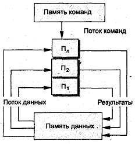

# Вопросы к экзамену

## Методички

### pdf - конспекты лекции

- [Конспект лекций для бакалавров по направлению 150900](./pdf/konsp01.pdf)

### Информатика

- [Информатика и информационно-коммутационные технологии. Часть 1](http://e-biblio.ru/book/bib/01_informatika/informatica/sg/sg_part1.html)
- [Информатика и информационно-коммутационные технологии. Часть 2](http://e-biblio.ru/book/bib/01_informatika/informatica/sg/sg_part2.html)
- [Вычислительные системы, сети и телекоммуникации](http://e-biblio.ru/book/bib/01_informatika/vychislit_sistemy_&_seti/sg.html)
- [Программная инженерия](http://e-biblio.ru/book/bib/01_informatika/prog_ingeneriya/sg.html)
- [Информационные системы и технологии](http://e-biblio.ru/book/bib/01_informatika/informacionnye_sistemy_i_texnologii/sg.html)
- [Интеллектуальные информационные системы](http://e-biblio.ru/book/bib/01_informatika/intellekt_inf_systems/sg.html)
- [Сервисный подход в управлении ИТ](http://e-biblio.ru/book/bib/01_informatika/service_podhod_v_upravlenii_IT/sg.html)
- [Теория программирования 1](http://e-biblio.ru/book/bib/01_informatika/ProgBK_pt2/Book_teria_prog_1.html)
- [Теория программирования 2](http://e-biblio.ru/book/bib/01_informatika/ProgBK_pt2/Book_teria_prog_2.html)
- [Технические средства информатизации](http://e-biblio.ru/book/bib/01_informatika/Tehnich_sredstva_inform/sg.htm)
- [Базы данных](http://www.e-biblio.ru/book/bib/01_informatika/BD/Book.html)
- [Базы данных(Управление данными)](http://www.e-biblio.ru/book/bib/01_informatika/bazy_dannyx/sg.html)
- [Информационные системы и сети](http://www.e-biblio.ru/book/bib/01_informatika/infokomm_systems&webs/sg.html)
- [Архитектура вычислительных систем и компьютерных сетей](http://e-biblio.ru/book/bib/01_informatika/AVC_I_KC/Book.html)
- [Программные и аппаратные средства информационной безопасности](http://www.e-biblio.ru/book/bib/01_informatika/programm_i_apparatnye_sredstva_inform/sg.html)
- [Безопасность серверных операционных систем](http://www.e-biblio.ru/book/bib/01_informatika/bezopasnost_servernyx_os/sg.html)
- [IT-менеджмент](http://e-biblio.ru/book/bib/01_informatika/IT_management/sg.html)
- [Информационный менеджмент](http://e-biblio.ru/book/bib/01_informatika/informac_menedgment/new/sg.html)
- [Управление проектами](http://e-biblio.ru/book/bib/06_management/upravlenie_proektami/up.html)
- [Информационно-аналитические системы](http://www.e-biblio.ru/book/bib/01_informatika/inform_analit_system/sg.html)
- [Информационные системы](http://www.e-biblio.ru/book/bib/05_finansy/Inf_sys/Book.html)
- [Информационно-аналитические системы](http://www.e-biblio.ru/book/bib/01_informatika/inform_analit_system/sg.html)
- [Корпоративные информационные системы](http://e-biblio.ru/book/bib/01_informatika/corp_infor_sistem/prog.html)
- [Методы и средства проектирования информационных систем](http://e-biblio.ru/book/bib/01_informatika/metod_i_sredstv_proekt_inform_system/sg.html)
- [Руководство по изучению дисциплины «Автоматизированные информационные системы»](http://www.e-biblio.ru/book/bib/01_informatika/sg.html)
- [Практикум по дисциплине «Программное обеспечение Банковского дела / Организация выбора, внедрения и эксплуатации банковских информационных систем»](http://www.e-biblio.ru/book/bib/01_informatika/organ_vybora_vnedr_i_ekspluat_bank_inform_system/prakt.html)
- [Банковский маркетинг](http://e-biblio.ru/book/bib/13_UMK_5kurs/Bank_market/UP/UP9.htm)

### Экономика

- [Экономика](http://e-biblio.ru/book/bib/09_ekonomika/economica/sg.html)
- [Иммитационное моделирование экономических процессов](http://e-biblio.ru/book/bib/09_ekonomika/imitac_modelir_econom_processov/sg.html)
- [Теория экономических информационных систем](http://e-biblio.ru/book/bib/09_ekonomika/teor_econom_inform_system/sg.html)
- [Финансовый менеджмент](http://e-biblio.ru/book/bib/09_ekonomika/finansovyj_menegment/sg.html)
- [Сетевая экономика](http://www.e-biblio.ru/book/bib/09_ekonomika/setevaya_ekonomika/YP.html)
- [Электронная коменрция](md/books/7cb0e2ceaab67895c7f03c42a467b97a.pdf)
- [Мировая экономика](http://www.e-biblio.ru/book/bib/09_ekonomika/mir_econom/sg.html)
- [Макроэкономика](http://www.e-biblio.ru/book/bib/09_ekonomika/Makroekonomika/new/sg.html)
- [Макроэкономика](http://www.e-biblio.ru/book/bib/09_ekonomika/Ekonomika_BK/Macroeconomica.htm)
- [Микроэкономика](http://www.e-biblio.ru/book/bib/09_ekonomika/microeconomika/prog2.html)
- [Экономика для менеджеров](http://e-biblio.ru/book/bib/Sinergia/ek-managment/sg.html)
- [Банковское дело](http://e-biblio.ru/book/bib/05_finansy/bankovskoe_delo/sg.html)
- [Банковское дело](http://www.e-biblio.ru/book/bib/13_UMK_5kurs/Bankovskoe%20delo/UP/UP.htm)
- [Теория отраслевых ранков](http://e-biblio.ru/book/bib/05_finansy/teory_otrasl_rynkov/sg.htm)
- [Организация деятельности банка](http://www.e-biblio.ru/book/bib/05_finansy/organ_deyat_banka/hb.html)

**1. Теоретические вопросы на знание базовых понятий и принципов**

1. +- [Понятия: данные, информация, знания. Свойства информации.](#q1-1)
2. -- [Понятие файловой системы. Отличие файловых систем друг от друга.](#q1-2)
3. ++ [Назначение центрального процессора. Внутренняя организация процессора. микропроцессоров. Понятие конвейеризации. Системы команд и прерываний. Современные модели микропроцессоров для ПК](#q1-3)
4. ++ [Составные части операционной системы отдельного компьютера.](#q1-4)
5. ++ [Многоуровневая, клиент-серверная и файл-серверная технологии. Blade серверы.](#q1-5)
6. +- [Компьютерные вирусы: определение, классификация по среде «обитания» и способам заражения.](#q1-6)
7. +- [Антивирусные программы: классификация и принципы работы.](#q1-7)
8. +- [Программы сжатия данных: возможности и принципы работы.](#q1-8)
9. +- [Понятие архитектуры информационной системы и АРМ.](#q1-9)
10. +- [Базовые компоненты универсального компьютера архитектуры Джон Фон-Неймана. Основной принцип построения ЭВМ.](#q1-10)
11. +- [Общие принципы подключения и работы периферийных устройств.](#q1-11)
12. [Принципы хранения данных на твердотельных, магнитных и оптических носителях.](#q1-12)
13. [Основные принципы построения компьютерных сетей.](#q1-13)
14. [Видеосистемы: состав и основные принципы работы. Представление видеоинформации в ПК.](#q1-14)
15. [Ресурсо\- и энергосберегающие технологии использования вычислительной техники.](#q1-15)
16. [Физическая природа звука. Принципы восприятия звука человеком. Акустические системы и звуковые карты. Представление аудиоинформации в ПК.](#q1-16)
17. [Понятие и свойства алгоритма. Язык схем.](#q1-17)
18. [Управляющие конструкции алгоритмического языка. Основные структуры алгоритмов.](#q1-18)
19. [Представление данных в ПК. Системы счисления и единицы измерения информации.](#q1-19)
20. [Понятие переменной в языках программирования высокого уровня.](#q1-20)
21. [Массивы, стеки, деки, деревья в языках программирования высокого уровня.](#q1-21)
22. [Обзор версий MS WINDOWS. Назначение и основные функции MS WINDOWS 10. Преимущества и недостатки MS WINDOWS 10.](#q1-22)
23. [Корпоративные компьютерные сети: принципы организации.](#q1-23)
24. [Основные требования, предъявляемые к современным операционным системам.](#q1-24)
25. [Типы локальных сетей. Модель OSI.](#q1-25)
26. [Способы классификации информации. Атрибутивные, динамические и прагматические свойства информации.](#q1-26)
27. [Характеристика глобальной сети Internet. Протоколы сети Internet. Типы Internet-сервисов.](#q1-27)
28. [Системы управления базами данных: классификация, возможности и тенденции развития.](#q1-28)
29. [Устройство системного блока. Типы корпусов и блоков питания.](#q1-29)
30. [Устройство и параметры материнской платы. Назначение устройств размещаемых на материнской плате.](#q1-30)
31. [Устройство и параметры связки видеокарта, монитор, сканер и принтер.](#q1-31)
32. [Нестандартные периферийные устройства: классификация, назначение и параметры.](#q1-32)
33. [Сетевые устройства: классификация и основные принципы работы.](#q1-33)
34. [Организация и устройство оперативной памяти в ПК.](#q1-34)

**2. Вопросы по направленности «Прикладная информатика в экономике»**

1. [Угрозы информационной безопасности.](#q2-1)
2. [Средства защиты информации.](#q2-2)
3. [Защита информации от утечки по техническим каналам.](#q2-3)
4. [Основные нормативные документы РФ по защите информации.](#q2-4)
5. [Защита государственной тайны.](#q2-5)
6. [Сетевые протоколы в Internet и принципы сетевых взаимодействий через сеть Internet между прикладным программным обеспечением в соответствии с моделью OSI.](#q2-6)
7. [Информационный менеджмент и место IT менеджера на предприятии.](#q2-7)
8. [Стратегии внедрения информационных систем. Факторы, влияющие на выбор стратегии.](#q2-8)
9. [Стратегии автоматизации деятельности компании. Факторы, влияющие на выбор стратегии.](#q2-9)
10. [Системы управления базами данных: классификация, возможности и тенденции развития.](#q2-10)
11. [OLAP и OLTP технологии. Big  Data. Data mining](#q2-11)
12. [Структуры и модели данных (реляционная, иерархическая, сетевая).](#q2-12)
13. [Стандарты MRP, MRP II, ERP, ERP II: основные принципы, применение.](#q2-13)
14. [Жизненный цикл разработки программного обеспечения. Модели жизненного цикла разработки. программного обеспечения.](#q2-14)
15. [Состав и содержание работ по этапам жизненного цикла разработки программного обеспечения.](#q2-15)
16. [Программное обеспечение автоматизации банковской деятельности.](#q2-16)
17. [Типовая организационная структура российского коммерческого банка.](#q2-17)
18. [Основные процессы банковской деятельности.](#q2-18)
19. [Автоматизация бизнес-процессов в банке.](#q2-19)
20. [Автоматизация процессов управления банковской деятельности.](#q2-20)
21. [Бухгалтерские информационные системы.](#q2-21)
22. [Налоговые информационные системы.](#q2-22)
23. [Статистические информационные системы.](#q2-23)
24. [Информационные системы экономического анализа.](#q2-24)
25. [Системы классификации и кодирования предприятий и организаций в РФ.](#q2-25)
26. [Информационные системы в страховании.](#q2-26)
27. [Информационные системы управления бюджетным процессом.](#q2-27)
28. [Корпоративные информационные системы.](#q2-28)
29. [CRM-системы.](#q2-29)
30. [Информационные системы управления проектами.](#q2-30)
31. [Система экономической документации.](#q2-31)
32. [Модели представления знаний.](#q2-32)
33. [Системы электронного документооборота.](#q2-33)
34. [Функциональная модель информационной системы.](#q2-34)
35. [Системы моделирования предметных областей в экономике.](#q2-35)

**3. Теоретические вопросы на понимание терминологии, понятий и принципов по предметной области прикладной информатики**

1. [Может ли пользователь самостоятельно осуществлять калибровку сканера? Обоснуйте ответ.](#q3-1)
2. [Нарушает ли производство интегрированных материнских плат принципы открытой архитектуры? Обоснуйте ответ.](#q3-2)
3. [Может ли пользователь самостоятельно осуществлять калибровку монитора? Обоснуйте ответ.](#q3-3)
4. [Целесообразно ли приобретать комплектующее в “OEM” исполнении для сборки ПК компьютерной компанией? Обоснуйте ответ.](#q3-4)
5. [Целесообразно ли приобретать комплектующее в “Retail” исполнении для сборки ПК компьютерной компанией? Обоснуйте ответ.](#q3-5)
6. [Для повышения быстродействия системы необходимо установить оперативную память с синхронным или асинхронным интерфейсом? Обоснуйте ответ.](#q3-6)
7. [Для повышения быстродействия системы целесообразно использовать статическую или динамическую оперативную память? Обоснуйте ответ.](#q3-7)
8. [При разработке операционных систем учитываются архитектурные или микроархитектурные особенности процессоров? Обоснуйте ответ.](#q3-8)
9. [Какой источник бесперебойного питания: постоянно действующий или интерактивный следует установить для повышения отказоустойчивости вычислительной системы. Обоснуйте ответ.](#q3-9)
10. [Какую пропускную способность: симметричную или асимметричную выгоднее использовать при доступе к сети Internet через цифровой модем? Обоснуйте ответ.](#q3-10)
11. [Какой из двух подходов к анализу данных (построение регламентированных отчетов или Data Mining) обеспечивает более широкие возможности? Обоснуйте ответ.](#q3-11)
12. [Какой из двух типов сетей (одноранговые сети или сети на основе сервера) целесообразно использовать для обеспечения полного контроля над всеми рабочими местами? Обоснуйте ответ.](#q3-12)
13. [В каком случае говорят, что отношение находится в 3 нормальной форме. Обоснуйте ответ. Приведите пример.](#q3-13)
14. [Какой из двух типов сетей (одноранговые сети или сети на основе сервера) целесообразно использовать для объединения небольшого числа компьютеров при отсутствии строгой защиты данных? Обоснуйте ответ.](#q3-14)
15. [Какие проблемы могут возникать при работе с базой данных, находящейся в первой нормальной форме? Приведите примеры.](#q3-15)
16. [Какие проблемы могут быть решены с помощью обеспечения выполнения ограничений целостности при проектировании базы данных? Приведите примеры.](#q3-16)
17. [Что необходимо сделать администратору базы данных для обеспечения безопасности?](#q3-17)
18. [Какие действия необходимо предпринять администратору для восстановления данных при случайном удалении некоторой информации пользователем?](#q3-18)
19. [Необходимо ли предпринять какие-либо действия администратору в случае, если произошел сбой системы при выполнении транзакции? Обоснуйте ответ.](#q3-19)
20. [Как формируется сеть WiFi? Зачем используют MiMo и MASH системы ?](#q3-20)

**4. Задания на умение использовать полученные знания и навыки для**
**решения профессиональной задачи**

1. [Опишите технические параметры следующего устройства: Процессор Intel "Pentium G620" (2.60ГГц, 2x256КБ+3МБ, EM64T, GPU) Socket1155.](#q4-1)
2. [Опишите технические параметры следующего устройства: Мат. плата Socket1155 ASUS "P8H61 EVO" rev.3.0 (iH61, 2xDDR3, SATA III, SATA II, PCI-E, SB, 1Гбит LAN, USB2.0, USB3.0, ATX).](#q4-2)
3. [Опишите технические параметры следующего устройства: Intel "Core i5-660" (3.33ГГц, 2x256КБ+4МБ, EM64T, GPU) Socket1156.](#q4-3)
4. [Опишите технические параметры следующего устройства: Socket 1156 GIGABYTE "GA-H55M-D2H" (iH55, 2xDDR3, SATA II, U133, 2xPCI-E, D-Sub, DVI, HDMI, SB, 1Гбит LAN, USB2.0, mATX).](#q4-4)
5. [Восстановите топологию интерфейса USB по представленному рисунку:](#q4-5)
    

6. [Укажите основные технические параметры для домашнего компьютера.](#q4-6)

    |     |           |          |          |            |         |
    | --- | --------- | -------- | -------- | ---------- | ------- |
    | Тип | Процессор | Объем ОП | Объем ЖД | Видеокарта | Монитор |

7. [Рассчитать объем следующего графического файла: разрешение 800*600 пикселей, 65536 цветов.](#q4-7)
8. [Выберите модуль памяти для следующей материнской платы:](#q4-8)
    Материнская плата Socket 1156 GIGABYTE "GA-H55M-D2H" (iH55, 2xDDR3, SATA II, U133, 2xPCI-E, D-Sub, DVI, HDMI, SB, 1Гбит LAN, USB2.0, mATX)
    1.  Модуль памяти 512МБ DDR SDRAM Patriot (PC3200, 400МГц)
    2.  Модуль памяти 2ГБ DDR3 SDRAM Kingston "Hyper X" KHX1600C9AD3B1/2G (PC12800, 1600МГц, CL9)
    3.  Модуль памяти 2ГБ DDR2 SDRAM Kingston "ValueRAM" KVR800D2N6/2G (PC6400, 800МГц, CL6)
    4.  Модуль памяти RIMM 512Мб, PC3200/800МГц Samsung (SEC-1)
9. [Выберите процессор для следующей материнской платы:](#q4-9)
    Мат. плата SocketFM1 GIGABYTE "GA-A75N-USB3" (AMD A75, 2xDDR3, SATA III, RAID, PCI-E, DVI, HDMI, SB, 1Гбит LAN, USB2.0, USB3.0, mini-ITX)
    Процессор
    1.  Процессор AMD "A4-3400" (2.70ГГц, 2x512КБ, GPU) SocketFM1
    2.  Процессор Intel "Celeron G530" (2.40ГГц, 2x256КБ+2МБ, EM64T, GPU) Socket1155
    3.  Процессор Intel "Core i3-540" (3.06ГГц, 2x256КБ+4МБ, EM64T, GPU) Socket1156
10. [Схема какой архитектуры приведена на рисунке?](#q4-10)
    
    

    A) SISD 
    B) SIMD
    C) MISD
    D) MIMD 

11. [Схема какой архитектуры приведена на рисунке? ](#q4-11)
    
    

    1.  SISD 
    2.  SIMD
    3.  MISD
    4.  MIMD

12. [Определите принцип действия ЭВМ, обрабатывающей информацию, представленную в непрерывной (аналоговой) форме, то есть в виде непрерывного ряда значений какой-либо физической величины (чаще всего электрического напряжения):](#q4-12)
    A) Цифровая ЭВМ;
    B) Аналоговая ЭВМ;
    C) Гибридная ЭВМ.
13. [Определите принцип действия ЭВМ, работающей с информацией, представленной и в цифровой, и в аналоговой форме; используемой для решения задач управления сложными быстродействующими техническими комплексами.](#q4-13)
    A) Цифровая ЭВМ;
    B) Аналоговая ЭВМ;
    C) Гибридная ЭВМ.
14. [Приведите данное отношение к 3 нормальной форме](#q4-14)

    |          |                     |            |                    |                 |       |              |            |                   |
    | -------- | ------------------- | ---------- | ------------------ | --------------- | ----- | ------------ | ---------- | ----------------- |
    | № Заказа | Наименование товара | Тип товара | Кол-во (заказанно) | Цена за единицу | Склад | Адрес склада | Постав-щик | Адрес постав-щика |

15. [Каким образом преобразуются входные данные длиной 400 бит при проведении операции хэширования в соответствии с отечественным стандартом хэширования ГОСТ Р 34.11–94?](#q4-15)
Входные данные (400 бит)

16. [Определите технические параметры ПК в соответствии с его типом (сервер, домашний ПК и так далее).](#q4-16)

    | Тип                                 | Процессор | Объем ОП | Объем ЖД | Видеокарта | Монитор |
    | ----------------------------------- | --------- | -------- | -------- | ---------- | ------- |
    | Сервер                              |           |          |          |            |         |
    | Игровой компьютер                   |           |          |          |            |         |
    | Дизайнер­ский для работы с графикой  |           |          |          |            |         |
    | Домашний                            |           |          |          |            |         |
    | Офисный                             |           |          |          |            |         |

17. [Рассчитайте объем звукового файла по представленным данным: частота дискретизации — 8 КГц, разрядность — 8 битов, время записи — 10 с.](#q4-17)
18. [Определите тип топологии Информационно-вычислительной сети:](#q4-18)

**5. Вопросы по дисциплине «Экономика»**

1. [ВВП и ВНП страны и методы их подсчета.](#q5-1)
2. [Деньги: их сущность и функции. Современные виды денег. Денежно-кредитная политика государства.](#q5-2)
3. [Инфляция; ее причины, типы и виды. Социально-экономические последствия инфляции.](#q5-3)
4. [Монополия, ее сущность, виды, поведение на рынке. Антимонопольная политика государства.](#q5-4)
5. [Определение и изменение экономического роста. Факторы и типы экономического роста.](#q5-5)
6. [Понятие рыночных структур и их типы. Основные правила поведения фирмы в различных рыночных структурах.](#q5-6)
7. [Понятие факторов производства и виды доходов. Предельная производительность факторов производства.](#q5-7)
8. [Распределение доходов в рыночной экономике и их измерения. Кривая Лоренца и коэффициент Джинни.](#q5-8)
9. [Роль и экономические функции государства. Методы и инструменты государственного регулирования экономики.](#q5-9)
10. [Рыночное равновесие спроса и предложения. Нарушение рыночного равновесия. Понятие устойчивости рыночного равновесия.](#q5-10)
11. [Совокупный спрос и совокупное предложение, и их взаимосвязь. Сущность и условия макроэкономического равновесия. Эластичность спроса и предложения.](#q5-11)
12. [Сущность, функции и структура рынка. Рыночная инфраструктура.](#q5-12)
13. [Фискальная политика государства, ее цели и инструменты. Налоги, их виды и принципы налогообложения.](#q5-13)
14. [Экономическое содержание государственного бюджета и его структура.](#q5-14)
15. [Ценные бумаги и их классификация.](#q5-15)

---

## Понятия: данные, информация, знания. Свойства информации.

## Понятие файловой системы. Отличие файловых систем друг от друга.

## Назначение центрального процессора. Внутренняя организация процессора. микропроцессоров. Понятие конвейеризации. Системы команд и прерываний. Современные модели микропроцессоров для ПК

## Составные части операционной системы отдельного компьютера.

## Многоуровневая, клиент-серверная и файл-серверная технологии. Blade серверы.

## Компьютерные вирусы: определение, классификация по среде «обитания» и способам заражения.

## Антивирусные программы: классификация и принципы работы.

## Программы сжатия данных: возможности и принципы работы.

## Понятие архитектуры информационной системы и АРМ.

## Базовые компоненты универсального компьютера архитектуры Джон Фон-Неймана. Основной принцип построения ЭВМ.

## Периферийные устройства подразделяются на 3 большие группы:

- стандартные устройства — аудио, принтеры, сканеры, модемы итд.
- нестандартные устройства — мфу, игровые устройства, фото-видео камеры, спец.наушники, микрофоны, синтезаторы, веб-камеры, итд.
- устройства сопряжения — специальные адаптеры (контроллеры) для подключения внешних устройств (кассовые аппараты, охранные системы, телеметрическое наблюдение, системы контроля, итд.)

Адаптер — средство связи (сопряжения) какого-либо устройства с какой-либо шиной или интерфейсом компьютера.

Контроллер — способен к самостоятельным действиям после получения команд от обслуживающей его программы.

Все внешние интерфейсы компьютера тоже имеют свои адаптеры и контроллеры. для взаимодействия с программой адаптеры и контроллеры обычно имеют регистры ввода и вывода. Для работы используются механизмы аппаратных прерываний, для сигнализации программе о событиях происходящих в периферийных устройствах. для обмена информацией с устройствами применяется механизм прямого доступа к памяти DMA (Direct Memory Access) а также прямое управление шиной.

Системные устройства (СУ) — это устройства, занимающие какие-либо свои системные ресурсы, порты ввода-вывода, ячейки памяти, линии запросов прерывания или каналы DMA. Пример системного устройства: Оперативная память. СУ могут располагаться на материнской плате или картах расширения, устанавливаемых в шины расширения.

Периферийные устройства — подключаются к тем или иным интерфейсам системных устройств. Винчестер подключаемый к контроллеру ATA материнской платы, является периферийным устройством. Процессор к нему обращается через контроллер ATA. Контроллер ATA в свою очередь является системным устройством (занимает ресурсы, прерывания независимо от использования).

Драйверы — это специальное ПО (программные модули содержащие процедуры работы с устройствами) нужное для правильного функционирования устройств. Наличие драйверов, облегчает задачу программистам, избавляя их от надобности писать аппаратно-зависимые процедуры, для всех известных моделе тех или иных устройств. Избавляет от написания или изменения программ, при появлении новых устройств.

Стандартные периферийные устройства — эти устройства подключаются к сист.блоку через строго определенные разъемы и шины.

Устройством сопряжения (УС) — называется любое устройство, обеспечивающее взаимодействие между двумя техническими средствами (системами).

Подключения УС через:
— через системную магистраль или шину (PCI — Peripheral Component Interconnect) — наибольшая скорость обмена
— через универсальную последовательную шину (USB, Universal Serial Bus) — (спецификации USB 2.0, 3.0 — чем больше цифра, тем больше скорость). Интерфейс USB соединяет между собой ХОСТ и устройства. Для подключения к хосту нескольких устройств, используется ХАБ. Корневой ХАБ подключен к ХОСТУ. В каждом устройстве, используется микропроцессорный блок, обеспечивающий поддержку сложного протокола USB. Преимущества USB: Большая скорость передачи данных, отсутствие необходимости устанавливать УС внутрь системного блока, возможность подключения нескольких устройств, малые размеры разъема.
— через параллельный интерфейс (LPT порт)

## Принципы хранения данных на твердотельных, магнитных и оптических носителях.

- http://inftis.narod.ru/it/n7.htm
- https://teletype.in/@fffarang/BJqVX7AMQqq

Устройства хранения данных
Устройства хранения данных, как показано на рис. 1, выполняют чтение информации с магнитных, оптических или полупроводниковых носителей, а также осуществляют запись на них. Привод используется для постоянного хранения данных или получения информации с дискового носителя.

Ниже приведены наиболее распространенные типы устройств хранения.

- Жесткие диски (HDD) — традиционные магнитные дисковые накопители, которые используются уже не одно десятилетие. Емкость жестких дисков варьируется от гигабайтов (ГБ) до терабайтов (ТБ). Скорость вращения такого диска измеряется в оборотах в минуту. Это скорость, с которой вращается шпиндель с пластинами, на которых записаны данные. Чем выше скорость вращения шпинделя, тем быстрее жесткий диск получает данные с пластин. Наиболее широкое распространение получили жесткие диски со скоростью вращения 5400, 7200 и 10 000 оборотов в минуту.
- Твердотельные накопители (SSD) — энергонезависимые запоминающие устройства для хранения данных. Они работают намного быстрее магнитных жестких дисков. Емкость таких дисков варьируется от гигабайтов (ГБ) до терабайтов (ТБ). В твердотельных накопителях отсутствуют подвижные детали, поэтому они абсолютно бесшумные и более энергоэффективные, а также выделяют меньше тепла, чем магнитные жесткие диски. Носители SSD имеют такие же формфакторы, что и магнитные жесткие диски, и стремительно вытесняют последние с рынка устройств хранения данных.
- Гибридные диски — также называемые твердотельными гибридными накопителями (SSHD), представляют собой компромисс между магнитными жесткими дисками и твердотельными накопителями. Они работают быстрее, чем HDD, однако стоят меньше, чем SSD. Такой накопитель представляет собой магнитный HDD со встроенным SSD, который используется в качестве кэша. Накопитель SSHD автоматически кэширует часто используемые данные.
- Привод оптических дисков — в приводе оптических дисков для чтения данных с носителей используется лазер. Существует три типа оптических дисков: компакт-диски (CD), универсальные цифровые диски (DVD) и диски Blu-ray (BD). Компакт-диски, диски DVD и диски Blu-ray бывают только для чтения, записываемые (однократная запись) или перезаписываемые (многократное чтение и запись). В таблице на рис. 2 представлены сведения о различных типах оптических носителей и их приблизительная емкость.
- Магнитные ленты — используются в большинстве случаев для архивирования данных. В ленточном накопителе используется магнитная головка чтения и записи. Скорость получения данных с ленточного накопителя может быть очень высокой, однако поиск определенных данных может занимать очень много времени, поскольку лента должна перематываться с катушки на катушку до момента нахождения данных. Емкость наиболее распространенных ленточных накопителей варьируется от гигабайтов (ГБ) до терабайтов (ТБ).
- Внешний флэш-диск — такие накопители, например как флэш-карта памяти USB, подключаются к порту USB. Во внешнем флэш-диске используется тот же тип энергозависимой памяти, что и в SSD. Ему не нужно электропитание для хранения данных. Емкость таких дисков также варьируется от мегабайтов (МБ) до гигабайтов (ГБ).

Примечание. На старых компьютерах могут по-прежнему быть установлены устаревшие устройства хранения данных, такие как приводы гибких дисков.

## Основные принципы построения компьютерных сетей.

- https://tsput.ru/res/informat/sist_seti_fmo/lekcii/lekciy-7.html

**Преимущества использования компьютерных сетей**

Рассмотрим преимущества, получаемые при сетевом объединении персональных компьютеров.

- Разделение ресурсов
  Разделение ресурсов позволяет экономно использовать ресурсы, например, управлять периферийными устройствами, такими как лазерные печатающие устройства, со всех присоединенных рабочих станций.
- Разделение данных
  Разделение данных предоставляет возможность доступа и управления базами данных с периферийных рабочих мест, нуждающихся в информации
- Разделение программных средств
  Разделение программных средств предоставляет возможность одновременного использования централизованных, ранее установленных программных средств.
- Разделение ресурсов процессора
  При разделение ресурсов процессора возможно использование вычислительных мощностей для обработки данных другими системами, входящими в сеть. Предоставляемая возможность заключается в том, что на имеющиеся ресурсы не "набрасываются" моментально, а только лишь через специальный процессор, доступный каждой рабочей станции.
- Многопользовательский режим
  Многопользовательские свойства системы содействуют одновременному использованию централизованных прикладных программных средств, ранее установленных и управляемых, например, если пользователь системы работает с другим заданием, то текущая выполняемая работа отодвигается на задний план.

Искусственные и реальные сети.
- Территориальная распространенность.
- Ведомственная принадлежность.
- Скорость передачи информации.
- Тип среды передачи информации.
- Топология компьютерных сетей.
- Одноранговые и иерархические сети.

**Искусственные и реальные сети**

По способу организации сети подразделяются на реальные и искусственные.
***Искусственные сети***  (псевдосети) позволяют связывать компьютеры вместе через последовательные или параллельные порты и не нуждаются в дополнительных устройствах. Иногда связь в такой сети называют связью по нуль-модему (не используется модем). Само соединение называют нуль-модемным. Искусственные сети используются когда необходимо перекачать информацию с одного компьютера на другой. MS-DOS и windows снабжены специальными программами для реализации нуль-модемного соединения.
*Основной недостаток*  \- низкая скорость передачи данных и возможность соединения только двух компьютеров.
***Реальные сети***  позволяют связывать компьютеры с помощью специальных устройств коммутации и физической среда передачи данных.
*Основной недостаток*  \- необходимость в дополнительных устройствах.
В дальнейшем употребляя термин компьютерная сеть будем иметь в ввиду реальные сети.
Все многообразие компьютерных сетей можно классифицировать по группе признаков:

1.  Территориальная распространенность;
2.  Ведомственная принадлежность;
3.  Скорость передачи информации;
4.  Тип среды передачи;
5.  Топология;
6.  Организация взаимодействия компьютеров.

**Территориальная распространенность**

По территориальной распространенности сети могут быть локальными, глобальными, и региональными.
*Локальные*  \- это сети, перекрывающие территорию не более 10 м2
*Региональные*  \- расположенные на территории города или области
*Глобальные*  на территории государства или группы государств, например, всемирная сеть Internet.
В классификации сетей существует два основных термина: LAN и wAN.

***LAN (Local Area Network)***  \- локальные сети, имеющие замкнутую инфраструктуру до выхода на поставщиков услуг. Термин "LAN" может описывать и маленькую офисную сеть, и сеть уровня большого завода, занимающего несколько сотен гектаров. Зарубежные источники дают даже близкую оценку - около шести миль (10 км) в радиусе; использование высокоскоростных каналов.

***wAN (wide Area Network)***  \- глобальная сеть, покрывающая большие географические регионы, включающие в себя как локальные сети, так и прочие телекоммуникационные сети и устройства. Пример wAN - сети с коммутацией пакетов (Frame relay), через которую могут "разговаривать" между собой различные компьютерные сети.
Термин "*корпоративная сеть*" также используется в литературе для обозначения объединения нескольких сетей, каждая из которых может быть построена на различных технических, программных и информационных принципах.
Локальные сети являются сетями закрытого типа, доступ к ним разрешен только ограниченному кругу пользователей, для которых работа в такой сети непосредственно связана с их профессиональной деятельностью. Глобальные сети являются открытыми и ориентированы на обслуживание любых пользователей.

**Ведомственная принадлежность**

По принадлежности различают ведомственные и государственные сети.
*Ведомственные*  принадлежат одной организации и располагаются на ее территории.
*Государственные*  сети \- сети, используемые в государственных структурах.

**Скорость передачи информации**

По скорости передачи информации компьютерные сети делятся на низко\-, средне\- и высокоскоростные.

- низкоскоростные (до 10 Мбит/с),
- среднескоростные (до 100 Мбит/с),
- высокоскоростные (свыше 100 Мбит/с);

Для определения скорости передачи данных в сети широко используется  *бод*.
Бод (Baud) – единица скорости передачи сигнала, измеряемая числом дискретных переходов или событий в секунду. Если каждое событие представляет собой один бит, бод эквивалентен бит/сек (в реальных коммуникациях это зачастую не выполняется).

**Тип среды передачи информации**

По типу среды передачи сети разделяются на:
*проводные* коаксиальные, на витой паре, оптоволоконные
*беспроводные* с передачей информации по радиоканалам, в инфракрасном диапазоне.

**Топология компьютерных сетей**

Введем определения.
*Узел сети*  представляет собой компьютер, либо коммутирующее устройство сети.
*Ветвь сети*  \- это путь, соединяющий два смежных узла.
Узлы сети бывают трёх типов:

- оконечный узел \- расположен в конце только одной ветви;
- промежуточный узел \- расположен на концах более чем одной ветви;
- смежный узел \- такие узлы соединены по крайней мере одним путём, не содержащим никаких других узлов.

Способ соединения компьютеров в сеть называется её  *топологией.*
Наиболее распространенные виды топологий сетей:

***Линейная сеть***

Содержит только два оконечных узла, любое число промежуточных узлов и имеет только один путь между любыми двумя узлами.

***Кольцевая сеть***

Сеть, в которой к каждому узлу присоединены две и только две ветви.

***Звездообразная сеть***

Сеть, в которой имеется только один промежуточный узел.

***Общая шина***

В этом случае подключение и обмен данными производится через общий канал связи, называемый общей шиной.

***Древовидная сеть***

Сеть, которая содержит более двух оконечных узлов и по крайней мере два промежуточных узла, и в которой между двумя узлами имеется только один путь.

***Ячеистая сеть***

Сеть, которая содержит по крайней мере два узла, имеющих два или более пути между ними.

***Полносвязная сеть***
Сеть, в которой имеется ветвь между любыми двумя узлами.

**Одноранговые и иерархические сети**

С точки зрения организации взаимодействия компьютеров, сети делят на одноранговые (Peer-to-Peer Network) и с выделенным сервером (Dedicated Server Network).

***Одноранговые сети***
Все компьютеры одноранговой сети равноправны. Любой пользователь сети может получить доступ к данным, хранящимся на любом компьютере.
Одноранговые сети могут быть организованы с помощью таких операционных систем, как LANtastic, windows'3.11, Novell Netware Lite. Указанные программы работают как с DOS, так и с windows. Одноранговые сети могут быть организованы также на базе всех современных 32-разрядных операционных систем - windows 9x\\ME\\2k, windows NT workstation версии, OS/2) и некоторых других.
*Достоинства одноранговых сетей:*

1.  Наиболее просты в установке и эксплуатации.
2.  Операционные системы DOS и windows обладают всеми необходимыми функциями, позволяющими строить одноранговую сеть.

*Недостатки:*
В условиях одноранговых сетей затруднено решение вопросов защиты информации. Поэтому такой способ организации сети используется для сетей с небольшим количеством компьютеров и там, где вопрос защиты данных не является принципиальным.

***Иерархические сети***
В иерархической сети при установке сети заранее выделяются один или несколько компьютеров, управляющих обменом данных по сети и распределением ресурсов. Такой компьютер называют  *сервером.*
Любой компьютер, имеющий доступ к услугам сервера называют клиентом сети или рабочей станцией.
Сервер в иерархических сетях \- это постоянное хранилище разделяемых ресурсов. Сам сервер может быть клиентом только сервера более высокого уровня иерархии. Поэтому иерархические сети иногда называются сетями с выделенным сервером.
Серверы обычно представляют собой высокопроизводительные компьютеры, возможно, с несколькими параллельно работающими процессорами, с винчестерами большой емкости, с высокоскоростной сетевой картой (100 Мбит/с и более).
Иерархическая модель сети является наиболее предпочтительной, так как позволяет создать наиболее устойчивую структуру сети и более рационально распределить ресурсы.
Также достоинством иерархической сети является более высокий уровень защиты данных.
К недостаткам иерархической сети, по сравнению с одноранговыми сетями, относятся:

1.  Необходимость дополнительной ОС для сервера.
2.  Более высокая сложность установки и модернизации сети.
3.  Необходимость выделения отдельного компьютера в качестве сервера.

***Две технологии использования сервера***
Различают две технологии использования сервера: технологию *файл-сервера* и архитектуру *клиент-сервер*.
В первой модели используется *файловый сервер*, на котором хранится большинство программ и данных. По требованию пользователя ему пересылаются необходимая программа и данные. Обработка информации выполняется на рабочей станции.
В системах с архитектурой клиент-сервер обмен данными осуществляется между *приложением-клиентом* (front-end) и *приложением-сервером* (back-end). Хранение данных и их обработка производится на мощном сервере, который выполняет также контроль за доступом к ресурсам и данным. Рабочая станция получает только результаты запроса. Разработчики приложений по обработке информации обычно используют эту технологию.
Использование больших по объему и сложных приложений привело к развитию многоуровневой, в первую очередь трехуровневой архитектуры с размещением данных на отдельном сервере базы данных (БД). Все обращения к базе данных идут через сервер приложений, где они объединяются.

## Видеосистемы: состав и основные принципы работы. Представление видеоинформации в ПК.

- http://book.kbsu.ru/theory/chapter2/1_2_14.html
- https://works.doklad.ru/view/KSX8k3-jS28/all.html
- http://www.kolomna-school7-ict.narod.ru/st20304.htm

Основным устройством вывода графических изображений является  ***дисплей***. Работой дисплея управляет  ***видеоконтроллер***. Употребляется также другой термин для обозначения этого устройства — видеоадаптер; в комплекте устройств ПК его еще называют  ***видеокартой***.

Основные представления об устройстве дисплея:

· дискретная (пиксельная) структура экрана;

· сетка пикселей (растр);

· сканирование растра электронным лучом;

· частота сканирования;

· трехцветная структура пикселя цветного монитора.

Видеоконтроллер состоит из двух частей:

1. видеопамяти

2. дисплейного процессора.

Основной универсальный для ЭВМ принцип заключается в том, компьютер работает с информацией, хранящейся в его памяти в двоичном виде. Следовательно, всякое изображение на экране \- это отражение информации в памяти ЭВМ — видеоинформации. Первоначально видеоинформация формируется в оперативной памяти (при открытии графического файла, при рисовании в графическом редакторе). Вывод на экран происходит в результате передачи видеоинформации контроллеру монитора: информация записывается в видеопамять и сразу же воспроизводится на экране, вследствие непрерывной работы дисплейного процессора, управляющего работой монитора. Таким образом, видеопамять является своеобразным буфером между ОЗУ и дисплеем. Смена «картинки» на экране является следствием смены содержимого видеопамяти. Система вывода на экран работает совершенно одинаково, не зависимо от того, какого рода информация выводится: текст ли это, неподвижный рисунок или анимация.

В качестве устройства ввода изображения с листа в компьютерную память используется сканер. Подчеркнуть взаимообратную функцию системы вывода изображения на экран и системы ввода изображения с помощью сканера (рис. 1).

Видеосистема компьютера состоит из трех компонент:

- **монитор**  (называемый также дисплеем);
- **видеоадаптер**;
- **программное обеспечение**  (драйверы видеосистемы).

**Видеоадаптер**  посылает в монитор сигналы управления яркостью лучей и синхросигналы строчной и кадровой развёрток.  **Монитор**  преобразует эти сигналы в зрительные образы. А  **программные средства**  обрабатывают видеоизображения — выполняют кодирование и декодирование сигналов, координатные преобразования, сжатие изображений и др.

*Монитор*  — устройство визуального отображения информации (в виде текста, таблиц, рисунков, чертежей и др.).

Подавляющее большинство мониторов сконструированы на базе  **электронно-лучевой трубки (ЭЛТ)**, и принцип их работы аналогичен принципу работы телевизора. Мониторы бывают алфавитно-цифровые и графические, монохромные и цветного изображения. Современные компьютеры комплектуются, как правило, цветными графическими мониторами.

### 1\. Монитор на базе электронно-лучевой трубки

Основной элемент дисплея —  **электронно-лучевая трубка**. Её передняя, обращенная к зрителю часть с внутренней стороны покрыта  **люминофором — специальным веществом, способным излучать свет при попадании на него быстрых электронов**.

Люминофор наносится в виде наборов точек трёх основных цветов —  **красного,  зелёного**  и  **синего**. Эти цвета называют основными, потому что их сочетаниями (в различных пропорциях) можно представить любой цвет спектра.

Наборы точек люминофора располагаются по треугольным триадам. Триада образует  **пиксел  — точку, из которых формируется изображение**  (англ. pixel — picture element, элемент картинки).

Расстояние между центрами пикселов называется  **точечным шагом монитора**. Это расстояние существенно влияет на чёткость изображения. Чем меньше шаг, тем выше чёткость. Обычно в цветных мониторах шаг составляет 0,24 мм. При таком шаге глаз человека воспринимает точки триады как одну точку "сложного" цвета.

На противоположной стороне трубки расположены три (по количеству основных цветов)  **электронные пушки.**  Все три пушки "нацелены" на один и тот же пиксел, но каждая из них излучает поток электронов в сторону "своей" точки люминофора. Чтобы электроны беспрепятственно достигали экрана, из трубки откачивается воздух, а между пушками и экраном создаётся высокое электрическое напряжение, ускоряющее электроны. Перед экраном на пути электронов ставится  **маска**  — тонкая металлическая пластина с большим количеством отверстий, расположенных напротив точек люминофора. Маска обеспечивает попадание электронных лучей только в точки люминофора соответствующего цвета.

Величиной электронного тока пушек и, следовательно, яркостью свечения пикселов, управляет сигнал, поступающий с видеоадаптера.

На ту часть колбы, где расположены электронные пушки, надевается  **отклоняющая система**  монитора, которая заставляет электронный пучок пробегать поочерёдно все пикселы строчку за строчкой от верхней до нижней, затем возвращаться в начало верхней строки и т.д.

Количество отображённых строк в секунду называется  **строчной частотой развертки.**  А частота, с которой меняются кадры изображения, называется  **кадровой частотой развёртки.**  Последняя не должна быть ниже 85 Гц, иначе изображение будет  **мерцать**.

### 2\. Жидкокристаллические мониторы

Все шире используются наряду с традиционными ЭЛТ-мониторами.  **Жидкие кристаллы**  — это особое состояние некоторых органических веществ, в котором они обладают текучестью и свойством образовывать пространственные структуры, подобные кристаллическим. Жидкие кристаллы могут изменять свою структуру и светооптические свойства под действием электрического напряжения. Меняя с помощью электрического поля ориентацию групп кристаллов и используя введённые в жидкокристаллический раствор вещества, способные излучать свет под воздействием электрического поля, можно создать высококачественные изображения, передающие более 15 миллионов цветовых оттенков.

Большинство ЖК-мониторов использует тонкую плёнку из жидких кристаллов, помещённую между двумя стеклянными пластинами. Заряды передаются через так называемую  **пассивную матрицу**  — сетку невидимых нитей, горизонтальных и вертикальных, создавая в месте пересечения нитей точку изображения (несколько размытого из-за того, что заряды проникают в соседние области жидкости).

**Активные матрицы**  вместо нитей используют прозрачный экран из транзисторов и обеспечивают яркое, практически не имеющее искажений изображение. Экран при этом разделен на независимые ячейки, каждая из которых состоит из четырех частей (для трёх основных цветов и одна резервная). Количество таких ячеек по широте и высоте экрана называют  **разрешением экрана.**  Современные ЖК-мониторы имеют разрешение 642х480, 1280х1024 или 1024х768. Таким образом, экран имеет от 1 до 5 млн точек, каждая из которых управляется собственным транзистором. По компактности такие мониторы не знают себе равных. Они занимают в 2 — 3 раза меньше места, чем мониторы с ЭЛТ и во столько же раз легче; потребляют гораздо меньше электроэнергии и не излучают электромагнитных волн, воздействующих на здоровье людей.

### 3\. Сенсорный экран

Общение с компьютером осуществляется путём прикосновения пальцем к определённому месту чувствительного экрана. Этим выбирается необходимый режим из меню, показанного на экране монитора. (**Меню**  — это выведенный на экран монитора список различных вариантов работы компьютера, по которому можно сделать конкретный выбор.) Сенсорными экранами оборудуют рабочие места операторов и диспетчеров, их используют  **в информационно-справочных системах**  и т.д.## Ресурсо\- и энергосберегающие технологии использования вычислительной техники.

- https://studref.com/403040/informatika/resurso_energosberegayuschie_tehnologii_ispolzovaniya_sredstv_vychislitelnoy_tehniki

**Энергосберегающие процессоры**

Самый миниатюрный процессор Intel® Atom™ площадью менее 25 мм2 создан на базе совершенно новой микроархитектуры, разработанной специально для компактных устройств с малым энергопотреблением и высокой производительностью. Процессор предназначен специально для мобильных интернет-устройств (MID) и нового класса простых и доступных компьютеров.

Технологии управления, такие как технология Intel® vPro™, способствуют еще большему снижению энергопотребления устройств и в то же время предоставляют возможность дистанционного управления питанием и централизованного доступа к компьютерам. Одновременно обеспечиваются оптимальное энергосбережение и непрерывность бизнес-процессов, а также установка критически важных параметров системы информационной безопасности.

Энергосберегающий процессор Intel Core 2 Duo для мобильных систем обладает революционной производительностью и обеспечивает исключительную энергоэффективность — при сравнении годового энергопотребления средней настольной системы на базе двухъядерного процессора Pentium® 945 и ноутбука на базе процессорной технологии Centrino® Pro™ выяснится, что ноутбуку требуется в 17 раз меньше электроэнергии при большей производительности. Этот эффект особенно заметен при одновременной работе нескольких ресурсоемких приложений или при выполнении многопоточных задач.

- https://studfile.net/preview/3000237/page:3/

В начале 90-х годов компания EPA (Environmental Protection Agency— Агентство по защите окружающей среды) начало проводить кампанию по сертификации энергосберегающих персональных компьютеров и периферийного оборудования. Компьютер или монитор во время продолжительного простоя должен снизить энергопотребление до 30 Вт и более. Система, удовлетворяющая этим требованиям, может получить сертификат Energy Star.

В настоящее время в ПК нашли применение следующие энергосберегающие технологии:

Стандарт усовершенствованной системы управления питанием (Advanced Power

Management—APM) разработан фирмой Intel совместно с Microsoft и определяет ряд интерфейсов между аппаратными средствами управления питанием и операционной системой компьютера. Полностью реализованный стандарт APM позволяет автоматически переключать компьютер между пятью состояниями в зависимости от текущего состояния системы. Каждое последующее состояние в приведенном ниже списке характеризуется уменьшением потребления энергии.

Full On.Система полностью включена.

APM Enabled.Система работает,некоторые устройства являются объектамиуправления для системы управления питанием. Неиспользуемые устройства могут быть выключены, может быть также остановлена или замедлена (т.е. снижена тактовая частота) работа тактового генератора центрального процессора.

APM Standby (резервный режим).Система не работает,большинство устройствнаходятся в состоянии потребления малой мощности. Работа тактового генератора центрального процессора может быть замедлена или остановлена, но необходимые параметры функционирования хранятся в памяти. Пользователь или операционная система могут запустить компьютер из этого состояния почти мгновенно.

APM Suspend (режим приостановки).Система не работает,большинствоустройств пассивны. Тактовый генератор центрального процессора остановлен, а параметры функционирования хранятся на диске и при необходимости могут быть считаны в память для восстановления работы системы. Чтобы запустить систему из этого состояния, требуется некоторое время.

Off (система отключена).Система не работает.Источник питания выключен.

Для реализации режимов APM требуются аппаратные средства и программное обеспечение. Источниками питания ATX можно управлять с помощью сигнала Power_On и факультативного разъема питания с шестью контактами. (Необходимые для этого команды выдаются программой.) Изготовители также встраивают подобные устройства управления в другие элементы системы, например в системные платы, мониторы и дисководы. Операционные системы (такие как Windows), которые поддерживают APM, при наступлении соответствующих событий запускают программы управления питанием, ―наблюдая‖ за действиями пользователя и прикладных программ. Однако операционная система непосредственно не посылает сигналы управления питанием аппаратным средствам. Система может иметь множество различных аппаратных устройств и программных функций, используемых при выполнении функций APM. Чтобы разрешить проблему сопряжения этих средств в операционной системе и аппаратных средствах предусмотрен специальный абстрактный уровень, который облегчает связь между различными элементами архитектуры APM.

При запуске операционной системы загружается программа — драйвер APM, который связывается с различными прикладными программами и программными функциями. Именно они запускают действия управления питанием, причем все аппаратные средства, совместимые с APM, связываются с системной BIOS. Драйвер APM и BIOS связаны напрямую; именно эту связь использует операционная система для управления режимами аппаратных средств.

Таким образом, чтобы функционировали средства APM, необходим стандарт, поддерживаемый схемами, встроенными в конкретные аппаратные устройства системы, системная BIOS и операционная система с драйвером APM. Если хотя бы один из этих компонентов отсутствует, APMработать не будет.

Усовершенствованная конфигурация и интерфейс питания (Advanced Configuration and Power Interface— ACPI) впервые реализованы в современных BIOS и операционных системах Windows 98 и более поздних. Если BIOS компьютера поддерживает систему ACPI, то все управление питанием передается операционной системе. Это упрощает конфигурирование параметров, все они находятся в одном месте— в операционной системе. Теперь для конфигурирования параметров системы управления питанием не нужно устанавливать соответствующие параметры в BIOS. Система ACPI реализована только в самых новых компьютерах.

Стандарт DPMS (Display Power Management Signaling - система сигналов управления питанием монитора) ассоциации VESA определяет состав сигналов, передаваемых компьютером в монитор, при вхождении системы от состояния простоя в режимы пониженного потребления энергии. В этих системных процедурах контроль берет на себя драйвер, посылающий соответствующие сигналы через графическую карту. При нажатии клавиши на клавиатуре или движении "мыши" монитор переходит в нормальный режим работы.

**Технология Enhanced Intel SpeedStep**

Улучшенная технология SpeedStep (Enhanced Intel SpeedStep) дает пользователям возможность увеличить время автономной работы от батареи за счет динамического изменения напряжения ядра процессора и его тактовой частоты. Изменение условий работы процессора зависит от его загрузки (степени утилизации), от температурного режима, а также от установленных пользователем предпочтений через задания схемы энергопотребления (Power Schemes) в настройках операционной системы.

В отличие от предыдущей версии технологии Intel SpeedStep, предусматривающей возможность работы мобильного процессора лишь на двух тактовых частотах, улучшенная технология Enhanced Intel SpeedStep определяет использование нескольких возможных напряжений питания и частот (в совокупности — рабочих точек), что позволяет достичь лучшего соотношения «напряжение/частота» и более эффективного режима функционирования, когда производительность согласуется с рабочей нагрузкой.

Крайние рабочие точки процессора задаются аппаратно, а промежуточные точки устанавливаются программно. Управление переходами между различными рабочими точками выполняется только самим процессором и блоком регулятора напряжения (VRM).

Для установки требуемого напряжения процессор Intel Pentium M посылает служебные VID-последовательности непосредственно в VRM-модуль. При этом не используются никакие другие компоненты системы при осуществлении перехода между рабочими состояниями процессора.

- http://inftis.narod.ru/arx/arx-rsi.htm

**Ресурсо\- и энергосберегающие технологии использования вычислительной техники**

***Амортизация и сбои в электрической сети***
**Амортизация**  (или износ) в данном случае подразумевает старение компонентов персонального компьютера и, в первую очередь, содержимого системного блока.
Понятно, что ни одна вещь со временем не становится новее: в конце концов, любой материал в природе подвержен разложению – это так называемое естественное старение. Наряду с течением времени амортизации способствуют и другие факторы: наличие в устройстве движущихся частей, высокий температурный режим, неблагоприятная окружающая среда и др.
Высокий температурный режим – важная проблема компьютерной техники. Все внутренние устройства персонального компьютера (процессор, блок питания, печатные платы, приводы, жесткие диски) в процессе работы производят значительное количество тепла. Перегрев различных частей системного блока приводит к сбоям и полному выходу из строя персонального компьютера.

Для качественной сквозной вентиляции в переднюю часть корпуса системного блока можно установить дополнительный вентилятор.
Если вентилятор блока питания закачивает воздух вовнутрь, то передний вентилятор должен выкачивать его наружу и наоборот.
Для обеспечения благоприятного температурного режима и хорошей вентиляции корпуса системного блока ПК важно правильно его расположить: не помещать в места с прямым воздействием солнечных лучей и рядом с отопительными батареями, а также в места, где затруднено сквозное прохождение воздуха через корпус (например, в ниши с глухой задней стенкой).

Закачивая воздух в корпус системного блока ПК, вентилятор засасывает и частицы пыли.
Попадающая на печатные платы пыль может накапливать заряды статического электричества, что негативно сказывается на работе устройств. Попадая внутрь приводов, например, CD-ROM, пыль оседает на читающих головках и затрудняет чтение информации с носителей.

Потенциально опасна для устройств настольных компьютеров и серверов неустойчивость работы сетей переменного тока (отключения, перенапряжения, броски питания и др.).
*Отключение напряжения*  особенно опасно для серверов компьютерных сетей, поскольку они хранят информацию, используемую многими пользователями.
*Броски*  напряжения, или переходные процессы, иногда вызываются грозовыми разрядами и могут приводить к кратковременному повышению номинального напряжения электросети до значений от 400 до 5600 В.
*Перенапряжения*  напряжения представляют собой кратковременные превышения нормального значения напряжения (их длительность больше, чем у бросков, но превышение напряжения меньше).
*Проседания сети*  – это кратковременные снижения входного напряжения, обычно обусловленные изменением нагрузки в электросети (например, при включении кондиционера, пылесоса, микроволновой печи или широкоэкранного телевизора).
*Частичные отключения электроснабжения*  – более длительные снижения входного напряжения. Обычно они происходят во время жарких летних месяцев и там, где электростанции перегружены.
*Полное отключение питания*  вызывается выходом из строя участков электросети.
Для борьбы с перечисленными проблемами обычно устанавливают сетевые фильтры и (или) источники бесперебойного питания.

Сетевой фильтр похож на обычный удлинитель, к которому подключаются устройства, но способен сглаживать импульсные помехи в сети переменного тока.
Как правило, фильтр имеет лампочку, выключатель и встроенный предохранитель, который срабатывает в случае возникновения бросков напряжения или перенапряжений и защищает компьютер и другие, подключённые к фильтру, технические средства.

***Внутреннее устройство сетевых фильтров***

Фильтр подавления высокочастотных помех. У модели TRG фильтр выполнен по упрощенной схеме, дроссель и два конденсатора. Фильтр модели THV более совершенен, два дросселя и четыре конденсатора.

|     |     |     |
| --- | --- | --- |
|  |     |  |
| Фильтр модели TRG |     | Фильтр модели THV |

Источники бесперебойного питания (ИБП, англ. «Uninterruptible Power Supply», UPS) представляют собой более дорогое и более надёжное решение. Они включаются в настенные розетки питания и служат отличной защитой системного блока, монитора и так далее.

Независимо от того, возникают ли в сети перенапряжения, броски, кратковременные понижения напряжения или полное отключение питания, ИБП «принимают их на себя» и обеспечивают на своем выходе напряжение питания возможно более близкое к номинальному.

При полном отключении питания ИБП переходит в режим работы от встроенной батареи и некоторое время может поддерживать работоспособность подключенных к нему устройств. Это время обычно составляет 5-30 минут и определяется исходя из мощности ИБП (емкости батареи), а также мощности и количества защищаемых устройств.
При возникновении проблемы в электросети, ИБП подаёт све-товой сигнал с помощью светодиодов или звуковых сигналов. После чего пользователь может сохранить информацию на жестком диске (или ином носителе) и выключить компьютер.
Кроме того, применяются специальные административные программы мониторинга ИБП. При этом компьютер и ИБП соединяются информационным кабелем. Произошедшее в сети событие фиксируется и сведения о нём могут быть отправлены администратору сети по электронной почтой. Программа мониторинга может самостоятельно закрыть все приложения и выполнить выключение компьютера.

Выделяют интерактивные (line-interactive) и постоянно действующие (online) ИБП.
*Интерактивные ИБП*  фильтруют поступающее на них сетевое напряжение и еще раз фильтруют его при выдаче на подключен-ные устройства. Когда входное напряжение изменяется, ИБП компенсирует (уменьшает) или усиливает (увеличивает) сигнал, обеспечивая необходимое на выходе напряжение.

При полном отказе электросети такой ИБП переключается на режим питания от батарей. При этом время переключения составляет около 8 наносекунд, что не будет замечено компьютером.

*Постоянно действующие ИБП*  для обеспечения питания компьютера стабильным напряжением используют батареи и преобразователи (инверторы) постоянного тока, то есть в отличие от интерактивных ИБП, пони пропускают всю поступающую электроэнергию через свою батарею и ничего не делают, пока напряжение входной электросети не упадет ниже определенного порога. В этот момент ИБП переключается в режим питания от батарей. Поступающая из электросети энергия служит главным образом для зарядки батарей.
Перебои электроснабжения не приводят к перерывам, вызванным переключением режимов, так как ИБП осуществляют питание оборудования от своих батарей. Такие ИБП обычно стоят дороже интерактивных.

Мощность ИБП (УБП) измеряется в вольт-амперах (ВА), а мощность, потребляемая нагрузкой, – в ваттах (Вт).
Для определения мощности УБП, обеспечивающей работу с соответствующей нагрузкой, необходимо его мощность умножить на коэффициент мощности, как правило, равный 0,7.
Целесообразно иметь запас мощность УБП от 25–30% до 50%. Например мощность, потребляемая нагрузкой (источником питания ПК), равна 300 Вт. Для нее может подойти ИБП мощностью 400 ВА (400х0,7 = 320 Вт), но лучше использовать ИБП мощностью 600 ВА (600х0,7= 420 Вт). При этом увеличивается и время автономной работы устройств, подключённых к ИБП от нескольких до десяти и более минут.
Когда требуется поддерживать работоспособность в течение более длительного периода после отключения электропитания, используют ИБП с большей номинальной мощностью, бензиновые и дизельные электрогенераторы (мотор-генераторы) и другие устройства.
Мотор-генераторы бывают с 1-фазным и 3-фазным напряжением. Они делятся на резервные и основные. Резервные станции предназначены для периодической непродолжительной работы (от 3–7 до 15–20 часов). Они характеризуются небольшими габаритами (20–100 кг) и мощностью 0,5–10 КВт.

Основные станции служат для постоянной и продолжительной работы. Обычно они оснащаются мощными дизельными двигателями с принудительным жидкостным охлаждением и имеют мощность от 6 до 300 КВт, а вес около 300 кг.

Любые модели установок резервного питания следует оснащать блоками автоматики, позволяющими автоматически включать и выключать системы в нужный момент времени. Например, при временном отключении централизованного электроснабжения такая система должна автоматически подключиться к потребителям электроэнергии, а при его возобновлении, также автоматически вернуть резервную установку в дежурный режим, оставив потребителей подключёнными к централизованной системе.
Дизельный агрегат экономичнее расходует более дешёвое топливо и имеет почти в два раза больший ресурс работы, но почти в 2,5 раза дороже бензиновых систем. Бензиновые двигатели обычно имеют 4-тактную систему и работают на бензине А-92 (А-95), расход которого примерно в два раза больше, чем дизельного топлива. При нагрузке 50–85% от номинала дизель расходует 0,25 л/КВт в ч, а бензиновый двигатель 0,5 25 л/КВт в ч.

Альтернативой автономным электрогенераторам на базе двигателей внутреннего сгорания, особенно для сред, где требуется строгое соблюдение экологических и строительных норм, электромагнитной совместимости и при ограничении пространства, являются  ***водородные топливные элементы***  (ВТЭ) – модульные элементы с полимерной электролитической мембраной. Продуктом сгорания в ВТЭ являются тепло и вода. В течение нескольких часов они могут использоваться в качестве автономных резервных источников. ВТЭ обеспечивают повышение надёжности комплекса энергосбережения (в них отсутствуют движущиеся механические части), улучшение показателей готовности и эффективное устранение слабостей конструкции за счёт размещения системы в непосредственной близости от нагрузки, увеличивают срок службы резервных источников до 10 лет или до 5 тысяч включений/выключений.

Другими, общеизвестными устройствами аварийного электропитания являются  ***аккумуляторы***.
Они получили распространение и для поддержки работы компьютеров (особенно серверов) на время прекращения («провалов») подачи энергии (напряжения и тока) в сетях электропитания.
Для организаций, у которых отсутствует возможность установить мотор (дизель)-генератор, фирма INELT Intelligent предложила три варианта аккумуляторных батарей (ИБП линейно интерактивного типа) общей ёмкостью 1000, 2000 и 3000 ВА соответственно. Их батарея Inelt Intelligent 1000 LT обеспечивает напряжение 24 В и ёмкость 268 А ч, чего, например, хватит для питания оборудования ёмкостью 750 ВА в течение не менее 10 часов непрерывной работы. Такой ИБП через порт RS-232 подключается к компьютеру.

***Экономия электроэнергии***  имеет большое значение, поэтому в современных персональных компьютерах предусмотрены возможности остановки жестких дисков через заданный период времени их простоя, отключение монитора, спящий режим (минимальное энергопотребление, выход из которого осуществляется по нажатию клавиши или сигналу от устройства, например, сетевой карты).
Настройка этих опций производится в BIOS, или средствами операционной системы.
Для предотвращения старения монитора и ухудшения его изображения во всех операционных системах предусмотрен хранитель экрана – специальная анимированная заставка, появляющаяся через установленный промежуток времени и выход из которой осуществляется по нажатию любой клавиши.

## Физическая природа звука. Принципы восприятия звука человеком. Акустические системы и звуковые карты. Представление аудиоинформации в ПК.

- https://vuzlit.com/1009162/fizicheskaya_priroda_zvuka_printsipy_vospriyatiya_zvuka_chelovekom_akusticheskie_sistemy_zvukovye_karty

Звук как явление физическое представляет собой колебательные движения материальных тел - твердых, газообразных или жидких. Возникновение слуховых ощущений человека связано, как правило, именно с колебаниями воздуха.

Человек способен слышать звук в пределах от 16 Гц до 22 кГц при передаче колебаний по воздуху, и до 220 кГц при передаче звука по костям черепа. Эти волны имеют важное биологическое значение, например, звуковые волны в диапазоне 300--4000 Гц соответствуют человеческому голосу. Звуки выше 20 000 Гц имеют малое практическое значение, так как быстро тормозятся; колебания ниже 60 Гц воспринимаются благодаря вибрационному чувству. Диапазон частот, которые способен слышать человек, называется слуховым или звуковым диапазоном; более высокие частоты называются ультразвуком, а более низкие -- инфразвуком.

Акустимческая системма -- устройство для воспроизведения звука. Акустическая система бывает широкополосной (один широкополосный излучатель, например, динамическая головка) и многополосной (две и более головок, каждая из которых создаёт звуковое давление в своей частотной полосе).

Звуковая карта -- дополнительное оборудование персонального компьютера, позволяющее обрабатывать звук. На момент появления звуковые платы представляли собой отдельные карты расширения, устанавливаемые в соответствующий слот. В современных компьютерах чаще представлены в виде интегрированного в материнскую плату аппаратного кодека.

## Понятие и свойства алгоритма. Язык схем.

- http://psk68.ru/files/metod/uchebnik_Informatika/algor.html

Алгоритм - это система точных и понятных предписаний о содержании и последовательности выполнения конечного числа действий, необходимых для решения любой задачи данного типа.

Примеры: правила сложения, умножения, решения алгебраических уравнений и т.п.

Свойства алгоритма:

1.Универсальность (массовость) - применимость алгоритма к различным наборам исходных данных.

2.Дискретность - процесс решения задачи по алгоритму разбит на отдельные действия.

3.Конечность - каждое из действий и весь алгоритм в целом обязательно завершаются.

4.Результативность - по завершении выполнения алгоритма обязательно получается конечный результат.

5.Выполнимость (эффективность) - результата алгоритма достигается за конечное число шагов.

6.Детерминированность (определенность) - алгоритм не должен содержать предписаний, смысл которых может восприниматься неоднозначно. Т.е. одно и то же предписание после исполнения должно давать один и тот же результат.

7.Последовательность – порядок исполнения команд должен быть понятен исполнителю и не должен допускать неоднозначности.

Классы алгоритмов.

1.вычислительные алгоритмы, работающие со сравнительно простыми видами данных, такими как числа и матрицы, хотя сам процесс вычисления может быть долгим и сложным;

2.информационные алгоритмы, представляющие собой набор сравнительно простых процедур, работающих с большими объемами информации (алгоритмы баз данных);

3.управляющие алгоритмы, генерирующие различные управляющие воздействия на основе данных, полученных от внешних процессов, которыми алгоритмы управляют.

По типу передачи управления алгоритмы бывают: основные (главные выполняемые программы) и вспомогательные (подпрограммы).

Для задания алгоритма необходимо описать следующие его элементы:

1.набор объектов, составляющих совокупность возможных исходных данных, промежуточных и конечных результатов;

2.правило начала;

3.правило непосредственной переработки информации (описание последовательности действий);

4.правило окончания;

5.правило извлечения результатов.

Способы описания алгоритмов.

Символьный, когда алгоритм описывается с помощью специального набора символов (специального языка).

Словесная форма записи алгоритмов обычно используется для алгоритмов, ориентированных на исполнителя-человека. Команды такого алгоритма выполняются в естественной последовательности, если не оговорено противного.

Графическая запись с помощью блок-схем осуществляется рисованием последовательности геометрических фигур, каждая из которых подразумевает выполнение определенного действия алгоритма. Порядок выполнения действий указывается стрелками. Графическая запись алгоритма имеет ряд преимуществ: каждая операция вычислительного процесса изображается отдельной геометрической фигурой и графическое изображение алгоритма наглядно показывает разветвления путей решения задачи в зависимости от различных условий, повторение отдельных этапов вычислительного процесса и другие детали.

Виды блоков.

Правила создания блок – схем:

1.Линии, соединяющие блоки и указывающие последовательность связей между ними, должны проводится параллельно линиям рамки.

2.Стрелка в конце линии может не ставиться, если линия направлена слева направо или сверху вниз.

3.В блок может входить несколько линий, то есть блок может являться преемником любого числа блоков.

4.Из блока (кроме логического) может выходить только одна линия.

5.Логический блок может иметь в качестве продолжения один из двух блоков, и из него выходят две линии.

6.Если на схеме имеет место слияние линий, то место пересечения выделяется точкой. В случае, когда одна линия подходит к другой и слияние их явно выражено, точку можно не ставить.

7.Схему алгоритма следует выполнять как единое целое, однако в случае необходимости допускается обрывать линии, соединяющие блоки.

Виды алгоритмов.

В линейном алгоритме операции выполняются последовательно, в порядке их записи. Каждая операция является самостоятельной, независимой от каких-либо условий. На схеме блоки, отображающие эти операции, располагаются в линейной последовательности.

В алгоритме с ветвлением предусмотрено несколько направлений (ветвей). Каждое отдельное направление алгоритма обработки данных является отдельной ветвью вычислений. Направление ветвления выбирается логической проверкой, в результате которой возможны два ответа:

1.«да» — условие выполнено.

2.«нет» — условие не выполнено.

Циклические алгоритмы содержат цикл – это многократно повторяемый участок алгоритма.Различают циклы с предусловием и постусловием.Также циклы бывают детерминированные и итерационные.Цикл называется детерминированным, если число повторений тела цикла заранее известно или определено. Цикл называется итерационным, если число повторений тела цикла заранее неизвестно, а зависит от значений параметров (некоторых переменных), участвующих в вычислениях.

## Управляющие конструкции алгоритмического языка. Основные структуры алгоритмов.

- https://studfile.net/preview/6163231/page:49/
- http://e-biblio.ru/book/bib/01_informatika/ProgBK_pt2/Book_teria_prog_2.html

** Управляющие конструкции алгоритмического языка**

Большинство алгоритмических языков относится к так называемым процедурным языкам, в которых основной единицей является оператор. Оператор представляет собой команду на выполнение некоторого действия. Язык, таким образом, состоит в основном из фраз в повелительном наклонении. Альтернативой операторам являются описания, определяющие объекты или типы объектов и их взаимосвязи. Считается, что чем больший процент составляют описания, тем более совершенным является язык. Существуют алгоритмические языки, состоящие в основном из описаний (функциональные языки), однако, данный курс ограничивается процедурными языками.

Всякий алгоритм предназначен исполнителю, который однозначно понимает команды алгоритма. Пример: опишем алгоритм проезда от Аэровокзала в Москве до аэропорта Домодедово.
алгоритм Проезд от Аэровокзала до Домодедово через МКАД

| Дано: находимся у Аэровокзала

| Надо: оказаться в аэропорту Домодедово

начало алгоритма

| повернуть направо на центральный проезд

|   Ленинградского проспекта в сторону центра;

| проехать до второго светофора;

| выполнить разворот на перекрестке

| проехать по Ленинградскому проспекту из центра

|   до пересечения с Московской кольцевой дорогой;

| переехать мост над кольцевой дорогой и

|   повернуть направо на внешнюю часть кольцевой дороги;

| двигаться по кольцевой дороге в направлении против

|   часовой стрелки до Каширского шоссе;

| повернуть направо на Каширское шоссе в сторону из города;

| двигаться, никуда не сворачивая, до

|   аэропорта Домодедово;

конец алгоритма
Строки алгоритма представляют собой фразы в повелительном наклонении, которые предназначены исполнителю алгоритма, т.е. любому водителю, который может отличить внешнюю сторону кольцевой дороги от внутренней. Строки алгоритма выполняются последовательно; считается, что исполнитель алгоритма способен не задумываясь выполнить каждую его команду.

Большинство алгоритмов не сводится, однако, к последовательному выполнению команд, в них присутствуют ветвления и циклы. При ветвлении в зависимости от условия выполняется одна из двух ветвей программы; для этого используется оператор "если ... то ... иначе ... конец если". Например, можно модифицировать приведенный выше алгоритм, используя выбор одного из двух альтернативных путей, в зависимости от наличия транспортной пробки.
алгоритм Оптимальный путь от Аэровокзала до Домодедово

| Дано: находимся у Аэровокзала

| Надо: оказаться в аэропорту Домодедово

начало алгоритма

| если нет пробки на Ленинградском проспекте

| |   в направлении из центра

| | то

| |  // ...выполняем предыдущий алгоритм...

| |  Проезд от Аэровокзала до Домодедово через МКАД

| | иначе

| |  повернуть направо на боковой проезд

| |     Ленинградского проспекта в сторону центра;

| |  доехать до пересечения с Беговой улицей;

| |  повернуть направо на Третье транспортное кольцо;

| |  ехать по Третьему транспортному кольцу против

| |     часовой стрелки до пересечения с Варшавским шоссе;

| |  повернуть направо на Варшавское шоссе

| |     в сторону из центра;

| |  ехать прямо до развилки с Каширским шоссе;

| |  на развилке с Каширским шоссе проехать прямо в сторону

| |     Каширского шоссе; // Варшавское уходит направо

| |  двигаться, никуда не сворачивая, до

| |     аэропорта Домодедово;

| конец если

конец алгоритма
Здесь исполнитель алгоритма сначала должен проверить условие
Нет ли пробки на Ленинградском проспекте в направлении из центра
Если это условие истинно, то выполняется первый алгоритм "Проезд от Аэровокзала до Домодедово через МКАД"; если ложно - часть алгоритма между строками "иначе" и "конец если".

Второй важнейшей конструкцией алгоритмического языка является конструкция "цикл пока". Заголовок цикла состоит из ключевых слов "цикл пока", за которыми следует некоторое условие. Дальше записывается тело цикла, завершаемое строкой "конец цикла". При выполнении цикла исполнитель сначала проверяет условие в заголовке тела цикла. Если условие истинно, то выполняется тело цикла. Затем вновь проверяется условие в заголовке цикла, опять выполняется тело цикла, если условие истинно, и так до бесконечности. Если же условие ложно с самого начала или становится ложным в результате предыдущего выполнения тела цикла, то тело цикла не выполняется и цикл завершается. Таким образом, по выходу из цикла условие, записанное в его заголовке, всегда ложно. Если условие ложно перед началом цикла, то цикл не выполняется ни разу! Программисты иногда называют "цикл пока" циклом с предусловием, поскольку условие продолжения цикла проверяется перед выполнением тела цикла, а не после него. Иногда используют циклы с постусловием (do... while), когда тело цикла всегда выполняется хотя бы один раз, а условие продолжения проверяется после каждой итерации. Всегда предпочтительнее использовать цикл с предусловием, это помогает избежать многих ошибок.

Для иллюстрации конструкции "цикл пока" можно привести следующую модификацию алгоритма проезда.
алгоритм Добраться из Аэровокзала до Домодедово

| Дано: находимся у Аэровокзала

| Надо: оказаться в аэропорту Домодедово

начало алгоритма

|

| цикл пока пробка на Ленинградском проспекте

| | выпить чашку кофе в кафе Аэровокзала

| | ждать полчаса

| конец цикла

|

| Проезд от аэровокзала до Домодедово через МКАД

конец алгоритма
Здесь снова использован определенный ранее алгоритм "Проезд от аэровокзала до Домодедово". Условие продолжения цикла проверяется перед выполнением тела цикла, но не в процессе его выполнения! Так, если пробка рассосалась после чашки кофе, то все равно нужно ждать полчаса.

Теперь можно подвести итоги.

Запись алгоритма на неформальном языке представляет собой последовательность команд исполнителю алгоритма. Запись может также включать управляющие конструкции: ветвление, или условный оператор, и цикл "пока". Условный оператор выглядит следующим образом:
если условие

| то

|   последовательность действий 1

| иначе

|   последовательность действий 2

конец если
Последовательность действий 1 выполняется, когда условие истинно; в противном случае выполняется последовательность действий 2. Ключевое слово "иначе" и последовательность действий 2 могут отсутствовать; в этом случае, когда условие ложно, исполнитель ничего не делает.

Цикл "пока", или цикл с предусловием выглядит следующим образом:
цикл пока условие

| последовательность действий

конец цикла
Сначала проверяется условие в заголовке цикла. Если оно истинно, то выполняется последовательность действий, составляющая тело цикла. Это повторяется неограниченное число раз, пока условие истинно. Цикл заканчивается, когда условие при очередной проверке оказывается ложным. Важно отметить, что условие проверяется перед каждым выполнением тела цикла, но не в процессе его выполнения.

Помимо элементарных действий, в записи алгоритма можно использовать другие алгоритмы. Также в записи алгоритма могут присутствовать комментарии, которые игнорируются исполнителем алгоритма. Для отделения комментария будут использоваться знаки // (двойная косая черта) для строчного комментария или /* …. */ для блока в соответствии с синтаксисом языка C++.

**Основные структуры алгоритмов**

Основные структуры алгоритмов — это ограниченный набор стандартных способов соединения отдельных блоков или структур для выполнения типичных последовательностей действий.

Приводимые ниже структуры рекомендуются при использовании так называемого структурного подхода к разработке алгоритмов и программ. Структурный подход предполагает использование только нескольких основных структур, комбинация которых дает все многообразие алгоритмов и программ.

К основным структурам относятся (см. рис. 4.2):

·  следование а;

·  две разновидности цикла б, в;

·  три разновидности разветвления г, д, е.

Рис.4.2. Основные структуры алгоритмов.

Отметим вначале особенности трех основных типов структур.

Следование – это последовательное размещение блоков и групп блоков, такая структура называется также линейной.

Если некоторая часть программы (на схеме группа блоков) выполняется многократно и после проверки некоторого условия в какой-то момент осуществляется выход из нее, то такую часть называют циклом.

Если после проверки некоторого условия выбирается один из двух (или более) путей вычислительного процесса и после выполнения любого из них вычислительный процесс опять сводится в одно русло, то возникает разветвление.

Теперь рассмотрим особенности каждого вида цикла и разветвления.

Цикл До. Применяется при необходимости выполнить какие-либо вычисления нескольких раз до выполнения некоторого условия (блок 3). Особенность этого цикла в том, что он всегда выполняется хотя бы один раз, так как первая проверка условия выхода из цикла происходит после того, как тело цикла выполнено. Тело цикла (блок 2) – это последовательность действий, которая выполняется многократно (в цикле). Начальные присвоения (блок 1) задание начальных значений тем переменным, которые используются в теле цикла. Цикл такого типа называют также итеративным циклом в том случае, когда количество повторений неизвестно до начала выполнения цикла.

Цикл Пока. Отличается от цикла До тем, что проверка условия (блок 3) производится до выполнения тела цикла (блок 2), и, если при первой проверке условие выхода из цикла выполняется, то тело цикла не выполняется ни разу. Цикл такого типа называется также циклом по условию.

Замечание. В некоторых случаях проверка условия осуществляется внутри тела цикла, т.е. тело цикла разбивается на две последовательности операторов: одна выполняется до проверки условия, вторая – после.

Существует еще одна важная разновидность цикла: цикл по счетчику. Для него существует специальное обозначение и специальный оператор в различных алгоритмических языках программирования (оператор цикла). Для организации цикла по счетчику используется управляющая переменная цикла, изменяющаяся в заданных пределах с постоянным шагом. Разветвление применяется, когда в зависимости от условия нужно выполнить либо одно, либо другое действие. Действие 1 (блок 1) или действие 2 (блок 2) могут, в свою очередь, представлять собой одну из типовых структур.

Обход – частный случай разветвления, когда одна ветвь не содержит никаких действий. Множественный выбор является обобщением разветвления, когда в зависимости от значения переменной (i) выполняется одно из нескольких действий. При i = 1 выполняется действие S1, при i = 2 – действие S2 и т. д.

Особенностью всех приведенных структур является то, что они имеют один вход и один выход и их можно соединить друг с другом в любой последовательности. Каждая структура может также содержать в качестве одного из блоков любую другую структуру.

Обычно при составлении схемы блоки размещаются друг под другом в порядке их выполнения. Возврат назад осуществляется только на циклах. Это дает простую и наглядную структуру алгоритма, по которой далее легко составлять программу.

Если для разработки алгоритма используется метод пошаговой детализации, то первоначально продумывается и фиксируется общая структура алгоритма без детальной проработки отдельных его частей, но при этом также используются лишь основные структуры алгоритмов. Блоки, требующие дальнейшей детализации, обозначаются пунктирной линией. Далее прорабатываются (детализируются) отдельные блоки, не детализированные на предыдущем шаге, т.е. на каждом шаге разработки уточняется реализация фрагмента алгоритма (или программы), и, таким образом, на каждом шаге мы имеем дело с более простой задачей. Полностью закончив детализацию всех блоков, мы получим решение всей задачи в целом.

В некоторых случаях, стремление, во что бы то ни стало, остаться в рамках структурного подхода приводит к необоснованному усложнению программы и потере ее наглядности и естественности. Если учесть, что структурное программирование имеет целью не подчинить программы каким-то правилам, а сделать их более удобными для восприятия, то в ряде случаев оказывается целесообразным отдать предпочтение ясности и естественности программы.

Составим в качестве примера алгоритм вычисления суммы квадратов целых чисел от 1 до N (N не меньше 1,N должно быть задано перед выполнением программы или алгоритма.)
## Представление данных в ПК. Системы счисления и единицы измерения информации.

## Понятие переменной в языках программирования высокого уровня.

## Массивы, стеки, деки, деревья в языках программирования высокого уровня.

## Обзор версий MS WINDOWS. Назначение и основные функции MS WINDOWS 10. Преимущества и недостатки MS WINDOWS 10.

Основные плюсы и минусы операционной системы Windows 10.
Плюсы:

• Устанавливается совершенно бесплатно у пользователей 7 и 8 версий в течение года после официального релиза.
• Вернули меню “Пуск”. Меню «Пуск» остановило споры между поклонниками традиционных выпусков Windows и предыдущей “восьмой” версии с очень видоизменённым «пуском». Теперь оно больше схоже с меню в Windows 7, но появилась возможность прикреплять дополнительные иконки программ. То есть, получился некий гибрид проверенного временем интерфейса с вкраплениями экспериментальных решений, что весьма удобно.
• Полноэкранные приложения можно уменьшить до нужных размеров, чего нельзя было сделать в восьмой версии.
• Поддержка нескольких рабочих столов без зависаний и торможений, характерных для предыдущей системы линейки.
• Универсальность. Новая Windows может использоваться как на настольных ПК, так и на карманных, переносных устройствах. Все официальные приложения устанавливаются на любой гаджет с поддержкой Windows 10, а их интерфейс подстраивается под его особенности.
• Также стоит отметить, что системные требования для установки Windows 10 такие же, как для седьмой версии. Она без проблем запустится на устаревших системах с ограниченным объемом оперативной памяти и слабым процессором. Официальная спецификация очень демократична.
• Обновления устанавливаются автоматически в фоновом режиме и не требуют перезагрузки компьютера.
• Можно вернуться к предыдущей Windows 7 или Vista, если имеется резервная копия на жестком диске, а также к восьмой версии.

Минусы:

• На некоторых устройствах устанавливается только со 2-3-й попытки. К счастью, это больше касается переносных ПК – среди пользователей персональных компьютеров о таких проблемах особо не упоминалось.
• Проблемы с региональными настройками. Многие пользователи отметили, что старались внести настройки своего региона, но ОС автоматически устанавливает США, с чем ничего нельзя поделать.
• Отсутствие приложения Media Center, а с ним и привычного приложения для воспроизведения DVD-дисков. Это объясняется тем, что такого рода носители в мире современных технологий являются устаревшими (но не в странах СНГ, где поддержка технологии все еще нужна).
• Проблемы с приватностью. Лицензионное соглашение W10 дает Microsoft право на сбор вашей персональной информации и статистики – данных о местоположении, истории браузера и прочего в таком духе. Как заверяют сами “Майки”, информация используется для подбора рекламных материалов и усовершенствования программных продуктов компании. Но только ли лишь для этого? Большой вопрос.

## Корпоративные компьютерные сети: принципы организации.

- https://wiki.merionet.ru/seti/61/struktura-korporativnoj-seti/
- https://moluch.ru/archive/133/37194/

## Основные требования, предъявляемые к современным операционным системам.

- https://studref.com/389069/informatika/trebovaniya_sovremennym_operatsionnym_sistemam

Операционная система является сердцевиной программного обеспечения компьютера, она создает среду для выполнения приложений и во многом определяет, какими полезными для пользователя свойствами эти приложения будут обладать. В связи с этим рассмотрим требования, которым должна удовлетворять современная операционная система.

Очевидно, что главным требованием, предъявляемым к операционной системе, является способность выполнения основных функций: эффективного управления ресурсами и обеспечения удобного интерфейса для пользователя и прикладных программ. Современная операционная система, как правило, должна реализовывать мультипрограммную обработку, виртуальную память, поддерживать многооконный интерфейс, а также выполнять многие другие совершенно необходимые функции. Кроме этих функциональных требо Гибридная сеть

Рис. 2.7. Гибридная сеть

ваний, к операционным системам предъявляются не менее важные

рыночные требования. К этим требованиям относятся:

• расширяемость. Код операционной системы должен быть написан таким образом, чтобы можно было легко внести дополнения и изменения, если это потребуется, и не нарушить целостность системы;
• переносимость. Код операционной системы должен легко переноситься с процессора одного типа на процессор другого типа и с аппаратной платформы (которая включает наряду с типом процессора и способ организации всей аппаратуры компьютера) одного типа на аппаратную платформу другого типа;
• надежность и отказоустойчивость. Система должна быть защищена как от внутренних, так и от внешних ошибок, сбоев и отказов. Ее действия должны быть всегда предсказуемыми, а приложения не должны наносить вред операционной системе;
• совместимость. Операционная система должна иметь средства для выполнения прикладных программ, написанных для других операционных систем. Кроме того, пользовательский интерфейс должен быть совместим с существующими системами и стандартами;
• безопасность. Операционная система должна обладать средствами защиты ресурсов одних пользователей от других;
• производительность. Система должна обладать настолько хорошим быстродействием и временем реакции, насколько это позволяет аппаратная платформа.

## Типы локальных сетей. Модель OSI.

- https://ru.wikipedia.org/wiki/%D0%A1%D0%B5%D1%82%D0%B5%D0%B2%D0%B0%D1%8F_%D0%BC%D0%BE%D0%B4%D0%B5%D0%BB%D1%8C_OSI

7. Прикладной (application)	Данные	Доступ к сетевым службам	HTTP, FTP, POP3, SMTP, WebSocket	Хосты (клиенты сети),
Межсетевой экран

6. Представления (presentation)	Представление и шифрование данных	ASCII, EBCDIC, JPEG, MIDI
5. Сеансовый (session)	Управление сеансом связи	RPC, PAP, L2TP, gRPC
4. Транспортный (transport)	Сегменты
(segment) /Датаграммы (datagram)

Прямая связь между конечными пунктами и надёжность	TCP, UDP, SCTP, Порты
Media[16]
layers	3. Сетевой (network)	Пакеты (packet)	Определение маршрута и логическая адресация	IPv4, IPv6, IPsec, AppleTalk, ICMP	Маршрутизатор, Сетевой шлюз,
Межсетевой экран

2. Канальный (data link)	Биты (bit)/
Кадры (frame)	Физическая адресация	PPP, IEEE 802.22, Ethernet, DSL, ARP, сетевая карта.	Сетевой мост, Коммутатор,
точка доступа

1. Физический (physical)	Биты (bit)	Работа со средой передачи, сигналами и двоичными данными	USB, RJ («витая пара», коаксиальный, оптоволоконный), радиоканал	Концентратор,
Повторитель (сетевое оборудование)

## Способы классификации информации. Атрибутивные, динамические и прагматические свойства информации.

- https://studme.org/50113/informatika/svoystva_informatsii

Описать информацию как объект исследования с помощью общего понятия "состояние" невозможно, но ее можно определить, т.е. превратить в субъективную информацию, только на основе использования категории, именуемой "свойство", производной от которой является понятие "параметр".

Свойство – это категория, выражающая такую сторону предмета, которая обусловливает его различие или общность с другими предметами и обнаруживается в его отношении к ним.

Чтобы познать или определить информацию как объект исследования, т.е. превратить объективную информацию о нем в субъективную, его состояние необходимо привести к свойствам (найти подобия и различия) других объектов.

У информации различают атрибутивные, прагматические и динамические свойства[1] (рис. 1.1).

Атрибутивные свойства – это свойства, без которых информация не существует. К данной категории свойств относятся: непрерывность, дискретность, неотрывность информации от физического носителя, языковая природа информации.

Прагматические свойства – это свойства, которые характеризуют степень полезности информации для пользователя, потребителя и практики. Проявляются в процессе использования информации. К данной категории свойств относятся смысл и новизна, полезность, ценность, кумулятивность, полнота, достоверность, адекватность, доступность, актуальность, объективность и субъективность.

Динамические свойства – это свойства, которые характеризуют изменение информации во времени: рост информации и старение.

Свойства информации

Рис. 1.1. Свойства информации

## Характеристика глобальной сети Internet. Протоколы сети Internet. Типы Internet-сервисов.

- https://studfile.net/preview/598497/page:23/

В структуре глобальной сети можно выделить три уровня (рисунок 8.1).

Первый – внутренний уровень составляет сеть передачи данных. Она состоит из узлов связи. Каждый узел связи представляет собой совокупность средств передачи данных и состоит из коммутационной ЭВМ и аппаратуры передачи данных.

Во второй уровень входят разнообразные серверы, называемые хост-ЭВМ [host computer], которые выполняют в сети задачи по хранению и обработке данных. Такими серверами могут быть, например, серверы различных локальных сетей.

Рисунок 8.1 - Структура глобальной сети

Третий уровень – терминальный – состоит из обычных клиентных рабочих станций, которые пользуются услугами глобальной сети.

Каждая локальная сеть называется сайтом [site], а юридическое лицо, обеспечивающее работу сайта – провайдером. Сайт состоит из группы серверов, которая выполняет определённые задачи.

Основными характеристиками сети являются: время доставки сообщений, производительность и стоимость обработки данных.

Время доставки сообщений определяется как статистическое среднее время от момента передачи сообщения в сеть до момента получения сообщения адресатом.

Производительность сети представляет собой суммарную производительность серверов.

Стоимость обработки данных определяется как стоимостью средств, используемых для обработки, так и временем доставки и производительностью сети.

Тип сети и все её характеристики в основном определяются строением и принципами работы сети передачи данных, которые описываются протоколом. Протокол [protocol] – это система правил, определяющих формат и процедуры передачи данных по сети. Можно сказать, что протокол представляет собой язык, на котором «разговаривают» ЭВМ в сети. Протокол, в частности, определяет, как будут идентифицироваться в сети хост-ЭВМ и как можно найти их в сети, то есть определяются адресация и порядок маршрутизации.

Свойства глобальной сети Internet определяются так называемым IP-протоколом.

## Системы управления базами данных: классификация, возможности и тенденции развития.

- https://scienceforum.ru/2017/article/2017031182

1.ПОНЯТИЕ СУБД
В современной технологии баз данных предполагается, что создание базы данных, её поддержка и обеспечение доступа пользователей к ней осуществляются централизованно с помощью специального программного инструментария - системы управления базами данных (СУБД).

Система управления базами данных (СУБД) - это совокупность языковых и программных средств, предназначенных для создания, ведения и совместного использования БД многими пользователями.

Современная СУБД содержит в своем составе программные средства создания баз данных, средства работы с данными и сервисные средства. С помощью средств создания БД проектировщик, используя язык описания данных (ЯОД). переводит логическую модель БД в физическую структуру, а на языке манипуляции данными (ЯМД) разрабатывает программы, реализующие основные операции с данными (в реляционных БД - это реляционные операции). При проектировании привлекаются визуальные средства, т.е. объекты, и программа-отладчик, с помощью которой соединяются и тестируются отдельные блоки разработанной программы управления конкретной БД.

Средства работы с данными предназначены для пользователя БД. Они позволяют установить удобный (как правило, графически многооконный) интерфейс с пользователем, создать необходимую функциональную конфигурацию экранного представления выводимой и вводимой информации (цвет, размер и количество окон, пиктограммы пользователя и т.д.). производить операции с данными БД. манипулируя текстовыми и графическими экранными объектами.

Сервисные средства позволяют при проектировании использовании БД привлечь к работе с БД другие системы. Например, воспользоваться данными из табличного процессора Excel или обратиться к сетевому серверу.

2. АРХИТЕКТУРА СУБД

В среде СУБД можно выделить следующих пять основных компонентов: аппаратное обеспечение, программное обеспечение, данные, процедуры и пользователи.

Аппаратное обеспечение. Для работы СУБД и приложений необходимо некоторое аппаратное обеспечение. Одни СУБД предназначены для работы только с конкретными типами операционных систем или оборудования, другие могут работать с широким кругом аппаратного обеспечения и различными операционными системами. Для работы СУБД обычно требуется некоторый минимум оперативной и дисковой памяти, но такой минимальной конфигурации может оказаться совершенно недостаточно для достижения приемлемой производительности системы.

Программное обеспечение. Этот компонент включает операционную систему, программное обеспечение самой СУБД, прикладные программы, включая и сетевое программное обеспечение, если СУБД используется в сети. Обычно приложения создаются на языках третьего поколения, таких как С. COBOL. Fortran. Ada или Pascal, или на языках четвертого поколения, таких как SQL. операторы которых внедряются в программы на языках третьего поколения. СУБД может иметь свои собственные инструменты четвертого поколения, предназначенные для быстрой разработки приложений с использованием встроенных непроцедурных языков запросов, генераторов отчетов, форм, графических изображений и даже полномасштабных приложений.

Данные - наиболее важный компонент с точки зрения конечных пользователей. База данных содержит как рабочие данные, так и метаданные, т.е. "данные о данных".

Процедуры, к которым относят инструкции и правила, которые должны учитываться при проектировании и использовании базы данных: регистрация в СУБД: использование отдельного инструмента СУБД или приложения: запуск и останов СУБД: создание резервных копий СУБД: обработка сбоев аппаратного и программного обеспечения, включая процедуры идентификации вышедшего из строя компонента, исправления отказавшего компонента (например, посредством вызова специалиста по ремонту' аппаратного обеспечения), а также восстановления базы данных после устранения неисправности: изменение структуры таблицы, реорганизация базы данных, размешенной на нескольких дисках, способы улучшения производительности и методы архивирования данных на вторичных устройствах хранения.

Пользователи: клиенты БД. администратор БД. прикладные программисты. Более подробно этот компонент рассматривается в лекции №9 (Администрирование БД)

СУБД значительно различаются по характеристикам и функциям. Логически в них можно выделить три компоненты. (Рис2)

Подсистема средств проектирования представляет собой набор инструментов, упрощающих проектирование и реализацию баз данных и их приложений. Как правило, этот набор включает в себя средства для создания таблиц, форм, запросов и отчетов. В СУБД имеются также языки программирования и интерфейсы для них. Например, в Access - макроязык, не требующий глубокого знания программирования, и версия языка Basic - Visual Basic for Application.

Подсистема обработки обеспечивает обработку компонентов приложений, созданных с помощью средств проектирования. Например, в Access 2002 имеется компонент, реализующий построение формы и связывающий элементы формы с данными таблиц.

Третий компонент СУБД - ее ядро (DBMS Engine) выполняет функцию посредника между' подсистемой средств проектирования и обработки и данными. Ядро СУБД получает запросы от двух других компонентов, выраженные в терминах таблиц, строк и столбцов, и преобразует эти запросы в команды операционной системы, выполняющие запись и чтение данных с физического устройства.

Кроме того, ядро СУБД участвует в управлении транзакциями, блокировке, резервном копировании и восстановлении.

Microsoft представляет два различных ядра для Access 2002: Jet Engine и SQL Server. Ядро Jet Engine используется для персональных и коллективных баз данных небольшого объема. Ядро SQL Server предназначено для крупных баз данных.

3.КЛАССИФИКАЦИЯ СУБД

Классифицировать СУБД можно, используя различные признаки классификации.

По степени универсальности различают СУБД общего и специального назначения.

СУБД общего назначения не ориентированы на какую-либо конкретную предметную область или на информационные потребности конкретной группы пользователей. Развитые функциональные возможности таких СУБД обеспечивают безболезненную эволюцию построенных на их основе автоматизированных информационных систем в рамках их жизненного цикла.

Однако в некоторых случаях доступные СУБД общего назначения не позволяют добиться требуемой производительности и или удовлетворить заданные ограничения по объёму памяти, предоставляемой для хранения БД. Тогда приходится разрабатывать специализированную СУБД для данного конкретного применен™. Примером специализированной СУБД может быть система IMBASE. используемая для автоматизации проектных и конструкторских разработок. Важнейшим классификационным признаком СУБД является тип модели данных, поддерживаемый СУБД. По этому признак)' СУБД делятся на:

• иерархические. Первой иерархической СУБД была система IMS (Information Management System) компании IBM. коммерческое распространение которой началось в 1968 г.:

• сетевые. Первой сетевой СУБД считается система IDS (Integrated Data Store), разработанная компанией General Electric немного позже системы IMS:

• реляционные. Первые коммерческие реляционные СУБД от компаний IBM. Oracle Corporation. Relation Technology Inc. и других поставщиков появились в начале 8O-x годов. Реляционные СУБД просты в использовании, повышают производительность программистов при разработке прикладных программ, хорошо приспособлены для работы в архитектуре клиент сервер, позволяют параллельную обработку БД. хорошо приспособлены к графическим пользовательским интерфейсам. Реляционные СУБД продолжают совершенствоваться, предоставляя пользователю возможность решать всё более сложные задачи:

• объектно-реляционные (постреляционные). Объектно-реляционные СУБД продолжают использовать стандартный язык запросов для реляционных БД - SQL. но с объектными расширениями:

• объектно-ориентированные. В основе объектно-ориентированных СУБД лежит объектно-ориентированная модель обработки данных.

• многомерные, в основе которых лежит многомерная модель данных.

На самом общем уровне все СУБД можно разделить на:

- профессиональные (промышленные), которые представляют собой программную основу для разработки автоматизированных систем управления крупными экономическими объектами. На их базе создаются комплексы управления и обработки информации крупных предприятий, банков или даже целых отраслей. В настоящее время характерными представителями профессиональных СУБД являются такие программные продукты: Oracle. DB2. Sybase. Informix. Inqres. Progress.

- персональные (настольные). Это программное обеспечение, ориентированное на решение задач локального пользователя или компактной группы пользователей и предназначенная для использования на персональном компьютере, это

объясняет их второе название - настольные. К ним относятся DBASE. FoxBase. FoxPro. Clipper. Paradox. Access [2].

В настоящее время среди СУБД выделяют СУБД (условно говоря) промежуточные между профессиональными и персональными SQL Windows. SQL Base. Interbase. Microsoft SQL Server.

К основным функциям СУБД относятся:

Ведение системного каталога, доступного конечным пользователям

Системный каталог, или словарь данных. является хранилищем информации, описывающей данные в базе данных (по сути, это "данные о данных", или метаданные). Обычно в системном каталоге хранятся следующие сведения:

имена, типы и размеры элементов данных:

имена связей:

накладываемые на данные ограничения поддержки целостности:

имена санкционированных пользователей, которым предоставлено право доступа к данным:

внешняя, концептуальная н внутренняя схемы и отображения между ними:

статистические данные, например частота транзакций и счетчики обращений к объектам базы данных.

Наличие системного каталога позволяет:

централизовано хранить информацию о данных, что обеспечивает контроль доступа к этим данным н любому другому ресурсу:

легко обнаружить избыточность и противоречивость описания отдельных элементов данных:

протоколировать внесение в базу данных изменений и определить их последствия еще до их внесения, поскольку в системном каталоге зафиксированы все существующие элементы данных, установленные между ними связи, а также все их пользователи:

усилить меры обеспечения безопасности:

выполнять аудит сохраняемой информации.

Поддержка транзакций. Транзакция представляет собой набор действий, выполняемых отдельным пользователем или прикладной программой с целью доступа или изменения содержимого базы данных. Примерами транзакций может служить добавление в базу данных сведений о новом сотруднике, обновление сведений о зарплате некоторого сотрудника, удаление сведений о сотруднике. Если во время выполнения транзакции произойдет сбой, например, из-за выхода из строя компьютера, база данных попадает в противоречивое состояние, поскольку некоторые изменения уже будут внесены, а остальные еще нет. Поэтому все частичные изменения должны быть отменены для возвращения базы данных в прежнее, непротиворечивое состояние. СУБД должна иметь механизм, который гарантирует выполнение либо всех операций обновления данной транзакции, либо ни одной из них [3].

Поддержка параллельной работы. СУБД должна иметь механизм, который гарантирует корректное обновление базы данных при параллельном выполнении операций обновления многими пользователями. Параллельный доступ сравнительно просто организовать, если все пользователи выполняют только чтение данных, поскольку в этом случае они не могут помешать друг другу. Однако, когда два или больше пользователей одновременно получают доступ к базе данных, легко может возникнуть конфликт с нежелательными последствиями.

Восстановление базы данных после сбоев. СУБД должна предоставлять средства восстановления базы данных на случай какого-либо ее повреждения или разрушения. Подобный сбой может произойти в результате выхода из строя системы или запоминающего устройства, ошибки аппаратного или программного обеспечения, которые могут привести к останову СУБД. Кроме того, пользователь может обнаружить ошибку во время выполнения транзакции н потребовать ее отмены. Во всех этих случаях СУБД должна предоставить механизм восстановления базы данных н возврата ее к непротиворечивому состоянию.

Для восстановления БД нужно располагать некоторой дополнительной информацией, т.е. поддержание надежности хранения данных в БД требует избыточности хранения данных, причем та часть данных, которая используется для восстановления, должна храниться особо надежно. Наиболее распространенным методом поддержания такой избыточной информации является ведение журнала изменений БД.

Журнал - это особая часть БД. недоступная пользователям СУБД и поддерживаемая с особой тщательностью (иногда поддерживаются две копии журнала, располагаемые на разных физических дисках), в которую поступают записи обо всех изменениях основной части БД.

Контроль доступа к данным. СУБД должна иметь механизм, гарантирующий возможность доступа к базе данных только санкционированных пользователей.

Поддержка обмена данными. СУБД в должны поддерживать работу в локальной сети, чтобы вместо нескольких разрозненных баз данных для каждого отдельного пользователя можно было бы установить одну централизованную базу данных и использовать ее как общий ресурс для всех существующих пользователей. При этом предполагается, что не база данных должна быть распределена в сети, а удаленные пользователи должны иметь возможность доступа к централизованной базе данных. Такая топология называется распределенной обработкой [1].

Поддержка целостности данных. Целостность базы данных означает корректность и непротиворечивость хранимых данных. Она может рассматриваться как еще один тип защиты базы данных. Целостность обычно выражается в виде ограничений или правил сохранения непротиворечивости данных, которые не должны нарушаться в базе. СУБД должна обладать инструментами контроля за тем. чтобы данные и их изменения соответствовали заданным правилам.

Поддержка независимости от данных. Независимость от данных обычно достигается за счет реализации механизма поддержки представлений или подсхем. Физическая независимость от данных достигается довольно просто, так как обычно имеется несколько типов допустимых изменений физических характеристик базы данных, которые никак не влияют на представления. СУБД должна обладать инструментами поддержки независимости программ от фактической структуры базы данных.

Вспомогательные функции. СУБД должна предоставлять некоторый набор различных вспомогательных функций, обычно предназначенных для администрирования базы данных, импорта и экспорта БД. мониторинга характеристик функционирования и использования базы данных, статистического анализа (оценка производительности или степени использования базы данных), реорганизации индексов, перераспределения памяти [5].

На заре технологии БД было легко установить границу между СУБД и приложением: приложения были отдельными программами, которые вызывали СУБД. Сегодня, в особенности с появлением СУБД для ПК эта граница стала несколько размытой. Поэтому будем считать, что все формы, отчеты, меню, как н программный код. содержащийся в них. входят в приложение БД. Автономные программы, вызывающие СУБД, также являются частью приложения. Все структуры, правила и ограничения, касающиеся таблицы, а также определения связей относятся к ведению СУБД и входят в состав БД.

Приложения выполняют пять основных функций: 1. Создание, чтение, обновление и удаление представлений. 2. Форматирование представлений. 3. Реализация ограничений. 4. Обеспечение механизмов безопасности и контроля. 5. Реализация логики обработки информации.

Производительность СУБД оценивается:

временем выполнения запросов

скоростью поиска информации в неиндексированных палях:

временем выполнения операций импортирования базы данных из других форматов:

скоростью создания индексов и выполнения таких массовых операций, как обновление, вставка, удаление данных:

максимальным числом параллельных обращений к данным в многопользовательском режиме:

временем генерации отчета.

На производительность СУБД оказывают влияние два фактора:

СУБД, которые следят за соблюдением целостности данных, несут дополнительную нагрузку, которую не испытывают другие программы:

производительность собственных прикладных программ сильно зависит от правильного проектирования и построения базы данных.

Самые быстрые программные изделия отнюдь не обладают самыми развитыми функциональными возможностями на уровне процессора СУБД [1].

4.РЕЖИМИ РАБОТЫ ПОЛЬЗОВАТЕЛЯ С СУБД

В информатике считается, что термин «режим» определяется как определённый порядок работы или состояния компьютера или программы.

Все современные СУБД имеют графический пользовательский интерфейс, через который возможна работа пользователя с СУБД в трех режимах:

1) Через меню системы. Он реализуется чаще всего в виде различных меню и диалоговых окон, с помощью которых пользователь постепенно уточняет, какие действия он хочет выполнить и какую информацию получить из БД. Для этого не надо знать языка СУБД.

2) Командный режим - интерактивный режим. Это способ реализации возможностей языка, т.е. непосредственное выполнение команд. Система выдаёт подсказку и ожидает ответа - ввод соответствующей команды. После ввода команды система осуществляет синтаксический контроль текста введённой команды и (при отсутствии ошибок) выполняет команду. Команда в процессе её выполнения может проводить собственный диалог с пользователем или выдавать конкретные сообщения. После выполнения текущей команды система постоянно выдаёт подсказку (приглашение) о готовности принять очередную команду.

Этот режим требует определенной подготовки пользователя, но обеспечивает более быстрый доступ к ресурсам БД.

3) Программный режим. Обеспечивает организацию доступа к данным и управление ими из прикладных программ. Пользователь может писать программы на языке команд, который поддерживает СУБД, производить отладку и выполнение программ. Текст программы можно вводить с помощью встроенного текстового или любого другого редактора [3].

5.НАПРАВЛЕНИЕ РАЗВИТИЯ СУБД

В середине SO-x годов исследователи БД стати рассматривать вопросы, выходящие за рамки реляционной модели. Традиционно существовало четкое разделение программ и данных. Этот подход хорошо работал, пока речь шла только о таких данных, как числа, символы, массивы. Но если данные представляли объект "документ", "графический образ", "звук" пли "карта", то методы работы с ними становились специфичными и труднореализуемыми. СУБД должны позволять прикладным специалистам отображать все типы данных для своих предметных областей. Шла напряженная работа в двух направлениях:

1) объединение объектно-ориентированного подхода и реляционных систем;

2) замена реляционной модели, ориентируясь исключительно на объекты.

В результате в конце SO-x годов на рынке появилось более десяти СУБД - объектно-реляционных и объектно-ориентированных СУБД (ООСУБД). Процесс миграции реляционных систем в объектную среду7 продолжается и в настоящее время, и это явление может рассматриваться как одна из тенденций развития СУБД.

Благодаря указанным свойствам объектно-ориентированные СУБД поддерживают новый класс БД с умеренно большими совокупностями записей и чрезвычайно сложными наборами связей между7 записями. С БД такого типа приходится работать, например, при проектировании автомобиля или самолета, когда задействованы тысячи деталей, причем все они организованы в чрезвычайно сложный список материалов. В этой среде производительность ООБД в сравнении с реляционными БД существенно возрастает, поскольку они обрабатывают все связи проще и эффективнее, из-за того, что информация о связях содержится в самих записях [2].

Наиболее известные коммерческие ООСУБД — GemStone. Vbase. ORION. PDM. IRIS.

## Устройство системного блока. Типы корпусов и блоков питания.

- http://information-technology.ru/articles/20-it/453-vidy-korpusov-i-blokov-pitaniya-sistemnogo-bloka
- https://studref.com/403012/informatika/korpusa_bloki_pitaniya

Корпус для любого компьютера является необходимым компонентом, обеспечивающим размещение и жесткую фиксацию всех его устройств, снабжение электропитанием и защищающим довольно хрупкие внутренности от воздействия окружающей среды.

Среди типоряда компьютерных корпусов — AT, ATX, micro ATX; последний наиболее соответствует требованиям современности: корпус обеспечивает легкий доступ к внутренним узлам компьютера (зачастую без использования отвертки), улучшенную вентиляцию внутри корпуса, установку большего числа полноразмерных плат расширения, расширенные возможности по управлению энергопотреблением.

Micro ATX — малогабаритный вариант, хорошо подходящий для компактных базовых ПК с минимумом плат расширения (минимальными габаритами и доступной ценой).

В настоящее время на рынке представлена модель АТХ 2.03, обеспечивающая установку системных плат с процессором Intel Pentium 4 (частота более 3 ГГц). Основное отличие корпусов нового стандарта — использование блоков питания повышенной мощности, рациональное расположение крепежных отверстий для системной платы и дополнительные точки крепления охлаждающей системы процессора.

Наиболее широкое распространение получили корпуса двух типов: desktop — для горизонтального расположения на столе, который применяется в основном для дорогих моделей ПК, и tower — вертикально стоящий и более дешевый массовый тип корпуса. Корпуса последнего типа подразделяются в свою очередь на micro-, mini-, midi- и big-tower в зависимости от числа посадочных мест для 5,25"-накопителей: 1, 2, 3, 4 и более соответственно.

Desktop. В корпусе такого типа чаще всего размещаются горизонтально два-три устройства формата 5,25” и вертикально — два формата 3,5", причем одно из них — с внешним доступом. Такие корпуса занимают много места, не всегда обеспечивают удобный доступ к внутренним устройствам и нормальное охлаждение процессора.

Slim. Развитие миниатюризации применительно к компьютерной области привело к созданию предельно интегрированных системных плат формата Flex-ATX и их естественного продолжения — корпусов Slim и Super Slim. Возможности модернизации этих корпусов очень ограничены, конструктив их крайне неудобен, однако внешне они выглядят оригинально и эксклюзивно. Стоимость их гораздо выше стоимости корпусов для полнофункциональных машин, но производителями они рекламируются как недорогие решения для офисов и домашнего применения.

Mini-tower. Корпус mini-tower был широко распространен для размещения в нем системных плат формата Baby АТ. Сейчас он встречается гораздо реже, поскольку пригоден только для малогабаритных плат micro-ATX и flex-ATX. Такие корпуса чаще всего используются в компьютерах самых простейших конфигураций и применяются в качестве офисных машин или сетевых терминалов.

Midi (middle)-tower. Самый распространенный на сегодняшний день корпус midi (middle)-tower ATX предусматривает использование большого количества накопителей и практически всех типов системных плат. Корпуса этого типа применяются в любой предметной области, так как оптимально приспособлены для решения самого широкого круга задач.

Big (full)-tower. Корпуса типа big-tower, являясь самыми крупногабаритными, обеспечивают размещение системных плат любых размеров и четырех-шести устройств формата 5,25”. Кроме того, они обычно комплектуются блоками питания повышенной мощности. Основная область применения корпусов — рабочие станции, небольшие серверы и компьютеры для продвинутых пользователей. Однако в связи с интенсивным распространением недорогих IDE RAID-контроллеров потребность в большом количестве посадочных мест для дисковых накопителей может привести к тому, что корпуса big-tower станут самыми массовыми, тем более что современные высокоскоростные винчестеры в процессе работы довольно сильно греются, и уже сейчас на рынке появились устройства, монтируемые в отсеки 5" и предназначенные для охлаждения жестких дисков размером 3".

Barebone. Упрощенное конструктивное решение от производителя предусматривает быструю сборку компьютера; при этом варьируются только процессор, память и жесткий диск. Как правило, при быстрой сборке производители используют собственные компоненты, поэтому замена материнской платы или добавление какого-нибудь компонента может вызвать затруднения. Обычно такие системы применяются в качестве массовых корпоративных компьютеров либо как персональный компьютер для оперативного применения.

Блок питания. Источник (или блок) питания обычно смонтирован и поставляется вместе с корпусом системного блока. Мощность источника питания должна обеспечивать энергопотребление всех устройств компьютера. Некоторые из них работают в режиме малого потребления (70—75 Вт), удовлетворяющего требованиям программы Energy Star. Наиболее распространены блоки питания стандарта АТХ с выходной мощностью 200 Вт (корпус mini-tower для маломощных компьютеров); 235 и 250 Вт (удовлетворяют наибольшему количеству конфигураций современных компьютеров); 300 Вт (для самых современных ПК) и составляющие типоряд Т200, Т235 и Т300 соответственно. В БП новой спецификации АТХ 2.03, которая учитывает потребности новейших высокопроизводительных процессоров (с рабочей частотой свыше 1 ГГц и повышенной рассеиваемой мощностью), значение выходной мощности достигает 400 Вт и более.

На корпусе типового блока питания IBM РС-совместимого компьютера, как правило, расположен один или два вентилятора, сетевой выключатель (или переходник), переключатель напряжения сети (на 220 и 110 Вт), общий сетевой разъем, сетевой разъем для подключения монитора, кабели питания с разъемами для системной платы и накопителей. На некоторых блоках питания имеется также внешний патрон для плавкого предохранителя. Для подключения к системной плате обычно используются два шестиконтактных разъема (реже — один общий); для питания накопителей — четырехконтактные: large style и small style. Если разъемов не хватает, применяют специальные Y-разветви- тели. Блоки питания обеспечивают следующие выходные напряжения: +3,3 В (в блоках питания стандарта АТ не используется); ±5 В; ±12 В. Модификации АТХ 2.03, помимо основного 20-контактного разъема питания для плат АТХ, оснащены дополнительным четырехжильным кабелем для 5 и 12 В питания, чтобы обеспечить необходимую мощность потребления для системной платы.

В блоках питания формата АТХ используются специальные управляющие сигналы PowerOn и 5v_Standby. Первый из них обеспечивает включение системы программным путем, в том числе и от клавиатуры, а второй — предоставляет возможность поддерживать «спящий» режим вместо полного отключения системы. ATX-блоки, помимо вышеперечисленных номиналов, вырабатывают также напряжение 3,3 В и подключаются к материнской плате через 20-контактный разъем, исключающий возможность неправильной установки благодаря соответствующему ключу. Кроме того, ATX-блоки, как правило, не имеют механического выключателя. Будучи подключенными к электрической сети, они находятся в режиме пониженного энергопотребления (standby), из которого выводятся нажатием кнопки на корпусе либо согласно программной команде в ответ на какое-либо внешнее событие. Это может быть, например, команда по сети (функция wake on LAN) или телефонный звонок, принятый и обработанный модемом. Выход из состояния standby также может происходить программно.

## Устройство и параметры материнской платы. Назначение устройств размещаемых на материнской плате.

- http://all-ht.ru/inf/pc/mp_struct.html
- https://konyakov.ru/2014/03/21/14-ustrojstvo-i-parametry-materinskoj-platy-naznachenie-ustrojstv-razmeshhaemyx-na-materinskoj-plate/

Материнская плата (МП) — основное устройство внутри системного блока. При выходе из строя, ПК даже не включится.

Может испортиться от физ.воздействия, перепада напряжения. Различные типы, подразумевают подключение различных устройств:
-форм-фактор и габариты
-тип разъема (слот, сокет) — для установки микропроцессора
-чипсет
-тактовая частота системной шины
-параметры контроллеров устройств
-наличие и параметры слотов
-наличие и параметры интегрированных устройств.

Печатная плата (PCB) — плата на которой располагаются все компоненты. Состоит из нескольких слоёв, состоящих из плоских камедевых пластин, между которыми нахоятся элементы цепи — соединительные линии, дорожки. Как правило PCB состоит из 4 (или больше) слоёв. 2 сверху, и 2 снизу — которые являются сигнальными слоями.
Разметка и длина дорожек очень важны для нормальной работы системы. Основная задача — снизить любое искажение сигнала изза пересечения дорожек. Чем длиннее дорожка и выше скорость передачи сигнала, тем больше перекрестных помех. Следовательно нужно увеличить расстояние между дорожками. На материнку подаётся напряжение от блока питания 3,3 В. Двигатели накопителей и кулеры питаются от 12 В.
Блок питания подключается к материнке ATX одним 20 контактным разъемом с ключом, исключающим возможность неправильного подключения к МП.

Регуляторы напряжения
5 В используют следующие компоненты системы: BIOS, часы реального времени, контроллер клавиатуры, DRAM-память.
3,3 В используют L2-кеш, чипсет, SDRAM-чипы.
Процессор может потреблять от 2 до 8 В.
Скачки напряжения могут легко повредить все компоненты, чтобы этого не происходило, устанавливаются регуляторы напряжения.

VRM (Voltage Regilate Module) — модуль стабилизатора напряжения. На МП для процессоров Pentium используется 2 регулятора напряжения = один для контроля I/O (3,3 V) а другой для самого процессора (напряжение на ядре процессора).

Конденсаторы обеспечивают ровный поток напряжения в схеме. Потребление энергии процессором может меняться мгновенно от низкого к высокому и наоборот (в режиме выключения и возврате в нормальное состояние). Этим сглаживется напряжение.

Генератор тактовых импульсов (Clock Generator Chip) — ГТИ — Каждый компонент ПК использует свой тактовый сигнал. ГТИ генерируют все тактовые сигналы, необходимые для синхронной работы устройств с различной скоростью.

BIOS и RTC (часы реального времени) — биос нужен для запуска компьютера. в нём зашит алгоритм запуска системы для полной загрузки ОС. BIOS находится в чипе постоянной памяти (возможно обновление, с помощью спец.программы обновления bios).
Когда ПК включается, запускается спец-процесс, называемый POST (power on self test) — самопроверка системы при включении, который определяет процессор, определяет сколько установлено памяти, все ли зарегистрированные компоненты присутствуют и работают корректно. после успешной проверки, алгоритм загрузки на каждом загружаемом устройстве ищет специальный набор инструкций. если все настроено правильно, эти инструкции завершат процесс загрузки, загрузив ОС.

Параметры BIOS хранятся в CMOS. RTC и CMOS хранят информацию только тогда, когда поступает напряжение, которое поступат от небольшой батарейки на МП. Если батарейка отсоединяется или разрядится, инфомрация в CMOS теряется, и её необходимо заново вводить при следующей загрузке.

Форм фактор и габариты материнской платы

МП должна иметь сопоставимый с корпусом размер, куда она будет устанавливаться. Самый распространенный на сегодняшний день форм-фактор — ATX (30,5 x 24см).

Тип разъема (слота, сокета) для установки микропроцессора

Процессор физически и электрически должен быть совместим с МП. Intel постоянно меняет типы разъемов. Socket 370, 425, 478, 775…

Чипсет — это набор интегральных схем, устанавливаемых на материнской плате для обеспечения работы центрального поцессора с периферийными устройствами. Чипсет управляет работой всех остальных контроллеров и компонентов, согласуя их работу во времени, именно в нем содержится информация о тактовых частотах устройств, типах процессоров, параметрах контроллеров устрйоств итд. Производители чипсетов: Intel, VIA, ALi, SiS…

Тактовая частота системной шины: Частота системной шины (FSB) — благодаря особенностям работы генератора, управляет частотой локальных шин через встроенные коэффициенты деления, находящиеся от нее в прямой зависимости.

Параметры контроллеров устройств
Материнка — это печатная плата с напаянными на нее контроллерами и разъемами. Существуют контроллеры, которые обычно не включаются в чипсет, потому что приборы, для которых они предназначены, не являются общепринятими и требуют лишних расходов. Сюда входит SCSI, FireWire, итд. Наиболее важным является контроллер прерываний 8259, контроллер клавиатуры и контроллер ввода/вывода (super I/O). Одной из самых важных на материнке является микросхема Super I/O (контроллеры: HDD, FDD, USB, клава, мышь). В хороших Super I/O реализована функция буферизации потоков в портах, позволяющая увеличить пропускную способность.

Наличие и параметры слотов: В число слотов шин ввода/вывода на плате могут входить: ISA, PCI, AGP.

Наличие и параметры интегрированных устройств

Сейчас МП предлагают интегрированные решения, включая звук, видео, сетевой адаптер, SCSI контроллер, итд. В случае необходимости, через CMOS можно выключить неиспользуемые устройства.

Socket 478, Intel 865PE/ICH5, Gigabyrte (GA-8IPE1000MK) Hyper-Threading, FSB/800МГц, Dual Channel DDR/400МГц, AGP8x/1.5v, 3xPCI, звук/5.1, Сеть 100 Мбит/сек, Serial ATA/150, USBv2.0, ATA/100, mATX (Retail)

1 Тип слота для установки микропроцессора: Socket 478
2 чипсет: Intel 865PE/ICH5
3 производитель: Gigabyrte
4 название МП (маркировка): GA-8IPE1000MK)
5 поддержка технологии: Hyper-Threading
6 тактовая частота системной шины (FSB): FSB/800МГц
7 слоты оперативной памяти: двухканальная (Dual Channel) память DDR/400МГц
8 слот для видеокарты: AGP8x/1.5v
9 слоты расширения: 3xPCI
10 интегрированные устройства: звуковая карта 5.1, сетевая карта 100 Мбит/сек;
11 контроллеры жестких дисков и CD/DVD: Serial ATA/150; ATA/100;
12 порты: USBv2.0;
13 форм-фактор: mATX;
14 вид исполнения: Retail (для розничной торговли).

## Устройство и параметры связки видеокарта, монитор, сканер и принтер.

## Нестандартные периферийные устройства: классификация, назначение и параметры.

- http://surazhspk.narod.ru/kop/Architec/public_html/page43.html

Нестандартные периферийные устройства: манипуляторы (джойстик, трекбол).

Периферийные устройства - это все устройства компьютера, за исключением процессора и внутренней памяти.

Классификация периферийных устройств по месту расположения (относительного системного блока настольного компьютера или корпуса ноутбука):

· внутренние - находятся внутри системного блока\корпуса ноутбука: жесткий диск (винчестер), встроенный дисковод (привод дисков);

· внешние - подключаются к компьютеру через порты ввода-вывода: мышь, принтер и т.д.

Устройства-манипуляторы (преобразуют движение руки в управляющую информацию для компьютера):

1.  Несенсорные:

· мышь,

· трекбол - устройство в виде шарика, управляется вращением рукой;

· трекпойнт (Pointingstick) - джойстик очень маленького размера (5 мм) с шершавой вершиной, который расположен между клавишами клавиатуры, управляется нажатием пальца;

· игровые манипуляторы: джойстик, педаль, руль, танцевальная платформа, игровой пульт (геймпад, джойпад);

2.  Сенсорные:

· тачпад (сенсорный коврик) - прямоугольная площадка с двумя кнопками, управляется движением пальца и нажатием на кнопки, используется в ноутбуках,

· сенсорный экран - экран, который реагирует на прикосновение пальца или стилуса (палочка со специальным наконечником), используется в планшетных персональных компьютерах;

· графический планшет (дигитайзер) - для ввода чертежей, схем и планов с помощью специального карандаша, которым водят по экрану планшета,

·  световое перо - устройство в виде ручки, ввод данных прикосновением или проведением линий по экрану ЭЛТ-монитора (монитора на основе электронно-лучевой трубки). Сейчас световое перо не используется.

## Сетевые устройства: классификация и основные принципы работы.

- https://itandlife.ru/technology/computer-networks/setevye-ustrojstva-tipy-setevyx-ustrojstv-i-ix-funkcii/
- https://comtrade.ua/blog/osnovnye-setevye-ustroystva-printsip-deystviya-i-otlichiya/

Сетевые устройства
Устройства, подключенные к какому-либо сегменту сети, называют сетевыми устройствами. Их принято подразделять на 2 группы:

Устройства пользователя. В эту группу входят компьютеры, принтеры, сканеры и другие устройства, которые выполняют функции, необходимые непосредственно пользователю сети;
Сетевые устройства. Эти устройства позволяют осуществлять связь с другими сетевыми устройствами или устройствами конечного пользователя. В сети они выполняют специфические функции.
Ниже более подробно описаны типы устройств и их функции.

Типы сетевых устройств
Сетевые карты
Устройства, которые связывают конечного пользователя с сетью, называются также оконечными узлами или станциями (host). Примером таких устройств является обычный персональный компьютер или рабочая станция (мощный компьютер, выполняющий определенные функции, требующие большой вычислительной мощности. Например, обработка видео, моделирование физических процессов и т.д.). Для работы в сети каждый хост оснащен платой сетевого интерфейса (Network Interface Card — NIC), также называемой сетевым адаптером. Как правило, такие устройства могут функционировать и без компьютерной сети.

Сетевой адаптер представляет собой печатную плату, которая вставляется в слот на материнской плате компьютера, или внешнее устройство. Каждый адаптер NIC имеет уникальный код, называемый MAC-адресом. Этот адрес используется для организации работы этих устройств в сети. Сетевые устройства обеспечивают транспортировку данных, которые необходимо передавать между устройствами конечного пользователя. Они удлиняют и объединяют кабельные соединения, преобразуют данные из одного формата в другой и управляют передачей данных. Примерами устройств, выполняющих перечисленные функции, являются повторители, концентраторы, мосты, коммутаторы и маршрутизаторы.

Сетевой адаптер (NIC)

Сетевой адаптер (NIC)

Повторители
Повторители (repeater) представляют собой сетевые устройства, функционирующие на первом (физическом) уровне эталонной модели OSI. Для того чтобы понять работу повторителя, необходимо знать, что по мере того, как данные покидают устройство отправителя и выходят в сеть, они преобразуются в электрические или световые импульсы, которые после этого передаются по сетевой передающей среде. Такие импульсы называются сигналами (signals). Когда сигналы покидают передающую станцию, они являются четкими и легко распознаваемыми. Однако чем больше длина кабеля, тем более слабым и менее различимым становится сигнал по мере прохождения по сетевой передающей среде. Целью использования повторителя является регенерация и ресинхронизация сетевых сигналов на битовом уровне, что позволяет передавать их по среде на большее расстояние. Термин повторитель (repeater) первоначально означал отдельный порт ‘‘на входе’’ некоторого устройства и отдельный порт на его ‘‘выходе’’. В настоящее время используются также повторители с несколькими портами. В эталонной модели OSI повторители классифицируются как устройства первого уровня, поскольку они функционируют только на битовом уровне и не просматривают другую содержащуюся в пакете информацию.

Повторитель (Repeater)

Повторитель (Repeater)

Концентраторы
Концентратор — это один из видов сетевых устройств, которые можно устанавливать на уровне доступа сети Ethernet. На концентраторах есть несколько портов для подключения узлов к сети. Концентраторы — это простые устройства, не оборудованные необходимыми электронными компонентами для передачи сообщений между узлами в сети. Концентратор не в состоянии определить, какому узлу предназначено конкретное сообщение. Он просто принимает электронные сигналы одного порта и воспроизводит (или ретранслирует) то же сообщение для всех остальных портов.

Для отправки и получения сообщений все порты концентратора Ethernet подключаются к одному и тому же каналу. Концентратор называется устройством с общей полосой пропускания, поскольку все узлы в нем работают на одной полосе одного канала.

Концентраторы и повторители имеют похожие характеристики, поэтому концентраторы  часто называют многопортовыми повторителями (multiport repeater). Разница между повторителем и концентратором состоит лишь в количестве кабелей, подсоединенных к устройству. В то время как повторитель имеет только два порта, концентратор обычно имеет от 4 до 20 и более портов.

Коммутатор Cisco Fasthub 108T

Концентратор Cisco Fasthub 108T

Свойства концентраторов
Ниже приведены наиболее важные свойства устройств данного типа:

концентраторы усиливают сигналы;
концентраторы распространяют сигналы по сети;
концентраторам не требуется фильтрация;
концентраторам не требуется определение маршрутов и коммутации пакетов;
концентраторы используются как точки объединения трафика в сети.
Функции концентраторов
Концентраторы считаются устройствами первого уровня, поскольку они всего лишь регенерируют сигнал и повторяют его на всех своих портах (на выходных сетевых соединениях). Сетевой адаптер узла принимает только сообщения, адресованные на правильный MAC-адрес. Узлы игнорируют сообщения, которые адресованы не им. Только узел, которому адресовано данное сообщение, обрабатывает его и отвечает отправителю.

Для отправки и получения сообщений все порты концентратора Ethernet подключаются к одному и тому же каналу. Концентратор называется устройством с общей полосой пропускания, поскольку все узлы в нем работают на одной полосе одного канала.

Через концентратор Ethernet можно одновременно отправлять только одно сообщение. Возможно, два или более узла, подключенные к одному концентратору, попытаются одновременно отправить сообщение. При этом происходит столкновение электронных сигналов, из которых состоит сообщение.

Столкнувшиеся сообщения искажаются. Узлы не смогут их прочесть. Поскольку концентратор не декодирует сообщение, он не обнаруживает, что оно искажено, и повторяет его всем портам. Область сети, в которой узел может получить искаженное при столкновении сообщение, называется доменом коллизий.

Внутри этого домена узел, получивший искаженное сообщение, обнаруживает, что произошла коллизия. Каждый отправляющий узел какое-то время ждет и затем пытается снова отправить или переправить сообщение. По мере того, как количество подключенных к концентратору узлов растет, растет и вероятность столкновения. Чем больше столкновений, тем больше будет повторов. При этом сеть перегружается, и скорость передачи сетевого трафика падает. Поэтому размер домена коллизий необходимо ограничить.

————————————

Мосты
Мост (bridge) представляет собой устройство второго уровня, предназначенное для создания двух или более сегментов локальной сети LAN, каждый из которых является отдельным коллизионным доменом. Иными словами, мосты предназначены для более рационального использования полосы пропускания. Целью моста является фильтрация потоков данных в LAN-сети с тем, чтобы локализовать внутрисегментную передачу данных и вместе с тем сохранить возможность связи с другими
частями (сегментами) LAN-сети для перенаправления туда потоков данных. Каждое сетевое устройство имеет связанный с NIC-картой уникальный MAC-адрес. Мост
собирает информацию о том, на какой его стороне (порте) находится конкретный MAC-адрес, и принимает решение о пересылке данных на основании соответствующего списка MAC-адресов. Мосты осуществляют фильтрацию потоков данных на основе только MAC-адресов узлов. По этой причине они могут быстро пересылать данные любых протоколов сетевого уровня. На решение о пересылке не влияет тип используемого протокола сетевого уровня, вследствие этого мосты принимают решение только о том, пересылать или не пересылать фрейм, и это решение основывается лишь на MAC-адресе получателя. Ниже приведены наиболее важные свойства мостов.

Свойства мостов
Мосты являются более «интеллектуальными» устройствами, чем концентраторы. «Более интеллектуальные» в данном случае означает, что они могут анализировать входящие фреймы и пересылать их (или отбросить) на основе адресной информации.
Мосты собирают и передают пакеты между двумя или более сегментами LAN-сети.
Мосты увеличивают количество доменов коллизий (и уменьшают их размер за счет сегментации локальной сети), что позволяет нескольким устройствам передавать данные одновременно, не вызывая коллизий.
Мосты поддерживают таблицы MAC-адресов.
Сетевой мост

Сетевой мост

Функции мостов
Отличительными функциями моста являются фильтрация фреймов на втором уровне и используемый при этом способ обработки трафика. Для фильтрации или выборочной доставки данных мост создает таблицу всех MAC-адресов, расположенных в данном сетевом сегменте и в других известных ему сетях, и преобразует их в соответствующие номера портов. Этот процесс подробно описан ниже.

Этап 1.	Если устройство пересылает фрейм данных впервые, мост ищет в нем MAC-адрес устройства отправителя и записывает его в свою таблицу адресов.
Этап 2.	Когда данные проходят по сетевой среде и поступают на порт моста, он сравнивает содержащийся в них MAC-адрес пункта назначения с MAC-адресами, находящимися в его адресных таблицах.
Этап 3.	Если мост обнаруживает, что MAC-адрес получателя принадлежит тому же сетевому сегменту, в котором находится отправитель, то он не пересылает эти данные в другие сегменты сети. Этот процесс называется фильтрацией (filtering). За счет такой фильтрации мосты могут значительно уменьшить объем передаваемых между сегментами данных, поскольку при этом исключается ненужная пересылка трафика.
Этап 4.	Если мост определяет, что MAC-адрес получателя находится в сегменте, отличном от сегмента отправителя, он направляет данные только в соответствующий сегмент.
Этап 5.	Если MAC-адрес получателя мосту неизвестен, он рассылает данные во все порты, за исключением того, из которого эти данные были получены. Такой процесс называется лавинной рассылкой (flooding). Лавинная рассылка фреймов также используется в коммутаторах.
Этап 6.	Мост строит свою таблицу адресов (зачастую ее называют мостовой таблицей или таблицей коммутации), изучая MAC-адреса отправителей во фреймах. Если MAC-адрес отправителя блока данных, фрейма, отсутствует в таблице моста, то он вместе с номером интерфейса заносится в адресную таблицу. В коммутаторах, если рассматривать (в самом простейшем приближении) коммутатор как многопортовый мост, когда устройство обнаруживает, что MAC-адрес отправителя, который ему известен и вместе с номером порта занесен в адресную таблицу устройства, появляется на другом порту коммутатора, то он обновляет свою таблицу коммутации. Коммутатор предполагает, что сетевое устройство было физически перемещено из одного сегмента сети в другой.
Коммутаторы
Коммутаторы используют те же концепции и этапы работы, которые характерны для мостов. В самом простом случае коммутатор можно назвать многопортовым мостом, но в некоторых случаях такое упрощение неправомерно.

Коммутатор Ethernet используется на уровне доступа. Как и концентратор, коммутатор соединяет несколько узлов с сетью. В отличие от концентратора, коммутатор в состоянии передать сообщение конкретному узлу. Когда узел отправляет сообщение другому узлу через коммутатор, тот принимает и декодирует кадры и считывает физический (MAC) адрес сообщения.

В таблице коммутатора, которая называется таблицей MAC-адресов, находится список активных портов и MAC-адресов подключенных к ним узлов. Когда узлы обмениваются сообщениями, коммутатор проверяет, есть ли в таблице MAC-адрес. Если да, коммутатор устанавливает между портом источника и назначения временное соединение, которое называется канал. Этот новый канал представляет собой назначенный канал, по которому два узла обмениваются данными. Другие узлы, подключенные к коммутатору, работают на разных полосах пропускания канала и не принимают сообщения, адресованные не им. Для каждого нового соединения между узлами создается новый канал. Такие отдельные каналы позволяют устанавливать несколько соединений одновременно без возникновения коллизий.

Поскольку коммутация осуществляется на аппаратном уровне, это происходит значительно быстрее, чем аналогичная функция, выполняемая мостом с помощью программного обеспечения (Следует обратить внимание, что мост считается устройством с программной, коммутатор с аппаратной коммутацией.). Каждый порт коммутатора можно рассматривать как отдельный микромост. При этом каждый порт коммутатора предоставляет каждой рабочей станции всю полосу пропускания передающей среды. Такой процесс называется микросегментацией.

Микросегментация (microsegmentation) позволяет создавать частные, или выделенные сегменты, в которых имеется только одна рабочая станция. Каждая такая станция получает мгновенный доступ ко всей полосе пропускания, и ей не приходится конкурировать с другими станциями за право доступа к передающей среде. В дуплексных коммутаторах не происходит коллизий, поскольку к каждому порту коммутатора подсоединено только одно устройство.

Однако, как и мост, коммутатор пересылает широковещательные пакеты всем сегментам сети. Поэтому в сети, использующей коммутаторы, все сегменты должны рассматриваться как один широковещательный домен.

Некоторые коммутаторы, главным образом самые современные устройства и коммутаторы уровня предприятия, способны выполнять операции на нескольких уровнях. Например, устройства серий Cisco 6500 и 8500 выполняют некоторые функции третьего уровня.

Коммутаторы Cisco серии Catalyst 6500

Коммутаторы Cisco серии Catalyst 6500

Иногда к порту коммутатора подключают другое сетевое устройство, например, концентратор. Это увеличивает количество узлов, которые можно подключить к сети. Если к порту коммутатора подключен концентратор, MAC-адреса всех узлов, подключенных к концентратору, связываются с одним портом. Бывает, что один узел подключенного концентратора отправляет сообщения другому узлу того же устройства. В этом случае коммутатор принимает кадр и проверяет местонахождение узла назначения по таблице. Если узлы источника и назначения подключены к одному порту, коммутатор отклоняет сообщение.

Если концентратор подключен к порту коммутатора, возможны коллизии. Концентратор передает поврежденные при столкновении сообщения всем портам. Коммутатор принимает поврежденное сообщение, но, в отличие от концентратора, не переправляет его. В итоге у каждого порта коммутатора создается отдельный домен коллизий. Это хорошо. Чем меньше узлов в домене коллизий, тем менее вероятно возникновение коллизии.

Маршрутизаторы
Маршрутизаторы (router) представляют собой устройства объединенных сетей, которые пересылают пакеты между сетями на основе адресов третьего уровня. Маршрутизаторы способны выбирать наилучший путь в сети для передаваемых данных. Функционируя на третьем уровне, маршрутизатор может принимать решения на основе сетевых адресов вместо использования индивидуальных MAC-адресов второго уровня. Маршрутизаторы также способны соединять между собой сети с различными технологиями второго уровня, такими, как Ethernet, Token Ring и Fiber Distributed Data Interface (FDDI — распределенный интерфейс передачи данных по волоконно»оптическим каналам). Обычно маршрутизаторы также соединяют между собой сети, использующие технологию асинхронной передачи данных ATM (Asynchronous Transfer Mode — ATM) и последовательные соединения. Вследствие своей способности пересылать пакеты на основе информации третьего уровня, маршрутизаторы стали основной магистралью глобальной сети Internet и используют протокол IP.

Маршрутизатор Cisco 1841

Маршрутизатор Cisco 1841

Функции маршрутизаторов
Задачей маршрутизатора является инспектирование входящих пакетов (а именно, данных третьего уровня), выбор для них наилучшего пути по сети и их коммутация на соответствующий выходной порт. В крупных сетях маршрутизаторы являются главными устройствами, регулирующими перемещение по сети потоков данных. В принципе маршрутизаторы позволяют обмениваться информацией любым типам компьютеров.

Как маршрутизатор определяет нужно ли пересылать данные в другую сеть? В пакете содержатся IP-адреса источника и назначения и данные пересылаемого сообщения. Маршрутизатор считывает сетевую часть IP-адреса назначения и с ее помощью определяет, по какой из подключенных сетей лучше всего переслать сообщение адресату.

Если сетевая часть IP-адресов источника и назначения не совпадает, для пересылки сообщения необходимо использовать маршрутизатор. Если узел, находящийся в сети 1.1.1.0, должен отправить сообщение узлу в сети 5.5.5.0, оно переправляется маршрутизатору. Он получает сообщение, распаковывает и считывает IP-адрес назначения. Затем он определяет, куда переправить сообщение. Затем маршрутизатор снова инкапсулирует пакет в кадр и переправляет его по назначению.

——————————————

Брандмауэры
Термин брандмауэр (firewall) используется либо по отношению к программному обеспечению, работающему на маршрутизаторе или сервере, либо к отдельному аппаратному компоненту сети.

Брандмауэр защищает ресурсы частной сети от несанкционированного доступа пользователей из других сетей. Работая в тесной связи с программным обеспечением маршрутизатора, брандмауэр исследует каждый сетевой пакет, чтобы определить, следует ли направлять его получателю. Использование брандмауэра можно сравнить с работой сотрудника, который
отвечает за то, чтобы только разрешенные данные поступали в сеть и выходили из нее.

Аппаратный брандмауэр Cisco PIX серии 535

Аппаратный брандмауэр Cisco PIX серии 535

Голосовые устройства, DSL-устройства, кабельные модемы и оптические устройства
Возникший в последнее время спрос на интеграцию голосовых и обычных данных и быструю передачу данных от конечных пользователей в сетевую магистраль привел к появлению следующих новых сетевых устройств:

голосовых шлюзов, используемых для обработки интегрированного голосового трафика и обычных данных;
мультиплексоров DSLAM, используемых в главных офисах провайдеров служб для концентрации соединений DSL»модемов от сотен индивидуальных домашних пользователей;
терминальных систем кабельных модемов (Cable Modem Termination System — CMTS), используемых на стороне оператора кабельной связи или в головном офисе для концентрации соединений от многих подписчиков кабельных служб;
оптических платформ для передачи и получения данных по оптоволоконному кабелю, обеспечивающих высокоскоростные соединения.
Беспроводные сетевые адаптеры
Каждому пользователю беспроводной сети требуется беспроводной сетевой адаптер NIC, называемый также адаптером клиента. Эти адаптеры доступны в виде плат PCMCIA или карт
стандарта шины PCI и обеспечивают беспроводные соединения как для компактных переносных компьютеров, так и для настольных рабочих станций. Переносные или компактные компьютеры PC с беспроводными адаптерами NIC могут свободно перемещаться в территориальной сети, поддерживая при этом непрерывную связь с сетью. Беспроводные адаптеры
для шин PCI (Peripheral Component Interconnect — 32-разрядная системная шина для подключения периферийных устройств) и ISA (Industry-Standard Architecture — структура, соответствующая промышленному стандарту) для настольных рабочих станций позволяют добавлять к локальной сети LAN конечные станции легко, быстро и без особых материальных
затрат. При этом не требуется прокладки дополнительных кабелей. Все адаптеры имеют антенну: карты PCMCIA обычно выпускаются со встроенной антенной, а PCI-карты комплектуются внешней антенной. Эти антенны обеспечивают зону приема, необходимую для передачи и приема данных.

Компьютерная сеть состоит из сетевых устройств — ее основы. Девайсы необходимы для организации и нормального протекания рабочих процессов. Давайте рассмотрим, как действуют основные сетевые приборы и чем они отличаются друг от друга.

Активные и пассивные устройства
Сетевое оборудование бывает активным и пассивным. Первый тип аппаратов нуждается в источнике электропитания. Активные приборы ответственны за преобразование сигнала сети и за управление информационными потоками. Именно к такому варианту относятся коммутаторы и маршрутизаторы, которые еще называют интеллектуальными устройствами.

Для работы пассивного оборудования не нужно питание. Приспособлениями этого типа считаются различные сетевые кабели, розетки, патч-панели, оптические модули. Для них характерна несложная конструкция, отсутствие какой-либо интеллектуальности, простая установка в систему. Основная функция пассивных устройств — регулировка уровня сигнала до необходимого уровня и его распределение.

Подробнее об основных сетевых устройствах
Основные сетевые устройства — маршрутизатор, коммутатор, концентратор, Wi-Fi-адаптер и точка доступа. Все эти слова в быту и на языке IT-специалистов имеют синонимы. На самом деле видов подобного оборудования вдвое меньше, чем непонятных терминов, которыми их называют.

Маршрутизатор, он же роутер
Это сетевое устройство обладает самым высоким «интеллектом» из всех. На него возлагается больше всего задач, главная из которых — переадресация и перенаправление пакетных данных. Большинство роутеров «умеет» создавать сеть Wi-Fi для беспроводного выхода в интернет.

Коммутатор
Типичный представитель основного сетевого оборудования, который на IT-жаргоне называют свитчем (от англ. switch — переключатель). Это центральный узел, соединяющий сегменты сети между собой.

Основа работы прибора — таблица коммутирования, где записываются номера портов и MAC-адреса, им соответствующие. В поступающих на свитч пакетных данных содержатся сведения об отправителе и о получателе. Аппарат параллельно обрабатывает несколько запросов, перенаправляя пакеты на нужный адрес. Такой принцип действия существенно уменьшает сетевой трафик.

В отличие от роутеров, коммутаторы:

приспособлены для работы только в локальных сетях;
по конструкции просты и функционируют иначе;
не способны создавать Wi-Fi-сети;
не оборудованы WAN-портами;
LAN-портов, наоборот,имеют гораздо больше.
Многие модели оснащены технологией Power over Ethernet (PoE) — функцией подачи питания по кабелю.

Концентратор (хаб)
Девайс принимает на один из своих портов пакетные данные и передает их на все остальные порты. В отличие от свитча, хаб отправляет информацию на абсолютно все адреса, поэтому сеть на его основе перегружена ненужным трафиком. Кроме того, в коммутаторе скорость передачи данных выставляется отдельно для каждого порта, а скорость концентратора ориентирована на самый слабый подключенный прибор.

Такие устройства сегодня уже практически нигде не используются. Вероятность, что вы когда-либо столкнетесь с хабом, приближается к нулю.

Адаптер и точка доступа
Часто люди считают, что Wi-Fi-роутер, Wi-Fi-адаптер и беспроводная точка доступа — одно и то же. Но это ошибочная точка зрения: устройства нельзя путать.

Wi-Fi-адаптер выполняет вспомогательную функцию. Его просто подсоединяют к ПК для беспроводного подключения к интернету.

Точки доступа внешне очень похожи на Wi-Fi-роутеры. Чтобы эти устройства различить, нужно внимательно изучить их интерфейс. Точки доступа, в отличие от роутеров, не могут создавать новую сеть. Они способны лишь наращивать ту, к которой уже подключены.

## Организация и устройство оперативной памяти в ПК.

- https://konyakov.ru/2014/03/21/18-organizaciya-i-ustrojstvo-operativnoj-pamyati-v-pk/

Оперативная память (ОП) или ОЗУ — спциальная внутренняя память ЭВМ, позволяющая быстро записывать в нее и считывать из нее необходимую информацию. Однако информация в этой памяти хранится лишь до отключения питания компьютера, по этому ее иногда называют энергозависимой, временной памятью, или RAM (Random Access Memory — память произвольного доступа).

Обычно в ПК используется DRAM — динамическая память. При этом во время работы компьютера информация может постоянно обновляться. В ОЗУ находятся элементы текстов, числовые данные, программные коды и другая информация, необходимая для выполняющихся в данный моммент программ.

В настоящее время достаточно широко используется кеш-память. Она бывает внутренняя (встроенная в процессор) или внешняя. Внешняя — это сверхоперативная память, расположенная как будфер между процессором и ОЗУ и повышающая производительность ОП. Она служит для уменьшения количества тактов ожидания процессора при обращении к более медленной RAM.

Для доступа к памяти с целью записи или чтения отдельных элементов информации, будь то слова или байты, необходимы имена или адреса, определяющие их расположение в памяти. В качестве адресов традиционно используются числа из диапазона от 0 до 2(в степ. k)-1 со значением k, достаточным для адрессации всей памяти компьютера. Все 2(в степ. k) адресов составляют адресное пространство компьютера. Следовательно, память состоит из 2(в степ. k) адресуемых элементов.

Например 32-разрядным адресам соответствует адресное пространство из 2(в степ. 32) или 4 Гб элементов.

Существует 2 способа адрессации байтов в словах:
а) в прямом порядке (little-endian) — байты адресуются справа налево, так что наименьший адрес имеет самый младший байт слова (расположеный с правого ряда)
б) в обратном порядке (big-endian) — байты адресуются слева направо, так что самый старший байт слова (расположенный с левого края) имеет наименьший адрес.

Доступ к числам, символам и символьным строкам

Обычно число занимает целое слово. Поэтому для того чтобы ообратиться к нему в памяти, нужно указать адрес слова, по которому это число хранится. Точно так-же доступ к отдельно хранящемуся в памяти символу существляется по адресу его байта.

Во многих приложениях необхгодимо обрабатывать строки символов переменной длины. Для доступа к такой строке нужно указать адрес байта, в котором хранится ее первый символ.

Существует два способа определения длины строки. Первый из них заключается в использовании специального управляющего симовла, обозначающего конец строки и являющегося пе последним символом. Второй способ состоит в использовании отдельного слова памяти или регистра процессора, содержащего число, которое определяет длину строки в байтах.

Операции с памятью

И команды программ, и данные, являющиеся операндами этих команд, хранятся в памяти. Для выполнения команды управляющие схемы процессора должны инициировать пересылку содержащего ее слова или слов из памяти в процессор.

Операнды и результаты также должны пересылаться между памятью и процессором. Таким образом, для выполнения команды программы необходимо произвести 2 операции с памятью:
— Load (или Read или Fetch) — т.е. загрузка (или чтение, или выборка соответственнор)
— Store (или Write), т.е. сохранение (или запись)

Операция загрузки, пересылает в процессор копию содержимого памяти по заданному адресу. При этом содержимое памяти остается неизменным. Для того чтобы начать операцию загрузки, процессор отсылает в память адрес и запрашивает содержимое памяти по этому адресу. Из памяти считываются соответствующие данные и пересылаются в процессор.

Операция сохранения пересылает элемент информации из процессора в память по заданному адресу, уничтожая предыдущие данные, хранившиеся по этому адресу. Для выполнения такой операции процессор отсылает в память данные и адрес, по которому они должны быть записаны.

Информацию из одного слова или одного байта можно пересылать между процессором и памятью за одну операцию. Процессор содержит небольшое количество регистров, вмещающих по одному слову. Эти регистры служат либо источниками, либо приемниками данных, пересылаемых в память и из памяти. Пересылаемый байт обычно располагается в младшей (крайний справа) позиции в регистре.

Взаимодействие с памятью происходит через:
— шину чтения-записи;
— адресную шину;
— информационную шину;

По шине чтения-записи сообщается тип производимой операции (считывание из памяти или запись в нее). Сигналы подаваемые на адресную шину определяют область памяти из которой (в которую) ведется считываение (запись) а по информационной шине передается считаннаая (записанная) информация.

Система прямого доступа к памяти

Процессор способен считывать данные из негокоторого устройства и записывать их в память. Подобные действия может выполнять и система прямого доступа к памяти (DMA — Direct Memory Access) и таким образом освобождать процессор от этой работы.

Запоминающее устрйоство в каждый момент времени обрабатывает только один запрос. Однако система прямого доступа к памяти достаточно «интеллектуальна» и в состоянии задержать запрос процессора, пока сама реализует обращение. Таким образом, процессор и система прямого доступа к памяти поочередно работаютс запоминающим устройством, причем процессор время от времени находится в состоянии ожидания, пока освободиться память.

Режимы процессора

В зависимости от режима процессора изменяется схема управления памятью системы и задачами

Процессоры могут работать в 3х режимах:
— реальном
— защищенном
— виртуальном реальном режиме (реальном внутри защищенного)

Реальный режим

16ти-разрядный режим, в котором выполнялись команды процессоров i8086 и i80286 был назван реальным режимом. Все программы выполняющиеся в реальном режиме должны использовать только 16-ти-разрядные команды, 20-разрядные адреса и поддерижваться архитектурой памяти, расчитанной на емкость до 1 Мбайт.

(!!!)
Для программного обеспечения этого типа обычсно используется однозадачный режим, т.е. одновременно может выполняться только одна программа. Нет никакой встроенной защиты для предотвращения перезаписи ячеек памяти одной программы или даже операционной системы другой программой. Это означает, что при выполнении нескольких программ вполне могут быть испорчены данные или код одной из них, а это может привести всю систему к краху (или останову);

Защищенный режим

Новый метод адрессации памяти позволяет изолировать адресные пространства отдельных задач друг от друга. При этом прикладная программа работающая в среде ОС, использующей защищенный режим, не может случайно или намеренно разрушить целостность самйо ОС, она может записывать данные только в те области памяти, которые выделены ей ОС.

Размер ОП предоставляемой программам, ограничен размером свободного дискового пространства.

Виртуальный реальный режим

Этот режим реализуется в рамках защищенного режима (процессор может переключиться в виртуальный режим, только из защищенного режима). В виртуальном режиме процессор способен выполнять программы, находять с защищенном режиме и используя аппаратные средства защищенного режима: мультизадачность, изолирование адресных пространств отдельных задач друг от друга, страничная виртуальная память.

Устройство и принципы фукнционирования ОП

Память состоит из множества ячеек каждая из которых хранит всего один бит информации. на физическом уровне ячейки объединяются в прямоугольную матрицу, горизонтальные линейки которй называются строками, а вертикальные — столбцами или страницами.

Динамическая память представляет собой памяить разового действия — т.к. чтение ячейки разряжает конденсатор. По этому во избежание потери информации считанную строку приходится тут-же перезаписывать вновь.

Саморазряд конденсатора вызывает малое время хранения информации.

Для борьбы с забывчивостью памяти прибегают к ее регенерации — периодическому считыванию ячеек с последющей перезаписью.

Модули ОП

ОП стрится на базе относительно недорогой динамической памяти. В то же время на мощных компьютерах или серверах устанавливается более дорогая статическая память SRAM. Её основное отличие состоит в том, что в качестве ячейки здесь выступает статический триггер, что исключает стекание заряда, и соответственно необходимость в регенерации такой памяти отпадает.

DIMM — модуль памяти с двойным располозением выводов.

SDRAM — динамическое озу с синхронным интерфейсовм, — микросхемы памяти работают синхронно с контроллером, что гарантирует завершение цикла в строго заданный срок. номера строк и столбцов подаются одновременно, для того, чтобы к приходу следующего тактового импульса сигналы уже успели стабилизироваться и были готовы к считыванию.

SDRAM II — DDR SDRAM — позволяет увеличить частоту за счет работы на обеих границах тактового сигнала, т.е. на подъеме и спаде.

---

## Угрозы информационной безопасности.

## Средства защиты информации.

## Защита информации от утечки по техническим каналам.

## Основные нормативные документы РФ по защите информации.

## Защита государственной тайны.

## Сетевые протоколы в Internet и принципы сетевых взаимодействий через сеть Internet между прикладным программным обеспечением в соответствии с моделью OSI.

- https://selectel.ru/blog/network-protocols/

## Информационный менеджмент и место IT менеджера на предприятии.

- https://konyakov.ru/2014/03/21/37-informacionnyj-menedzhment-i-mesto-it-menedzhera-na-predpriyatii/

Инф.менеджмент необходим:
— на предприятиях — производителях прог.продуктов;
— на предприятиях, занимающихся реализацией прог.продуктов;
— на предприятиях — потребителях информ.систем;
— на предприятиях, работающих в ИТ-консалтинге.

Информационный менеджмент
Внутренние с внешние информационные системы, Software
Независимые IT-компании (продажи Software, Hardware, системная интеграция)
Общий менеджмент организации
Независимые IT-компании (консалтинг, аутсорсинг)
Hardware
Ресурсы предприятия
Команда разработчиков ИС
IT-служба, эксплуатирующая Software и Hardware

Информационный менеджер: Финансовые вопросы, Медеджер, Программист администратор, Техн.вопросы
Сфера деятельности информ.менеджера: Предметная область — ИТ и рынок ИТ — Методы и инструменты управления

На фирме-потребителе ИТ-менеджер организует:
успешную покупку (цена качество)
организацию разработки
адаптацию
обучение персонала
установку, внедрение информационной системы
сопровождение
работает с сетвым планированием — ИТ

В компании производителе ИТ-менеджер:
организуемт поиск покупателей ИС
обеспечивает контроль над реализацией, установкой, обучением, внедрением, обслуживанием ИС
организует связь по горячей линии
обеспечивает оказание скорой помощи
организует рассылку информации о новинках, ценах

Согласно немецкой школе информ.менеджмент — это весь комплекс задач менеджмента в сфере создания и использования информац.ресурсов.

Английская школа трактует информац.менеджмент как комплекс задач управления, связанных с информационными системами.

Российское определение информ.менеджмента: круг задач управления, решение которых обеспечивает достижение целей предприятия за счет эффективного и согласованного управления ресурсами информационных технологий и ресурсами предприятия.

Информационный менеджмент (управление ИТ) включает:

определние права на принятие решений и границ ответственности для стимулирования желаемого поведения при использовании ИТ
процессы принятия конкретных решений в ИТ

В рамках ИМ на предприятии принимают решения:
— высшее руководство бизнеса или отдельных направлений
— отдельные ИТ-руководители или группы ИТ-руководителей
— руководители среднего звена
— высшее руководство по направлениям
— ИТ-руководители и отдельные руководители
— каждый отдельный пользователь

Оценка эффективности ИМ на предприятии осуществляется с точки зрения:

общих бизнес-характеристик:
— затрат
— эффективности использования активов (ROA)
— роста производства
— гибкости и адаптивности бизнеса

дополнительных характеристик
— существующих уровней рисков
— уровня информационной безопасности
— качества реализации ИТ на предприятии
— гибкости используемых информ.систем и тех.средств

Принципы построения динамической системы ИМ состоят в следующем:
— разработка и управления моделью ИТ должна основываться на едином видении бизнес-процессов
— в основу следует закладывать многофункциональную архитектуру
компонентно-ориентированная структура ИТ
— виртуализация
— гибкость в поиске и выборе ИТ-ресурсов.

Признаки компании с высоким уровнем реализации ИМ:
— высшее руководство компании способно описать процедуры информ.менеджмента в компании.
— прямое участие высшего менеджмента в процедурах принятия стратегических решений в ИМ
— наличие четких целей бизнеса
— наличие динамики по уменьшению перемен в управлении

Признаки неэффективного ИМ на предприятии:
— высшее руководство ощущает низкую рентабельность от инвестиций в ИТ
— ИТ часто являются преградой для осуществления новых стратегий компании
— медлительное или противоречивое действие механизмов принятия решений в ИТ
— высшее руководство не может объяснить процедуры в рамках ИМ на предприятии
— проекты ИТ не укладываются в сроки или бюджет
— аутсорсинг рассматривается как быстрое решение проблем
— частая смена механизмов управления

В сфере ИМ на предприятиях наблюдаются следующие тенденции:
— постоянное увеличение роли ИТ как ресурса в реализуемых технологиях
— повышение ценности и конфиденциальности накапливаемой информации
— перевод все большего количества процессов в он-лайн
— увеличение потребности в мобильности процессов ИМ и применяемых ИТ
— увеличение доли аутсорсинга в вопросах управления инфраструктурой (ИТ-услугами)

## Стратегии внедрения информационных систем. Факторы, влияющие на выбор стратегии.

- https://konyakov.ru/2014/03/21/38-strategii-vnedreniya-informacionnyx-sistem/

Внедрение систем — это комплекс специфических задач, выполнение которых позволяет добиться реальной эксплуатации решения в организации.

Процесс внедрения состоит из:
— подготовительных работ технического и административного плана
— тестовой (опытной) эксплуатации
— промышленной эксплуатации.

При крупных внедрениях выделяют 3 уровня организации проекта внедрения:
— управляющая команда (руководитство)
— рабочая команда (предметные специалисты)
— внедренцы (исполнители)

Для успешного внедрения:
— структурированности целей внедрения и задач, которые будут решаться в рамках внедряемой ИС
— четкого описания всех без исключения процедур, которые будут выполняться в рамках бизнес-процессов
— описания мер по контролю над исполнением процедур
— использования системного подхода на всех этапах жизненного цикла ИС

Внедрение — самый ответственный момент проекта замены информационной системы.

Возможно самый главный пункт — это мотивация всех участников проекта, и прежде всего его непосредственных работников, на достижение результата. Мы уже останавливались на основных подходах по мотивации, когда рассматривали управление ИТ-персоналом, поэтому не будем здесь повторяться.

Планирование важно всегда! Но на этапе внедрения оно имеет повышенное значение.

Есть 3 способа начала использования новой системы:

1) Параллельная стратегия — для случая, когда старую работающую систему необходимо заменить новой.
2) Скачок означает, что прежняя система работала еще в пятницу а в понедельник начала работать по новой системе.
Если данные не столь точные, как хотелось бы, если люди не обучены, тогда есть риск ввергнуться в хаос, сорвать поставки и финансовые расчеты.
3) Опытная эксплуатация пилотного проекта — это тактика скачка, но применяемая к ограниченному числу изделий. Область применения стратегии — малый участок деятельности. Такой подход наиболее надежен, он снижает риск, и сегодня практически все фирмы применяют эту тактику.
4) Узкое место — это наиболее критичная малая часть производственного процесса. При внедрении узкого места план внедрения выполняется только для узкого места и для людей, работающих в нем.
При стратегии узкого места объем работ уменьшается значительно, и при заданных ресурсах узкое место может быть завершено в более короткие сроки, чем внедрение во всей фирме.

Свойство этой стратегии — сосредоточение на узком месте в производственном процессе — упрощает внедрение.

Узкое место служит испытательным полигоном для дальнейших работ. Оно может явиться успешным примером, помогающим внедрению во всей фирме.

При крупных внедрениях выделяют 3 уровня организации проекта внедрения:
— управляющая команда (руководство),
— рабочая команда (предметные специалисты),
— внедренцы (исполнители).

## Стратегии автоматизации деятельности компании. Факторы, влияющие на выбор стратегии.

- https://studfile.net/preview/7872833/page:6/

Стратегия автоматизации включает в себя базовые принципы, используемые при автоматизации предприятия. В ее состав входят следующие компоненты:

цели: области деятельности предприятия и последовательность, в которой они будут автоматизированы,

способ автоматизации - по участкам, направлениям, комплексная автоматизация,

долгосрочная техническая политика - комплекс внутренних стандартов, которых придерживаются на предприятии: типы стандартов на оборудование и программное обеспечение. Перечень поставщиков и производителей базовых аппаратно-программных средств, на использование продукции которых ориентировано предприятие, перечень продуктов и линий продуктов, которые используются или которые предполагается использовать в области автоматизации,

ограничения: финансовые, временные и т.п.,

условия, при которых производится ревизия плана,

процедура и управление изменением плана.

Стратегия автоматизации, в первую очередь, должна соответствовать приоритетам и стратегии (задачам) бизнеса предприятия. Автоматизация – это один из способов достижения стратегических бизнес-целей, а не процесс, развивающийся по своим внутренним законам. Стратегия автоматизации должна быть согласована по срокам и целям со стратегией организации в целом (миссией, направлениями и моделью бизнеса).

Различают следующие способы автоматизации.

Кусочная («лоскутная») автоматизация. Она определяется сиюминутными локальными задачами, а не реальными потребностями бизнеса. Например автоматизация выписки накладных на складе или расчета заработной платы в бухгалтерии.

С одной стороны, кусочная автоматизация имеет несомненные преимущества, поскольку нормализуется работа предприятия, большинство рутинных операций начинает выполняться автоматически, появляется возможность не только учитывать, но и прогнозировать, смотреть вперед. Кроме того, кусочная автоматизация проводится в кратчайшие сроки и не требует больших единовременных финансовых затрат. Вместе с тем, после ее проведения можно столкнуться с ситуацией, когда в бухгалтерии стоит одна программа, на складе - другая, а менеджеры выписывают счета и накладные покупателям с использованием третьей. Некоторые участки уже автоматизированы, а на других работа ведется вручную. При этом одну и ту же информацию нередко приходится заводить в компьютер и обрабатывать несколько раз, часто данные не стыкуются, и требуется время для их проверки.

Автоматизация по участкам. Производится автоматизация отдельных производственных или управленческих подразделений предприятия, объединенных по функциональному признаку, например работы бухгалтерии предприятия. Этот подход используется в следующих случаях:

инвестиционные ресурсы предприятия недостаточны для решения задач автоматизации в полном объеме,

существуют участки, где применение автоматизированных систем дает значительный экономический эффект, например, за счет сокращения численности персонала,

технология производства или иные условия не позволяют обходиться без использования автоматизированных систем.

3. Автоматизация по направлениям. Принципиальное отличие от предыдущих подходов состоит в участии в процессе автоматизации всех подразделений предприятия, функционирование которых связано с автоматизируемым направлением. Например, автоматизация управления финансами предприятия, управления сбытом. Этот подход может использоваться как первый шаг в направлении создания комплексной автоматизированной системы управления предприятием.

4. Комплексная автоматизация финансово-хозяйственной деятельности предприятия

При таком подходе с единой базой данных работают отделы менеджеров, бухгалтерии, работники складов, кладовщики, кадровые службы и прочие подразделения. Полностью устраняется дублирование в работе различных подразделений, а руководство получает возможность оперативно получать любую информацию о деятельности предприятия.

Основными преимуществами комплексной автоматизации являются следующие:

оптимизация бизнес процессов предприятия

автоматизация документооборота предприятия,

ликвидация внутрифирменных барьеров,

К недостаткам комплексных систем относятся:

чрезвычайно высокая стоимость;

сложность и большой срок внедрения;

необходимость переобучения значительной части персонала;

потребность в постоянном присутствии квалифицированных специалистов в области информационных технологий для обеспечения бесперебойной ра­боты системы, а следовательно, и всего предприятия.

В табл. 4 приведен сравнительный анализ последствий внедрения комплексной интегрированной автоматизированной системы.

Целесообразность выбора одного из названных возможных путей проведения автоматизации - «по частям» или «все сразу» зависит от конкретных условий. Такими факторами обычно являются:

степень внутренней готовности предприятия к внедрению новых методов работы и его финансовые возможности. При всех их достоинствах комплексные информационные системы обходятся довольно дорого. Стоимость таких программ составляет от 1000 долларов за каждое рабочее место, и это еще без учета затрат на внедрение,

даже если соответствующие финансовые возможности и имеются, для руководителя экономическая целесообразность таких больших затрат может оказаться неочевидной,

внедрение комплексной системы - довольно продолжительный процесс, а результаты зачастую требуются немедленно.

Если предприятие не может сразу внедрить комплексную систему автоматизации финансово-хозяйственной деятельности или ее использование признано нецелесообразным, можно и нужно автоматизировать отдельные участки. Однако следует иметь в виду, что очень желательно сразу выбрать правильную для предприятия стратегию и потом последовательно ее придерживаться.

К основным ограничениям, которые необходимо учитывать при выборе стратегии автоматизации, являются следующие:

финансовые - величина инвестиций, которые предприятию необходимо сделать в развитие автоматизации,

временные – связанные со сменой технологий основного производства, ры-

ночной стратегией предприятия, государственным регулированием экономики,

связанные с влиянием человеческого фактора – корпоративная культура, выраженная в отношении персонала к автоматизации, особенности рынка труда например. отсутствие необходимых специалистов), трудового законодательства (например, проблемы увольнения персонала, высвобождающегося в процессе автоматизации),

технические – реальные возможности предприятия, например, отсутствие помещений для размещения техники, ограничения на использование определенного вида оборудования и т.п.

Разрабатывая стратегию автоматизации, следует определиться, какими силами она будет осуществляться – собственными силами или путем привлечения внешних разработчиков. Основные преимущества внешнего разработчика состоят в следующем:

профессионализм. Внешний разработчик интегрирует не только опыт многих разработок, но и многих "живых" систем, которые ему пришлось автоматизировать.

реализм. Разработчик должен отчетливо представлять степень реализуемости задания, тем самым предохраняя заказчика от неоправданных затрат финансов и времени на нереализуемые проекты.

ответственность. Внешний разработчик несет перед заказчиком юридическую и финансовую ответственность за разработку в полном объеме (в отличие от собственного разработчика).

экономическая целесообразность. Разработку системы может выполнить только подготовленный коллектив, имеющий концептуальные, инструментальные и технологические наработки. На ос­нащение, обкатку и наработку всего этого уходит немало времени и средств. Поэтому при относительно небольших планируемых сроках (до двух лет) на эту работу и разовом ее характере на данном предприятии разработка внешним исполнителем будет стоить дешевле, чем собственным.

## Системы управления базами данных: классификация, возможности и тенденции развития.

- https://ru.wikipedia.org/wiki/%D0%A1%D0%B8%D1%81%D1%82%D0%B5%D0%BC%D0%B0_%D1%83%D0%BF%D1%80%D0%B0%D0%B2%D0%BB%D0%B5%D0%BD%D0%B8%D1%8F_%D0%B1%D0%B0%D0%B7%D0%B0%D0%BC%D0%B8_%D0%B4%D0%B0%D0%BD%D0%BD%D1%8B%D1%85

Классификации СУБД
По модели данных
Примеры:

Иерархические
Сетевые
Реляционные
Объектно-ориентированные
Объектно-реляционные
По степени распределённости
Локальные СУБД (все части локальной СУБД размещаются на одном компьютере)
Распределённые СУБД (части СУБД могут размещаться не только на одном, но на двух и более компьютерах).
По способу доступа к БД
Файл-серверные
В файл-серверных СУБД файлы данных располагаются централизованно на файл-сервере. СУБД располагается на каждом клиентском компьютере (рабочей станции). Доступ СУБД к данным осуществляется через локальную сеть. Синхронизация чтений и обновлений осуществляется посредством файловых блокировок.
Преимуществом этой архитектуры является низкая нагрузка на процессор файлового сервера.
Недостатки: потенциально высокая загрузка локальной сети; затруднённость или невозможность централизованного управления; затруднённость или невозможность обеспечения таких важных характеристик, как высокая надёжность, высокая доступность и высокая безопасность. Применяются чаще всего в локальных приложениях, которые используют функции управления БД; в системах с низкой интенсивностью обработки данных и низкими пиковыми нагрузками на БД.
На данный момент файл-серверная технология считается устаревшей, а её использование в крупных информационных системах — недостатком[3].
Примеры: Microsoft Access, Paradox, dBase, FoxPro, Visual FoxPro.
Клиент-серверные
Клиент-серверная СУБД располагается на сервере вместе с БД и осуществляет доступ к БД непосредственно, в монопольном режиме. Все клиентские запросы на обработку данных обрабатываются клиент-серверной СУБД централизованно.
Недостаток клиент-серверных СУБД состоит в повышенных требованиях к серверу.
Достоинства: потенциально более низкая загрузка локальной сети; удобство централизованного управления; удобство обеспечения таких важных характеристик, как высокая надёжность, высокая доступность и высокая безопасность.
Примеры: Oracle Database, Firebird, Interbase, IBM DB2, Informix, MS SQL Server, Sybase Adaptive Server Enterprise, PostgreSQL, MySQL, Caché, ЛИНТЕР.
Встраиваемые
Встраиваемая СУБД — СУБД, которая может поставляться как составная часть некоторого программного продукта, не требуя процедуры самостоятельной установки. Встраиваемая СУБД предназначена для локального хранения данных своего приложения и не рассчитана на коллективное использование в сети.
Физически встраиваемая СУБД чаще всего реализована в виде подключаемой библиотеки. Доступ к данным со стороны приложения может происходить через SQL либо через специальные программные интерфейсы.
Примеры: OpenEdge, SQLite, BerkeleyDB, Firebird Embedded, Microsoft SQL Server Compact, ЛИНТЕР.

## OLAP и OLTP технологии. Big  Data. Data mining

- https://asu-analitika.ru/olap

Что такое OLAP сегодня, в общем-то знает каждый специалист. По крайней мере, понятия “OLAP” и “многомерные данные” устойчиво связаны в нашем сознании. Тем не менее тот факт, что эта тема вновь поднимается, надеюсь, будет одобрен большинством читателей, т. к. для того, чтобы представление о чем-либо с течением времени не устаревало, нужно периодически общаться с умными людьми или читать статьи в хорошем издании…

Хранилища данных (место OLAP в информационной структуре предприятия)
Термин “OLAP” неразрывно связан с термином “хранилище данных” (Data Warehouse).

 

Приведем определение, сформулированное “отцом-основателем” хранилищ данных Биллом Инмоном: “Хранилище данных – это предметно-ориентированное, привязанное ко времени и неизменяемое собрание данных для поддержки процесса принятия управляющих решений”.

 

Данные в хранилище попадают из оперативных систем (OLTP-систем), которые предназначены для автоматизации бизнес-процессов. Кроме того, хранилище может пополняться за счет внешних источников, например статистических отчетов.

 

Зачем строить хранилища данных – ведь они содержат заведомо избыточную информацию, которая и так “живет” в базах или файлах оперативных систем? Ответить можно кратко: анализировать данные оперативных систем напрямую невозможно или очень затруднительно. Это объясняется различными причинами, в том числе разрозненностью данных, хранением их в форматах различных СУБД и в разных “уголках” корпоративной сети. Но даже если на предприятии все данные хранятся на центральном сервере БД (что бывает крайне редко), аналитик почти наверняка не разберется в их сложных, подчас запутанных структурах. Автор имеет достаточно печальный опыт попыток “накормить” голодных аналитиков “сырыми” данными из оперативных систем – им это оказалось “не по зубам”.

 

Таким образом, задача хранилища – предоставить “сырье” для анализа в одном месте и в простой, понятной структуре. Ральф Кимбалл в предисловии к своей книге “The Data Warehouse Toolkit” пишет, что если по прочтении всей книги читатель поймет только одну вещь, а именно: структура хранилища должна быть простой, – автор будет считать свою задачу выполненной.

 

Есть и еще одна причина, оправдывающая появление отдельного хранилища – сложные аналитические запросы к оперативной информации тормозят текущую работу компании, надолго блокируя таблицы и захватывая ресурсы сервера.

 

На мой взгляд, под хранилищем можно понимать не обязательно гигантское скопление данных – главное, чтобы оно было удобно для анализа. Вообще говоря, для маленьких хранилищ предназначается отдельный термин – Data Marts (киоски данных), но в нашей российской практике его не часто услышишь.

OLAP – удобный инструмент анализа
Централизация и удобное структурирование – это далеко не все, что нужно аналитику. Ему ведь еще требуется инструмент для просмотра, визуализации информации. Традиционные отчеты, даже построенные на основе единого хранилища, лишены одного – гибкости. Их нельзя “покрутить”, “развернуть” или “свернуть”, чтобы получить желаемое представление данных. Конечно, можно вызвать программиста (если он захочет придти), и он (если не занят) сделает новый отчет достаточно быстро – скажем, в течение часа (пишу и сам не верю – так быстро в жизни не бывает; давайте дадим ему часа три). Получается, что аналитик может проверить за день не более двух идей. А ему (если он хороший аналитик) таких идей может приходить в голову по нескольку в час. И чем больше “срезов” и “разрезов” данных аналитик видит, тем больше у него идей, которые, в свою очередь, для проверки требуют все новых и новых “срезов”. Вот бы ему такой инструмент, который позволил бы разворачивать и сворачивать данные просто и удобно! В качестве такого инструмента и выступает OLAP.

 

Хотя OLAP и не представляет собой необходимый атрибут хранилища данных, он все чаще и чаще применяется для анализа накопленных в этом хранилище сведений.

 

Компоненты, входящие в типичное хранилище, представлены на рис. 1.

| Аналитика бизнеса
Рис. 1. Структура хранилища данных

Оперативные данные собираются из различных источников, очищаются, интегрируются и складываются в реляционное хранилище. При этом они уже доступны для анализа при помощи различных средств построения отчетов. Затем данные (полностью или частично) подготавливаются для OLAP-анализа. Они могут быть загружены в специальную БД OLAP или оставлены в реляционном хранилище. Важнейшим его элементом являются метаданные, т. е. информация о структуре, размещении и трансформации данных. Благодаря им обеспечивается эффективное взаимодействие различных компонентов хранилища.

 

Подытоживая, можно определить OLAP как совокупность средств многомерного анализа данных, накопленных в хранилище. Теоретически средства OLAP можно применять и непосредственно к оперативным данным или их точным копиям (чтобы не мешать оперативным пользователям). Но мы тем самым рискуем наступить на уже описанные выше грабли, т. е. начать анализировать оперативные данные, которые напрямую для анализа непригодны.

Определение и основные понятия OLAP
Для начала расшифруем: OLAP – это Online Analytical Processing, т. е. оперативный анализ данных. 12 определяющих принципов OLAP сформулировал в 1993 г. Е. Ф. Кодд – “изобретатель” реляционных БД. Позже его определение было переработано в так называемый тест FASMI, требующий, чтобы OLAP-приложение предоставляло возможности быстрого анализа разделяемой многомерной информации.

Тест FASMI
Fast (Быстрый) – анализ должен производиться одинаково быстро по всем аспектам информации. Приемлемое время отклика – 5 с или менее.

 

Analysis (Анализ) – должна быть возможность осуществлять основные типы числового и статистического анализа, предопределенного разработчиком приложения или произвольно определяемого пользователем.

 

Shared (Разделяемой) – множество пользователей должно иметь доступ к данным, при этом необходимо контролировать доступ к конфиденциальной информации.

 

Multidimensional (Многомерной) – это основная, наиболее существенная характеристика OLAP.

 

Information (Информации) – приложение должно иметь возможность обращаться к любой нужной информации, независимо от ее объема и места хранения.

OLAP = многомерное представление = Куб
OLAP предоставляет удобные быстродействующие средства доступа, просмотра и анализа деловой информации. Пользователь получает естественную, интуитивно понятную модель данных, организуя их в виде многомерных кубов (Cubes). Осями многомерной системы координат служат основные атрибуты анализируемого бизнес-процесса. Например, для продаж это могут быть товар, регион, тип покупателя. В качестве одного из измерений используется время. На пересечениях осей – измерений (Dimensions) – находятся данные, количественно характеризующие процесс – меры (Measures). Это могут быть объемы продаж в штуках или в денежном выражении, остатки на складе, издержки и т. п. Пользователь, анализирующий информацию, может “разрезать” куб по разным направлениям, получать сводные (например, по годам) или, наоборот, детальные (по неделям) сведения и осуществлять прочие манипуляции, которые ему придут в голову в процессе анализа.

 

В качестве мер в трехмерном кубе, изображенном на рис. 2, использованы суммы продаж, а в качестве измерений – время, товар и магазин. Измерения представлены на определенных уровнях группировки: товары группируются по категориям, магазины – по странам, а данные о времени совершения операций – по месяцам. Чуть позже мы рассмотрим уровни группировки (иерархии) подробнее.

| Аналитика бизнеса
Рис. 2. Пример куба

“Разрезание” куба
Даже трехмерный куб сложно отобразить на экране компьютера так, чтобы были видны значения интересующих мер. Что уж говорить о кубах с количеством измерений, большим трех? Для визуализации данных, хранящихся в кубе, применяются, как правило, привычные двумерные, т. е. табличные, представления, имеющие сложные иерархические заголовки строк и столбцов.

 

Двумерное представление куба можно получить, “разрезав” его поперек одной или нескольких осей (измерений): мы фиксируем значения всех измерений, кроме двух, – и получаем обычную двумерную таблицу. В горизонтальной оси таблицы (заголовки столбцов) представлено одно измерение, в вертикальной (заголовки строк) – другое, а в ячейках таблицы – значения мер. При этом набор мер фактически рассматривается как одно из измерений – мы либо выбираем для показа одну меру (и тогда можем разместить в заголовках строк и столбцов два измерения), либо показываем несколько мер (и тогда одну из осей таблицы займут названия мер, а другую – значения единственного “неразрезанного” измерения).

 

Взгляните на рис. 3 – здесь изображен двумерный срез куба для одной меры – Unit Sales (продано штук) и двух “неразрезанных” измерений – Store (Магазин) и Время (Time).

| Аналитика бизнеса
Рис. 3. Двумерный срез куба для одной меры

На рис. 4 представлено лишь одно “неразрезанное” измерение – Store, но зато здесь отображаются значения нескольких мер – Unit Sales (продано штук), Store Sales (сумма продажи) и Store Cost (расходы магазина).

| Аналитика бизнеса
Рис. 4. Двумерный срез куба для нескольких мер

Двумерное представление куба возможно и тогда, когда “неразрезанными” остаются и более двух измерений. При этом на осях среза (строках и столбцах) будут размещены два или более измерений “разрезаемого” куба – см. рис. 5.

| Аналитика бизнеса
Рис. 5. Двумерный срез куба с несколькими измерениями на одной оси

Метки
Значения, “откладываемые” вдоль измерений, называются членами или метками (members). Метки используются как для “разрезания” куба, так и для ограничения (фильтрации) выбираемых данных – когда в измерении, остающемся “неразрезанным”, нас интересуют не все значения, а их подмножество, например три города из нескольких десятков. Значения меток отображаются в двумерном представлении куба как заголовки строк и столбцов.

Иерархии и уровни
Метки могут объединяться в иерархии, состоящие из одного или нескольких уровней (levels). Например, метки измерения “Магазин” (Store) естественно объединяются в иерархию с уровнями:

All (Мир)
Country (Страна)
State (Штат)
City (Город)
Store (Магазин).
В соответствии с уровнями иерархии вычисляются агрегатные значения, например объем продаж для USA (уровень “Country”) или для штата California (уровень “State”). В одном измерении можно реализовать более одной иерархии – скажем, для времени: {Год, Квартал, Месяц, День} и {Год, Неделя, День}.

Архитектура OLAP-приложений
Все, что говорилось выше про OLAP, по сути, относилось к многомерному представлению данных. То, как данные хранятся, грубо говоря, не волнует ни конечного пользователя, ни разработчиков инструмента, которым клиент пользуется.

 

Многомерность в OLAP-приложениях может быть разделена на три уровня:

Многомерное представление данных – средства конечного пользователя, обеспечивающие многомерную визуализацию и манипулирование данными; слой многомерного представления абстрагирован от физической структуры данных и воспринимает данные как многомерные.
Многомерная обработка – средство (язык) формулирования многомерных запросов (традиционный реляционный язык SQL здесь оказывается непригодным) и процессор, умеющий обработать и выполнить такой запрос.
Многомерное хранение – средства физической организации данных, обеспечивающие эффективное выполнение многомерных запросов.
Первые два уровня в обязательном порядке присутствуют во всех OLAP-средствах. Третий уровень, хотя и является широко распространенным, не обязателен, так как данные для многомерного представления могут извлекаться и из обычных реляционных структур; процессор многомерных запросов в этом случае транслирует многомерные запросы в SQL-запросы, которые выполняются реляционной СУБД.

 

Конкретные OLAP-продукты, как правило, представляют собой либо средство многомерного представления данных, OLAP-клиент (например, Pivot Tables в Excel 2000 фирмы Microsoft или ProClarity фирмы Knosys), либо многомерную серверную СУБД, OLAP-сервер (например, Oracle Express Server или Microsoft OLAP Services).

 

Слой многомерной обработки обычно бывает встроен в OLAP-клиент и/или в OLAP-сервер, но может быть выделен в чистом виде, как, например, компонент Pivot Table Service фирмы Microsoft.

Технические аспекты многомерного хранения данных
Как уже говорилось выше, средства OLAP-анализа могут извлекать данные и непосредственно из реляционных систем. Такой подход был более привлекательным в те времена, когда OLAP-серверы отсутствовали в прайс-листах ведущих производителей СУБД. Но сегодня и Oracle, и Informix, и Microsoft предлагают полноценные OLAP-серверы, и даже те IT-менеджеры, которые не любят разводить в своих сетях “зоопарк” из ПО разных производителей, могут купить (точнее, обратиться с соответствующей просьбой к руководству компании) OLAP-сервер той же марки, что и основной сервер баз данных.

 

OLAP-серверы, или серверы многомерных БД, могут хранить свои многомерные данные по-разному. Прежде чем рассмотреть эти способы, нам нужно поговорить о таком важном аспекте, как хранение агрегатов. Дело в том, что в любом хранилище данных – и в обычном, и в многомерном – наряду с детальными данными, извлекаемыми из оперативных систем, хранятся и суммарные показатели (агрегированные показатели, агрегаты), такие, как суммы объемов продаж по месяцам, по категориям товаров и т. п. Агрегаты хранятся в явном виде с единственной целью – ускорить выполнение запросов. Ведь, с одной стороны, в хранилище накапливается, как правило, очень большой объем данных, а с другой – аналитиков в большинстве случаев интересуют не детальные, а обобщенные показатели. И если каждый раз для вычисления суммы продаж за год пришлось бы суммировать миллионы индивидуальных продаж, скорость, скорее всего, была бы неприемлемой. Поэтому при загрузке данных в многомерную БД вычисляются и сохраняются все суммарные показатели или их часть.

 

Но, как известно, за все надо платить. И за скорость обработки запросов к суммарным данным приходится платить увеличением объемов данных и времени на их загрузку. Причем увеличение объема может стать буквально катастрофическим – в одном из опубликованных стандартных тестов полный подсчет агрегатов для 10 Мб исходных данных потребовал 2,4 Гб, т. е. данные выросли в 240 раз! Степень “разбухания” данных при вычислении агрегатов зависит от количества измерений куба и структуры этих измерений, т. е. соотношения количества “отцов” и “детей” на разных уровнях измерения. Для решения проблемы хранения агрегатов применяются подчас сложные схемы, позволяющие при вычислении далеко не всех возможных агрегатов достигать значительного повышения производительности выполнения запросов.

 

Теперь о различных вариантах хранения информации. Как детальные данные, так и агрегаты могут храниться либо в реляционных, либо в многомерных структурах. Многомерное хранение позволяет обращаться с данными как с многомерным массивом, благодаря чему обеспечиваются одинаково быстрые вычисления суммарных показателей и различные многомерные преобразования по любому из измерений. Некоторое время назад OLAP-продукты поддерживали либо реляционное, либо многомерное хранение. Сегодня, как правило, один и тот же продукт обеспечивает оба этих вида хранения, а также третий вид – смешанный. Применяются следующие термины:

MOLAP (Multidimensional OLAP) – и детальные данные, и агрегаты хранятся в многомерной БД. В этом случае получается наибольшая избыточность, так как многомерные данные полностью содержат реляционные.
ROLAP (Relational OLAP) – детальные данные остаются там, где они “жили” изначально – в реляционной БД; агрегаты хранятся в той же БД в специально созданных служебных таблицах.
HOLAP (Hybrid OLAP) – детальные данные остаются на месте (в реляционной БД), а агрегаты хранятся в многомерной БД.
Каждый из этих способов имеет свои преимущества и недостатки и должен применяться в зависимости от условий – объема данных, мощности реляционной СУБД и т. д.

 

При хранении данных в многомерных структурах возникает потенциальная проблема “разбухания” за счет хранения пустых значений. Ведь если в многомерном массиве зарезервировано место под все возможные комбинации меток измерений, а реально заполнена лишь малая часть (например, ряд продуктов продается только в небольшом числе регионов), то большая часть куба будет пустовать, хотя место будет занято. Современные OLAP-продукты умеют справляться с этой проблемой.

## Структуры и модели данных (реляционная, иерархическая, сетевая).

- http://bseu.by/it/tohod/lekcii2_2.htm

2. ИЕРАРХИЧЕСКИЕ И СЕТЕВЫЕ МОДЕЛИ ДАННЫХ

 Одними из основополагающих в концепции баз данных являются категории «данные» и «модель данных». Данные – это набор конкретных значений, параметров, характеризующих объект, условие, ситуацию и др., например:  200 руб., Петров Петр Петрович и т.п.  Данные  не обладают определенной структурой, они становятся информацией лишь тогда, когда пользователь задает им определенную структуру, то есть наделяет их смысловым содержанием. Поэтому центральным понятием в области баз данных является понятие модели. Не существует однозначного определения этого термина, но можно выделить нечто общее в существующих определениях.

         Модель данных  – это некоторая абстракция, которая, будучи приложима к конкретным данным, позволяет пользователям и разработчикам трактовать их уже как информацию, то есть сведения, содержащие осмысленные данные и взаимосвязь между ними.

С другой стороны, любая база данных состоит из элементов данных (реквизитов) и связей между ними. Значит, чтобы организовать данные в базу, необходим предварительный процесс моделирования, то есть должна быть разработана схема, позволяющая изобразить связи между элементами данных. Такую схему принято называть моделью данных. Таким образом, модель данных – это систематизация разнообразной информации и отражение ее свойств по содержанию, структуре, объему, связям, динамике с учетом удовлетворения информационных потребностей всех категорий пользователей.  Модель данных является ядром базы данных.

В настоящее время в результате теоретических изысканий, рожденных реальными потребностями практики обработки данных, разработано много моделей данных, которые различаются по способу связи между данными. Однако наибольшее практическое применение нашли три модели: иерархическая, сетевая, реляционная. Их иногда называют традиционными моделями данных. В последние годы ведутся  работы по созданию баз данных, построенных на постреляционной, многомерной, объектно-ориентированной и других моделях, которые называют нетрадиционными моделями.

 

2.1. Иерархическая модель

 Иерархическая модель появилась впервые в результате обобщения структур данных языка Кобол. В иерархических моделях основная структура представления данных имеет форму дерева. На самом высшем (первом)  уровне иерархии находится только одна вершина, которая называется корнем дерева. Эта вершина имеет связи с вершинами второго уровня, вершины второго уровня имеют связи с вершинами третьего уровня и т.д. Связи между вершинами одного уровня отсутствуют. Следовательно, данные в иерархической структуре не равноправны – одни жестко подчинены другим.  Доступ к информации возможен только по вертикальной схеме, начиная с корня, так как каждый элемент связан только с одним элементом на верхнем уровне и с одним или несколькими на низком.

Примером иерархической структуры может служить  книга, как иерархическая последовательность букв, которые объединяются в слова, слова – в предложения, предложения –  в параграфы, затем в главы и т.д.

С точки зрения теории графов иерархическая модель представляет собой древовидный граф (перевернутое дерево), упрощенный вид которого показан на рис. 2.

 

 

 

Рис. 2. Древовидный граф

 

Реальный пример иерархической модели данных представлен на рис. 3 и 4.

 

 

Рис. 3. Пример иерархической модели данных

 

 

Рис. 4. Пример иерархической модели данных

 

Над иерархически организованными данными определенны следующие операции:

· Добавить в базу данных новую запись.

· Изменить значение данных предварительно извлеченной записи.

· Удалить некоторую запись и все подчиненные ей записи.

· Извлечь запись;  в этой операции допускается задание условий выборки, например, извлечь сотрудников с окладом более 200 тысяч руб.

Иерархическая модель является наиболее простой, поэтому исторически она появилась первой. К достоинствам иерархической модели данных относится: достаточно эффективное использование памяти и неплохие временные показатели выполнения операций над данными.  Однако, удобна эта модель в основном для работы с иерархически организованной информацией. Недостатками иерархической модели являются достаточно сложные логические связи и соответствующая громоздкость в обработке данных.

Первые системы управления базами данных, появившиеся в середине 60-х годов, позволяли работать с иерархической базой данных. Наиболее известной была иерархическая система IMS фирмы IBM. Известны также другие системы: PC/Focus, Team-Up, Data Edge и наши: Ока, ИНЭС, МИРИС.

 

2.2. Сетевая модель

 Дальнейшим развитием иерархической модели является сетевая. Сетевая модель – это структура, у которой любой элемент может быть связан с любым другим элементом (рис. 5). Реальный пример иерархической модели представлен на рис. 6.

 

Рис. 5. Представление связей в сетевой модели данных

 

 

Рис. 6. Пример сетевой модели данных

 

Сетевая база данных состоит из наборов записей, которые связаны между собой так, что записи могут содержать явные ссылки на другие наборы записей. Тем самым наборы записей образуют сеть. Связи между записями могут быть произвольными, и эти связи явно присутствуют и хранятся в базе данных.

Над данными в сетевой базе могут выполняться следующие операции:

· Добавить – внести запись в базу данных.

· Извлечь – извлечь запись из базы данных.

· Обновить – изменить значение элементов предварительно извлеченной записи.

· Удалить – убрать запись из базы данных.

· Включить в групповое отношение – связать существующую подчиненную запись с записью-владельцем.

· Исключить из группового отношения – разорвать связь между записью-владельцем и записью-членом.

· Переключить – связать существующую подчиненную запись с другой записью-владельцем в том же групповом отношении.

Первоначально сетевая модель замышлялась как инструмент для программистов. В качестве базового языка программирования был выбран Cobol. Одна из первых сетевых моделей данных, разработанная группой  CODASYL, была предложена в 1969 г. и развивалась до 80-х годов. К известным сетевым системам управления базами данных относятся: DBMS, IDMS, TOTAL, VISTA, СЕТЬ, СЕТОР, КОМПАС и др.

Основное достоинство сетевой модели – это высокая эффективность затрат памяти и оперативность. Недостаток – сложность и жесткость схемы базы, а также сложность понимания. Кроме того, в этой модели ослаблен контроль целостности, так как в ней допускается устанавливать произвольные связи между записями.

Сравнивая иерархические и сетевые базы данных, можно сказать следующее. В целом иерархические и сетевые модели обеспечивают достаточно быстрый доступ к данным. Но поскольку в сетевых базах основная структура представления информации имеет форму сети, в которой каждая вершина (узел) может иметь связь с любой другой, то данные в сетевой базе более равноправны, чем в иерархической, так как доступ к информации может быть осуществлен, начиная с любого узла.

Однако следует отметить жесткость организации данных в иерархических и сетевых моделях. Доступ к информации осуществляется только в соответствии со связями, определенными при проектировании структуры конкретной базы данных. Базы данных с такими моделями сложно реорганизовывать. Недостатком этих моделей является и сложность механизма доступа к данным, а также необходимость на физическом уровне четко определять связи данных. А поскольку каждый элемент данных должен содержать ссылки на некоторые другие элементы, то для этого требуются значительные ресурсы памяти ЭВМ. Кроме того, для таких моделей характерна сложность реализации систем управления базами данных.

Графовые (иерархические и сетевые) модели реализованы в качестве моделей данных в системах управления базами данных, работающих на больших ЭВМ. Для персональных компьютеров больше распространены реляционные базы данных, хотя имеются и системы управления базами данных, поддерживающих сетевую модель.

## Стандарты MRP, MRP II, ERP, ERP II: основные принципы, применение.

- https://vuzlit.com/1009194/standarty_osnovnye_printsipy_primenenie
- http://pravilapokera.narod.ru/ERP.html

MRP (англ. Material Requirement Planning -- планирование потребности в материалах) -- система планирования потребностей в материалах, одна из наиболее популярных в мире логистических концепций, на основе которой разработано и функционирует большое число микрологистических систем. На концепции MRP базируется построение логистических систем «толкающего типа».

MRP II (Manufacturing Resource Planning -- Планирование производственных ресурсов). MRP II представляет собой методологию, направленную на более широкий охват ресурсов предприятия, нежели MRP. В отличие от MRP, в системе MRP II производится планирование не только в материальном, но и в денежном выражении.

ERP (англ. Enterprise Resource Planning System -- планирование ресурсов предприятия) -- это интегрированная система на базе ИТ для управления внутренними и внешними ресурсами предприятия. Построенная, как правило, на централизованной базе данных, ERP-система формирует стандартизованное единое информационное пространство предприятия.

ERPII (Enterprise Resource and Relationship Processing) - Управление внутренними ресурсами и внешними связями предприятия. Новая ревизия концепции ERP. Можно считать что, ERPII=ERP+CRM+SCM.

Основная идея ERP II заключается в выходе за рамки задач по оптимизации внутренних процессов организации: кроме интеграции таких традиционных для ERP систем областей деятельности предприятия, как управление финансами, бухгалтерский учет, управление продажами и покупками, отношения с дебиторами и кредиторами, управление персоналом, производство, управление запасами, системы класса ERP II позволяют управлять взаимоотношениями с клиентами, цепочками поставок, вести торговлю через Интернет.

MRP

[Краткая концепция MRP – Material Resource Planning (Планирование потребностей в материальных ресурсах). Основная концепция MRP в том, чтобы минимизировать издержки, связанные со складскими запасами (в том числе и на различных участках в производстве). В основе этой концепции лежит следующее понятие - Bill Of Material (BOM - спецификация изделия, за которую отвечает конструкторский отдел), который показывает зависимость спроса на сырье, полуфабрикаты и пр. в зависимости от плана выпуска (бюджета реализации) готовой продукции. При этом очень важную роль играет время. Для того, чтобы учитывать время, системе необходимо знать технологию выпуска продукции (или технологическую цепочку, т.е. последовательность операций и их продолжительность). На основании плана выпуска продукции, BOM и технологической цепочки осуществляется расчет потребностей в материалах, привязанный к конкретным срокам.]

В конце 60-х годов крупные компании с множеством автоматизированных рабочих мест стали искать способ упростить управление производственными процессами. Первым шагом на этом пути стало появление идеи единой модели данных в масштабе всей организации. Так появилась концепция систем MRP (Material Requirements Planning) – автоматизированное планирование потребности сырья и материалов для производства.

Главное достижение MRP-систем – минимизация издержек, связанных со складскими запасами.

Итак, суть концепции MRP состоит в том, чтобы минимизировать издержки, связанные со складскими запасами и на различных участках в производстве. В основе этой концепции лежит понятие спецификации изделия (bill of material — BOM), которое показывает зависимость спроса на сырье, полуфабрикаты и др. от плана выпуска готовой продукции (с учетом времени). На основе плана выпуска продукции, спецификации изделия и учета особенностей технологической цепочки и осуществляется расчет потребностей производства в материалах (обязательно привязанный к конкретным срокам).

Концепция MRP легла в основу построения так называемых MRP-систем. Главной задачей MRP-систем является обеспечение наличия на складе необходимого количества требуемых материалов/комплектующих в любой момент времени в рамках срока планирования. Программные системы, реализованные на базе MRP-методологии, позволили оптимально регулировать поставки комплектующих для производства продукции, контролировать складские запасы и саму технологию производства. Кроме того, использование MRP-систем позволило уменьшить объем постоянных складских запасов.

Сначала с помощью MRP-систем просто формировался на основе утвержденной производственной программы план заказов на определенный период. Это не вполне удовлетворяло возрастающие потребности предприятий. С целью повышения эффективности планирования в конце 70-х гг. в MRP-системах была реализована идея воспроизведения замкнутого цикла (Cloosed Loop Material Requirment Planning), подразумевающая составление производственной программы и ее контроль на цеховом уровне. К базовым функциям планирования производственных мощностей и планирования потребностей в материалах были добавлены дополнительные функции (например, контроля соответствия количества произведенной продукции количеству использованных в процессе сборки комплектующих, составления регулярных отчетов о задержках заказов, об объемах и динамике продаж продукции, о поставщиках и др.). Cозданные в процессе работы модифицированной MRP-системы отчеты анализировались и учитывались на дальнейших этапах планирования, изменяя (при необходимости) программу производства и план заказов (обеспечивая, тем самым, гибкость планирования по отношению к таким внешним факторам, как уровень спроса, текущее состояние дел у поставщиков комплектующих и др.).

MRP II

[Краткая концепция MRP II - Manufacturing Resource Planing (Планирование производственных ресурсов) У MRP есть серьезный недостаток. Его суть в том, что, рассчитывая потребность в материалах, мы не учитываем (как минимум) производственные мощности, их загрузку, стоимость рабочей силы и т.д. Поэтому, возникла концепция MRP II (Manufacturing Resource Planing - планирование производственных ресурсов). MRP II позволял планировать все производственные ресурсы предприятия (сырье, материалы, оборудование, персонал и т.д.). Впоследствии концепция MRP II развивалась, и к ней постепенно добавлялись возможности по учету остальных затрат предприятия - появилась концепция ERP (Enterprise Resource Planning - Планирование ресурсов предприятия), называемая иногда также планированием ресурсов в масштабе предприятия (Enterprise-wide Resource Planning).]

Следующий этап развития корпоративных информационных систем связан с появлением концепции MRP II (Manufacturing Resource Planning – та же аббревиатура, но другое содержание).

Системы этого класса способны планировать все производственные ресурсы предприятия: сырье, материалы, оборудование с его реальной производительностью, трудозатраты.

MRP II - это набор проверенных на практике разумных принципов, моделей и процедур управления и контроля, служащих повышению показателей экономической деятельности предприятия. Идея MRP II опирается на несколько простых принципов, например, разделение спроса на зависимый и независимый.

Стандарт MRP II

Развитием концепций автоматизированного управления занимается американская некоммерческая организация APICS (American Production and Inventory Control Society), www.apics.org. Она объединяет производителей (заказчиков), консультантов и разработчиков программного обеспечения.

По стандарту APICS, MRP II включает следующие функции:

Sales and Operation Planning – Планирование продаж и производства
Demand Management – Управление спросом
Master Production Scheduling – Составление плана производства
Material Requirement Planning – Планирование потребностей в сырье и материалах
Bill of Materials – Спецификации продукции
Inventory Transaction Subsystem – Складская подсистема
Scheduled Receipts Subsystem – Отгрузка готовой продукции
Shop Flow Control – Управление производством на цеховом уровне
Capacity Requirement Planning – Планирование производственных мощностей
Input/output control – Контроль входа/выхода
Purchasing – Материально-техническое снабжение
Distribution Resource Planning – Планирование запасов сбытовой сети
Tooling Planning and Control – Планирование и управление инструментальными средствами
Financial Planning – Финансовое планирование
Simulation – Моделирование
Performance Measurement – Оценка результатов деятельности
Класс ERP, в отличие от MRP и MRP II, для которых имеются строгие определения и формализованные перечни требований, описан только на уровне концепции. Поэтому утверждения о том, что такая-то система относится к классу ERP, строго говоря, является рекламным утверждением, или, в лучшем случае, экспертным заключением.
Задачей информационных систем класса MRP II является оптимальное формирование потока материалов (сырья), полуфабрикатов (в том числе находящихся в производстве) и готовых изделий. Система класса MRP II - имеет целью интеграцию всех основных процессов, реализуемых предприятием, таких как снабжение, запасы, производство, продажа и дистрибьюция, планирование, контроль за выполнением плана, затраты, финансы, основные средства и т.д.

Стандарт MRP II делит сферы отдельных функций (процедур) на два уровня: необходимый и опциональный. Для того, чтобы программное обеспечение было отнесено к классу MRP II, оно должно выполнять определенный объем необходимых (основных) функций (процедур). Некоторые поставщики ПО приняли различный диапазон реализаций опциональной части процедур этого стандарта.

Результаты использования интегрированных систем стандарта MRP II:

получение оперативной информации о текущих результатах деятельности предприятия как в целом, так и с полной детализацией по отдельным заказам, видам ресурсов, выполнению планов;
долгосрочное, оперативное и детальное планирование деятельности предприятия с возможностью корректировки плановых данных на основе оперативной информации;
решение задач оптимизации производственных и материальных потоков;
реальное сокращение материальных ресурсов на складах;
планирование и контроль за всем циклом производства с возможностью влияния на него в целях достижения оптимальной эффективности в использовании производственных мощностей, всех видов ресурсов и удовлетворения потребностей заказчиков;
автоматизация работ договорного отдела с полным контролем за платежами, отгрузкой продукции и сроками выполнения договорных обязательств;
финансовое отражение деятельности предприятия в целом;
значительное сокращение непроизводственных затрат;
защита инвестиций, произведенных в информационные технологии;
возможность поэтапного внедрения системы, с учетом инвестиционной политики конкретного предприятия.
В основу MRP II положена иерархия планов. Планы нижних уровней зависят от планов более высоких уровней, т.е. план высшего уровня предоставляет входные данные, намечаемые показатели и/или какие-то ограничительные рамки для планов низшего уровня. Кроме того эти планы связаны между собой таким образом, что результаты планов нижнего уровня оказывают обратное воздействие на планы высшего уровня.

Если результаты плана нереалистичны, то этот план или планы высшего уровня должны быть пересмотрены. Таким образом можно проводить координацию спроса и предложения ресурсов на определенном уровне планирования и ресурсов на высших уровнях планирования.

ERP

[Краткая концепция ERP - Enterprise Resource Planning (Планирование ресурсов предприятия) В основе ERP лежит принцип создания единого хранилища данных (repository), содержащего всю деловую информацию, накопленную организацией в процессе ведения деловых операций, включая финансовую информацию, данные, связанные с производством, управлением персоналом, или любые другие сведения. Это устраняет необходимость в передаче данных от системы к системе. Кроме того, любая часть информации, которой располагает данная организация, становится одновременно доступной для всех работников, обладающих соответствующими полномочиями. Концепция ERP стала очень известной в производственном секторе, поскольку планирование ресурсов позволило сократить время выпуска продукции, снизить уровень товарно-материальных запасов, а также улучшить обратную связь с потребителем при одновременном сокращении административного аппарата. Стандарт ERP позволил объединить все ресурсы предприятия, таким образом, добавляя управление заказами, финансами и т.д.]

Когда в список учитываемых при планировании ресурсов добавились другие, в частности, финансовые, появился термин ERP (Enterprise Resource Planning) – планирование ресурсов в масштабе предприятия.

Различие между концепциями MRP II и ERP заключается в том, что первая ориентирована на производство, а вторая – на бизнес. Например, такие вещи, как условия кредитования заказчика по отгрузке готовой продукции, попадают в поле зрения ERP, но не MRP II.

Инструментарий OLAP, средства поддержки принятия решений – принадлежности ERP, но не MRP/MRP II систем.

Основные понятия производственного менеджмента (в том числе и термин «ERP») можно считать вполне устоявшимися. В этой области признанным «стандартом де-факто» служит терминология Американской ассоциации по управлению запасами и производством (American Production and Inventory Control Society, APICS). Основные термины и определения приводятся в Словаре APICS, который регулярно обновляется по мере развития теории и практики управления. Именно в этом издании содержится наиболее полное и точное определение ERP-системы.

В соответствии со Словарем APICS, термин «ERP-система» (Enterprise Resource Planning — Управление ресурсами предприятия) может употребляться в двух значениях.

Во-первых, это — информационная система для идентификации и планирования всех ресурсов предприятия, которые необходимы для осуществления продаж, производства, закупок и учета в процессе выполнения клиентских заказов.

Во-вторых (в более общем контексте), это — методология эффективного планирования и управления всеми ресурсами предприятия, которые необходимы для осуществления продаж, производства, закупок и учета при исполнении заказов клиентов в сферах производства, дистрибьюции и оказания услуг.

ресурсами предприятия, которые необходимы для осуществления продаж, производства, закупок и учета при исполнении заказов клиентов в сферах производства, дистрибьюции и оказания услуг.

Таким образом, термин ERP может означать не только информационную систему, но и соответствующую методологию управления, реализуемую и поддерживаемую этой информационной системой.

Основные функции ERP-системы:

Большинство современных ERP-систем построены по модульному принципу, что дает заказчику возможность выбора и внедрения лишь тех модулей, которые ему действительно необходимы. Модули разных ERP-систем могут отличаться как по названиям, так и по содержанию. Тем не менее, есть некоторый набор функций, который может считаться типовым для программных продуктов класса ERP. Такими типовыми функциями являются:

ведение конструкторских и технологических спецификаций. Такие спецификации определяют состав конечного изделия, а также материальные ресурсы и операции, необходимые для его изготовления (включая маршрутизацию);
управление спросом и формирование планов продаж и производства. Эти функции предназначены для прогноза спроса и планирования выпуска продукции;
планирование потребностей в материалах. Позволяют определить объемы различных видов материальных ресурсов (сырья, материалов, комплектующих), необходимых для выполнения производственного плана, а также сроки поставок, размеры партий и т.д.;
управление запасами и закупочной деятельностью>. Позволяют организовать ведение договоров, реализовать схему централизованных закупок, обеспечить учет и оптимизацию складских запасов и т.д.;
планирование производственных мощностей. Эта функция позволяет контролировать наличие доступных мощностей и планировать их загрузку. Включает укрупненное планирование мощностей (для оценки реалистичности производственных планов) и более детальное планирование, вплоть до отдельных рабочих центров;
финансовые функции. В эту группу входят функции финансового учета, управленческого учета, а также оперативного управления финансами;
функции управления проектами. Обеспечивают планирование задач проекта и ресурсов, необходимых для их реализации.

CRM и SCM

ERP, однако, не является вершиной эволюции. Фундаментальное ограничение систем ERP: они автоматизируют внутреннюю деятельность предприятия (т.н. back-office).

Со второй половины середины 90-х годов признанные поставщики ERP-систем, такие как SAP, испытывали нарастающее давление со стороны молодых компаний, предлагающих средства автоматизации функций, обращенных вовне (front-office).

Широкое распространение получили концепции CRM (Customer Relations Management) и SCM (Supply Chain Management) – управление отношениями соответственно с заказчиками и с поставщиками.

К настоящему времени ведущие поставщики ERP-систем так или иначе научились справляться с этими задачами. Особо преуспела в этом компания Oracle с системой Oracle Applications, чему способствовала более адекватная, чем у конкурентов, системная платформа. Благодаря использованию браузера с поддержкой java в качестве рабочего места эта система изначально ориентирована на доступ к приложениям не только из локальной сети предприятия, но и извне через Интернет.

CSRP

[Краткая концепция CSRP – Customer Synchronized Resource Planning (Планирование ресурсов, синхронизированное с покупателем) Cтандарт CSRP (Customer Synchronized Resource Planning) охватывает также и взаимодействие с клиентами: оформление наряд-заказа, техзадание, поддержка заказчика на местах и пр. Таким образом, если MRP, MRP-II, ERP ориентировались на внутреннюю организацию предприятия, то CSRP включил в себя полный цикл от проектирования будущего изделия, с учетом требований заказчика, до гарантийного и сервисного обслуживания после продажи. Основная суть концепции CSRP в том, чтобы интегрировать Заказчика (Клиента, Покупателя и пр.) в систему управления предприятием. То есть не отдел сбыта, а сам покупатель непосредственно размещает заказ на изготовление продукции - соответственно сам несет ответственность за его правильность, сам может отслеживать сроки поставки, производства и пр. При этом предприятие может очень четко отслеживать тенденции спроса и т.д. ]

На расширение функциональности на сферу взаимодействия предприятия с его заказчиками нацелена концепция CSRP (Customer Synchronized Resourсe Planning).

Корпоративные ресурсы, охватываемые CSRP-системой, обслуживают такие этапы производственной деятельности, как проектирование будущего изделия с учетом специфических требований заказчика, гарантийное и сервисное обслуживание.

CSRP - это первая бизнес методология, которая интегрирует деятельность предприятия, ориентированную на покупателе, в центр системы управления бизнесом.

CSRP устанавливает методологию ведения бизнеса, основанную на текущей информации о покупателе. CSRP сдвигает фокус предприятия с планирования от потребностей производства к планированию от заказов покупателей. Информация о покупателях и услуги вплавляются в основу организации. Деятельность по производственному планированию не просто расширяется, а удаляется и заменяется запросами покупателей, переданными из подразделений организации, ориентированных на работу с покупателями.

CSRP переопределяет практику бизнеса, фокусируя ее на рыночной активности, а не на производственной деятельности. Бизнес-процессы синхронизируются с деятельностью покупателей.

CSRP переопределяет обслуживание покупателей и расширяет его за пределы обычной телефонной поддержки и выдачи справки о счетах. При использовании модели CSRP покупательские услуги становятся спинным мозгом целого предприятия, командным пунктом для организации. Центр технической поддержки покупателей отвечает за доведение критической информации о покупателях к исполнительным центрам организации.

Выгоды успешного применения CSRP - это повышение качества товаров, снижение времени поставки, повышение ценности продуктов для покупателя и так далее, а в результате этого - снижение производственных издержек, но что более важно, это создание инфраструктуры приспособленной для создания продуктов удовлетворяющих потребности покупателя, улучшение обратной связи с покупателями и обеспечение лучших услуг для покупателей. Это не эффективность производства, которая будет обеспечивать временные конкурентные преимущества, скорее это способность создавать продукты, удовлетворяющие потребности покупателя и лучший сервис. Способность создавать покупательскую ценность приведет к росту доходов и устойчивому конкурентному преимуществу.

При использовании модели бизнеса CSRP, традиционные бизнес-процессы пересматриваются в направлении к обслуживанию покупателей и создании продуктов удовлетворяющих их потребности. Внедрение приложений CSRP подталкивает руководителей предприятия к изменению. Внутренняя сфокусированность традиционных производственных структур, сегментированная по отделам и функциональности, перефокусируется наружу. CSRP позволяет построить двунаправленный свободный поток информации между покупателем и производителем.

ERP II

[Краткая концепция ERP II – Enterprise Resource and Relationship Processing (Управление внутренними ресурсами и внешними связями предприятия)]

В мировом масштабе (но не в России!) ERP можно рассматривать как пройденный этап. В развитых странах большинство корпораций внедрило у себя систему такого класса. (Некоторые даже и не по одной – увы, риск неудачи внедрения в этой области велик даже на Западе.)

Авторитетная консалтинговая компания Gartner Group заявила о завершении эпохи ERP-систем в 1999 году. На смену была предложена концепция ERP II – Enterprise Resource and Relationship Processing, управление внутренними ресурсами и внешними связями предприятия.

По определению, данному Gartner Group ERP II, - это бизнес-стратегия предприятия, принадлежащего к определенной отрасли, и набор ключевых для данной отрасли приложений, помогающих клиентам и акционерам компаний увеличивать стоимость бизнеса за счет эффективной ИТ-поддержки и оптимизации операционных и финансовых процессов как внутри своего предприятия, так и во внешнем мире - в рамках сотрудничества с другими корпорациями.

Основная идея ERP II заключается в выходе за рамки задач по оптимизации внутренних процессов организации: кроме интеграции таких традиционных для ERP систем областей деятельности предприятия, как управление финансами, бухгалтерский учет, управление продажами и покупками, отношения с дебиторами и кредиторами, управление персоналом, производство, управление запасами, системы класса ERP II позволяют управлять взаимоотношениями с клиентами, цепочками поставок, вести торговлю через Интернет.

Функции и преимущества систем, которые реализованы в ERPII:

Управление взаимоотношениями с клиентами (CRM)

Новая функциональность ERP II, позволяет эффективно управлять контактами с клиентами, рекламными кампаниями, сбытом, проводить маркетинговые исследования. Это достигается за счет создания персональных профилей клиентов, классификации клиентов по различным категориям, определения целевых групп для рекламных кампаний, планирования и контроля взаимодействия с клиентами (телефонные звонки, визиты, рассылка рекламных и маркетинговых материалов и т. д.), упрощенного доступа к данным о существующих и потенциальных клиентах, поставщиках. Существует также возможность тарифицировать различные типы контактов и точно оценивать затраты на проведение различных мероприятий. Благодаря интеграции с другими подсистемами появляется возможность сопоставления с результатов маркетинговых кампаний с фактическими данными продаж. Это позволяет повысить координацию работы служб маркетинга, сбыта и снабжения.

Сервисным подразделениям система дает возможность организовать эффективное управление послепродажным обслуживанием клиентов. Функциональные средства позволяют регистрировать действия, осуществляемые компанией после продажи товаров. При этом заявки на сервисное обслуживание могут быть инициированы как самими клиентами, так и автоматически, согласно сервисному контракту. Данные в сервисный заказ могут быть внесены как сотрудником, принявшим звонок, так и работником сервисной службы. В системе имеется возможность определять приоритетные сервисные заказы и загрузку персонала, выбирать персонал и работников технической службы по их занятости, профессиональной ориентации. Проанализировав исторические данные о сервисных работах можно выявлять наиболее "слабые места" в производимой продукции. Интеграция с подсистемой управления запасами позволяет при приеме заказа на сервисное обслуживание выяснить наличие запасных частей, а в случае их отсутствия определить сроки поступления на склад или зарегистрировать заявку на приобретение. Клиент в любой момент может проследить, как выполнялся заказ и его статус.

Электронная коммерция

Для продвижения своего бизнеса в Интернет необходимо, прежде всего, выстроить и отработать свои бизнес процессы до открытия Интернет представительства. Отсутствие "надежного тыла" становиться серьезной проблемой для компании.

Это обусловлено тем, что при обычной схеме работы задача часто решается следующим образом: создается каталог продукции с описанием товаров и интерактивной формой заказа, клиент заказывает товар и ждет его доставки. Однако зачастую, осуществляя заказ, клиент, да и сами менеджеры, не имеют понятия, есть ли товар на складе и в случае отсутствия, сколько времени понадобится, чтобы доставить товар на склад, а затем переправить его клиенту. Более того, если единожды компания осуществляла специальный заказ для клиента, данные об этом не сохраняются, и при вторичном заказе компания вновь обрабатывает его как новый.

Это приводит к простоям, затягивает сроки доставки заказов, что, в конечном счете, влечет за собой полное разочарование клиентов. Функциональность систем ERP II, в свою очередь, позволяют контролировать склад, закупки и поставки и организовывать систему работы оптимальным образом. Помимо оптимизации рабочих процессов, решения ERP II позволяет создать клиентскую базу, хранить и анализировать данные по предпочтениям. Компания также получают возможность прогнозировать сроки последующих заказов постоянных покупателей и предоставлять более персонализированный сервис, что служит выработке приверженности покупателей к сотрудничеству и установлению длительных отношений с клиентами. Таким образом, использование ERP-систем при ведении электронной торговли позволяет компаниям добиться преимущества по отношению к конкурентам.

Что касается рынка B2B, то этот сегмент в СНГ развит все еще довольно слабо. Это связано, с тем, что системы B2B весьма дорогостоящи, и внедрять их могут позволить только крупные предприятия сырьевой направленности или предприятия, выпускающие высоко ликвидные товары. Но с появлением на рынке систем ERP II, ориентированных на средние предприятия, компании получают возможность развивать торговые площадки в Интернет, которые оптимально будут отвечать их нуждам - обеспечивать электронный документооборот, контролировать движение заказов и т.д. Это позволит компаниям использовать свои Интернет - ресурсы для взаимодействия с поставщиками или дистрибьюторами.

Использование систем класса ERP II в данном случае позволяет оптимизировать процессы, как закупок, так и продаж. Информация о заказах, полученных через Интернет, интегрируется с данными склада, отделов доставки, продаж, сервисных центров, что позволяет создать единый профиль клиента, эффективно обрабатывать заказы и быстро отвечать на них, создавать и хранить данные обо всех его обращениях, анализировать их и прогнозировать новые обращения.

Клиент, в свою очередь, отправив заказ через Интернет - представительство, получает возможность контролировать процесс обработки заказа: автоматическое уведомление о его принятии и начале работы, данные о подготовке заказа, когда его заявка получена складом, сведения об отгрузке, когда заказ сформирован и отправлен, а также пакет необходимых документов.

Аналогично используется система при закупках. Менеджер по закупкам через систему получает доступ к каталогу товаров поставщика, выбирает необходимые товары и отправляет заказ. Возможны варианты, когда система автоматически формирует заказ на покупку, учитывая оптимальные объемы закупок, текущие потребности, необходимые сроки поставки и в стандартном формате пересылает поставщику. Система у поставщика обрабатывает полученный заказ, вычисляет срок поставки и посылает уведомление о ходе выполнения заказа.

B2C и B2B

B2C (Business to Customer) и B2B (Business to Business) – обозначения широких классов программных продуктов, обслуживающих взаимоотношения предприятий с покупателями (B2C) и между собой (B2B).

Пример B2C-системы – онлайновый интернет-магазин. К классу B2B относятся SCM и CSRP-решения.
Бум B2B-технологий
Технологии B2B в настоящее время переживают настоящий бум. Аналитики соревнуются в предсказании астрономических сумм, которые будут потрачены на них в ближайшие годы.

Этот бум связан с вступлением развитых стран в постиндустриальный период. Во все больших масштабах крупные корпорации стремятся избавляться от производства, оставляя за собой исследования, проектирование, маркетинг и продажи. Производство же размещается на фабриках, расположенных в странах с дешевой рабочей силой, и являющихся независимыми предприятиями-подрядчиками. Понятно, что такая схема ведения бизнеса невозможна без совершенных B2B-систем.

Максим Ковин

## Жизненный цикл разработки программного обеспечения. Модели жизненного цикла разработки. программного обеспечения.

- https://evergreens.com.ua/ru/articles/software-development-metodologies.html

Жизненный цикл программного обеспечения: этапы
У программного обеспечения, как у живого существа есть свой жизненный цикл. Жизненный цикл ПО – это стадии, которые проходит программный продукт от появления идеи до ее реализации в коде, имплементации в бизнес и последующей поддержки. Модели жизненного цикла во многом предопределяют и методологии разработки ПО.

Обычно к этапам жизненного цикла относят:

Анализ требований
Проектирование
Программирование
Тестирование и отладку
Эксплуатацию, сопровождение и поддержку
Но это не полный перечень. 

Существует некая вариативность в прохождении этапов ЖЦ во время разработки и внедрения продукта на рынок. Для каждого продукта это происходит по-своему, но чтобы процессом как-то управлять были сформулированы модели жизненного цикла ПО – упрощенное и обобщенное представление о том, как развивается продукт. В реальности жизнь продукта не соответствует модели.

Среди моделей жизненного цикла программного обеспечения наиболее известны следующие: 

Каскадная модель (она же “водопадная” - waterfall)
Итерационные модели
Инкрементная модель
Спиральная модель
Давайте посмотрим на них подробнее и разберемся, что в них общего, а что отличается.

Модели жизненного цикла ПО
По большому счету все модели можно разделить на две больших группы: последовательные и итерационные модели. 

Waterfall (каскадная модель) 
Основная суть модели Waterfall в том, что этапы зависят друг от друга и следующий начинается, когда закончен предыдущий, образуя таким образом поступательное (каскадное) движение вперед. 

Параллелизм этапов в каскадной модели, хоть и ограничен, но возможен для абсолютно независимых между собой работ. При этом интеграция параллельных кусков все равно происходит на каком-то следующем этапе, а не в рамках одного.

Команды разных этапов между собой не коммуницируют, каждая команда отвечает четко за свой этап.

Недостатками этой модели являются получение результата  по прохождению всех этапов и сложность выявления ошибок. Возвращаться назад трудно. Не понятно что возвращать: если произошел сбой на каком-то этапе, его последствия видны только в конце. 

Для заказчиков данная модель выглядит линейно и со стороны достаточно просто: из завершенного этапа проектирования следует программирование, а затем тестирование - и так шаг за шагом пока не будет достигнута финальная точка и цель, ради которой ведется разработка. 

Данная модель понятно и чисто укладывается в документы, например в договора и роадмапы при наличии четко обозначенных контрольных точек. В любой момент времени можно легко понять была ли пройдена та или иная точка контроля или нет, и соблюдены ли сроки. По этим причинам долговременные и особо крупные проекты, рассчитанные на десятилетия и вовлечение большого числа организаций-участников, руководствуются преимущественно waterfall . 

Однако представление о простоте каскадной модели является иллюзорным. Оно появляется из-за ограниченного видения клиентом всего процесса, ведь данная модель не подразумевает вовлечение заказчика в детали процессов разработки, и демонстрирует понятный и конечный результат работы только на контрольных точках и в конце проекта. 

В реальности каскадную модель нельзя назвать простой, на практике ею сложно управлять.  Внесение заказчиком значительных изменений в процессе разработки по waterfall или срабатывание серьезных не предусмотренных проектом рисков несут разрушительный характер для всего процесса - модель приходиться перестраивать, графики перепланировать. 

Каскадная модель ЖЦ

Итерационная, спиральная и инкрементная модели 
Итерационная модель предполагает разбиение проекта на части (этапы, итерации) и прохождение этапов жизненного цикла на каждом их них. Каждый этап является законченным сам по себе, совокупность этапов формирует конечный результат.

Поясним разбиение на этапы на бытовом примере. Допустим, нам нужен стол в гостиную.

На первом этапе мы сделает столешницу, ножки и скрепим их так, чтобы стол стоял.
На втором, укрепим и покрасим его.
А на третьем, накроем скатертью и купим подходящие к нему стулья.
На каждой итерации мы работали с одним и тем же продуктом и в конце каждой итерации получали результат, которым можно пользоваться (естественно, с определенными ограничениями).

С каждым этапом разработка приближается к конечному желаемому результату или уточняются требования к результату по ходу разработки, и соответственно в любой момент текущая итерация может оказаться последней или очередной на пути к завершению.

Данный подход позволяет бороться с неопределенностью, снимая ее этап за этапом, и проверять правильность технического, маркетингового или любого другого решения на ранних стадиях. 

Использование итерационной модели снижает риски глобального провала и растраты всего бюджета, получение несинхронизированных ожиданий и ошибочного понимания процессов как клиентом, так и каждым участником команды разработки. Оно также дает возможность завершения разработки в конце любой итерации (в каскадной модели вы должны прежде завершить все этапы).

Итерационная модель ЖЦ

Итерационная модель например применялась при разработке СДО проекта Джерело. Детальнее о разработке чата Джерело можно почитать тут.

Спиральная и инкрементная модели являются видами итерационной модели жизненного цикла. 

Что же такое спиральная модель?

Все этапы жизненного цикла при спиральной модели идут витками, на каждом из которых происходят проектирование, кодирование, дизайн, тестирование и т. д. Такой процесс отображает суть названия: поднимаясь, проходится один виток (цикл) спирали для достижения конечного результата. Причем не обязательно, что один и тот же набор процессов будет повторятся от витка к витку. Но результаты каждого из витков ведут к главной цели.

Спиральная модель ЖЦ

Теперь поговорим об инкрементной модели.

Принцип, который лежит в основе инкрементной модели, подразумевает расширение возможностей, достраивание модулей и функций приложения. Буквальный перевод слова инкремент: «увеличение на один». Это «увеличение на один» применяется в том числе для обозначения версий продукта.

Если в каскадной модели по сути есть два состояния продукта: «ничего» и «готовый продукт», то с появлением итерационных моделей стало  применяться версионирование продукта. Каждая итерация обозначается цифрой: 1,2,3 и соответственно продукт после каждой итерации имеет версию с соответствующим номером: v.1, v.2, v.3. Числами после слова версия обозначают масштабные изменения в ядро продукта.

А когда одна из версий эксплуатируется, следующая, учитывая недочеты предыдущей, только планируется или уже разрабатывается, а улучшения заказчику и пользователю хочется доставить прямо сейчас, тогда появляются минорные версии. Туда попадают изменения, которые не влияют на ядро разработки и представлены как под-версии 1.1,1.2,1.3 или релизы 1.1.1, 1.1.2 и т.п. 

В совокупности такие поэтапные релизы приводят к полноценной версии 2.0. 

## Состав и содержание работ по этапам жизненного цикла разработки программного обеспечения.

- ГОСТ https://libraryno.ru/4-4-stadii-razrabotki-i-etapy-rabot-zhiznennogo-cikla-programmnogo-obespecheniya-trpo/
- https://studfile.net/preview/2007545/page:7/

Жизненным циклом программного обеспечения называют период от момента появления идеи создания некоторого программного обеспечения до момента завершения его поддержки фирмой-разработчиком или фирмой, выполнявшей сопровождение.

Состав процессов жизненного цикла регламентируется международным стандартом ISO/IEC 12207: 1995 «Information Technologies – Software Life Cycle Processes» («Информационные технологии - Процессы жизненного цикла программного обеспечения»). ISO - International Organization for Standardization – Международная организация по стандартизации. IEC -International Electrotechnical Commission – Международная комиссия по электротехнике.

Этот стандарт описывает структуру жизненного цикла программного обеспечения и его процессы. Процесс жизненного цикла определяется как совокупность взаимосвязанных действий, преобразующих некоторые входные данные в выходные. На рис. 1.9 представлены процессы жизненного цикла по указанному стандарту. Каждый процесс характеризуется определенными задачами и методами их решения, а также исходными данными и результатами.

Процесс разработки (development process) в соответствии со стандартом предусматривает действия и задачи, выполняемые разработчиком, и охватывает работы по созданию программного обеспечения и его компонентов в соответствии с заданными требованиями, включая оформление проектной и эксплуатационной документации, а также подготовку материалов, необходи-

мых для проверки работоспособности и соответствия качества программных продуктов, материалов, необходимых для обучения персонала, и т.д. По стандарту процесс разработки включает следующие действия:

подготовительную работу – выбор модели жизненного цикла (см. далее), стандартов, методов и средств разработки, а также составление плана работ;

анализ требований к системе – определение ее функциональных возможностей, пользовательских требований, требований к надежности и безопасности, требований к внешним интерфейсам и т.д.;

проектирование архитектуры системы – определение состава необходимого оборудования, программного обеспечения и операций, выполняемых обслуживающим персоналом;

анализ требований к программному обеспечению – определение функциональных возможностей, включая характеристики производительности, среды функционирования компонентов, внешних интерфейсов, спецификаций надежности и безопасности, эргономических требований, требований к используемым данным, установке, приемке, пользовательской документации, эксплуатации и сопровождению;

проектирование архитектуры программного обеспечения – определение структуры программного обеспечения, документирование интерфейсов его компонентов, разработку предварительной версии пользовательской документации, а также требований к тестам и плана интеграции;

детальное проектирование программного обеспечения – подробное описание компонентов программного обеспечения и интерфейсов между ними, обновление пользовательской документации, разработка и документирование требований к тестам и плана тестирования компонентов программного обеспечения, обновление плана интеграции компонентов;

кодирование и тестирование программного обеспечения – разработку и документирование каждого компонента, а также совокупности тестовых процедур и данных для их тестирования, тестирование компонентов, обновление пользовательской документации, обновление плана интеграции программного обеспечения;

интеграцию программного обеспечения – сборку программных компонентов в соответствии с планом интеграции и тестирование программного обеспечения на соответствие квалификационным требованиям, представляющих собой набор критериев или условий, которые необходимо выполнить, чтобы квалифицировать программный продукт, как соответствующий своим спецификациям и готовый к использованию в заданных условиях эксплуатации;

квалификационное тестирование программного обеспечения – тестирование программного обеспечения в присутствии заказчика для демонстрации его соответствия требованиям и готовности к эксплуатации; при этом проверяется также готовность и полнота технической и пользовательской документации

интеграцию системы – сборку всех компонентов системы, включая программное обеспечение и оборудование;

квалификационное тестирование системы – тестирование системы на соответствие требованиям к ней и проверка оформления и полноты документации;

установку программного обеспечения – установку программного обеспечения на оборудовании заказчика и проверку его работоспособности;

приемку программного обеспечения – оценку результатов квалификационного тестирования программного обеспечения и системы в целом и документирование результатов оценки совместно с заказчиком, окончательную передачу программного обеспечения заказчику.

Указанные действия можно сгруппировать, условно выделив следующие основные этапы разработки программного обеспечения [10] (в скобках указаны соответствующие стадии разработки по ГОСТ 19.102-77 «Стадии разработки»):

постановка задачи (стадия «Техническое задание»);

анализ требований и разработка спецификаций (стадия «Эскизный проект»);

проектирование (стадия «Технический проект»);

реализация (стадия «Рабочий проект»).

Традиционно разработка также включала этап сопровождения (началу этого этапа соответствует стадия «Внедрение» по ГОСТ). Однако по международному стандарту в соответствии с изменениями, произошедшими в ин­дустрии разработки программного обеспечения, этот процесс теперь рассматривается отдельно.

Условность выделения этапов связана с тем, что на любом этапе возможно принятие решений, которые потребуют пересмотра решений, принятых ранее (см. § 1.5).

Постановка задачи. В процессе постановки задачи четко формулируют назначение программного обеспечения и определяют основные требования к нему. Каждое требование представляет собой описание необходимого или желаемого свойства программного обеспечения. Различают функциональные требования, определяющие функции, которые должно выполнять разрабатываемое программное обеспечение, и эксплуатационные требования, определяющие особенности его функционирования.

Требования к программному обеспечению, имеющему прототипы, обычно определяют по аналогии, учитывая структуру и характеристики уже существующего программного обеспечения. Для формулирования требований к программному обеспечению, не имеющему аналогов, иногда необходимо провести специальные исследования, называемые предпроектными. В процессе таких исследований определяют разрешимость задачи, возможно, разрабатывают методы ее решения (если они новые) и устанавливают наиболее существенные характеристики разрабатываемого программного обеспечения. Для выполнения предпроектных исследований, как правило, заключают договор на выполнение научно-исследовательских работ. В любом случае этап постановки задачи заканчивается разработкой технического задания, фиксирующего принципиальные требования, и принятием основных проектных решений (см. гл. 3).

Анализ требований и определение спецификаций. Спецификациями называют точное формализованное описание функций и ограничений разрабатываемого программного обеспечения. Соответственно различают функциональные и эксплуатационные спецификации. Совокупность спецификаций представляет собой общую логическую модель проектируемого программного обеспечения.

Для получения спецификаций выполняют анализ требований технического задания, формулируют содержательную постановку задачи, выбирают математический аппарат формализации, строят модель предметной области, определяют подзадачи и выбирают или разрабатывают методы их решения. Часть спецификаций может быть определена в процессе предпроектных исследований и, соответственно, зафиксирована в техническом задании.

На этом этапе также целесообразно сформировать тесты для поиска ошибок в проектируемом программном обеспечении, обязательно указав ожидаемые результаты.

Проектирование. Основной задачей этого этапа является определение подробных спецификаций разрабатываемого программного обеспечения. Процесс проектирования сложного программного обеспечения обычно включает:

проектирование общей структуры – определение основных компонентов и их взаимосвязей;

декомпозицию компонентов и построение структурных иерархий в соответствии с рекомендациями блочно-иерархического подхода;

проектирование компонентов.

Результатом проектирования является детальная модель разрабатываемого программного обеспечения вместе со спецификациями его компонентов всех уровней. Тип модели зависит от выбранного подхода (структурный, объектный или компонентный) и конкретной технологии проектирования. Однако в любом случае процесс проектирования охватывает как проектирование программ (подпрограмм) и определение взаимосвязей между ними, так и проектирование данных, с которыми взаимодействуют эти программы или подпрограммы.

Принято различать также два аспекта проектирования:

логическое проектирование, которое включает те проектные операции, которые непосредственно не зависят от имеющихся технических и программных средств, составляющих среду функционирования будущего программного продукта;

физическое проектирование – привязка к конкретным техническим и программным средствам среды функционирования, т.е. учет ограничений, определенных в спецификациях.

Реализация. Реализация представляет собой процесс поэтапного написания кодов программы на выбранном языке программирования (кодирование), их тестирование и отладку.

Сопровождение. Сопровождение – это процесс создания и внедрения новых версий программного продукта. Причинами выпуска новых версий могут служить:

• необходимость исправления ошибок, выявленных в процессе эксплуатации предыдущих версий;

• необходимость совершенствования предыдущих версий, например, улучшения интерфейса, расширения состава выполняемых функций или повышения его производительности;

• изменение среды функционирования, например, появление новых технических средств и/или программных продуктов, с которыми взаимодействует сопровождаемое программное обеспечение.

На этом этапе в программный продукт вносят необходимые изменения, которые так же, как в остальных случаях, могут потребовать пересмотра проектных решений, принятых на любом предыдущем этапе. С изменением модели жизненного цикла программного обеспечения (см. далее) роль этого этапа существенно возросла, так как продукты теперь создаются итерационно: сначала выпускается сравнительно простая версия, затем следующая с большими возможностями, затем следующая и т.д. Именно это и послужило причиной выделения этапа сопровождения в отдельный процесс жизненного цикла в соответствии с стандартом ISO/IEC 12207.

Рассматриваемый стандарт только называет и определяет процессы жизненного цикла программного обеспечения, не конкретизируя в деталях, как реализовывать или выполнять действия и задачи, включенные в эти процессы. Эти вопросы регламентируются соответствующими методами, методиками и т.п. Прежде, чем перейти к подробному рассмотрению последних, проанализируем эволюцию схем разработки программного обеспечения от момента их появления до настоящего времени.

## Программное обеспечение автоматизации банковской деятельности.

- https://ekonomika.snauka.ru/2014/01/3591

Внедрение электронных систем обработкиaи передачи информации охватывают все направления банковской деятельности. Преимущества и  новые возможности комплексной автоматизации банковских систем позволяют  решать проблемы , связанные с анализом деятельности банков, и созданием новых банковских систем.

Процессы автоматизации банковских систем начали активно  развиваться в начале 90-х г. ХХ века в связи с банковской реформой 1989 г., особенностью которой стало получение банками самостоятельности и появление новых коммерческих банков.

Основной задачей процесса автоматизации банковских систем является обеспечение обработки объемных потоков информации.

Значительное число задач, возникающих в процессе деятельности банка, можно решить с помощью автоматизации, вследствие чего она быстро развивается. Более того, банки имеют достаточные возможности и финансовые средства для того, что бы приобретать, внедрять и использовать новейшую технику и технологии.

При использовании  систем автоматизации решаются самые разнообразные задачи [1]:

Автоматизация всех ежедневных внутрибанковских операций, ведение бухгалтерии и составление сводных отчетов.
Коммуникация с филиалами и иногородними отделениями.
Автоматизированное взаимодействие с клиентами (так называемые системы «банк-клиент”).
Анализ всей деятельности банка и системы выбора оптимальных в данной ситуации решений.
Автоматизация розничных операций – применение банкоматов и кредитных карточек.
Автоматизация межбанковских расчетов.
Автоматизация работы банка на рынке ценных бумаг.
Возможность мгновенного получения необходимой информации, влияющей на финансовую ситуацию.
На ряду с очевидными достоинствами системы автоматизации в банковскую деятельность, имеется и ряд проблем, связанным с ее внедрением и функционированием внутри организации, а именно:

Затраты на приобретение новых программных продуктов
Специфика российского учета
Нестабильность законодательной и нормативной базы
Языковой барьер
Ограниченные способности служащих к освоению
Отсутствие понимания необходимости использования системы автоматизации
На российском рынке наблюдается жесткая конкуренция производителей программного обеспечения для систем автоматизации банковской деятельности. На ряду с крупными производителями, укоренившимися на своих позициях, растет доля собственных разработок каждого банка. Многие банки расценивают производство собственного программного продукта как свое дополнительное конкурентное преимущество .

На российском рынке активно предлагаются различные программные продукты для автоматизации, каждый из которых имеет самых различных потребителей: от банков, только начинающих свою деятельность, до крупных международных банков. Основная масса продуктов по стоимости и требованиям рассчитана на средние банки. Однако в связи с ростом  финансовых и технических возможностей банков наблюдается повышение спроса на новейшие, более многофункциональные системы, для обеспечения которых требуются высококвалифицированные первоклассные специалисты.

Многие компании предлагают широкий спектр программных продуктов для автоматизации банковской деятельности. Среди них [2] :

“WorkFlow” –данный продукт подходит для разномасштабных розничных банков. Благодаря этой системе полностью автоматизируется формирование разного рода отчетности.

“5NT” – идеально подходит для крупных оптовых банков. Наличие данной системы является огромным конкурентным преимуществом банка, занимающегося оптовой деятельностью, обязательным атрибутом которой я является большой объем валютных операций. В настоящее время данные программные продукты используют БИНБАНК, Сбербанк России, Газпромбанк, КИТ Финанс, Росбанк, Банк Москвы СОЮЗ, БГ УРАЛСИБ, ТрансКредитБанк и другие крупные банки.

Система “ФАКТОРИНГ”  способствует  комплексной автоматизации факторингового бизнес банков. Преимуществами данной системы является настраиваемая схема бухучета, возможность.

“Банковский Аналитик” способствует решению следующих задач: ввод финансового досье клиентов в базу данных; анализ их финансового и экономического состояния; автоматическое создание заключения для кредитного комитета банка; расчет кредитоспособности заемщика и т.д.

Благодаря программе “RS-Bank V.6” происходит автоматизация всей сферы банковских услуг. Ее использование способствует снижению рисков, а а наличие возможности по разграничению доступа и протоколированию действий пользователей повышают уровень безопасности использования комплекс.

При использовании системы “InterBank”  происходит дистанционное обслуживание клиентов в сети Интернет, электронной почте или телефону.

“RS-Loans” –данная система предназначена для  автоматизации кредитования физических лиц и включает в себя все операции, выполняемые при выдаче кредитов, их сопровождении, учете, а также анализе и управлении кредитным портфелем банка. Программные продукты и системы  “R-Style SoftLab” используются в каждом четвертом банке, действующем на территории России. Среди крупных банков, эксплуатирующих данные АБС можно выделить Банк Москвы, Собинбанк, ТрансКредитБанке, Пробизнесбанк и т.д.

Благодаря активному развитию рыночных отношений все большее количество банков принимает участие в международных расчетах, которые могут быть реализованы  с помощью транспортной межбанковской сети SWIFT, обеспечивающей высокую степень надежности и достоверности.

Однако вместе с положительными аспектами автоматизации банковского обслуживания возникают и негативные процессы, в том числе  создание  виртуальной валюты Биткоин.

По мнению экспертов, новая криптовалюта может явиться причиной различных проблем экономики: она децентрализована, анонимна, ее объем регулируется и контролируется алгоритмом, способным вызвать дефляцию.

Биткоин- это валюта, хранящаяся в электронном анонимном кошельке, обладающем возможностью передачи денежных масс через интернет , и являющаяся полной противоположностью централизованному контролю. При использовании биткоинов, все сделки происходят между персональным компьютером владельца данной кибер-валюты и огромной сетью серверов, способствующих передаче и получению денежных средств, представленных биткоинами. По сути, это денежное обращение, которое невозможно закрыть. В связи с этим , биткоин является серьезной угрозой целостности экономики страны в целом. Недавно, на одном  интернет-форуме  возникла теневая он-лайн торговля наркотиками, которую невозможно выследить, поскольку власти не обладают достаточными ресурсами для упорной борьбы с наркоторговлей в сети Интернет.

Более того, криптовалюта не является защищенной от воровства. За последнее время произошло более 5 крупнейших ограблений. Так, например, в   октябре неизвестный похитил китайский обменник, к котором находилось более 4 миллионов долларов в криптовалюте.

Таким образом, на основании вышесказанного можно сделать вывод, что развитие автоматизации  банковской деятельности  приводит и к положительным, и к негативным  трудно контролируемым эффектам. В связи с этим, банкам, на наш взгляд, необходимо    создавать фонды для финансирования проектов противодействия создания таких вредоносных систем, развитие которых может привести к коллапсу финансового рынка и  сокращению возможностей регулирования  для стабилизации экономики государством.

Библиографический список
- Электронный ресурс -Режим доступа: http://rykov–bnk.narod.ru/l1. html
- Электронный ресурс -Режим доступа: http://bibliofond.ru/view.aspx?id=491285

## Типовая организационная структура российского коммерческого банка.

- http://banki-uchebnik.ru/kommercheskie-banki/11-organizatsionnaya-struktura-kommercheskogo-banka

Организационная структура коммерческого банка
Организационная структура коммерческого банка обычно определяется его уставом, в котором содержатся положения об органах управления банка, их полномочиях, ответственности и взаимосвязи при осуществлении банковских операций.

Органы управления коммерческого банка
Управляет акционерным банком общее собрание акционеров, которое является высшим звеном его организационной структуры. Оно созывается не реже одного раза в год, при этом возможны случаи внеочередного собрания акционеров по требованию учредителей, совета директоров, ревизионной комиссии или акционеров банка. На собрании акционеров присутствуют все акционеры, однако право голоса имеют лишь владельцы обыкновенных акций. Решения принимаются простым большинством голосов. Общее собрание акционеров утверждает и вносит изменения в устав банка, положения о совете директоров, правлении банка, ревизионной комиссии, принимает решение о расширении числа участников или их выходе из банка, утверждает годовой отчет, распределяет прибыль банка, принимает решения о формировании его фондов, создании и ликвидации его филиальной сети, а также решает другие важные для банка вопросы.

Общее собрание акционеров избирает совет директоров, или совет банка, в который входят от 5 до 25 человек в зависимости от величины банка, и определяет срок их полномочий. Чаще всего в совет директоров входят владельцы пакетов акций. Деятельность совета директоров включает: определение целей банка и формирование его политики; внесение изменений в устав банка; определение размера дивидендов; перевод средств со счета нераспределенной прибыли на резервные счета; определение организационной структуры банка; наем и увольнение руководящих работников; определение форм и видов отчетов; осуществление контроля за ссудами и инвестициями; проверку всех банковских операций; осуществление консалтинговых услуг; формирование маркетинговой политики банка; установление деловых связей с другими банками и юридическими лицами.

Совет директоров избирает председателя совета директоров, который может быть президентом банка. Председатель совета директоров занимается информированием совета директоров о работе банка, о связях с общественностью, о перспективах развития банка и т.д.; осуществляет управление оперативной деятельностью банка.

Правление банка наряду с председателем совета директоров включает вице-президентов, которые возглавляют ведущие отделы банка, а также главного бухгалтера, осуществляющего бухгалтерский учет, движение денежных средств и контроль. В зарубежных банках в правление входит ревизор, который подчиняется непосредственно председателю совета директоров и осуществляет внешний обзор деятельности банка, выявляет его недостатки, перспективы развития и докладывает об этом совету директоров. В задачи правления банка входят: организация и осуществление оперативного руководства деятельностью банка в целях обеспечения выполнения решений общего собрания акционеров и совета директоров, утверждение положения о структурных подразделениях, филиалах и представительствах банка, решение вопросов подбора и расстановки кадров.

Подразделения и службы в организационной структуре коммерческого банка
В организационной структуре банка реализуются как оперативные (кредитование, инвестирование, осуществление доверительных операций, международных расчетов, прием и обслуживание вкладов), так и штабные функции (консультирование исполнителей, ведение бухгалтерского учета, анализ хозяйственной деятельности, прием на работу, повышение квалификации сотрудников, маркетинг, контроль за деятельностью банка). В результате типовая организационная структура коммерческого банка включает функциональные подразделения и службы, число которых определяется экономическим содержанием и объемом выполняемых банком операций.

Схема организационной структуры коммерческого банка

Подразделения, или управления, банка формируются по функциональному назначению:

кредитный комитет и ревизионный комитет занимаются общими вопросами: первый разрабатывает кредитную политику банка, второй проводит внешний обзор и оценку деятельности банка;
управление планирования занимается организацией коммерческой деятельности и управлением банковской ликвидностью, рентабельностью; экономическим анализом и изучением кредитоспособности клиента; разработкой основ и планов коммерческой деятельности банков; маркетингом и связями с общественностью;
управление депозитных операций проводит депозитные операции (прием и выдачу вкладов) и занимается эмиссией и размещением собственных ценных бумаг (акций, облигаций, векселей, сертификатов);
управление кредитных операций осуществляет краткосрочное и долгосрочное кредитование; кредитование населения; нетрадиционные банковские операции, связанные с кредитованием, такие, как лизинг, факторинг и т.д.;
управление посреднических и других операций связано с проведением гарантийных операций и операций по доверенности (трастовые операции); комиссионных операций, факторинговых услуг, посреднических услуг; операций с ценными бумагами (операции по размещению, хранению и продаже ценных бумаг);
управление организации международных банковских операций осуществляет валютные и кредитные операции с привлечением валютных вкладов, покупку валюты, предоставление валютных кредитов; проведение международных расчетов;
учетно-операционное управление, включающее операционный отдел, отдел кассовых операций, расчетный отдел, занимается проведением расчетно-кассового обслуживания клиентов.
Для выполнения штабных функций, как уже отмечалось, в банке формируются определенные службы, включающие: административно- хозяйственный отдел; юридический отдел, юристы которого проверяют правильность документов, составления договоров, проведения трастовых операций (представление клиента в суде); отдел кадров, занимающийся подбором и расстановкой кадров; отдел эксплуатации и внедрения вычислительной техники; бухгалтерию.

В силу того что организационную структуру банка разрабатывает Совет директоров, она может быть индивидуальной для каждого банка и зависит от совокупности выполняемых банком операций. Однако в целом организационная структура может строиться по отраслевому или территориальному признаку, например отдел кредитования может включать отделы по кредитованию отдельных отраслей экономики и территориальных подразделений.

Деятельность коммерческих банков в России расширяется, возникает ряд новых для них операций, что отражается на организационной структуре банков, способствует ее совершенствованию, с тем чтобы банки могли выполнять возложенные на них функции.

## Основные процессы банковской деятельности.

- https://www.businessstudio.ru/articles/article/kompleksnaya_biznes_model_kommercheskogo_banka/

## Автоматизация бизнес-процессов в банке.

- https://studfile.net/preview/2915912/
- https://studfile.net/preview/9500586/page:22/

Целями автоматизации банковской деятельности являются:
Увеличение возможностей банков в проведении операций на финансовом рынке и обслуживании юридических и физических лиц;

Улучшение качества обслуживания клиентов;

Снижение себестоимости банковских операций;

Сокращение численности персонала, занятого на низкорентабельных операциях;

Интеграция в международные и национальные межбанковские сети.

Автоматизированные банковские системы (АБС) являются подклассом АИС, использующихся в банковской области, и направленных на выполнение функций информационного обслуживания и поиска (АСИО и АИПС) и функций управления (АСУ) Существует два определения автоматизированных банковских систем, которые отражают две различные точки зрения: банка, ведущего эксплуатацию АБС и фирмы-разработчика, осуществляющей поставку АБС.

В широком смысле АБС представляет собой человеко-машинную систему, работающую в определенном банке, построенную на основе базовых теоретических положений кибернетики и информатики, опираясь на моделирование кредитно-финансовых операций, упорядочение информационных потоков, применение экономико-математических методов, вычислительной техники и средств связи.

В узком смысле, с точки зрения фирм-разработчиков программного обеспечения (ПО), АБС рассматривается как тиражируемый программный продукт, отвечающий потребностям большого количества банков, но без привязки к какому-либо банку и конкретным банковским условиям.

Чтобы различать эти понятия системы первого определения мы будем называть эксплуатируемыми АБС, а программные системы из второго определения - прикладными программными комплексами АБС (ППКАБС) или просто АБС. Составляющие автоматизированных банковских систем

В широком понятии АБС можно выделить следующие основные составляющие: аппаратные средства, программное обеспечение, математическое обеспечение, информационное обеспечение, функциональное обеспечение, технологическое обеспечение. Все компоненты АБС сильно взаимосвязаны между собой и зачастую невозможно точно определить чёткую границу между ними. Основные направления автоматизации деятельности российских коммерческих банков

Автоматизация внутрибанковской деятельности.

Автоматизация расчетов с внешними контрагентами (обслуживание банковских карточек, система безналичных расчетов между банками).

Аналитические программы для эффективного управления коммерческим банком.

В области финансов все шире используются аналитические системы (экспертные системы) - компьютерные программы, формализующие процесс принятия решений человеком. Западные эксперты называют создание и внедрение в банковскую деятельность интеллектуальных программ как одно из перспективных направлений совершенствования банковской деятельности. С необходимостью использования аналитических программ столкнулись и отечественные банки.

В банках экспертные системы можно применять в следующих областях:

Программы для анализа инвестиционных проектов;

Программы анализа состояния валютного, денежного и фондового рынков;

Программы анализа кредитоспособности или финансового состояния предприятий и банков.

Лидерами на ранке банковской автоматизации являются фирмы –разработчики отечественных банковских систем: фирма «Диасофт», «Программбанк», R-Style, ФОРС, «Инверсия», «Кворум», ЦФТ (Центр финансовых технологий, Новосибирск) и др.

Автоматизированные банковские системы (операционный день банка), их виды и назначение.

Автоматизированные банковские системы (АБС) являются подклассом АИС, использующихся в банковской области, и направленных на выполнение функций информационного обслуживания и поиска (АСИО и АИПС) и функций управления (АСУ) Существует два определения автоматизированных банковских систем, которые отражают две различные точки зрения: банка, ведущего эксплуатацию АБС и фирмы-разработчика, осуществляющей поставку АБС.

В широком смысле АБС представляет собой человеко-машинную систему, работающую в определенном банке, построенную на основе базовых теоретических положений кибернетики и информатики, опираясь на моделирование кредитно-финансовых операций, упорядочение информационных потоков, применение экономико-математических методов, вычислительной техники и средств связи.

В узком смысле, с точки зрения фирм-разработчиков программного обеспечения (ПО), АБС рассматривается как тиражируемый программный продукт, отвечающий потребностям большого количества банков, но без привязки к какому-либо банку и конкретным банковским условиям.

Чтобы различать эти понятия системы первого определения мы будем называть эксплуатируемыми АБС, а программные системы из второго определения - прикладными программными комплексами АБС (ППКАБС) или просто АБС. Составляющие автоматизированных банковских систем

В широком понятии АБС можно выделить следующие основные составляющие: аппаратные средства, программное обеспечение, математическое обеспечение, информационное обеспечение, функциональное обеспечение, технологическое обеспечение. Все компоненты АБС сильно взаимосвязаны между собой и зачастую невозможно точно определить чёткую границу между ними. Основные направления автоматизации деятельности российских коммерческих банков

Автоматизация внутрибанковской деятельности.

Автоматизация расчетов с внешними контрагентами (обслуживание банковских карточек, система безналичных расчетов между банками).

Аналитические программы для эффективного управления коммерческим банком.

В области финансов все шире используются аналитические системы (экспертные системы) - компьютерные программы, формализующие процесс принятия решений человеком. Западные эксперты называют создание и внедрение в банковскую деятельность интеллектуальных программ как одно из перспективных направлений совершенствования банковской деятельности. С необходимостью использования аналитических программ столкнулись и отечественные банки.

В банках экспертные системы можно применять в следующих областях:

Программы для анализа инвестиционных проектов;

Программы анализа состояния валютного, денежного и фондового рынков;

Программы анализа кредитоспособности или финансового состояния предприятий и банков.

Лидерами на ранке банковской автоматизации являются фирмы –разработчики отечественных банковских систем: фирма «Диасофт», «Программбанк», R-Style, ФОРС, «Инверсия», «Кворум», ЦФТ (Центр финансовых технологий, Новосибирск) и др.

История развития автоматизированных банковских систем в России.

История развития

Первые автономные системы, обеспечивающие обработку платежных документов, подсчеты балансов и подготовку отчетной документации в банках, были разработаны за рубежом в 50-х годах. В 1959 году в Bank of America начала работать электронная установка для осуществления депозитных чековых операций - "ЭРМА". С появлением в 1954 году способа записи реквизитов документа специальными магнитными чернилами были разработаны поточные линии, которые помимо компьютера включали сортировальные и считывающие аппараты, механизмы для магнитной надпечатки, быстродействующие печатные механизмы для изготовления выписок, журналов и другой бухгалтерской документации.

Первая попытка широкого внедрения автоматизированных систем в начале 70-х годов окончилась неудачей в силу ряда факторов:

темпы технического прогресса были ниже потенциально возможных;

потребовались значительные усилия, чтобы рядовой потребитель принял новые формы предоставления услуг;

для создания широкомасштабных систем передачи информации были необходимы огромные капитальные затраты;

существующие внутри отрасли экономические связи не способствовали техническому прогрессу;

постоянно происходило совершенствование применения обработки и оплаты традиционных чеков;

регулирующий юридический и административный аппарат был связан с традиционной "бумажной" системой банковских услуг.

К концу 70-х главной целью банков стало увеличение объемов банковских услуг, поэтому типичная банковская система того времени представляла собой мощную обрабатывающую ЭВМ, к которой через относительно медленные каналы связи подключались региональные концентраторы и групповые терминальные контроллеры, обеспечивавшие распределение информации на местах. На рынке банковских систем доминировали такие фирмы, как IBM, UNIVAC, в то же время появились первые системы телеобработки данных, позволившие связать центральные конторы банков с удаленными филиалами, создавая тем самым системы электронных межбанковских расчетов (SWIFT и др.).

Массовое распространение ЭВМ в 80-е годы приобрело универсальный и всеобъемлющий характер, охватив буквально все направления банковской деятельности. ЭВМ стали дешевле, компактнее, надежнее, а значит, и более доступными в эксплуатации. Их использование позволило улучшить качество банковских услуг за счет автоматизации обработки информации на рабочих местах, где непосредственно выполнялись банковские операции и велось обслуживание клиентов. Именно в это время многие банки, имеющие разветвленные структуры, обратили внимание на ЭВМ фирмы DEC, для которых было создано сетевое программное обеспечение, позволявшее поддерживать связи практически с любыми имеющимися на рынке ЭВМ. На базе вычислительных машин этой фирмы стали создавать небольшие системы автоматизации банковских офисов, которые могли интегрироваться в более крупные.

В СССР в это время также начали проявлять интерес к автоматизации банковских операций. Рассматривались вопросы машинной обработки информации в финансово-кредитной системе, в том числе в сберегательных кассах.

Ускоренное развитие финансового сектора рынка, характерное для 90-х годов, потребовало от банков дальнейшего повышения эффективности обслуживания клиентов, гибкого экономического маневрирования, предотвращения снижения прибылей за счет принятия правильных, с точки зрения минимизации рисков, решений. Поэтому чрезвычайно актуальной стала проблема интеграции и обеспечения целостности оперативно используемой информации, чего можно было достичь только при условии применения эффективных средств распределенной обработки данных и связи.

Вместе с тем в результате ряда слияний многие западные фирмы и системы перестали существовать, и в середине 90-х рынок можно было охарактеризовать как застойный. Старые АБС, разработанные до появления современных компьютерных технологий, таких, как открытые системы, CASE-средства, графический интерфейс пользователя (GUI), объектно-ориентированный подход, устарели и не могли быть модернизированы, а АБС нового поколения еще не были созданы. Кроме того, изменились сами банковские технологии. Если раньше наибольший вес приходился на кредитование, операции Forex и операции на денежных рынках, что позволяло внедрять АБС без больших затрат на адаптацию, то с распространением закладных и портфельных (Portfolio Management) операций и особенно операций с производными инструментами (фьючерсы, опционы и свопы) сформировались новые требования к функциональным возможностям и гибкости АБС. В частности, банки должны были осуществлять мониторинг позиций относительно текущего состояния рынка (Mark-to-Market) и консолидировать риски по торговым операциям.

В России на рубеже 80-х и 90-х годов с появлением финансового рынка и первых коммерческих банков начала становление новая банковская система. Развитие отечественных технологий автоматизации банковского дела неразрывно связано с развитием банковской системы страны.

Первым этапом развития была так называемая островная автоматизация - естественный начальный этап автоматизации любого вида деятельности, который характеризуется автоматизацией отдельных, как правило, наиболее важных или относительно легко автоматизируемых, частей технологического процесса, относительной простотой реализации, возможностью быстрого внедрения, малочисленностью команды разработчиков, практической независимостью от коммуникаций.

Высокий уровень инфляции в период 1989-1995 годов стал важнейшим фактором, определившим развитие всей российской банковской системы, собственно банковского бизнеса, банковских технологий и банковских программных разработок.

Инфляционная "накачка" финансового рынка в эти годы явилась как макроэкономической основой количественного роста банковской системы "вширь" (банков становилось все больше, и они становились все крупнее), так и микроэкономической причиной высокого уровня доходности единичных финансовых сделок. Высокая доходность была доступной не для всех участников рынка, но именно для банков - как для распределителей и регуляторов инфляционных потоков, направленных "сверху вниз". Основная задача банковской автоматизации на "инфляционном" этапе развития состояла в учете "проходящих" финансовых потоков, точнее - в учете отдельных платежей и отдельных операций. Банкам не приходилось особенно заботиться об автоматизации оптимального управления финансовыми ресурсами (активами и пассивами) - общий уровень доходности банковских операций при высокой инфляции все равно оказывался либо высоким, либо приемлемым. Такое положение определяло горизонтальное состояние рынка АБС, когда почти всем коммерческим банкам - потенциальным пользователям были нужны недорогие, практически однотипные программные продукты одного класса.

В течение этого периода развитие отечественных автоматизированных банковских систем связано в основном с изменениями аппаратно-технических платформ в банках без коренного улучшения технологических аспектов. В 1994 году можно было выделить четыре поколения АБС.

Первое поколение: аппаратная платформа - автономные персональные компьютеры под управлением MS-DOS; СУБД - Clipper, FoxPro, Clarion; базовый элемент технологии - бухгалтерская проводка; структура АБС - автономные АРМы, не связанные или слабо связанные по данным через обмен файлами (в том числе путем физического переноса на гибких дисках с компьютера на компьютер).

Второе поколение: аппаратная платформа - персональные компьютеры под управлением MS-DOS, работающие в локальной сети Novell NetWare; СУБД - Clipper, FoxPro, Clarion; базовый элемент технологии - бухгалтерская проводка; структура АБС - автономные АРМы, связанные по данным через общие файлы, лежащие на сервере и не связанные по функциям.

Третье поколение: аппаратная платформа - персональные компьютеры под управлением MS-DOS (MS Windows), работающие в локальной сети Novell NetWare (Windows NT); СУБД - Btrieve; базовый элемент технологии - бухгалтерская проводка (реже документ); структура АБС - автономные АРМы, сильно связанные по данным через общие структуры базы данных и слабо связанные по функциям. Технология - переходная, от "файл-сервер" к "клиент-сервер".

Четвертое поколение: аппаратная платформа - персональные компьютеры под управлением MS-DOS (MS Windows), работающие в локальной сети, или же хост-компьютер с терминалами; СУБД - профессиональная реляционная (может быть постреляционная или сетевая); базовый элемент технологии - бухгалтерская проводка (реже), документ, сделка; структура АБС - автономные АРМы, сильно связанные по данным через общие структуры базы данных, в отдельных случаях связанные по функциям через общее ядро. Технология - "хост-терминал" или двухуровневая "клиент-сервер".

С августа 1995 года прекратился численный рост количества банковских учреждений - как следствие "принудительного" снижения уровня инфляции и в связи с кризисом на рынке межбанковского кредитования - первым системным кризисом российской банковской системы. Снизилась доходность финансовых операций в целом. Банкам уже было недостаточно просто считать проходящие через банк финансовые потоки, появилась необходимость эффективного управления этими потоками (а также всеми активами и пассивами банка).

Соответственно изменился и рынок АБС. Он превращается в вертикальный, когда все большему числу коммерческих банков нужны серьезные, технологически продвинутые решения, интегрирующие учетные, аналитические и управленческие технологии. "Вертикализация" определяла развитие рынка АБС с осени 1995 до лета 1997 года. Понятно, что на горизонтальном рынке успеха добивается та фирма-разработчик, чьи программные продукты весьма просто внедряются и которая может продавать "много, быстро и недорого". И наоборот, вертикальному рынку нужны высокотехнологичные программные решения, которые индивидуально адаптируются и настраиваются под каждый банк, внедряются по многомесячным специальным процедурам, такие банковские системы с учетными, аналитическими и управленческими функциями могут стоить в несколько раз или на порядок дороже.

В это время продолжалось усовершенствование систем четвертого поколения и начались разработки более серьезных систем пятого поколения. Аппаратная платформа - персональные компьютеры под управлением MS Windows, MS-DO, (реже UNIX), в распределенной сети (WAN) с несколькими физическими серверами приложений (которые работают под многозадачными многопользовательскими ОС); СУБД - профессиональная реляционная плюс менеджер транзакций; базовый элемент технологии - документ или сделка; структура АБС - логические АРМы, сильно связанные как по данным, так и по функциям в пределах локальной сети или хоста и слабо связанные по данным в пределах распределенной сети. Технология - трехуровневая "клиент- сервер" с использованием менеджеров транзакций.

Специфика российского рынка в том, что из-за введения новых правил бухгалтерского учета - нового Плана счетов (НПУ-НПС) - на короткий промежуток времени (во второй половине 1997 года) вернулся горизонтальный рынок. И это приостановило технологическое развитие автоматизированных банковских систем. В это время образовался очень активный "горизонтальный спрос" - большому числу банков понадобились быстро внедряемые АБС. Многие банки и фирмы-разработчики из-за надвигающегося перехода на НПУ-НПС затормозили или отложили "до лучших времен" свои перспективные программы технологического перевооружения (как собственные, так и выполнявшиеся по твиннинговым программам FIDP и кредитам Мирового банка). "Горячие деньги" рынка АБС осенью 1997 года были направлены не обязательно на приобретение "не самых идеальных, но заведомо работающих" АБС третьего поколения.

В 1998 году банкам и разработчикам пришлось приспосабливаться к новой реальности. Поскольку Центральный банк активно проводил политику консолидации в системе коммерческих банков России, это не могло не отразиться на состоянии рынка АБС. Основная конкурентная борьба между разработчиками шла не столько за влияние на рынок вообще, сколько за конкретные, весьма крупные, контракты. С 1998 года над российскими банками уже не висел дамоклов меч перехода на новые правила учета (НПУ-НПС) и деноминации, поэтому было время для осознанного выбора технологий, наиболее отвечающих формализованным требованиям и стратегии развития конкретного банка.

Однако ситуация во второй половине 1998 года резко ухудшилась. Рынок банковских информационных технологий перестает быть вертикальным, поскольку его финансовая емкость очень мала, и он становится точечным. Его основные особенности характеризуются следующими негативными факторами.

Во-первых, глобальная неустойчивость всего рынка. Отсутствует хоть сколько-нибудь стабильное деление банков по масштабу деятельности, уровням устойчивости и надежности. Прямым следствием банковской неустойчивости явилось нарушение финансовой устойчивости практически всех российских фирм - разработчиков банковских технологий.

Во-вторых, отсутствие стратегии. Выбор банками каких-либо информационных технологий вообще и систем автоматизации в частности уже не определялся стратегией и приоритетами в развитии банков на среднесрочную перспективу, самих перспектив (осязаемых и понятных) у большинства банков попросту не существовало. Если в начале 90-х банки выбирали системы автоматизации, в 1996-1997 годах - стратегического партнера в своем технологическом развитии, то в 1998 году банки вынуждены выбирать программные средства для обеспечения собственного выживания.

В-третьих, финансово-технологическая изоляция - остановлено либо радикально сокращено внешнее финансирование проектов по программам FIDP-ПРФУ как из-за реальных финансовых трудностей банков (Империал, Инкомбанк, СБС-Агро, Токобанк и др.), так и по решениям инициатора проектов - Мирового банка. В недавнем прошлом именно этот источник составлял основной путь импорта в Россию высоких банковских технологий мирового уровня.

В-четвертых, ценовая доминанта. В который уже раз изменились приоритеты банковских интересов и требования к АБС. В условиях тотального ужесточения финансовой конъюнктуры и относительного выравнивания функциональных возможностей систем определяющими параметрами выбора АБС вновь стали ценовые характеристики технологических решений.

В-пятых, потеря (отказ от) информационной управляемости. Консолидированные в лучших российских и зарубежных разработках технологии управления работой филиалов и банка в целом, активами/пассивами, рисками, лимитами, внутренними нормативами и т.д. оказались коммерческим банкам просто "не по карману". Хочется заметить, что технологии, предназначенные для скрупулезного внутреннего анализа, базирующиеся не только на балансовых, но и на лицевых счетах, заведомо не могут быть дешевыми и легкотиражируемыми. Их установка и адаптация требуют тонкой и четкой настройки и от фирмы-разработчика, и от высококлассных банковских специалистов. Спрос на серьезные системы со значительными элементами анализа и управления (включая моделирование и прогноз) резко рухнул из-за тотального сворачивания российских финансовых рынков.

В настоящее время рынок банковских автоматизированных технологий вновь на этапе подъема. Финансовый кризис 1998 года для одних банков стал тормозом, а для других, наоборот, мощным импульсом развития бизнеса. А развитие невозможно без соответствующей программно-технологической поддержки. Тяжесть конкурентной борьбы между фирмами-разработчиками смещается в сторону "тяжелых" программных решений четвертого и пятого поколений. Происходит возврат спроса на автоматизацию банковской аналитики.

Перспективное направление развития автоматизированных банковских технологий как у нас в стране, так и за рубежом - шестое поколение АБС. Главные особенности: аппаратная платформа - гетерогенная сетевая среда; СУБД - профессиональные реляционные с открытым интерфейсом (возможно одновременно несколько разных СУБД); базовый элемент технологии - сделка или документ; структура АБС - логические АРМы, динамически формируемые по компонентной технологии, сильно связанные по данным и функциям в пределах всей сети Интранет.

Критерии выбора автоматизированных банковских систем. Функции АБС.

Критерии выбора и принципы построения автоматизированных банковских систем .

Стоимость автоматизированной банковской системы

Возможность масштабирования.

Использование существующих ресурсов.

Наличие системы защиты информации.

Надежность системы.

Наличие средств восстановления при сбоях.

Возможность адаптации к изменениям финансового законодательства, структуры банка и другим событиям.

Возможность работы в режиме реального времени.

Наличие дополнительных функциональных возможностей.

Автоматизированная банковская система представляет совокупность средств, выполняющих в банке операции со вкладами, ценными бумагами, кредитами и платежами.

3. Принципы организации банковских систем

Банковские системы как инструмент поддержки и развития банковского бизнеса создаются на базе ряда основополагающих принципов:

комплексный подход в охвате широкого спектра банковских функций с их полной интеграцией;

модульный принцип построения, позволяющий легко конфигурировать системы под конкретный заказ с последующим наращиванием;

открытость технологий, способных взаимодействовать с различными внешними системами (системы телекоммуникации, финансового анализа и др.),

обеспечивать выбор программно-технической платформы и переносимость ее на другие аппаратные средства;

гибкость настройки модулей банковской системы и адаптация их к потребностям и условиям конкретного банка;

масштабируемость, предусматривающая расширение и усложнение функциональных модулей системы по мере развития бизнес-процессов (например, поддержка работы филиалов и отделений банка, углубление анализа и т.д.);

многопользовательский доступ к данным в реальном времени и реализация функций в едином информационном пространстве;

моделирование банка и его бизнес-процессов, возможность алгоритмических настроек бизнес-процессов;

непрерывное развитие и совершенствование системы на основе ее реинжиниринга бизнес-процессов.

Создание или выбор автоматизированных банковских систем (АБС) связаны с планированием всей системной инфраструктуры информационной технологии банка.

Автоматизированные банковские системы, их эволюция и структура.
Исторически развитие АБС прошло ряд этапов.

Первые серийные АБС работали на автономных персональных компьютерах, не объединенных в локальную сеть.

I. Начальный этап автоматизации был основан на использовании автономных рабочих мест банковских специалистов; этап характеризуется относительной простотой реализации, возможностью быстрого внедрения, малочисленностью команды разработчиков, практической независимостью от коммуникаций.

II. Переход к единому операционному дню - естественный шаг на пути к формированию единой банковской бухгалтерии, ориентированный на отчетность.

В 1992г. во многих банках внедрялось второе поколение АБС на основе локальных сетей с размещением всех рабочих файлов на ее сервере. Это упрощало консолидацию баланса, однако создавало новые проблемы. Когда несколько пользователей с нескольких рабочих станций одновременно обращались к данным, в локальной сети возникали «конфликты».

Новые решения начали предлагать и отечественные фирмы-разработчики. Некоторые, ориентируясь на Запад, делали ставку на «тяжелые технологи» - мощные центральные компьютеры, работающие в режиме «клиент - сервер», и профессиональные системы управления базами данных (СУБД).

III. Потребности в расширении возможностей по анализу деятельности банка и его клиентов привели к созданию интегрированных систем банковского учета, нацеленных на расширение аналитических возможностей в многофилиальном банке, в том числе и возможности анализа клиентской базы.

Первые отечественные системы четвертого поколения на базе профессиональных СУБД появились в связи с укрупнением банков, рождением финансовых сетей, что обусловило новые требования к АБС.

АБС многофилиального банка поддерживают распределенную обработку информации с использованием соответствующих телекоммуникационных средств и адекватной технологии.

IV. Развитие АБС, направленных на интегрированность в отношении возможностей анализа отчетности и на многофункциональность системы управления банковской деятельностью.

V. Создание интегрированных АБС (ИАБС), ориентированных на использование распределенных, комплексных, адаптивных систем управления банковской деятельностью.

Современные банковские технологии как инструмент поддержки и развития банковского бизнеса создаются на базе ряда основополагающих принципов:

комплексный подход в охвате широкого спектра банковских функций с их полной интеграцией; модульный принцип построения, позволяющий легко конфигурировать системы под конкретный заказ с последующим наращиванием;

открытость технологий, способных взаимодействовать с различными внешними системами (системы телекоммуникации, финансового анализа и др.), обеспечивать выбор программно-технической платформы и переносимость ее на другие аппаратные средства;

гибкость настройки модулей банковской системы и адаптация их к потребностям и условиям конкретного банка;

масштабируемость, предусматривающая расширение и усложнение функциональных модулей системы по мере развития бизнес-процессов (например, поддержка работы филиалов и отделений банка, углубление анализа и т.д.);

многопользовательский доступ к данным в реальном времени и реализация функций в едином информационном пространстве;

моделирование банка и его бизнес-процессов, возможность алгоритмических настроек бизнес-процессов; непрерывное развитие и совершенствование системы на основе ее реинжиниринга бизнес-процессов.

Структурная схема комплексной автоматизации банка включает следующие

активно-пассивных операций;

автоматизации учетных операций;

анализа и формирования отчетности;

оказания интерактивных услуг.

АБС создаются в соответствии с современными представлениями об архитектуре банковских приложений, которая предусматривает разделение функциональных возможностей на три уровня.

Верхний уровень (Front-office) образуют модули, обеспечивающие быстрый и удобный ввод информации, ее первичную обработку и любое внешнее взаимодействие банка с клиентами, другими банками, ЦБ, информационными и торговыми агентствами и т.д.

Средний уровень (Back-office) представляет собой приложения по разным направлениям внутрибанковской деятельности и внутренним расчетам (работу с кредитами, депозитами, ценными бумагами, пластиковыми карточками и т.д.).

Нижний уровень (Accounting) это базовые функции бухгалтерского учета, или бухгалтерское ядро. Именно здесь сосредоточены модули, обеспечивающие ведение бухгалтерского учета по всем пяти главам нового плана счетов.

Разделение банка на front-office и back-office основывается не столько на функциональной специфике обработки банковских операций (сделок) и принятия решений (обобщения и анализа), сколько на самой природе банка как системы, с одной стороны, фиксирующей, а с другой активно влияющей на экономическое взаимодействие в финансово-кредитной сфере.

Перечислим основные функции АБС (обычно они реализуются в виде независимых модулей единой системы):

- Автоматизация всех ежедневных внутрибанковских операций, ведение бухгалтерии и составление сводных отчетов.

- Система коммуникации с филиалами и иногородними отделениями.

- Система автоматизированного взаимодействия с клиентами («банк-клиент»).

- Аналитические системы, включая анализ всей деятельности банка и выбор оптимальных в данной ситуации решений.

- Автоматизация розничных операций, в том числе применение банкоматов и кредитных карточек.

- Системы межбанковских расчетов.

- Системы автоматизации работы банка на рынке ценных бумаг.

- Информационные системы.

## Автоматизация процессов управления банковской деятельности.

- https://studfile.net/preview/9406552/page:8/

Автоматизация банковской деятельности.
Использование современных информационных технологий кар­динально влияет и изменяет бизнес-процессы в банках, выводя их на принципиально иной уровень. Банковские технологии неразрывно связаны с информационными технологиями, которые обеспечивают комплексную автоматизацию бизнеса.

Рост объемов банковского бизнеса, его управление и оценка дея­тельности требуют использования не только количественных методов оценки, но и качественных критериев, что вызывает необходимость модернизации информационно-технологических систем в банках, по­вышения качества клиентской работы, определения стратегии разви­тия банка и стратегического планирования.

Переход на международные стандарты отчетности, снижение банковских рисков также предопределяют условия выбора направ­лений развития автоматизации банковского бизнеса, выбора той или иной информационной системы и планирования инвестиций в них.

Реализация информационных процессов в банках осуществляется на основе автоматизированных банковских систем (АБС).

АБС — спроектированная и функционирующая объединенная совокупность элементов (информации, Техники, программ, технологий и т.д.), выполняющих единым комплексом информационные и управленче­ские задачи, стоящие перед банком.

Таким образом, АБС представ­ляет собой взаимосвязанный набор средств и методов работы с ин­формацией с целью управления банком.

При выработке идеологии построения ABC создается модель работы банка, объединяющая ряд уровней и звеньев:

разнообразие банковских услуг и операций;

обслуживание юридических и физи­ческих лиц;

обеспечение внутренних и внешних информационных потребностей и т.д.

Так как в российском банковском деле нет ус­тоявшихся магистральных технологий, то для обеспечения устойчи­вого развития банка на рынке банковского сектора предлагаются разнообразные семейства АБС, в которых сочетаются различные концептуальные (идеологические) подходы.

Множество предлагаемых к использованию автоматизированных банковских систем от­ражает сложнейший технологический уровень развития банковского дела в России.

Западные банковские системы обладают высокой функциональ­ностью, что создает для банка существенный запас прочности в развитии бизнеса..

Они позволяют решать задачи автоматизации всех бизнес-процессов, начиная со стратегического планирования и заканчивая хозяйственной деятельностью. Такие системы дороги и доступны наиболее крупным банкам.

Использование информационной системы российского производ­ства обеспечивает бухгалтерскую и операционную деятельность кре­дитной организации, но функциональность подобных систем в таких сферах бизнеса, как стратегическое управление, управление клиентскими отношениями, управление рисками, значительно отстает и является более узкой, чем у западных систем, хотя они и дешевле.

Собственные разработки банка в сфере автоматизации характер­ны для малых и средних банков, но они постепенно сходят на нет. Появилась тенденция перехода на аутсорсинг в сфере информаци­онных технологий.

Аутсорсинг означает передачу каких-либо функ­ций, например по автоматизации банковских операций, внешнему исполнителю.

Рассмотрим важнейшие направления развития банковского биз­неса, которые на сегодня наиболее актуальны и определяют выбор информационно-технологических решений.

Во-первых, это возросшая конкуренция за клиентуру, особенно за качественного клиента. Необходимо, чтобы банк обладал доста­точной информацией о рынках и клиентах, мог гибко и оперативно реагировать на запросы клиентов, прогнозировать меняющиеся по­требности клиентуры и разрабатывать новые продукты с учетом таких прогнозов.

Такое положение касается в первую очередь тех банков, которые стали развивать розничный бизнес, приватный банкинг и т.д.

Во-вторых, возрос интерес к системам, обеспечивающим ком­плексное управление рисками, и прежде всего кредитными.

В-третьих, внедрение современной корпоративной информаци­онной системы, охватывающей все стороны деятельности крупной кредитной организации, т.е. банка.

В-четвертых, насущной является проблема стратегического управления и планирования. Последние нормативные документы и рекомендации Банка России о бизнес-планах кредитных организа­ций стимулируют банки к использованию современных информа­ционных систем в сфере стратегического развития бизнеса.

Во избежание технологического отставания банки должны оп­ределить свою нишу и сконцентрироваться на автоматизации из­бранных направлений бизнеса. Чем более высокотехнологичный банк, тем выше его конкурентоспособность.

Происходящие в рос­сийской банковской системе процессы слияний и поглощений тре­буют адекватности развития информационных систем в банках для минимизации риска и потери их управляемости.

Первой и самой важной задачей информационных технологий (IT) среди прочих является достижение бизнес-целей.

Любая дея­тельность в области IT лишь тогда имеет смысл, когда она направ­лена на получение конечного результата и связана со стратегией развития банка. При правильной организации управления кредит­ной организацией IT -менеджер должен принимать непосредствен­ное участие в определении целей и выработке стратегии их дости­жения.

В области IT средствами достижения являются ресурсы и их сбалансированность. Основные ресурсы IT — это технологии, ин­формация, персонал, программно-техническое оснащение.

Общим ресурсом являются деньги и время. В области ресурсного обеспечения IT использование сторонних ресурсов, т.е. аутсорсинг, для некоторых задач является более предпочтительным и все более расширяется.

Например, банк приобрел у фирмы-разработчика банковских программ и технологий систему автоматизации банков­ской деятельности. Спустя некоторое время для расширения дея­тельности понадобилось добавить функцию работы с новыми фон­довыми инструментами (допустим, с векселями).

Аутсорсинговая услуга предполагает обращение банка к фирме-разработчику для проектирования и закупки информационной технологии, обеспечи­вающей банку работу с векселями.

Новая функция в деятельности конкретного банка реализуется внешним исполнителем и его ресур­сами, что является более экономичным способом ее реализации-Услуги по аутсорсингу могут быть связаны с переводом информа­ционных технологий банка на новое программно-техническое ос­нащение (платформу), с заменой и обновлением сетевой операци­онной системы и т.д.

При решении конкретных задач необходимо определить: какой вид использования ресурсов является более эф­фективным — внутренний или сторонний. С аутсорсингом связаны и новые специфические риски, управление которыми является ча­стью оперативной деятельности IT -служб.

В международной практике банков для решения проблем оп­тимальной организации информационных технологий используют не только опыт и знания менеджеров и другого персонала, но и при­меняют также какую-либо разработанную на стороне или собственную методологию управления IT.

Такие методологии содержат определе­ние основных целей и задач структуры управления информационными технологиями, состава функций, технологий, организацию работ по их внедрению.

К преимуществам известных методологий относятся пред­ложение проверенных подходов и решений, соответствующих между­народным юридическим нормативам и техническим стандартам, дос­тижение поставленных целей и результатов и др.

Наиболее известными методологиями и стандартами в области информационных технологий являются:

• СоbIТ — управление, контроль и аудит всеми аспектами информационных технологий (используется в американской практике);

• ITIL, ITSM — управление обслуживанием информационных систем (используется в европейских странах);

• ISO 9000 — управление качеством информационных техноло­гий и программных продуктов;

• TickIT — управление качеством IT и программных продуктов;

• ГОСТы — государственные нормативно-технические доку­менты, устанавливающие определенные нормы и правила соз­дания и функционирования IT;

• BS7799 — организация информационной безопасности и т.д.

Внедрение указанных методологий является сложной задачей и не всегда может быть осуществлено без внешней поддержки. Свя­зано это с тем, что в процессе внедрения необходимо оценить по­следовательность действий и сформировать систему приоритетов.

Для больших банков помимо выбора и использования проверенных методологий необходимостью является централизация методологи­ческого управления информационными технологиями как в голов­ном офисе, так и в удаленных филиалах.

Разработкой и реализацией таких методологий занимаются очень крупные компании, преимущественно международные, так как при этом требуются весьма объемная научная и исследовательская работа и ресурсы.

Применение таких методологий связано с более высокой эффективностью. В них предлагается структурированный подход к управлению IT, они соответствуют международным нормативам и стандартам и т.д.

Ключевым подходом в управлении IT является необходимость их постоянного совершенствования и оптимизации. Еще одной со­ставляющей правильной организации и управления IT является документальное отражение главных аспектов внедрения и функцио­нирования IT.

В качестве примеров таких направлений можно привести следующие: стратегия в области IT, программно-техни­ческая платформа, политика информационной безопасности, соглашения об обслуживании бизнес-процессов и их подразделений, IT -бюджет и др.

## Бухгалтерские информационные системы.

- https://studfile.net/preview/9217165/page:58/

Бухгалтерские информационные системы
69. Классификация информационных систем бухгалтерского учета по способу построения. Информационные системы бухгалтерского учета для крупных и малых предприятий.
При проектировании БИС необходимо учитывать, что они имеют как черты, свойственные всем системам автоматизированной обработки экономической информации, так и специфические. К общим принципам построения и функционирования БИС относят принципы первого лица, системного подхода, надежности, непрерывного развития, экономичности, совместимости.

Принцип первого лица определяет право принятия окончательного решения и порядок ответственности на различных уровнях управления.

Принцип системного подхода предполагает в процессе проектирования БИС проведение анализа объекта управления в целом и системы управления им, а также выработку общих целей и критериев функционирования объекта в условиях его автоматизации. Данный принцип предусматривает однократный ввод информации в систему и многократное ее использование, единство информационной базы, комплексное программное обеспечение.

Принцип надежности обеспечивается с помощью различных способов, например, дублированием структурных элементов системы или их избыточности.

Принцип непрерывного развития системы требует возможности ее расширения без существенных организационных изменений.

Принцип экономичности заключается в том, чтобы выгоды от новой БИС не превышали расходы на нее.

Принцип совместимости предполагает, что проектируемая БИС будет учитывать организационную структуру предприятия, а также интересы и квалификацию людей, осуществляющих бухгалтерский учет, при условии их подготовленности к работе в этой системе.

Для БИС свойственны и специфические черты. Так, в БИС осуществляется интеграция различных видов учета (оперативного, бухгалтерского и статистического) на основе единой первичной информации. При этом слияния этих видов учета не происходит, так как каждый из них выполняет свои функции и решает свои задачи.

Принцип обратной связи является одним из основных принципов любой системы управления. Однако, только решив задачи бухгалтерского учета, можно осуществить обратную связь. БИС – единственный источник достоверной информации для обратной связи. Именно эту информацию руководители предприятия используют для принятия решений.

Кроме того, для БИС характерной является возможность автоматизации обработки учетной информации на всех участках учета, начиная с процесса сбора, регистрации информации (автоматизация первичного учета).

Классификация АСБУ

По способу построения АСБУ можно (достаточно условно) разделить на следующие классы:

− интегрированные системы;

− инструментальные системы;

− комплексы АРМ.

В дополнение к этим трем основным классам иногда добавляют два дополнительных:

− мини-бухгалтерии;

− бухгалтерский модуль корпоративной системы.

(Хотя это скорее виды функциональной направленности систем, нежели способы построения.)

Итак, рассмотрим каждый из этих классов, начиная с наиболее простых.

Мини-бухгалтерии предназначены для автоматизации учета на малых предприятиях, не имеющих на балансе большого числа объектов, не обладающих товарными запасами широкой номенклатуры, с числом бухгалтеров 1–2 человека. Программы подобного типа позволяют вводить и обрабатывать проводки, формировать главную книгу, оборотную ведомость, журналы-ордера, готовить отчетность. Натуральный учет в этих программах обычно не ведется. Такие программы иногда используют и на крупных предприятиях для ведения сводного учета, учета кассовых и банковских операций.

К этому классу систем можно отнести такие продукты, как «Главный бухгалтер» (фирма «Паритет-Софт»), «Бухгалтерия» (ранняя разработка фирмы «Фолио»), «Бухгалтерия» (фирма «Рапс»), «Валютный баланс 1 + Мини-бухгалтерия» (фирма «Овионт»).

Ранее к этому типу относили программы «1С: Бухгалтерия», «Инфо-Бухгалтер» и некоторые другие, но возможности этих программ гораздо шире.

Интегрированные системы выполняются в виде одного модуля, за исключением модуля учета зарплаты, который может использоваться отдельно.

Для того чтобы отразить специфику различных участков учета в проводки включается различная дополнительная информация, необходимая для организации развитого аналитического учета. Так, например, в системе «Парус» базовым элементом является не сама проводка, а запись о хозяйственной операции, которая может содержать не одну, а несколько проводок.

Подобные программы также ориентированы на небольшие предприятия, но иногда используются на средних и крупных предприятиях. По сравнению с мини-бухгалтериями они обладают большей глубиной аналитического учета и развитыми функциями натурально-стоимостного и инвентарного учета.

Интегрированные системы поставляются и в сетевом варианте, но на каждом компьютере отображается вся система.

Представителями этого класса являются такие системы, как «Парус», «Инфин», «Интегратор» (фирма «Инфософт»), «Инотек».

Инструментальные системы, или бухгалтерские конструкторы, получили наиболее широкое распространение.

Здесь так же, как и в интегрированных системах, применяется общая модель бухгалтерского учета. Но пользователь может самостоятельно описывать расчетные алгоритмы, макеты ввода документов, правила построения отчетов на специальном входном языке. При этом достигается адаптация системы для конкретных нужд предприятия и значительная независимость от разработчика, что, в свою очередь, обусловливает относительно низкие цены на системы такого вида.

Относительным недостатком инструментальных систем можно признать необходимость навыков программирования у бухгалтера, хотя программирование на входном языке таких систем существенно проще, чем на универсальном языке программирования.

К этому классу систем относятся «1С: Бухгалтерия», «Инфо-Бухгалтер», «Турбо-Бухгалтер» (фирма «ДИЦ»), «Компьютер-Сервис» и т. п.

Комплексы бухгалтерских автоматизированных рабочих мест

(АРМ) ориентированы на бухгалтерии средних и крупных предприятий, где функции между бухгалтерами четко разделены. В такие комплексы входят отдельные АРМ по участкам учета (основные средства, зарплата, товарно-материальные ценности и т. п.).

Пользователь может приобрести лишь наиболее интересующие его компоненты, а по мере необходимости докупать и другие модули. Здесь нет единой модели представления данных: на каждом АРМ реализованы специфические функции обработки первичных документов и выдачи отчетных форм. Системы этого типа наиболее полно отражают специфику документооборота большой бухгалтерии.

Некоторые системы данного типа включают в себя, кроме чисто бухгалтерских АРМ, еще и АРМ делопроизводства, руководства, учета кадров, что делает их весьма похожими на корпоративные системы, но меньшей стоимости.

Данные с отдельных АРМ передаются на АРМ сводного учета по сети.

Здесь можно привести примеры таких систем, как БЭСТ (фирма «Интеллект-Сервис»), «ФинЭко» (фирма «Авер»), «КомТех».

Корпоративные системы (комплексные системы автоматизации управления) ориентированы на крупные промышленные предприятия и включают в себя ряд модулей: управления закупками и продажами, планирования процесса производства, финансового анализа, кадрового учета, бухгалтерского учета и т. д. Примерами отечественных систем подобного класса являются «Галактика», «Флагман» (фирма «Инфософт»), NS2000 (фирма «Никос-Софт»).

В течение последних нескольких лет самым покупаемым классом бухгалтерских программ является класс инструментальных систем, включающих мощные средства макропрограммирования. По некоторым оценкам, более половины бухгалтерий, ведущих компьютерный учет, пользуются программами «1С: Бухгалтерия», «Инфо-Бухгалтер» и «Турбо-Бухгалтер».

БИС для крупных предприятий

Проблема автоматизации бухгалтерского учета на крупных предприятиях остается одной из актуальных и сложных в современных условиях. Это связано, прежде всего, с необходимостью сбора и переработки значительных объемов информации и своевременной выдачи результатов для их анализа и принятия управленческих решений.

В настоящее время для новых потребителей АСБУ – менеджеров крупных предприятий – в условиях рынка важна не только автоматизация учетных задач, но и возможность повышения эффективности управления предприятием, сохранение финансового равновесия, получение стабильной прибыли. В этой связи АСБУ крупного предприятия должна обеспечивать осуществление следующих функций:

автоматизированное решение всего комплекса задач бухгалтерского учета, планирования, анализа финансово-хозяйственной деятельности предприятия, а также внутреннего аудита;

получение оперативной, постоянно меняющейся информации о текущем состоянии дел на предприятии. Такой режим важен, например, для крупных промышленных предприятий, стремящихся более эффективно использовать свои ресурсы, для крупных торговых домов, которые могут терпеть убытки в случае, если информация о движении и наличии товаров и иных средств не обновляется в течение короткого времени, а также для других предприятий, где происходит постоянное движение больших объемов средств. Основной акцент при этом должен быть сделан на получение оперативных аналитических отчетов и сводок по использованию вложенных финансовых ресурсов;

возможность консолидированного управления и получения консолидированных финансовых отчетов. Крупные предприятия могут иметь филиалы или удаленные склады. Кроме того, финансы такого предприятия могут принадлежать группе собственников. Поэтому актуальным является наличие в такой системе удаленных рабочих мест с возможностью осуществлять обмен данными для оперативного управления из центра.

АСБУ крупного предприятия, отвечающую данным требованиям, целесообразно создавать на основе комплекса АРМ учетных работников, действующих в сети с централизованным управлением.

На крупном предприятии обработка учетной информации с помощью АСБУ ведется на трех уровнях, соответствующих первичному, управленческому и финансовому учету. На каждом уровне в соответствии с методологией сбора, регистрации и обработки учетной информации создаются АРМ экономистов, бухгалтеров, финансистов и аналитиков, взаимодействующих между собой.

Применение АРМ для обработки данных непосредственно на рабочих местах специалистов различных уровней учета обеспечивает минимальное использование бумажных носителей, достоверность и полноту информации.

АРМ организованы на функциональных участках, каждый из которых связан или с первичным учетом (материалов, готовой продукции (ГП), табельным учетом), или с определенным объектом бухгалтерского учета, где осуществляются непрерывная регистрация и обработка хозяйственных операций (по учету материальных ценностей (МЦ), основных средств и нематериальных активов, труда и заработной платы, финансово-расчетных операций, готовой продукции и ее реализации), а также со сводным учетом и составлением отчетности, планированием и анализом, внутренним аудитом.

При выделении участков необходимо учитывать, что каждый из них должен отвечать следующим требованиям:

располагать набором хозяйственных операций и проводок;

иметь свое, возможно пересекающееся с другими участками, подмножество плана счетов;

иметь присущие только ему первичные документы и отчетные формы.

Также необходимо учитывать конкретные условия, сложившиеся на предприятии, и особенности учетной политики.

Для каждого АРМ или группы АРМ разрабатывается самостоятельный программный модуль. Организованная таким образом АСБУ представляет собой открытую модульную систему, для которой характерна возможность добавления и удаления ее компонентов (АРМ). Это важно, потому что при разработке АСБУ добавляемые со временем модули не должны вызывать перестройку всей системы. Сопоставимость информации различных АРМ обеспечивается за счет создания единого фонда нормативно-справочной информации (НСИ).

На первом уровне (первичный учет) с помощью АРМ работников, ведущих первичный учет, выполняются сбор, регистрация, накопление и частичная обработка первичной информации, возникающей в производственно-хозяйственных подразделениях предприятия (цехах, складах, подразделениях). На этом уровне функционируют АРМ по учету материальных ценностей, ведению табельного учета и учету готовой продукции на складе.

Полученные на каждом участке результирующие данные поступают на второй уровень – управленческий учет, который характеризуется трудоемкими ручными операциями, а также большими объемами учетных номенклатур. На этом уровне данные первичных документов и информация, полученная с нижнего уровня, регистрируются и группируются в системе синтетических и аналитических счетов. Для этого сведения об остатках хозяйственных средств и их источниках, а также данные текущих хозяйственных операций отражаются в различных учетных регистрах. На втором уровне функционирует группа АРМБ (по учету материальных ценностей, основных средств и нематериальных активов, труда и заработной платы, финансово-расчетных операций, готовой продукции и ее реализации, затрат на производство). Она формирует результирующие данные, отражающие все хозяйственные операции предприятия в стоимостной оценке, в виде файлов бухгалтерских проводок.

Эта информация передается на третий, более высокий уровень обработки данных – финансовый учет, где организуются АРМ сводного учета, финансового анализа и планирования, а также внутреннего аудита.

С помощью АРМ сводного учета на основе данных аналитического и синтетического учета, поступающих с нижних уровней, формируются Главная книга, бухгалтерский баланс, отчет о финансовых результатах и другие учетные регистры синтетического и аналитического учета.

АРМ финансового анализа и планирования позволяет формировать аналитическую информацию для принятия решений, а также предоставлять руководству оперативную информацию. Такой информацией являются показатели себестоимости, прибыли, состояние расчетного и других счетов, дебиторской и кредиторской задолженности, различные экономические показатели, динамика их движения в виде таблиц и графических диаграмм, результаты анализа, прогнозы, сведения о сотрудниках.

АРМ внутреннего аудитора позволяет отслеживать изменения в системе бухгалтерских стандартов; анализировать хозяйственную ситуацию и законодательство; вырабатывать предложения по учетной политике, регулированию издержек и рациональному построению инвестиционной политики; осуществлять налоговое планирование.

В целом, данные финансового учета используются в планировании и прогнозировании экономики предприятия, в финансовом менеджменте, в экономическом анализе всей информации предприятия.

В результате функционирования такой АСБУ формируются объективные данные, которые необходимы руководству для принятия решений. Эти решения влияют на сохранение финансового равновесия, на выбор наиболее эффективных направлений производственной и коммерческой деятельности для получения стабильной прибыли и рентабельности предприятия в рыночных условиях.

АСБУ на предприятиях малого и среднего бизнеса

При создании АСБУ на небольших предприятиях использование ПЭВМ позволяет автоматизировать все процедуры по обработке информации на рабочем месте бухгалтера.

Существует несколько подходов к автоматизации бухгалтерского учета при создании таких АСБУ. Это связано с тем, что небольшие предприятия с простой и слаборазвитой структурой не требуют ведения управленческого учета как отдельной подсистемы.

При первом подходе создается система, автоматизирующая только финансовый учет. Такую АСБУ относят к классу мини-бухгалтерий. Как правило, бухгалтерский учет в этой системе ведется одним человеком — бухгалтером.

При втором подходе кроме финансового учета частично автоматизируется управленческий учет. В этом случае бухгалтерский учет ведут два человека (бухгалтер и его помощник): либо на одном рабочем месте путем разграничения доступа, либо на двух рабочих местах.

Автоматизация финансового и управленческого учета достигается при третьем подходе. В такой системе при значительных объемах обрабатываемой информации вводится многопользовательский режим. Несколько компьютеров объединяются в локальную сеть, а каждый из компьютеров рассматривается как отдельное рабочее место бухгалтера.

Выбор подхода зависит от типа предприятия и его размеров.

В отличие от крупных на небольших предприятиях основное внимание уделяется ведению финансового учета, который по трудоемкости и значимости занимает главное место. Он направлен на обобщение и синтез учетной информации.

Ведение же учета по отдельным участкам, например, таким, как учет труда и заработной платы, учет готовой продукции и ее реализации, учет основных средств и нематериальных активов, учет материальных ценностей, сводный учет и другим, осуществляется посредством применения отдельных программных модулей (блоков). С использованием принципа конструирования создается единый программный комплекс, который ориентирован на пользователя-бухгалтера и охватывает все рутинные и трудоемкие учетные работы. Основная роль бухгалтера в этих условиях сводится к правильности оформления хозяйственных операций, принятию решений, анализу и контролю правильности формирования отчетной документации.

Работа бухгалтера становится более рациональной, ПЭВМ превращается в главный инструмент его деятельности. Программный комплекс для автоматизации бухгалтерского учета на малых и средних предприятиях, охватывающий финансовый и управленческий учет, состоит из двух модулей. Модуль управленческого учета позволяет вести учет в суммовом и количественном выражении для участков учета основных средств и нематериальных активов, товарно-материальных ценностей (ТМЦ), готовой продукции (товаров для торговых предприятий), расчетов по оплате труда.

Набор этих участков можно менять исходя из потребностей пользователей. Основными учетными регистрами данного модуля являются аналитические регистры по участкам учета — журнал учета первичных документов, журнал учета товарно-материальных ценностей, журнал учета хозяйственных операций. Модуль финансового учета позволяет вести учет по всем счетам бухгалтерского учета. Основными его учетными регистрами являются аналитические регистры (журнал первичных документов, журнал хозяйственных операций) и регистры сводного учета (Главная книга, оборотные ведомости).

## Налоговые информационные системы.

- https://studfile.net/preview/9571844/page:6/

Информационные системы в налоговых органах
Система управления налогообложением в Российской Федерации представляет собой единую централизованную структуру, построенную по принципу многоуровневой иерархической орга­низации: федерального, регионального (субъекта РФ) и местного (территориального) уровней. Эта система предполагает единство целей, при котором локальные системы управления одного уров­ня функционируют по одной (типовой) схеме, решают идентич­ный набор задач по заранее определенной единой методологии и технологии обработки данных.

Основные задачи налоговых органов:

- учет налогоплательщиков (по категориям, территории, ви­дам налогообложения, роду деятельности);

- учет поступления налогов (по категориям налогоплатель­щиков, территории, видам налогов, роду деятельности, банкам);

- анализ динамики поступления налогов по всем отслеживае­мым признакам;

- информирование органов государственной власти о поступ­лении налогов;

- совершенствование системы налогообложения (законода­тельная инициатива, методические разработки, информацион­ное обеспечение);

- информирование налогоплательщиков по вопросам налого­вого законодательства и разъяснение им системы налогообложе­ния.

Система электронного документооборота является централь­ным связующим звеном, позволяющим автоматизировать управление информационными потоками и обработку циркулирующих документов. В результате внедрения электронного докумен­тоо6орота достигается комплексная автоматизация всей «бюрок­ратической» работы и документоо6орота, а не отдельных ее час­тей. Документы обрабатываются по заданному алгоритму в авто­матическом и/или интерактивном режиме и перемещаются по заранее определенным маршрутам.

Налоговые органы взаимодействуют с большим числом дру­гих организаций в части получения необходимой информации для своего функционирования. Для этого создается информаци­онная база налоговых органов, которая должна:

- содержать исчерпывающую (возможно более точную) ин­формацию о тех сторонах хозяйственной деятельности предпри­ятия, которые связаны с исчислением и уплатой им налогов;

- давать налоговым органам возможность быстро разыскивать предприятия-налогоплательщики и физических лиц;

- позволять получать как стандартные отчеты, таки сводки и выборки по произвольным запросам;

- обеспечивать контроль достоверности содержащейся в базе данных информации, поступившей из различных справочников, путем ее автоматизированного сопоставления и анализа;

- оперативно получать и анализировать сведения обо всех контактах налогоплательщиков с государственными органами и банками.

В целях эффективного взаимодействия введен единый иден­тификатор предприятий и граждан в масштабе всей страны ‑ идентификационный номер налогоплательщика (ИНН), присва­иваемый налоговыми органами.

Оптимальным уровнем для хранения информации является региональный уровень, на котором наиболее эффективно реша­ются задачи по обмену информацией с территориальными и фе­деральными органами, а также задачи по защите информации. Кроме того, деятельность большинства налогоплательщиков ред­ко выходит за пределы региона.

Основная цель разработки и совершенствования информаци­онной системы налоговых органов (ИСНО) - внедрение функционально полной информационной технологии, объединяю­щей все структурные подразделения на базе единой вычислительной сети, интегрированной в единое информационное пространство органов государственного управления и других за­интересованньгх организаций (МВД, суды, таможня, казначей­ство, банки и др.). Особенностями разработки ИСНО являются:

- неустойчивость налогового законодательства и методичес­кой базы деятельности налоговой инспекции;

- многоуровневая структура объектов автоматизации, их распределенность в пространстве и сложные связи между ними;

- большой объем баз данных с их повышенным временем жизни, превышающим срок жизни оборудования;

- использование в информационной системе уже функцио­нирующих отдельных частей.

В общем случае требования к ИС налогового органа наклады­вают ограничения на выбор конкретного решения на каждом ша­ге разработки системы. Состав требований определяется видом, назначением, специфическими особенностями и условиями функционирования конкретной системы.

Учет фактических и промышленных стандартов в сфере информатизации позволяет на начальном этапе ориентироваться на наиболее распространенные технические и программные реше­ния. Это в значительной мере снижает затраты на сопровождение и развитие системы обработки данных. Кроме того, расширяется круг специалистов, которые могут быть привлечены к техничес­кому обслуживанию системы, разработке и развитию прикладных программных средств, что обеспечивает большую свободу наращивания мощности технических и системных программных средств.

К немаловажным требованиям к ИСНО следует отнести обес­печение информационной безопасности, под которой понимает­ся защищенность информации и прикладных программ от слу­чайных или преднамеренных воздействий естественного или ис­кусственного характера, чреватых утечкой или потерей данных. Требования по безопасности системы направлены в первую оче­редь на обеспечение доступности данных, целостности ресурсов, конфиденциальности. Безопасность ИСНО методически связана с точным определением компонентов системы, ответственных за те или иные функции, сервисы и услуги, и средств защиты дан­ных, встроенных в эти компоненты. Для ИСНО безопасность обеспечивается совокупностью компонентов, реализующих раз­личные функции защиты данных:

- на уровне операционной системы;

- на уровне программного обеспечения промежуточного слоя и прикладных компонентов АИС;

- на уровне СУБД, при обмене в распределенных системах, включая криптографические функции;

- на уровне специальных программных средств (например, средств защиты от программных вирусов);

- на уровне администрирования средств безопасности.

Помимо требований к функциональной полноте ИСНО сле­дует сформулировать требования на уровне прикладного прог­раммного обеспечения, которые определят базовую ИС налого­вой инспекции и послужат отправным пунктом для перехода на единую ИС налоговых органов. Программное обеспечение должно быть обобщенным, Т.С. строиться вокруг единой базо­вой модели данных. Программные средства должны проектиро­ваться таким образом, чтобы ими могли пользоваться все нало­говые инспекции.

ИСНО представляет собой совокупность взаимодействующих прикладных подсистем, решающих определенные группы функциональных задач на основе оперативных баз данных и электронного хранилища данных (рис. 3.2).

Среди прикладных подсистем ИСНО можно выделить две ос­новные группы:

- оперативной обработки;

- поддержки принятия решений.

Первая группа подсистем ориентирована на ввод данных по налогоплательщикам, довольно интенсивную оперативную обра­ботку (поиск, относительно простые запросы, свод данных и т.п.) и хранение. Данные в подобных подсистемах актуальны в течение нескольких лет. Основные требования к таким подсистемам -высокая производительность обработки транзакций и гарантиро­ванная скоростная доставка информации при удаленном доступе к базам данных по телекоммуникациям.

Вторая группа прикладных подсистем предназначена для об­работки больших объемов данных из различных источников за большой период времени, сосредоточенных в электронном хра­нилище данных. Подсистемы поддержки принятия решений включают средства многомерного анализа данных, статистической обработки, моделирования правил, причинно-следственных связей и ситуаций и т.п.

В ИСНО предусматриваются следующие подсистемы этой группы:

- анализ и прогнозирование налоговых платежей;

- макро- и микроимитационное моделирование;

- комплексный контроль финансово-хозяйственной деятельности предприятий и организаций;

- выбор предприятий для выездных проверок.

Лекция № 8

Функциональный состав ИСНО обусловливается соответ­ствующими функциональными участками работ по сбору нало­гов, включающими следующие этапы:

- учет налогоплательщиков;

- прием, ввод в базу данных и камерanьная проверка бухгал­терской и налоговой отчетности;

- учет поступлений в бюджет и ведение лицевых счетов нало­гоплательщиков;

- выездная налоговая проверка;

- организация хранилища данных налоговой инспекции.

Этап 1. Учет налогоплательщиков. Налоговые органы полу­чают первичную информацию о налогоплательщиках, включают их в свою базу данных. В дальнейшем сведения о плательщиках уточняются и изменяются в связи с изменениями, происходящи­ми в их хозяйственной деятельности.

Этап 2. Прием, ввод в базу данных и камеральная проверка бухгалтерской и налоговой отчетности. К основным особенностям камеральной проверки от­носятся массовый характер ошибок, допускаемых плательщиками при заполнении деклараций, жесткий срок предоставления документов, необходимость представления дополнительных расчетов к декларациям «по произвольной форме» и обязанность плательщика подтверждать свое право на льго­ты, заявленные в декларации, первичными документами.

Камеральная проверка деклараций о совокупном доходе физических лиц проводится в две стадии. Сначала проверяется правильность заполнения налоговых деклара­ций, правильность расчетов и применения ставок налогов. Затем в ходе камеральных проверок деклараций физических лиц проводится сверка данных, указанных в них, со сведениями о доходах работающих граждан, которые инспекция получает от работодателей и других источников выплат.

Этап З. Учет поступлений в бюджет и ведение лицевых сче­тов налогоплательщиков. Специфика работы на этом этапе зак­лючается в том, что она полностью осуществляется на рабочих местах, без выхода на предприятия. Главной задачей инспекто­ров, работающих на участке учета платежей и ведения лицевых счетов, является контроль за полнотой и своевременностью упла­ты налогов в бюджет. Основным инструментом такого контроля является карточка лицевого счета (КЛС) плательщика, которая является предельно формализованным документом и может быть легко представлена для обработки на компьютере.

Этап 4. Выездная налоговая проверка. Отчетность налого­плательщика проверяется для выявления допущенных им ошибок и нарушений при исчислении налогооблагаемой базы и уплате налогов. С помощью вычислительной техники и программ на участке до­кументальных проверок выполняются следующие операции:

- выбор объектов для проверки;

- помощь проверяющим в систематизации и группировке первичных бухгалтерских документов для выявления нарушений;

- отражение результатов проверки в карточках лицевых сче­тов и контроль своевременности и полноты поступления в бюд­жет доначисленных налогов, пеней и санкций.

Этап 5. Организация хранилища данных налоговой инспек­ции. Хранилище данных - это предметно-ориентированная, ин­тегрированная, зависящая от времени, устойчивая совокупность данных, используемая в системах поддержки принятия решений. Хранилище данных интегрирует информацию, имеющуюся в ис­ходных разнородных базах данных, в единую результирующую базу данных, оптимально спроектированную для поддержки про­цесса принятия решений.

Данные хранилища характеризуют следующие свойства:

- предметная ориентация - данные организованы согласно предмету, а не приложению. В частности, для налоговой инспек­ции хранилище данных должно быть организовано по платель­щикам налогов по принципу электронного досье;

- интегрированность - данные могут поступать из разных приложений, использующих базы данных различных структур, форматов и кодировок, которые в хранилище должны быть еди­ны для соответствующих данных;

- архивирование данных - хранилище содержит данные, соб­ранные во времени. Они используются для сравнения, выявле­ния трендов и прогноза;

- неизменяемость - данные не должны обновляться или из­меняться после помещения их в хранилище, они только считыва­ются или загружаются.

К основным категориям данных, которые располагаются в хранилище, относятся: метаданные, описывающие способы изв­лечения информации из различных источников; фактические данные (архивы), отражающие состояние предметной области в конкретные моменты времени и обеспечивающие наибольший уровень детализации, а также итоговые данные, полученные на основе проведенных аналитических расчетов на базе фактичес­ких данных.

При построении информационного хранилища данных нало­говой инспекции учитываются следующие параметры:

- скорость загрузки;

- технология загрузки;

- управление качеством данных и поддержка различных ти­пов данных;

- масшта6ируемость;

- обслуживание большого числа пользователей;

- администрирование;

- средства формирования запросов.

Основная цель создания хранилища данных налоговой инспекции заключается в обеспечении целостного, объективного образа существующей реальности в сфере налогообложения. Для получения такого объективного представления в электронном информационном хранилище должны накапливаться сведения из всех возможных источников.

Всю поступающую информацию можно разбить по следую­щим основным категориям:

- регистрационные данные юридических и физических лиц - поступают от юридических и физических лиц при постановке их на учет;

- сведения об имущественном состоянии налогоплательщи­ков - поступают в налоговую службу от юридических и физичес­ких лиц, регистрационной палаты, ГИБДД и т.д.;

- информация о финансово-хозяйственной деятельности юридических и физических лиц - поступает от юридических и физических лиц, МВД и т.д.;

- информация о расчетно-платежной деятельности налого­плательщиков - поступает от банков, от юридических и физических лиц;

- результаты деятельности налоговой инспекции - поступают из соответствующих подразделений налоговой инспекции;

- нормативно-справочная информация - поступает от орга­нов государственного управления, Росстата.

На основе этих сведений возможно выявление нарушителей налогового законодательства посредством перекрестной обработки информации, накапливаемой в хранилище данных, прове­дение анализа и прогнозирования налоговых поступлений, про­ведение макро - и микроимитационного моделирования, а также исполнение запросов, поступающих от региональных, территориальных подразделений налоговой инспекции и от государ­ственных органов управления.

Создание информационного хранилища сопровождается дос­таточно трудоемким технологическим процессом, включающим следующие последовательно выполняемые этапы:

- обследование информационных потребностей функцио­нальных подразделений налоговой службы с определением прав доступа к информации различных уровней;

- построение функциональной модели с использованием CASE-технологий высокого уровня и разработка структуры таб­лиц и баз данных с использованием CASE-технологий более низ­кого уровня и архитектуры системы управления таблицами;

- построение прототипа хранилища на выбранной системно-технической платформе;

- подключение и настройка средств и процедур поддержания баз данных в работоспособном состоянии и автоматизированно­го и ручного ввода информации в хранилище;

- наполнение хранилища данными из информационных сис­тем инспекций местного и регионального уровней, городских, федеральных и негосударственных организаций;

- подключение и настройка прикладных программ для рабо­ты с информацией хранилища с учетом прав доступа для конк­ретных рабочих мест сотрудников подразделений налоговой службы;

- выпуск инструктивных материалов для различных групп пользователей по работе с электронным информационным хра­нилищем данных.

## Статистические информационные системы.

- https://studfile.net/preview/3573037/page:12/

Статистические информационные системы
7.1. Основные задачи государственной статистики
Государственная статистика − одно из важнейших звеньев в системе управления экономикой страны. Основными задачами государственной статистики являются: сбор, обработка и представление статистической информации различным пользователям о деятельности всех отраслей экономики и подведомственных им предприятий; разработка научно обоснованной статистической методологии, соответствующей потреб­но­стям общества на современном этапе, а также международным стандартам; гарантирование полноты и научной обоснованности всей официальной статистической информации; координация статистической деятельности органов управления экономикой и обеспечение проведения ими отраслевых (ведомственных) статистических наблюдений; предос­тавление всем пользователям равного доступа к открытой статистической информации путем распространения официальных докладов о социально-экономическом положении страны, отраслях и секторах экономики.

Государственная статистика служит базой для создания в стране статистической информационной системы. Органы государственной статистики осуществляют свою работу, руководствуясь тем, что система учета и статистики в Российской Федерации является одним из важнейших рычагов государственного управления развитием экономики.

Федеральная служба государственной статистики

(Госкомстат России) выполняет функцию обратной связи по отношению к органам управления, предоставляя всю необходимую им статистическую информацию о деятельности отраслей экономики и подведомственных им предприятии и организаций.

Статистические задачи, решаемые в различных отраслях, с точки зрения пользователя, подразделяются на регламентные задачи и запросные (нерегламентные), среди которых, в свою очередь, выделяются задачи информационного обслуживания и задачи экономического анализа для различных органов управления. Под регламентными задачами понимаются задачи обработки данных статистической отчетности на соответствующих уровнях Госкомстата России. Каждая регламентная задача, как правило, связана с формированием некоторой конкретной формы статистической отчетности или нескольких форм. Для решения таких задач до настоящего времени используются информационные технологии, реализуемые с помощью комплексов электронной обработки информации (КЭОИ), которые представляют собой совокупность пакетов прикладных программ (ППП), обеспечивающих решение отдельных регламентных задач на различных уровнях системы Госкомстата России.

Задачи информационного обслуживания предусматривают фор- ми­рование по запросам пользователя необходимых ему статистических данных для оперативного составления докладов, аналитических записок и справок, не регламентированных по содержанию. Решение этих задач обеспечивается с помощью автоматизированного банка данных.

Задачи экономического анализа основаны на использовании динамических рядов, методов математической статистики и др. Для их решения применяются информационные технологии, называемые аналитическими комплексами (AK). АК реализуются в виде пакета прикладных программ, ориентированного на применение методов статистики.

## Информационные системы экономического анализа.

- http://pimoodle.rfpgu.ru/enrol/index.php?id=13
- https://studfile.net/preview/9493464/page:3/
- https://privetstudent.com/kursovyye/kursovye-po-bukhgalterskomu-uchetu/1766-informacionnye-sistemy-ekonomicheskogo-analiza.html
- https://www.km.ru/referats/334232-osnovnye-ponyatiya-teorii-informatsionnykh-sistem-v-ekonomike

1. Экономические информационные системы.
1.1 Информационные процессы и методика их автоматизации
Информация – новые сведения, позволяющие улучшить процессы, связанные с преобразованием вещества, энергии и самой информации.Экономическая автоматизированная информационная система – это совокупность внутренних и внешних потоков прямой и обратной информационной связи экономического объекта, методов, средств, специалистов, участвующих в процессе обработки информации и выработке управленческих решений.Экономические информационные системы классифицируются по характеру использования информации, по характеру обрабатываемых данных, по признаку структурированности задач.Информационные системы, разрабатывающие альтернативы решений, могут быть модельными или экспертными.Частью автоматизированной информационной системы является автоматизированное рабочее место конечного пользователя.Под проектированием автоматизированных экономических информационных систем понимается процесс разработки технической документации, связанный с организацией системы получения и преобразования исходной информации в результативную, т.е. с организацией автоматизированной информационной системы. Документ, полученный в процессе проектирования, носит название проект.Целью проектирования является подбор технического и формирование информационного, математического, программного и организационно-правового обеспечения.

Основные этапы проектирования: предпроектное обследование, проектирование (технический проект, рабочий проект), ввод системы в действие, промышленная эксплуатация. Основные способы организации автоматизированных информационных систем: структурный и функциональный.Проектирование и функционирование экономических систем основывается на системотехнических принципах, отражающих важнейшие положения общей теории систем, системного проектирования и др. наук, обеспечивающих надежность эксплуатации и экономичность, как при проектировании, так и при использовании систем. К этим принципам относятся:

1. Принцип системности или системный подход. является важнейшим при создании, функционировании и развитии АИС. Он позволяет подойти к ис­следуемому объекту как единому целому, выявить на этой основе многообразные типы связей между структурными элементами, обеспечивающими целостность системы; установить направления производственно-хозяйственной деятельности системы и реали­зуемые ею конкретные функции.

2. Непрерывное развитие экономических информационных систем (ЭИС) – предусматривает, при создании информационных технологий (ИТ) должна быть заложена возможность быстрого и без больших затрат на перестройку изменения и наращивания ИТ при изменении и развитии объекта.

3. Принцип совместимости заключается в обеспечении способно­сти взаимодействия АИС различных видов, уровней в процессе их совместного функционирования. Реализация принципа совмести­мости позволяет обеспечить нормальное функционирование эко­номических объектов, повысить эффективность управления народ­ным хозяйством и его звеньями.

4. Стандартизация и унификация – предполагает использование типовых, унифицированных и стандартных решений при создании и развитии ЭИС (типовых программных продуктов, унифицированной документации, техники).

5. Принцип эффективности – рациональное соотношение между затратами на создание и эксплуатацию и эффектом от функционирования создаваемой системы.

6. Интеграция – это объединение в единый технологических процесс процедур сбора передачи, накопления, хранения информации и процедур формирования управленческих решений.

1.2 Информационное и технологическое обеспечение ЭИС
Информационное обеспечение – совокупность единой системы классификации и кодирования информации, унифицированных систем документации, схем информационных потоков, циркулирующих в организации, а также методология построения баз данных.Информационное обеспечение составляет методы и средства преобразования внешнего представления данных в машинные, описание хранимой и обрабатываемой информации и последующего преобразования данных из машинного представления во внешнее.Обработка экономических задач заканчивается составлением на ЭВМ различных сводок, таблиц, ведомостей, в которых информация сгруппирована по каким-либо реквизитам-признакам. Группировка информации осуществляется на основе систем классификации и кодирования, позволяющих представить технико-экономическую информацию в форме, удобной для ввода и обработки данных с помощью вычислительной техники. Экономическая информация фиксируется в документах в виде цифр и букв.После составления классификации выполняется следующий этап – кодирование – процесс присвоения условного обозначения различным позициям номенклатуры. Код – условное обозначение объекта знаком или группой знаков по определенным правилам, установленным системой кодирования. Коды могут быть цифровыми, буквенными, буквенно-цифровыми и состоять из одного или нескольких знаков. При машинной обработке предпочтение отдается информации, закодированной в цифровой форме, как наиболее удобной для автоматической группировки.Штриховое кодирование является одним из типов автоматической идентификации, использующим метод оптического считывания информации. Оно основывается на принципе двоичной системы счисления: информация запоминается как последовательность 0 и 1. Широким линиям и широким промежуткам присваивается логическое значение 1, узким – 0. В связи с этим штриховое кодирование есть способ построения кода с помощью чередования широких и узких, темных и светлых полос.Основными носителями информации при автоматизированной обработке являются входные и выходные документы, т.е. утвержденной формы носители информации, имеющие юридическую силу. Входная документация содержит первичную, не обработанную информацию, отражающую состояние объекта управления; заполняется вручную либо при помощи технических средств. Выходная документация включает сводно-группировочные данные, полученные в результате автоматизированной обработки и изготовляется, главным образом, на печатающих устройствах машины.Развитие систем автоматизированной обработки экономической информации, предусматривающих обмен информацией, потребовало унификации и стандартизации всей документации, предназначенной для отражения экономической информации.Большое значение при изучении информационных потоков придается правильной организации документооборота, т.е. последовательности прохождения документа от момента выполнения первой записи до сдачи его в архив. Документооборот выявляется на стадии обследования экономического объекта. Любая экономическая задача обрабатывается на основании определенного количества первичных документов, проходящих различные стадии обработки: движение документа до обработки, в процессе обработки и после обработки.

Техническое обеспечение – комплекс технических средств, предназначенных для работы информационной системы, а также соответствующая документация на эти средства и технологические процессы.Комплекс технических средств составляют:

· компьютеры любых моделей;

· устройства сбора, накопления, обработки, передачи и вывода информации;

· устройства передачи данных и линий связи;

· оргтехника и устройства автоматического съема информации;

· эксплуатационные материалы и др.

Весь компьютерный парк можно условно разделить на РС и высокопроизводительные компьютеры Удобство и эффективность применения компьютеров для подготовки текстов привели к созданию множества программ для обработки документов. Такие программы называются текстовыми процессорами (Word Processors) или редакторами.Существует несколько сотен редакторов текстов – от самых простых до весьма мощных и сложных. Наиболее распространенные Microsoft Word (версии для DOS и Windows), WordPerfect, WordStar, WordStar 2000. В США наиболее распространены Microsoft Word для Windows и WordPerfect, в Европе и в России Microsoft Word (версии для DOS и Windows).Множество задач, которые предстоит решать фирмам и предприятиям, носят учетно-аналитический характер и требуют табличной компоновки данных с подведением итогов по различным группам и разделам данных, например при составлении баланса, справок для налоговых органов, возможных финансовых отчетов и т.п. Для хранения и обработки информации, представленной в табличной форме используют электронные таблицы (ЭТ).Программные средства для проектирования называют также табличными процессорами. Они позволяют не только создавать таблицы, но и автоматизировать обработку табличных данных. Кроме того, с помощью ЭТ можно выполнять различные экономические, бухгалтерские и инженерные расчеты, а также строить разного рода диаграммы, проводить сложный экономический анализ, моделировать и оптимизировать решение различных хозяйственных ситуаций и многое другое. Excel предоставляет большой набор возможностей по графическому представлению данных. Имеется возможность выбора из 14 различных типов диаграмм, причем каждый тип диаграмм имеет несколько разновидностей (подтипов). В интегрированный пакет для офиса входят взаимодействующие между собой программные продукты. Основу пакета составляют текстовый редактор, электронная таблица и СУБД (кроме них, в интегрированный пакет могут входить и другие офисные продукты). Главной отличительной чертой программ, составляющих интегрированный пакет, является общий интерфейс пользователя, позволяющий применять похожие приемы при работе с различными приложениями пакета.

Документ, созданный в одном приложении, можно вставить в другое приложение и при необходимости изменить его. Общность интерфейса уменьшает затраты на обучение пользователя.Системы управления базами данных (СУБД) – это программные средства, предназначенные для ввода, наполнения, удаления, фильтрации и поиска данных.Существует широкий спектр реляционных СУБД для приложений различного масштаба. Разработан международный стандарт языка запросов SQL, ставший универсальным интерфейсом коммерческих реляционных СУБД.

1.3 Защита информации в информационных системах
Наряду с интенсивным развитием вычислительных средств и систем передачи информации все более актуальной становится проблема обеспечения ее безопасности. Меры безопасности направлены на предотвращение несанкционированного получения информации, физического уничтожения или модификации защищаемой информации.Безопасность ИС – защищенность системы от случайного или преднамеренного вмешательства в нормальный процесс ее функционирования, от попыток хищения информации, модификации или разрушения ее компонент.Угроза безопасности информации – событие или действие, которое может привести к искажению, несанкционированному использованию или разрушению информационных ресурсов системы, а также программных и аппаратных средств.К основным угрозам безопасности информации относят:

- раскрытие конфиденциальной информации;
- компрометация информации;
- несанкционированное использование информационных ресурсов;
- ошибочное использование ресурсов;
- несанкционированный обмен информацией;
- отказ от информации;
- отказ от обслуживания.

Средствами реализации угрозы раскрытия конфиденциальной информации могут быть несанкционированный доступ к базам данных, прослушивание каналов и т.п. В любом случае получение информации, являющейся достоянием некоторого лица (группы лиц), другими лицами наносит ее владельцам существенный ущерб.Компрометация информации, как правило, реализуется посредством внесения несанкционированных изменений в базы данных, в результате чего ее потребитель вынужден либо отказаться от нее, либо предпринимать дополнительные усилия для выявления изменений и восстановления истинных сведений. В случае использования скомпрометированной информации потребитель подвергается опасности принятия неверных решений со всеми вытекающими последствиями.Несанкционированное использование информационных ресурсов, с одной стороны, является средством раскрытия или компрометации информации, а с другой — имеет самостоятельное значение, поскольку, даже не касаясь пользовательской или системной информации, может нанести определенный ущерб абонентам и администрации. Этот ущерб может варьировать в широких пределах — от сокращения поступления финансовых средств до полного выхода АИТ из строя.Ошибочное использование информационных ресурсов, будучи санкционированным, тем не менее может привести к разрушению, раскрытию или компрометации указанных ресурсов. Данная угроза чаще всего является следствием ошибок в программном обеспечении АИТ. Несанкционированный обмен информацией между абонентами может привести к получению одним из них сведений, доступ к которым ему запрещен, что по своим последствиям равносильно раскрытию содержания маркетинговой информации.
Отказ от информации состоит в непризнании получателем или отправителем информации фактов ее получения или отправки. В условиях маркетинговой деятельности это, в частности, позволяет одной из сторон расторгать заключенные финансовые соглашения «техническим» путем, формально не отказываясь от них и нанося тем самым второй стороне значительный ущерб. Отказ в обслуживании представляет собой весьма существенную и распространенную угрозу, источником которой является сама АИТ. Подобный отказ особенно опасен в ситуациях, когда задержка с предоставлением ресурсов абоненту может привести к тяжелым для него последствиям. Так, отсутствие у пользователя данных, необходимых для принятия решения, в течение периода, когда это решение еще может быть эффективно реализовано, может стать причиной его нерациональных или даже антимонопольных действий.Угрозы принято делить на случайные, или непреднамеренные, и умышленные. Источником первых могут быть ошибки в программном обеспечении, выходы из строя аппаратных средств, неправильные действия пользователей или администрации и т.п. Умышленные угрозы, в отличие от случайных, преследуют цель нанесения ущерба пользователям АИТ и, в свою очередь, подразделяются на активные и пассивные.Пассивные угрозы, как правило, направлены на несанкционированное использование информационных ресурсов, не оказывая при этом влияния на ее функционирование. Пассивной угрозой является, например, попытка получения информации, циркулирующей в каналах, посредством их прослушивания.

Активные угрозы имеют целью нарушение нормального процесса функционирования посредством целенаправленного воздействия на аппаратные, программные и информационные ресурсы. К активным угрозам относятся, например, разрушение или радиоэлектронное подавление линий связи, вывод из строя ПЭВМ или ее операционной системы, искажение сведений в базах данных или в системной информации в компьютерных технологиях и т.д. Источниками активных угроз могут быть непосредственные действия злоумышленников, программные вирусы и т.п. Методы и средства обеспечения безопасности информации :

1. Физическое преграждение пути к защищаемой информации (к аппаратуре, посетителям).

2. Управление доступом информации:

· идентификация пользователя;

· авторизация (проверка полномочий);

· регистрация обращения к защищенным ресурсам;

· реагирование системы при попытках несанкционированных действий.

3. Механизм шифрования.

4. Регламентация, т.е. создание таких условий автоматизации, обработки, хранения и передачи информации, при которых нормой стандарта по защите выполняется в наибольшей мере.

5. Принуждение – метод защиты, при котором пользователь и персонал ИС вынуждены соблюдать правила обработки и передачи информации под угрозой ответственности.

6. Морально-этические средства защиты информации, включающие нормы поведения, складывающиеся в компании по мере развития ИС.

Для реализации мер безопасности используются различные механизмы шифрования (криптографии). Криптография — это наука об обеспечении секретности и/или аутентичности (подлинности) передаваемых сообщений. Сущность криптографических методов заключается в следующем.Готовое к передаче сообщение — будь то данные, речь либо графическое изображение того или иного документа, — обычно называется открытым, или незащищенным, текстом (сообщением). В процессе передачи такого сообщения по незащищенным каналам связи оно может быть легко перехвачено или отслежено подслушивающим лицом посредством умышленных или неумышленных действий. Для предотвращения несанкционированного доступа к сообщению оно зашифровывается, преобразуясь в шифрограмму, или закрытый текст. Санкционированный пользователь, получив сообщение, дешифрует или раскрывает его посредством обратного преобразования криптограммы, вследствие чего получается исходный открытый текст. Метод преобразования в криптографической системе определяется используемым специальным алгоритмом, действие которого определяется уникальным числом или битовой последовательностью, обычно называемым шифрующим ключом.
Каждый используемый ключ может производить различные шифрованные сообщения, определяемые только этим ключом. Для большинства систем закрытия схема генератора ключа может представлять собой либо набор инструкций, команд, либо часть, узел аппаратуры (hardware), либо компьютерную программу (software), либо все это вместе. Однако в любом случае процесс шифрования/дешифрования определяется единственно выбранным специальным ключом. Таким образом, чтобы обмен зашифрованными сообщениями проходил успешно, и отправителю, и получателю необходимо знать правильную ключевую установку и хранить ее в тайне. Следовательно, надежность любой системы закрытой связи определяется степенью секретности используемого в ней ключа. Тем не менее этот ключ должен быть известен другим пользователям сети, чтобы они могли свободно обмениваться зашифрованными сообщениями. Криптографические системы также помогают решить проблему аутентификации (установления подлинности) принятой информации, поскольку подслушивающее лицо, пассивно перехватывающее сообщение, будет иметь дело только с зашифрованным текстом. В то же время истинный получатель, приняв сообщения, закрытые известным ему и отправителю ключом, будет надежно защищен от возможной дезинформации.
    Шифрование может быть симметричным и асимметричным. Первое основывается на использовании одного и того же секретного ключа для шифрования и дешифрования. Второе характеризуется тем, что для шифрования используется один общедоступный ключ, а для дешифрования — другой, являющийся секретным, при этом знание общедоступного ключа не позволяет определить секретный ключ.Наряду с шифрованием внедряются следующие механизмы безопасности:
- цифровая (электронная) подпись;
- контроль доступа;
- обеспечение целостности данных;
- обеспечение аутентификации;
- постановка графика;
- управление маршрутизацией;
- арбитраж или освидетельствование.
Механизмы цифровой подписи основываются на алгоритмах асимметричного шифрования и включают две процедуры: формирование подписи отправителем и ее опознавание (верификацию) получателем- Первая процедура обеспечивает шифрование блока данных либо его дополнение криптографической контрольной суммой, причем в обоих случаях используется секретный ключ отправителя. Вторая процедура основывается на использовании общедоступного ключа, знания которого достаточно для опознавания отправителя. Механизмы контроля доступа осуществляют проверку полномочий объектов АИТ (программ и пользователей) на доступ к ресурсам сети. При доступе к ресурсу через соединение контроль выполняется как в точке инициации, так и в промежуточных точках, а также в конечной точке.
Механизмы обеспечения целостности данных применяются к отдельному блоку и к потоку данных. Целостность блока является необходимым, но не достаточным условием целостности потока и обеспечивается выполнением взаимосвязанных процедур шифрования и дешифрования отправителем и получателем. Отправитель дополняет передаваемый блок криптографической суммой, а получатель сравнивает ее с криптографическим значением, соответствующим принятому блоку. Несовпадение свидетельствует об искажении информации в блоке. Однако описанный механизм не позволяет вскрыть подмену блока в целом. Поэтому необходим контроль целостности потока, который реализуется посредством шифрования с использованием ключей, изменяемых в зависимости от предшествующих блоков.Различают одностороннюю и взаимную аутентификацию. В первом случае один из взаимодействующих объектов проверяет подлинность другого, во втором случае проверка является взаимной.Механизмы постановки графика, называемые также механизмами заполнения текста, используются для засекречивания потока данных. Они основываются на генерации объектами АИТ фиктивных блоков, их шифровании и организации передачи по каналам сети. Тем самым нейтрализуется возможность получения информации посредством наблюдения за внешними характеристиками потоков, циркулирующих по каналам связи. Механизмы управления маршрутизацией обеспечивают выбор маршрутов движения информации по коммуникационной сети таким образом, чтобы исключить передачу секретных сведений по скомпрометированным (небезопасным) физически ненадежным каналам. Механизмы арбитража обеспечивают подтверждение характеристик данных, передаваемых между объектами АИТ, третьей стороной (арбитром). Для этого вся информация, отправляемая или получаемая объектами, проходит и через арбитра, что позволяет ему впоследствии подтверждать упомянутые характеристики.

2 Информационные системы экономического анализ
2.1 Классификация видов экономического анализа
Анализ хозяйственной деятельности выступает как функция управления производством. Функция управления – это особый вид управленческой деятельности, продукт специализации в сфере управления. Функции управления классифицируются на общие, или главные, отражающие содержание самого процесса управления, и специфические, отражающие различные объекты управления. Любая специфическая функция может быть осуществлена только с помощью общих функций, т. к. общие функции не могут осуществляться сами по себе, без приложения к какому-либо объекту управления.Основные функции экономической деятельности можно определить как:

1. Информационное обеспечение управления (сбор, обработка, упорядочение информации об экономических явлениях и процессах);

2. Анализ хода и результатов экономической деятельности, ее оценка возможности совершенствования на основе научно-обоснованных критериев;

3. Планирование как функция управления, предполагающее прогнозирование, перспективное и текущее планирование экономической системы хозяйствования;

4. Организация эффективного функционирования элементов хозяйственного механизма в целях оптимизации трудовых, материальных и денежных ресурсов и управленческих решений;

5. Контроль за ходом выполнения бизнес-планов и управленческих решений.

Информационное и аналитическое обеспечение процесса принятия решений обеспечивает две первые функции управления. Принятие решений осуществляется в виде функций управления, которые отражают этапы планирования, организации управления и осуществления контроля за принятыми решениями. В основе классификации видов экономического анализа лежит класси-фикация функций управления, т. к. экономический анализ является необходимым элементом выполнения каждой функции управления экономикой. Классификация анализа хозяйственной деятельности необходима для правильного понимания его содержания и определения задач. В основу классификации положены разные признаки. В зависимости от характера объектов управления выделяют отраслевую структуру народного хозяйства и уровни общественного производства и управления. Теоретической и методологической основой анализа хозяйственной деятельности во всех отраслях национальной экономики является теория анализа хозяйственной деятельности, или межотраслевой анализ. Межотраслевой анализ позволяет выявить взаимосвязи отдельных отраслей, наличие внутренней связи между ними; вскрыть наиболее общие методологические черты и особенности хозяйственной деятельности; обобщает опыт анализа хозяйственной деятельности в разных отраслях экономики; обогащает содержание экономического анализа в целом и отраслевого в частности.

Отраслевой анализ учитывает специфику отдельных отраслей экономики (промышленности, сельского хозяйства, транспорта, торговли и т. д.). Каждая отрасль народного хозяйства имеет свои особенности, свою специфику. Необходимость исследования специфики разных отраслей обусловливает потребность разработки методики анализа с учетом особенностей и условий каждой отрасли экономики. По содержанию процесса управления выделяют оперативный анализ, текущий (ретроспективный) анализ по итогам деятельности за тот или иной период и перспективный (прогнозный, предварительный) анализ. Хозяйственная деятельность (управляемая система) состоит из отдельных подсистем: экономики, техники, технологии, организации производства и др., вследствие чего выделяют:

- Технико-экономический анализ, которым занимаются технические службы. Его содержанием является изучение взаимодействия технических и экономических процессов и их влияние на результаты деятельности.

Предметом ТЭА являются хозяйственные процессы, социально –экономическая и финансовая деятельность п\п, которые, складываются под влиянием субъектов и объектов факторов и получающих отражение в экономической информации (системе). ТЭА связан с различными видами смежных наук, т.ч. бух.учет и аудит, финансы, организация планирования п\п, эконом теория и т.д. Как наука представляет собой систему спец знаний связан с исследованием эконом процессов в их взаимосвязи складываются под воздействием объективных эконом законов и факторов субъект порядка с научным обоснованием бизнес-плана и объект оценкой их выполнения, с раскрытием определения тенденций и пропорций хоз развития, с выявлением внутри хозяйственных резервов. Из перечисленных выше направлений можно сформулировать задачи ТЭА. К числу важнейших задач относятся:

1. повышение научной обос-ти план заданий и нормативов в процессе их разработки;

2. объект и всестороннее исследование выполнения бизнес-плана и соблюдениянормативов по данным учета и отчетности;

3. определение эконом эф-ти исп-ния труд., матер и фин ресурсов (отдельно и в совокупности)

4. контроль за осущ-нием требований коммерческого расчета;

5. выявление резервов на всех стадиях производственного процесса;

6. исследование управленческого решения с т.зр их оптимальности.

- Финансово-экономический анализ, которым занимаются финансовые службы, кредитные органы. Объектом анализа являются финансовые результаты, улучшение финансового состояния и платежеспособности. Финансово-экономический анализ - это совокупность методов, инструментов и технологий, применяемых для сбора, обработки и интерпретации (истолкования) данных о хозяйственной деятельности компании. Главной целью любого вида анализа финансово-экономической деятельности предприятия является оценка и идентификация внутренних проблем предприятия для подготовки, обоснования и принятия различных управленческих решений, в том числе в области развития, выхода из кризиса, перехода к процедурам банкротства, покупки-продажи бизнеса или пакета акций, привлечения инвестиций (заемных средств). В зависимости от конкретных задач финансово-экономический анализ может осуществляться в следующих видах:

экспресс-анализ (предназначен для получения общего представления о финансовом положении компании на базе форм внешней бухгалтерской отчетности);

комплексный финансовый анализ (предназначен для получения комплексной оценки финансового положении компании на базе форм внешней бухгалтерской отчетности, а также расшифровок статей отчетности, данных аналитического учета, результатов независимого аудита и др.);

финансовый анализ как часть общего исследования бизнес-процессов и оценки рыночной стоимости компании (предназначен для получения комплексной оценки всех аспектов деятельности компании - производства, финансов, снабжения, сбыта и маркетинга, менеджмента, персонала и др.);

ориентированный финансовый анализ (предназначен для решения приоритетной финансовой проблемы компании, например оптимизации дебиторской задолженности, проводится на базе как основных форм внешней бухгалтерской отчетности, так и расшифровок только тех статей отчетности, которые связаны с указанной проблемой);

регулярный финансовый анализ (предназначен для постановки эффективного управления финансами компании на базе представления в определенные сроки, ежеквартально или ежемесячно, специальным образом обработанных результатов комплексного финансового анализа).

Управленческий анализ. Им занимаются все службы с целью предоставления информации, необходимой для планирования, контроля и принятия оптимальных управленческих решений. Он носит оперативный характер. Результаты его являются коммерческой тайной.Управленческий анализ— это процесс комплексного анализа внутренних ресурсов и возможностей предприятия, направленный на оценку текущего состояния бизнеса, его сильных и слабых сторон, выявление стратегических проблем. Конечной целью управленческого анализа является предоставление информации менеджерам и другим заинтересованным лицам для принятия адекватных стратегических решений, выбора стратегии, которая в наибольшей степени соответствует будущему предприятия. По сути, управленческий анализ является второй частью SWOT-анализа, связанной с выявлением сильных и слабых сторон деятельности предприятия. Разделение стратегического анализа на две части (анализ внешней среды и управленческий анализ) связано с тем, что за их проведение должны отвечать разные службы предприятия. Если анализ внешней среды является функцией маркетинга, то проведение управленческого анализа строго не закреплено за функциональными службами предприятия. Пока только в коммерческих банках имеется

Экономико-статистический анализ. Его проводят статистические органы, он применяется для изучения массовых общественных явлений на разных уровнях управления: (предприятия, отрасли, региона, народного хозяйства в целом). Анализ и обобщение статистических данных - заключительный этап статистического исследования, конечной целью которого является получение теоретических выводов и практических заключений о тенденциях и закономерностях изучаемых социально-экономических явлений и процессов. Анализ - это метод научного исследования объекта путем рассмотрения его отдельных сторон и составных частей. Экономико-статистический анализ - это разработка методики, основанной на широком применении традиционных статистических и математико-статистических методов, с целью контроля адекватного отражения исследуемых явлений и процессов. Задачами статистического анализа являются: определение и оценка специфики и особенностей изучаемых явлений и процессов, изучение их структуры, взаимосвязей и закономерностей их развития. Задачами статистического анализа являются: определение и оценка специфики и особенностей изучаемых явлений и процессов, изучение их структуры, взаимосвязей и закономерностей их развития. В качестве этапов статистического анализа выделяются:

- формулировка цели анализа;

- критическая оценка данных;

- сравнительная оценка и обеспечение сопоставимости данных;

- формирование обобщающих показателей;

- фиксация и обоснование существенных свойств, особенностей, сходств и различий, связей и закономерностей изучаемых явлений и процессов;

- формулировка заключений, выводов и практических предложений о резервах и перспективах развития изучаемого явления.

Методы анализа должны меняться в зависимости от характера изучаемых процессов, их специфики, особенностей и форм проявления. Статистический анализ данных проводится в неразрывной связи теоретического, качественного анализа сущности исследуемых явлений и соответствующего количественного инструментария изучения их структуры, связей В современных условиях возрастает роль экономико-экологического анализа (проводят органы охраны окружающей среды и экономические службы предприятия). Его содержанием является изучение взаимодействия экологических и экономических процессов, связанных с сохранением и улучшением окружающей среды и затратами на экологию. Кроме того, виды экономического анализа классифицируются следующим образом:

- По периодичности: периодический, годовой, квартальный, месячный, декадный, каждодневный, сменный, разовый, непериодический анализ.

- По содержанию и полноте изучаемых вопросов выделяют: полный анализ всей хозяйственной деятельности, локальный анализ деятельности отдельных подразделений, тематический анализ отдельных вопросов экономики.

- По методу изучения объекта: комплексный, системный, функционально-стоимостной, экономико-математический, диагностический, маржинальный, корреляционный.

- По охвату изучаемых объектов: анализ делится на стоимостной и выборочный.

- По степени механизации и автоматизации вычислительных работ выделяют: анализ в условиях электронной обработки данных с применением счетно-перфорационной техники, счетно-клавишных машин.

По субъектам (пользователям) анализа выделяют внутренний (управленческий) анализ и внешний (финансовый) анализ. На практике отдельные виды экономического анализа в чистом виде не встречаются. Однако знание важнейших принципов их организации и методов необходимо. Ежедневно на каждом уровне управления принимается множество решений, для обоснования которых используются различные виды экономического анализа.

2.2 Система показателей в экономическом анализе
Производственная, хозяйственная и финансовая деятельность хозяйствующих субъектов в различных отраслях экономики измеряются многочисленными экономическими показателями, которые сводятся в определенную систему. Любой хозяйственный процесс измеряется не одним, а рядом взаимосвязанных показателей. От того, насколько показатели полно и точно отражают сущность изучаемых явлений, зависят результаты анализа. Использование большого количества различных показателей при оценке того или иного явления предполагает их группировку и систематизацию. В зависимости от положенных в основу измерителей показатели делятся на стоимостные, натуральные и условно-натуральные. Стоимостные показатели наиболее распространенные. Использование денежного измерителя определяется функционированием товарного производства и обращением в условиях рыночной системы хозяйствования. Важнейшими стоимостными показателями являются валовая, товарная, реализованная продукция, розничный и оптовый товарооборот.

В условиях товарного производства продукция производится для рынка. Вышеуказанные стоимостные показатели отражают различные стадии производства, выпуска и реализации готовой продукции, работ и услуг. Показатель валовой продукции утратил свое значение, которое он играет в плановой экономике, однако он употребляется для анализа производственной деятельности в целом. Важнейшим стоимостным показателем, используемым в анализе, является показатель товарной продукции. Он позволяет сделать в аналитическом исследовании переход к показателю реализованной продукции. Установление заданий в бизнес-плане по объему реализации продукции обусловлено необходимостью более тесной связи производства и потребления. Натуральные показатели используются для количественной характеристики выпускаемой и реализуемой продукции в ее натурально-вещественном содержании. Натуральные показатели выражают величину явления в физических единицах измерения (масса, длина, объем). Применение того или иного измерителя зависит от физических свойств продукции, измеряется в тоннах, погонных и квадратных метрах, в декалитрах, штуках, центнерах и т.д. Условно-натуральные показатели применяются для обобщенной характеристики объемов производства и реализации продукции разнообразного ассортимента, т. е. разной по содержанию, качеству и назначению продукции, производимой хозяйствующим субъектом. Для того чтобы выразить разнообразную продукцию в условных единицах, производится пересчет всей продукции на основе коэффициентов. Для этого используется условная единица, в которой пересчитывается весь объем (условные пары обуви в обувной промышленности; кормовая единица, с помощью которой сравнительно оценивается экономичность производства кормов – овса, свеклы, кукурузы и т. д.; в общественном питании – условное блюдо и т. д.). Использование условных единиц делает аналитические расчеты и выводы более достоверными и обоснованными. По содержанию (или в зависимости от того, какая сторона экономических явлений измеряется) показатели делятся на количественные и качественные.

Количественные показатели используются для выражения абсолютных и относительных величин, характеризующих объем производства и реализации, его структуру и другие аспекты работы хозяйствующих субъектов. Количественные показатели выражаются как в стоимостных, так и в натуральных измерителях (например: поголовье скота, птицы – в штуках, площадь посевов – в гектарах, количество работников – в количестве человек).

Качественные показатели показывают существенные особенности и свойства изучаемых явлений. Они используются для оценки выпущенной продукции с точки зрения ее соответствия установленным требованиям, техническим условиям, образцам, стандартам оценки экономической эффективности материальных, трудовых и финансовых ресурсов. Это показатели, характеризующие качественные параметры продукции, работ и услуг. Они зависят от технологических особенностей того или иного производства. К ним относятся показатели сортности, сертификации продукции, урожайности, продуктивности, ритмичности торговли, выполнения плана товарооборота по структуре товаров, соблюдения рецептуры и технологии приготовления блюд; производительность, себестоимость.

Количественные и качественные показатели связаны между собой: рост производительности труда приводит к увеличению объема выпуска, увеличению объема реализации и повышению финансовой устойчивости. Исходя из сферы применения, все показатели делятся на общие и специфические. Общие показатели используются при анализе деятельности всех отраслей экономики. К ним относятся: производительность (выработка, трудо-емкость); товарная, реализованная продукция; себестоимость; прибыль и т. п. Специфические показатели используются только в отдельных отраслях. К ним относят: жирность молока, урожайность культур, продуктивность животных, влажность леса и т. п.

В зависимости от применения отдельно взятых показателей или их со-отношения выделяют объемные и удельные показатели. Объемные показатели являются первичными. Они определяют величины оборотных средств, издержек обращения, сметы затрат на производство, прибыли, оптового и розничного товарооборота, количество рабочих. Удельные показатели вторичны. Они являются производными от объемных: выпуск продукции на одного рабочего, на один станок, на один метр площади; урожайность; продуктивность; материалоемкость; оборот на один квадратный метр площади; уровень издержек и т. д. По способу формирования различают показатели нормативные (норма амортизации, норма ссудного процента, норматив представительских расходов, рекламы и т. д.), учетные (учетные данные оперативной, бухгалтерской и статистической отчетности), аналитические (оценочные), которые определяются в ходе проведения анализа для оценки результатов. Каждый показатель имеет свой определенный смысл и свое значение в аналитической работе. Экономический анализ предполагает комплексное, системное использование показателей. Взаимосвязь основных показателей определяет последовательность выполнения анализа – от изучения первичных показателей до обобщающих.

2.3 Система экономической информации. Виды источников информации
Информационное обеспечение анализа является одним из ресурсов экономического анализа, как труда, средства труда и предмета труда – ресурсами производства. Это означает, что оно должно обладать всеми характерными для ресурса качествами: быть необходимым и достаточным по объему, своевременно полученным и переданным, достоверным, полным и сопоставимым. Несоблюдение любого из перечисленных качеств равнозначно отсутствию информационного обеспечения экономического анализа. В условиях рыночных отношений эффективность хозяйствования зависит от оптимальности управленческих решений, их обоснованности и своевременности. Принятие оптимальных управленческих решений возможно только при условии проведения глубокого всестороннего анализа. Процессы планирова-ния и принятия управленческих решений могут быть эффективны только в том случае, если они базируются на точной и свежей информации.

Состав, содержание и качество экономической информации имеют определяющую роль в обеспечении качества аналитической работы. При проведении аналитической работы используется не только экономическая, но и техническая, технологическая, экологическая, социальная и другая информация. Все источники экономической информации делятся на плановые, учетные и неучетные. Плановые источники информации включают в себя все типы планов, которые разрабатываются на предприятии.

К источникам учетной информации относятся данные оперативного, бухгалтерского, статистического учета и отчетности, а также данные выборочных наблюдений. Систематический, своевременный и полный учет хозяйственных операций, отраженных в бухгалтерских учетных и отчетных документах, определяет ведущую роль бухгалтерских учетных и отчетных данных в информационном обеспечении анализа, обеспечивает принятие необходимых мер, направленных на улучшение хозяйственных результатов. Данные статистического учета и отчетности представлены в специальных и унифицированных формах статистической отчетности. Статистическая отчетность собирается и обрабатывается для обеспечения информацией, необходимой для анализа состояния и развития различных отраслей экономики, для принятия управленческих решений. Данные статистической отчетности используются для выявления экономических закономерностей, тенденций на отраслевом и народнохозяйственном уровне.

Оперативный учет и отчетность в основном используются при оперативном анализе. Данные оперативной отчетности позволяют своевременно, быстро проанализировать сложившуюся ситуацию и принять соответствующие меры. Наряду с данными учетными источниками информации используются ежегодные выборочные обследования в различных отраслях хозяйства. В современных условиях возрастает объем информации, получаемой из внеучетных источников. К внутренним источникам информации относятся:

- нормативные акты и документы в виде законов, указов, постановлений правительства и местных органов власти, приказов вышестоящих органов управления;

- материалы ревизий, аудиторских и налоговых проверок;

- решения собрания коллектива, совета трудового коллектива;

- материалы радио, печати, телевидения, интернета и т. д.;

- соглашения и решения арбитража и судебных органов;

- материалы официальной переписи с финансовыми, кредитными, страховыми учреждениями;

- материалы специальных обследований на отдельных рабочих местах;

- материалы периодических и специальных изданий, конференций.

Вся информация, используемая в анализе, делится на внутреннюю и внешнюю, основную и вспомогательную, регулярную и эпизодическую, первичную и вторичную в зависимости от признаков, положенных в основу деления.

2.4 Требования, предъявляемые к информационной базе экономического анализа
Экономическая информация неоднородна по своему составу и содержанию. К информации, используемой в экономическом анализе, предъявляются определенные требования. Основное требование, которому должна удовлетворять экономическая информация, заключается в объективном отражении процессов производства, использования всех видов ресурсов (материальных, трудовых, финансовых). Первичные документы, отражающие суть той или иной хозяйственной операции, должны исключать искажения, приписки, ошибки. В целях сокращения трудоемкости работ и повышения объективности данных целесообразно переложение первичной регистрации данных на машины. Одним из требований, предъявляемых к информации, является единство учетных и плановых данных. Первичная документация должна быть унифицирована. Каждая хозяйственная операция должна регистрироваться таким образом, чтобы можно было использовать данные в учете, планировании, контроле и анализе. Использование единых форм бухгалтерской отчетности, максимально приближенных к международным стандартам, унифицированных форм статистической отчетности в значительно большей степени обеспечивает соблюдение данного требования.

Одним из требований, предъявляемых к качеству информации, является ее сопоставимость по предмету и объекту исследования, периоду времени, методологии исчисления показателей.Повышение эффективности аналитической работы во многом определяется тем, как быстро поступает требуемая информация к аналитику. Оперативность информации является одним из важнейших условий организации учета, анализа и контроля на предприятиях различных организационно-правовых форм. Система бухгалтерского и статистического учета этому требованию в полной мере не отвечает. В лучшем случае они используются как исходный материал для составления бизнес-планов. Повышение оперативности информации достигается применением новых средств связи, обработки информации на ПЭВМ. Особое значение получает дистанционная передача первичных данных непосредственно на воспринимающие устройства ЭВМ.

Одним из требований, предъявленных к экономической информации, является ее рациональность. Рациональная система информации предполагает сокращение объема передаваемых данных, т. е. затраты на сбор, обработку и использование данных должны быть минимальны. Для анализа любого экономического процесса требуется разносторонняя информация. При ее отсутствии анализ будет неполным. Излишек информации удлиняет процесс ее поиска, сбора и принятия решения. Сохранение первичных данных и сроки их хранения обусловливают необходимость ограничения экономической информации исходными, базисными данными. Можно рационализировать передачу исходных данных, включая лишь информацию об их изменениях, списывать устаревшие данные. Взаимосвязь экономического анализа и информации выражается в том, что в процессе анализа осуществляется контроль за самой информацией, которая является исходной базой для проведения анализа. Проверка исходных данных является важнейшим этапом аналитической работы. Таким образом, экономическая информация неоднородна, сложна; наряду с систематическим ростом объема информации наблюдается ее нехватка для принятия управленческих решений.

Система экономической информации
Основу экономического анализа составляет система экономической информации, которая для современного предприятия характеризуется следующим образом:

экономическая информация крайне неоднородна;

взаимосвязь показателей отличается высокой сложностью;

объёмы информации велики и имеют тенденцию к постоянному росту;

несмотря на сложность взаимосвязей и рост объёма ощущается нехватка информации для управления;

возрастание объемов информации приводит к избыточности данных и усложнению схемы перекрещивающихся информационных потоков.

Экономический анализ базируется на системе экономической информации, которая лежит в основе оптимальных управленческих решений. Для своевременного обеспечения процесса принятия управленческих решений достоверной и актуальной информацией должна быть организована база данных, в основе которой лежит создание рационального потока экономической информации. Потоки плановых, нормативных, статистических, бухгалтерских, оперативных сведений должны своевременно поступать в базу данных и обеспечивать её актуализацию. Основные принципы этого процесса включают:

- выявление информационных потребностей процесса принятия управленческих решений.

- выявление способов наиболее эффективного удовлетворения информационных потребностей аппарата управления,

- единство информации, поступающей из различных источников,

- устранение дублирования информации,

- оперативность информации, обеспечивающаяся применением новейших средств связи и периферийного оборудования,

- наличие алгоритмов и программ, обеспечивающих переработку информации для выявления тенденций и оценки последствий принимаемых управленческих решений.

5. Основы организации компьютерной обработки экономической информации
Применение ЭВМ повышает эффективность аналитической работы. Это достигается за счет сокращения сроков проведе­ния анализа; более полного охвата влияния факторов на ре­зультаты хозяйственной деятельности; замены приближенных или упрощенных расчетов точными вычислениями; постановки и решения новых многомерных задач анализа, практически не выполнимых вручную и традиционными методами.

ЭВМ становится неотъемлемой частью рабочего места эко­номиста, и его труд приобретает характер автоматизирован­ного труда.

В настоящее время все предприятия испытывают насто­ятельную потребность в расширении аналитических работ, связанных с переходом к рынку, разработкой перспектив раз­вития, комплексной оценкой эффективности применения раз­личных форм хозяйствования, своевременной выработкой опе­ративных управленческих решений. В связи с этим автомати­зация экономического анализа на базе ЭВМ становится объективной необходимостью. Она обусловлена ростом значе­ния качественного информационного обслуживания процесса управления хозяйственной деятельностью, бурным развитием технических возможностей современных ЭВМ, особенностями настоящего периода развития экономики.

Методика экономического анализа, ориентированная на применение ЭВМ, должна удовлетворять требованиям систем­ности, комплексности, оперативности, точности, прогрессив­ности, динамичности. Только на основе выполнения этих тре­бований обеспечиваются познание состояний управляемого объекта и тенденций его развития, систематическое и целенап­равленное повышение эффективности хозяйственной деятель­ности по результатам анализа.

Существенное значение для автоматизации на базе ЭВМ имеет формализованное описание задач анализа исходя из единых принципов построения условных обозначений показа­телей. В чем необходимость формализации задач анализа хозяйственной деятельности?

Во-первых, формализация задач облегчает их последу­ющую алгоритмизацию и программирование для ЭВМ.

Во-вторых, формализация задач четко высвечивает дейст­вительную потребность в исходных данных для анализа.

В-третьих, формализация устраняет дублирование анали­тических задач, облегчает группировку их в блоки для одно­временной обработки.

В-четвертых, формализованная задача анализа становится непосредственным объектом экономико-математического мо­делирования, что существенно повышает глубину аналитичес­кого исследования хозяйственной деятельности. Эти объектив­ные предпосылки к росту ожидаемого эффекта от формализа­ции задач анализа постоянно питают интерес аналитика и под­талкивают его к использованию математической символики.

Экономический анализ поднялся на новую ступень в связи с применением для обработки экономической информации персональных ЭВМ (ПЭВМ). Новые возможности, открывши­еся для анализа, обусловлены исключительными особенностя­ми ПЭВМ: низкая стоимость, высокая производительность, надежность, простота обслуживания и эксплуатации, гибкость и автономность использования, наличие развитого про­граммного обеспечения, диалоговый режим работы и др. При­менение ПЭВМ позволяет реально повысить производитель­ность труда экономиста, бухгалтера, плановика и других спе­циалистов за счет децентрализации процесса автоматизиро­ванной обработки экономической информации, совмещения непосредственно на рабочем месте их профессиональных зна­ний с преимуществами электронной обработки информации.

Наиболее эффективной организационной формой исполь­зования ПЭВМ является создание на их базе автоматизиро­ванных рабочих мест (АРМ) бухгалтеров, экономистов, плано­виков и т. д. В стране широким фронтом ведутся .работы по созданию АРМ бухгалтера, АРМ плановика и других специ­алистов. Имеется также некоторый опыт создания АРМ ана­литика. Под автоматизированным рабочим местом аналитика понимают профессионально ориентированную малую вычис­лительную систему, предназначенную для автоматизации ра­бот по анализу хозяйственной деятельности. Техническую базу АРМ аналитика составляют персональные ЭВМ отечествен­ного и зарубежного производства.

На первых порах АРМ аналитика технологически функци­онирует в автономном режиме с использованием локальных баз данных. Наиболее эффективной формой функционирова­ния АРМ является соединение их в единую вычислительную сеть аналитического обеспечения хозяйственной деятельности предприятия.

Опыт проектирования АРМ аналитика и других систем по­зволяет обобщить требования к их функционированию: свое­временное удовлетворение вычислительных и информацион­ных потребностей экономиста при проведении анализа хозяй­ственной деятельности; минимальное время ответа на анали­тические запросы; возможность представления выходной ин­формации в табличной и графической форме; возможность внесения корректив в методику расчетов и в формы отображе­ния конечного результата; повторение процесса решения задачи с любой произвольно заданной точки (стадии) расчета; возможность работы в составе вычислительной сети; простота освоения приемов работы на АРМ и взаимодействия системы человек-машина.

Согласованную работу всех устройств ПЭВМ и их взаимо­действие с человеком обеспечивает программное обеспечение АРМ аналитика. В составе программного обеспечения (ПО) выделяют общее программное обеспечение (ОПО) и функци­ональное программное обеспечение (ФПО). Базовыми прог­раммными средствами при создании ФПО АРМ аналитика (а также и других АРМ) являются программные средства для подготовки текстов (текстовые редакторы или текстовые про­цессоры), программные средства для подготовки табличных документов (табличные процессоры или электронные ведомо­сти), программные средства для автоматизации работ по соз­данию и ведению баз данных, поиску требуемых сведений для подготовки различных документов (системы управления база­ми данных или СУБД). Большое распространение на практике получили интегрированные пакеты ФПО, включающие в свой состав текстовый процессор, табличный процессор, СУБД, а также конкретный командный файл настройки ПО на конк­ретный вид (режим) обработки информации. Это позволяет организовать работу экономиста на АРМ в режиме «меню» с максимальным учетом его профессиональных требований, сочетающих целостную обработку чисел, текстов и графиков, а также другой деловой информации.

АРМ аналитика на базе ПЭВМ является технико-техноло­гическим средством освоения стратегических информацион­ных ресурсов предприятия, обусловливающих его способность к успешному развитию. АРМ аналитика позволяет перевести данные о работе предприятия из пассивной в активную форму, преобразовать их в новые знания, в источник новых подходов и решений, материализуя информацию в повышение эффектив­ности производства.

В рамках АРМ аналитика весь информационный фонд предприятия функционирует в форме базы данных, базы зна­ний и программных средств. Базы данных представляют собой фактографические данные о хозяйственной деятельности. Ин­теллектуальной оболочкой их полезного прочтения являются базы знаний — методы и методика анализа. Программные средства образуют инструмент автоматизированного исполне­ния аналитических задач для информационного обслуживания хозяйственной деятельности.

Принципиальная схема организации аналитической деяте­льности в условиях функционирования АРМ аналитика пред­ставлена на рис. 4.1. Что характерно для организации анализа в условиях АРМ?

Во-первых, сохранение целостности анализа при условии децентрализованной обработки информации. В теории анали­за хозяйственной деятельности уже много сделано для дос­тижения системности, функциональной, технической, методи­ческой и информационной совместимости составных частей анализа в единое целое. Благодаря этому достигаются объекти­вность анализа и его достоверность. В условиях децентрализо­ванной обработки информации целостность анализа не разрушается, не отменяется единство целей и задач анализа с точ­ки зрения его системных свойств. Поэтому можно, говорить о том, что развитой сети распределенных баз данных соответ­ствуют система распределенных задач хозяйственной деятель­ности, отдельные задачи АХД, промежуточные результаты и т.д.; как бы важны они ни были, должны проходить через призму общей системы комплексного анализа, реализующей все частные задачи.

Рис. 1. Принципиальная схема организации компьютерного анализа

Во-вторых, соединение процесса обработки информации с процессом принятия решения. Централизация обработки ин­формации в мощных ВЦ, характерная для АСУ старших поко­лений, привела к «отчуждению» информации от непосредст­венного пользователя. Самые необходимые справочные и нор­мативные данные, плановые и отчетные показатели после пе­реноса их на машинные носители исчезали в анналах ВЦ, оперативный доступ к ним ограничивался. Практически пользова­тель не мог воздействовать на ход расчетов, на методику анализа и обобщения. В конечном счете это сказывалось на ухудшении качества принимаемых решений.

В условиях АРМ аналитические задачи решаются непосред­ственно самим пользователем на своем рабочем месте. Анали­тик ведет личный контроль над всеми стадиями процесса об­работки аналитической информации, имеет возможность оце­нить полученные результаты, грамотно использовать их для обоснования управленческих решений, удовлетворения разнооб­разных информационных потребностей управляющей системы.

В-третьих, повышение оперативности и действенности ана­лиза. В условиях АРМ анализ непосредственно следует за уче­том, а также выполняется в ходе хозяйственного учета. АРМ аналитика превращает подсистему аналитического обеспечения управления хозяйственной деятельностью в постоянно дейст­вующий фактор повышения эффективности производства за счет активизации всего информационного фонда предприятия.

Наиболее эффективный путь использования ПЭВМ в ана­лизе хозяйственной деятельности — это создание на предпри­ятиях автоматизированных рабочих мест (АРМ) аналитика.

При проектировании и создании АРМ аналитика первооче­редными факторами, которые необходимо учитывать, являют­ся: тенденции развития хозяйственной деятельности и управле­ния ею; содержание и структура аналитических задач; опыт автоматизации экономического анализа на ЭВМ предшеству­ющих поколений.

Комплекс программных средств для АРМ аналитика (ППП АХД) разрабатывается как программное приложение к типо­вой методике анализа хозяйственной деятельности.

Функциональное назначение комплекса — выполнение в ав­томатизированном режиме полного набора взаимосвязанных аналитических расчетов по итогам хозяйственной деятельно­сти промышленного предприятия за год, квартал, месяц. Ре­зультатом работы ППП АХД является получение на ПЭВМ машинограмм, которые характеризуют деятельность предпри­ятия по выполнению плана и повышению эффективности про­изводства, динамику показателей за ряд периодов, степень влияния на обобщающие показатели деятельности различных факторов. Таблицы позволяют дать сравнительную оценку работы предприятия и имеющихся резервов.

ППП АХД представляет собой совокупность программ обработки аналитических таблиц по методике комплексного анализа хозяйственной деятельности предприятия. Задачи ана­лиза сгруппированы в десяти разделах:

Комплексный обзор обобщающих показателей хозяй­ственной деятельности.

Анализ организационно-технического уровня производ­ства и качества продукции.

Анализ объема продукции.

Анализ использования основных фондов и работы обо­рудования.

Анализ использования материальных ресурсов.

Анализ использования труда и заработной платы.

Анализ себестоимости продукции.

Анализ прибыли и рентабельности.

Анализ финансового состояния.

10. Комплексная оценка хозяйственной деятельности.

Работа с ППП осуществляется в режиме диалога.

Пользователь имеет возможность легко переходить от од­ного раздела методики к другому и от одной задачи анализа к другой задаче внутри раздела. Для облегчения выбора для каждой задачи анализа составлена краткая характеристика о цели и назначении, периодичности решения, источниках ин­формации и др.

Пользователь имеет возможность обратиться к этой ин­формации перед решением задачи.

Эксплуатация комплекса предусматривает достижение сле­дующих целей:

- снижение трудоемкости и стоимости аналитического про­цесса;

сокращение сроков обработки аналитических данных, по­вышение их качества и достоверности;

создание условий для перехода к безбумажной технологии обработки аналитических данных;

обеспечение директивных сроков представления установ­ленных результатов анализа;

повышение гибкости и управление аналитическим про­цессом;

совершенствование организации труда аналитических ра­ботников.

## Системы классификации и кодирования предприятий и организаций в РФ.

- https://studfile.net/preview/9919464/page:3/

Системы классификации и кодирования информации
Формирование системы показателей на предприятиях требует систематизации информации, которая выполняется посредством группировки показателей по каким-либо реквизитам-признакам. Для выполнения этой операции используются системы классификации информации, которые позволяют распределить объекты (предметы, явления, процессы, понятия) по классам в соответствии с определенным признаком. Классификация организует информацию, представляет ее в форме, удобной для восприятия, хранения и поиска в средствах вычислительной техники, а также обеспечивает однозначное и легко определимое место для каждого из классифицируемых объектов.

Классификация — разделение множества объектов на подмножества по их сходству или различию в соответствии с принятыми методами.

Классификация фиксирует закономерные связи между классами объектов и используется для разработки правил (алгоритмов) и процедур обработки информации, представленной совокупностью реквизитов.

При любой классификации необходимо соблюдать следующие требования:

полнота охвата объектов рассматриваемой области;

однозначность реквизитов;

возможность включения новых объектов.

Совокупность методов и правил классификации, т.е. распределение объектов множества на подмножества, образует систему классификации, которая позволяет сгруппировать объекты и выделить определенные классы, характеризующиеся рядом общих свойств.

В процессе классификации используется понятие «классификационный признак», которое позволяет установить сходство или различие объектов. Объекты классификации, объединенные по одному или нескольким признакам, образуют классификационную группировку.

Каждая система классификации характеризуется следующими свойствами:

гибкостью, т.е. способностью системы допускать включение новых признаков, объектов без разрушения структуры классификатора. Гибкость определяется временем жизни системы;

емкостью (Р) — наибольшим количеством классификационных группировок, допускаемым в данной системе классификации;

степенью заполненности системы (Кзап) — определяется как частное от деления фактического количества группировок (Qф) на величину емкости системы (Р): Кзап= Qф/Р.

Выделяют три основные системы классификации — иерархическую, фасетную, дескрипторную, которые различаются разной стратегией применения классификационных признаков.

Иерархическая система классификации строится путем последова­тельного разделения множества объектов на подчиненные, зависимые классификационные группировки. Получаемая на основе этого процесса классификационная схема имеет иерархическую структуру. В ней первоначальный объем классифицируемых объектов разбивается на подмножества по какому-либо признаку и детализируется на каждой следующей ступени классификации (рис. 6.4).

Рис. 6.4. Иерархическая система классификации

Классификация в иерархической системе осуществляется следующим образом:

исходное множество элементов составляет 0-й уровень и делится в зависимости от выбранного классификационного признака на классы (группировки), которые образуют 1-й уровень;

каждый класс 1-го уровня в соответствии со своим, характерным для него классификационным признаком делится на подклассы, которые образуют 2-й уровень;

каждый класс 2-го уровня аналогично делится на группы, которые образуют 3-й уровень, и т.д.

При использовании иерархической системы классификации необходимо соблюдать следующие ограничения:

получающиеся на каждом уровне классификационные группировки должны составлять исходное множество объектов;

классификационные группировки на каждой ступени не должны пересекаться;

классификация на каждой ступени должна проводиться только по одному признаку.

Количество уровней классификации, соответствующее числу признаков, выбранных в качестве основания деления, характеризует глубину классификации.

Классификационные схемы, построенные на основе иерархического принципа, имеют неограниченную емкость, величина которой зависит от глубины классификации (числа ступеней деления) и количества объектов классификации, которое можно расположить на каждой ступени. Выбор глубины классификации зависит от характера объектов классификации и характера задач, для решения которых предназначен классификатор.

К достоинствам иерархической системы классификации относятся:

простота построения и удобство логической и арифметической обработки;

использование независимых классификационных признаков в различных ветвях иерархической структуры.

Недостатками иерархической системы классификации являются:

невозможность группировать объекты по заранее не предусмотренным сочетаниям признаков;

жесткая структура, которая приводит к сложности внесения изменений, так как приходится перераспределять все классификационные группировки. Гибкость этой системы обеспечивается только за счет ввода большой избыточности в ветвях, что приво­дит к слабой заполненности структуры классификатора.

Поэтому при разработке классификаторов следует учитывать, что иерархический метод классификации более предпочтителен для объектов с относительно стабильными признаками и решения стабильного комплекса задач. Например, иерархическая классификация материальных ресурсов для обеспечения производства, представленная на рис. 6.5.

Недостатки, выделенные в иерархической системе, отсутствуют в других системах, которые относятся к классу многоаспектных систем классификации. Под аспектом в системах классификации понимается точка зрения на объект классификации, который характеризуется одним или несколькими признаками.

Рис. 6.5. Пример иерархической классификации материальных ресурсов

Таким образом, многоаспектная система — это система классификации, которая использует параллельно несколько независимых признаков (аспектов) в качестве основания классификации.

Существуют два типа многоаспектных систем: фасетная и дескрипторная.

Фасет (facet — рамка) — это аспект классификации, который используется для образования независимых классификационных группировок. Значения в фасете могут располагаться упорядоченно или в произвольном порядке.

Дескриптор (от лат. describe — описываю) — ключевое слово, определяющее некоторое понятие, которое формирует описание объекта и дает принадлежность этого объекта к классу, группе и т.д.

Фасетиая система классификации ориентирована на параллельное разделение множества объектов на независимые классификационные группировки. При этом не создается заранее жесткой классификационной схемы, а разрабатывается система таблиц с фасетами. Каждый фасет (Фi.) содержит совокупность однородных значений данного классификационного признака. Причем значения в фасете могут располагаться в произвольном порядке, хотя предпочтительнее их упорядочение. При необходимости создания классификационной группировки для решения конкретной задачи осуществляется выборка необходимых признаков из фасетов и их объединение в определенной последовательности.

Классификация по фасетной системе осуществляется следующим образом:

множество классифицируемых объектов рассматривается в нескольких аспектах, каждый из которых может характеризоваться одним или несколькими признаками, образующими фасет;

устанавливается некоторый порядок следования фасетов с помощью фасетной формулы (при этом последовательность фасетов определяется по частоте обращения к ним при решении задач):

Кs=(Ф1,Ф2,…,Фi,…,Фn),

где Фi — i-й фасет; п — количество фасетов. В процессе классификации могут быть использованы не все фасеты. Внутри фасета значения признаков могут просто перечисляться по некоторому порядку или образовывать сложную иерархическую структуру, если существует соподчиненность выделенных признаков;

определяется количество подмножеств классификационных группировок, число которых определяется числом задач, обращающихся при своем решении к тем или иным фасетам.

Классификацию объектов по фасетной системе удобно выполнять в виде таблицы (рис. 6.6).

Рис. 6.6. Фасетная система классификации

Названия столбцов соответствуют выделенным фасетам, обозначенным Ф1,Ф2,…,Фi,…,Фn. Произведена нумерация строк таблицы. В каждой клетке таблицы хранится конкретное значение фасета.

При построении фасетной системы классификации необходимо, чтобы значения, используемые в различных фасетах, не повторялись. Фасетную систему легко можно модифицировать, внося изменения в конкретные значения любого фасета. Например, фасетная система классификации принтеров представлена в табл. 6.1.

Таблица 6.1

Пример фасетной классификации принтеров

Модель

Технология печати

Макс, формат

Скорость печати

Тип пе­чати

Печать фото­графий

Ф1

Ф2

Фз

Ф4

Ф5

…

Фn

Samsung ML-1641

Лазерная

А4

12 стр/мин

Черно-белая

…

Есть

Xerox Phaser 3117

Термическая струйная

A3

16 стр/мин

Цветная

Нет

HP Photosmart В109с

Пьезоэлектри­ческая струй­ная

20 стр/мин

Toshiba

e-STUDIO211

21 стр/мин

HP Color Laser Jet CP1215

36 стр/мин

Epson Stylus TX550W

К достоинствам фасетной системы классификации можно отнести:

возможность создания большой емкости классификации, т.е. использования большого числа признаков классификации и их значений для создания группировок;

возможность выбора признаков классификации независимо друг от друга;

возможность простой модификации всей системы классификации без изменения структуры существующих группировок.

Недостатком фасетной системы классификации является сложность ее построения, так как необходимо учитывать все многообразие классификационных признаков.

Дескрипторная система классификации используется, как правило, для организации поиска информации, для ведения тезаурусов (словарей) и т.д. Данная система классификации относится к описательным системам, так как ее дескрипторный язык приближается к естественному языку описания информационных объектов и характеризуется совокупностью терминов (дескрипторов) и набором отношений между ними.

Классификация объектов с помощью дескрипторного метода заключается в следующем:

отбирается совокупность ключевых слов или словосочетаний, описывающих определенную предметную область или совокупность однородных объектов. Причем среди ключевых слов могут находиться синонимы;

выбранные ключевые слова и словосочетания подвергаются нормализации, т.е. из совокупности синонимов выбирается один или несколько наиболее употребляемых;

создается словарь дескрипторов — тезаурус, т.е. словарь ключевых слов и словосочетаний, отобранных в результате процедуры нормализации.

Например, в качестве объектов классификации рассматривается уровень заработной платы сотрудников предприятия. Ключевыми словами могут быть выбраны: размер заработной платы, период, структурное подразделение, должность, система оплаты труда. Здесь нет синонимов, поэтому указанные ключевые слова можно использовать как тезаурус.

В качестве предметной области выбирается начисление заработной платы на предприятии. Ключевыми словами здесь могут быть: должностной оклад, размер заработной платы, размер оплаты труда, надбавка, премия, доплата, дополнительная выплата, тарифная ставка, период, месяц, квартал, год, отдел, структурное подразделение, специалист, работник, сотрудник, система оплаты труда, форма оплаты труда и т.д. Среди указанных ключевых слов встречаются синонимы, например: размер заработной платы и размер оплаты труда; доплата и дополнительная выплата; отдел и структурное под­разделение; специалист, сотрудник и работник и т.д. После нормализации словарь дескрипторов будет состоять из следующих слов: должностной оклад, размер оплаты труда, надбавка, премия, дополнительная выплата, тарифная ставка, период, месяц, квартал, год, структурное подразделение, сотрудник, система оплаты труда, форма оплаты труда и т.д.

Между дескрипторами устанавливаются связи, которые позволяют расширить область поиска информации. Связи могут быть трех видов:

синонимические, указывающие некоторую совокупность ключевых слов как синонимов (работник, сотрудник, специалист);

родовидовые, отражающие включение некоторого класса объектов в более представительный класс (система оплаты труда, форма оплаты труда);

ассоциативные, соединяющие дескрипторы, обладающие общими свойствами (сотрудник, система оплаты труда, размер оплаты труда, структурное подразделение).

При работе с такой поисковой системой пользователь может получить ответы на запросы о размере оплаты труда сотрудника определенного структурного подразделения предприятия за определенный период, системе или форме оплаты труда, в соответствии с которой происходит начисление заработной платы сотруднику и т.д.

Для полной формализации экономической информации недостаточно простой классификации объектов, поэтому проводят следующую процедуру — кодирование, которое применяется для замены названия объекта на условное обозначение (код) в целях обеспечения удобной и эффективной обработки информации.

Кодирование — это процесс присвоения условных обозначений объектам и классификационным группам по соответствующей системе кодирования.

Основная цель кодирования состоит в однозначном обозначении объектов, а также в обеспечении необходимой достоверности кодируемой информации. С помощью кодирования обеспечивается выполнение основных функций, связанных с обработкой экономической информации:

минимизация объема необходимой информации при вводе ее в средства вычислительной техники и передаче по каналам связи;

сортировка и поиск информации по ключевым признакам;

разработка сводных экономических отчетов по различным признакам;

декодирование при переходе от кодов к их наименованиям при печати свободных экономических отчетов и т.д.

Кодирование выполняется в соответствии с определенными правилами, совокупность которых образует систему кодирования, определяющую процедуры обозначения объектов и классификационных группировок с использованием кодов.

Основой кода является алфавит, включающий определенное множество знаков (букв, цифр и других символов). Число знаков этого множества называется основанием кода. Различают следующие типы алфавитов: цифровой, буквенный и комбинированный. Например, 1127 — цифровой код, ПРОГ — буквенный код, 03ИАК1955 — комбинированный код.

Место знака в коде является разрядом кода. Старший разряд находится слева от младшего. В кодах часто предусматривается дополнительный (резервный) разряд для проверки кода — контрольный разряд.

Коды имеют следующие характеристики:

длину (L) — число позиций в коде;

основание кода (А) — количество знаков в алфавите кода;

структуру кода — порядок расположения в коде символов, используемых для обозначения классификационного признака;

степень информативности (I), рассчитываемой как частное от деления общего количества признаков (R) на длину кода (L): I=R/L;

коэффициент избыточности (Кизб), который определяется как отношение максимального количества кодируемых объектов (Qmax) к фактическому количеству объектов (Qфакт): : = Qmax/ Qфакт..

Кодирование объектов выполняется с использованием определенных методов:

регистрационных, не требующих предварительной классификации объектов;

классификационных, ориентированных на проведение предварительной классификации объектов либо на основе иерархической, либо на основе фасетной систем классификации.

Регистрационные методы используются для однозначной идентификации кодируемых объектов и положены в основу порядковой и серийной систем кодирования.

Порядковая система кодирования использует числа натурального ряда. Порядковая система применяется для кодирования по младшему классификационному признаку без учета старших и без выделения резерва. Каждому объекту кодируемого множества присваивается текущий порядковый номер. Данный метод кодирования обеспечивает довольно большую долговечность классификатора при незначительной избыточности кода. Этот метод обладает наибольшей простотой, использует наиболее короткие коды и лучше обеспечивает однозначность каждого объекта классификации. Кроме того, он обеспечивает наиболее простое присвоение кодов новым объектам, появляющимся в процессе ведения классификатора. Существенным недостатком порядкового метода кодирования является отсутствие в коде какой-либо конкретной информации о свойствах объекта.

Серийная система кодирования предусматривает предварительное выделение групп объектов, которые составляют серию, а затем в каждой серии производится порядковая нумерация объектов. Каждая серия также будет иметь порядковую нумерацию. В целом серийная система является смешанной — классифицирующей и идентифицирующей одновременно. Ее применение целесообразно, когда количество групп невелико.

Классификационные методы положены в основу позиционной и комбинированной систем кодирования.

Позиционные системы кодирования используются для иерархической классификационной структуры. Здесь четко выделяется каждый классификационный признак и ему отводится один или несколько разрядов в зависимости от его значности. Суть метода заключается в следующем: сначала записывается код старшего классификационного признака 1-го уровня, затем код признака 2-го уровня, затем код признака 3-го уровня и т.д. В результате получается кодовая комбинация, каждый разряд которой содержит информацию о специфике выделенной группы на каждом уровне иерархической структуры. Позиционная система обладает теми же достоинствами и недостатками, что и иерархическая система классификации.

Комбинированная система так же, как и позиционная, предусматривает четкое выделение всех классификационных признаков. Но при этом часть признаков кодируются с использованием одной системы, а часть — посредством другой.

К недостаткам всех систем кодирования можно отнести то, что вновь появившимся объектам присваивают очередные номера кодов, что нарушает установленную систему классификации внутри классификационного признака. Например, распределение кодируемых работников подразделений по алфавиту. Однако при автоматизированной обработке информации в средствах вычислительной техники данный недостаток не является критичным.

В качестве примера использования различных систем кодирования можно рассмотреть кодирование транспорта, размещенного в двух гаражах предприятия, в порядковой, серийной и позиционной системах (табл. 6.2). Предприятие имеет следующие строительные машины:

В 1-м гараже:

грузоподъемные машины, из которых 3 крана и 5 подъемников;

погрузочно-разгрузочные машины, из них 11 автопогрузчиков 5 пневмотранспортных установок, 5 ковшовых погрузчиков;

землеройные машины, из них 6 экскаваторов, 5 бульдозеров 5 скреперов.

Во 2-м гараже

2 копры;

6дизель-молотов;

4 вибропогружателя.

дробильно-сортировочные машины, из которых 11 дробилок и 7 ситов.

Таблица 6.2 Кодирование транспортного парка предприятия

КЛАССИФИКАЦИОННЫЙ ПРИЗНАК

СИСТЕМА КОДИРОВАНИЯ

1-й уровень

2-й уровень

3-й уровень

4-й уровень

поряд-ковая

серийная

Позиции-онная

Гараж 1 [1]

Грузопо-дъемные машины (ГР)

Краны (КР)

1 маш.

01

Серия

001-005001

1ГРКР01

…

…

…

…

3 маш.

03

003

(резерв 004 -005)

1ГРКР03

Подъем­ники [ПД]

1 маш.

04

серия

006-015006

1ГРПД01

…

…

…

…

5 маш.

08

010 (резерв 011-015)

1ГРПД05

Погрузоч­норазгру­зочные машины [ПР)

Автопог­рузчики (АП)

1 маш.

09

серия

016-030016

1ПРАП01

…

…

…

…

11 маш.

19

026 (резерв 027-030)

1ПРАП11

Пневмо-транспортные машины [ПТ]

1 маш.

20

серия 031-040031

1ПРПТ01

…

…

…

…

5 маш.

24

035 (резерв 036-040)

1ПРПТ05

Ковшо-вые погрузчи-ки (KB)

1 маш.

25

серия 041-050041

1ПРКВ01

5 маш.

29

045 (резерв 046-050)

1ПРКВ05

Землеройные ма­шины [ЗМ]

Экскава­торы (ЭК)

1 маш.

30

серия 051-060051

13МЭК01

…

…

…

…

6 маш.

35

056 (резерв 057-060)

13МЭК06

Бульдозе-ры [БД]

1 маш.

36

серия 061-070061

13МБД01

…

…

…

…

5 маш.

40

065 (резерв 066-070)

13МБД05

Скрепе-ры [СK]

1 маш.

41

серия 071-080071

13МСК01

5 маш.

45

075 (резерв 076-080)

13МСК05

Гараж 2 (2)

-

[00]

Копры [КП]

1 маш.

46

серия 081-085081

200КП01

2 маш.

47

082 (резерв 083-085)

200КП02

Дизель-молоты [ДМ]

1 маш.

48

серия 086-095086

200ДМ01

…

…

…

…

6 маш.

55

091 (резерв 092-095)

200ДМ06

Вибропогружате-ли [BБ]

1 маш.

56

серия 096-105096

200ВБ01

…

…

…

…

4 маш.

59

099 (резерв 100-105)

200ВБ04

Дробильносорти-ровоч-ные ма-шины [ДC]

Дробил-ки [ДР]

1 маш.

60

серия 106-120106

2ДСДР01

…

…

…

…

11 маш.

70

116 (резерв 117-120)

2ДСДР11

Ситы [СТ]

1 маш.

71

серия 121-130121

2ДССТ01

…

…

…

…

7 маш.

77

127 (резерв 128-130)

2ДССТ07

В процессе кодирования экономических объектов необходимо соблюдать определенные правила:

код должен осуществлять идентификацию кодируемого объекта;

желательно предусматривать использование в качестве алфавита кода десятичных цифр и букв русского алфавита;

необходимо обеспечивать по возможности минимальную длину кода и достаточный резерв незанятых позиций для кодирования новых объектов без нарушения структуры классификатора;

следует соблюдать значность кода, т.е. количество знаков в коде должно быть равно количеству знаков максимального числа кодируемых объектов. Например, при общем количестве кодируемых объектов, равном 1000, код первого объекта будет иметь вид 0001.

Кроме рассмотренных систем кодирования на предприятиях используются также мнемокоды, которые представляют собой буквенные или буквенно-цифровые коды, характеризующиеся тем, что в структуру кода переносят часть символьного обозначения объекта для сокращения длины идентификатора. Как правило, в качестве мнемокода применяется условное короткое буквенное обозначение объекта. Например, можно закодировать мнемокодами названия документов: договоры — ДГВ, приходный кассовый ордер — ПКР, расходное уведомление — РУ и т.д.

Ограниченное распространение получила также шахматная система, которая используется для кодирования двухпризначных номенклатур с устойчивой связью. Она строится в виде таблицы и напоминает позиционную систему кодирования.

На основе систем классификации и кодирования разрабатываются классификаторы, представляющие собой систематизированный свод наименований и кодов классификационных группировок.

Классификатор — нормативный документ для описания экономической информации, содержащий наименования объектов, наименования классификационных группировок и их кодовые обозначения.

По своему статусу классификаторы являются документами по стандартизации, которые разрабатываются по определенным правилам, утверждаются (принимаются) в установленном порядке и являются обязательными для применения в соответствующих сферах управления.

Классификаторы имеют двойное представление. Первое — в виде справочника на бумажном носителе, что относит их к категории внемашинного ИО. Второе — электронная форма классификатора, пе­реводящая их в разряд внутримашинного ИО, которое хранится в памяти ПК или на машинных носителях и используется в качестве условно-постоянной информации, что позволяет автоматически формировать необходимую текстовую информацию в первичных документах и выходных сводках.

По сфере действия выделяют классификаторы: Международные; Общероссийские (ОК); отраслевые; региональные; локальные.

Международные классификаторы входят в состав Системы между­народных экономических стандартов (СМЭС) и обязательны для передачи информации между организациями различных стран. К ним относятся, например, принятые Организацией объединенных наций (ООН), такие, как:

Международная стандартная отраслевая классификация всех видов экономической деятельности (МСОК);

Классификация основных продуктов (КОП);

Классификация по широким экономическим категориям (КШЭК);

Международная стандартная торговая классификация (МСТК);

Классификация функций органов управления (КФОУ);

Классификация продовольственных и сельскохозяйственных организаций;

Классификация международной организации труда (МОТ) и др.

Применение международных классификаторов на территории нашей страны обеспечивается путем полного или частичного включения их содержания в отечественные классификаторы, либо путем разработки переходных ключей. При этом выполняется гармонизация классификатора, т.е. согласование (установление необходимого соответствия) состава, структуры и содержания национальных классификаторов с классификаторами, разработанными международными организациями.

Гармонизация классификаторов достигается путем группирования экономико-статистических данных при разработке национальных классификаторов в соответствии с международными классификаторами. Отражение национальных особенностей стран осуществляется по установленным международными организациями правилам или рекомендациям.

Для установления взаимного соответствия содержания группировок национальных и международных классификаторов разрабатываются переходные ключи (перекодировочные таблицы), в которых содержится информация о том, каким позициям (кодам) национального классификатора соответствуют коды международного классификатора и наоборот. В случае использования в классификаторах разных признаков классификации увязка кодов не всегда является однозначной. В этих случаях в переходных ключах приводится поясняющая информация, дающая описание «входимости» объектов информации.

Общероссийские классификаторы (ОК) приняты Госстандартом России и обязательны для применения в определенных сферах деятельности, установленных разработчиком по согласованию с заинтересованными министерствами, ведомствами. Все ОК входят в единую систему классификации и кодирования (ЕСКК) технико-экономической и социальной информации, которая включает комплекс нормативно-технических и методических материалов для обеспечения информационной совместимости предприятий и организаций разных форм собственности, уровней и отраслей экономики и сопоставимости всех экономико-статистических данных. В настоящее время насчитывают около 40 ОК, которые условно подразделяются на 4 группы:

ОК трудовых и природных ресурсов, например:

ОКПДТР — ОК профессий рабочих, должностей служащих и тарифных разрядов.

ОК структуры отраслей, например:

ОКВЭД — ОК видов экономической деятельности (построен в соответствии с требованиями Европейского Союза (ЕС));

ОКОГУ — ОК органов государственного управления;

ОКАТО — ОК административно-территориальных объектов;

ОКПО — ОК предприятий и организаций (является регистрационным номером предприятия, формируется органами государственной статистики);

ОКОПФ — ОК организационно-правовых форм собственности (означает принадлежность предприятия к различным формам собственности).

3. ОК информации о продукции и услугах, например:

ОКП — ОК промышленной и сельскохозяйственной продукции;

ОК строительной продукции.

4. ОК технико-экономических показателей:

ОКУД — ОК управленческой документации;

ОКТЭП — ОК технико-экономических показателей;

ОКЕИ — ОК единиц измерения (построен на основе международной классификации единиц измерения) и т.д.

Информация в ОК постоянно поддерживается в достоверном состоянии за счет операции ведения классификаторов, которая заключается во внесении в него изменений, касающихся включения, аннулирования или изменения содержащихся в нем кодов, группировок или иной информации, являющейся его частью.

Изменения по ОК разрабатываются министерствами, ведомствами РФ, ответственными за ведение соответствующих классификаторов, и могут вноситься во введение к классификатору, в алфавитно-предметный указатель, в приложения, в пояснения, раскрывающие содержание группировок, в определения категорий, используемых в классификаторе, и т.д.

Проекты изменений к ОК утверждаются по поручению Госстандарта России ВНИИКИ (Всероссийским научно-исследовательским институтом классификации, терминологии и информации по стандартизации и качеству) Госстандарта России.

Систематизированные в классификаторах виды объектов технико-экономической и социальной информации используются для организации электронных информационных фондов и баз данных на предприятиях и в организациях, органах государственной власти на федеральном и региональном уровнях, а также на уровне местного самоуправления.

Отраслевые (ведомственные) классификаторы принимаются ми­нистерством, ведомством РФ и обязательны для применения всеми предприятиями, имеющими соответствующую отраслевую принадлежность.

Отраслевые классификаторы разрабатываются в тех случаях, когда в отраслевые унифицированные формы документов необходимо включить информацию, отсутствующую в ОК. Иногда отраслевые классификаторы представляют собой выборки из ОК, в которые вносятся допустимые дополнения отсутствующих в них объектов и (или) признаков классификации. Например, ведомственный классификатор ФНС России «Система обозначений налоговых органов» (СОНО). К отраслевым (ведомственным) классификаторам также относится ИНН и КПП.

ИНН (идентификационный номер налогоплательщика) формируется как цифровой код, состоящий из последовательности цифр, характеризующих слева направо (рис. 6.7, а):

код налогового органа, который присвоил налогоплательщику ИНН. Включает 4 знака: 2 знака — код региона, 2 знака — номер инспекции федеральной налоговой службы России (ИФНС);

порядковый номер записи о лице в территориальном разделе Единого государственного реестра налогоплательщиков (ЕГРН): для организаций — 5 знаков, для физических лиц — 6 знаков;

контрольное число, рассчитанное по специальному алгоритму, установленному ФНС России: для организаций — 1 знак; для физических лиц — 2 знака.

Для организаций разработан десятизначный цифровой код ИНН, а для физических лиц — двенадцатизначный.

КПП (код причины постановки на учет) является дополнением к ИНН и включает 9 знаков. Он состоит из следующей последовательности цифр (см. рис. 6.7, б):

код налогового органа, который осуществил постановку на учет организации по месту ее нахождения. Включает 4 знака: 2 знака — код региона, 2 знака — номер ИФНС;

причина постановки на учет. Включает 2 знака. При постановке на учет российской организации значения причины постановки могут принимать значения от 01 до 50, при постановке на учет иностранной организации — от 51 до 99;

порядковый номер постановки на учет по соответствующей причине — 3 знака.

Рис. 6.7. Структуры ИНН и КПП: а) структура ИНН для физического лица; б) структура КПП

Региональные классификаторы — это классификаторы субъекта РФ, города, области и т.д., которые разрабатываются и утверждаются властными органами какого-либо региона и обязательны к применению на региональном уровне. Например, классификаторы города разрабатываются для кодирования улиц, районов, хозяйствующих субъектов и т.д.

Локальные классификаторы имеют сферу действия, ограниченную рамками одного предприятия, на специфику которого они ориентированы. Локальные классификаторы принимаются предприятием или объединением предприятий и применяются только этими хозяйствующими субъектами. Они разрабатываются в тех случаях, когда в унифицированные формы документов предприятия необходимо включить информацию, отсутствующую в ОК и (или) отраслевых классификаторах.

В информационных технологиях большое значение уделяется вопросам автоматизированного ввода первичной информации в ПК, в основе которой лежит автоматическая идентификация разнородных объектов. Такая идентификация выполняется в определенной последовательности:

1. Каждому кодируемому объекту присваивается определенный идентификатор.

2. На объект наносится метка, содержащая идентификатор.

3. Специальным устройством выполняется считывание информации с метки.

4. Данные с метки переводятся в электронный вид и вводятся в ПК.

Идентификаторы включаются в графические, магнитные, радиочастотные и электронные метки, которые находят применение в различных сферах. Однако наибольшей популярностью пользуются графические метки в виде штрих-кода, которые представляют собой, по существу, портативные информационные файлы большой плотности и емкости и обеспечивают доступ к большим объемам информации без отсылок к внешней базе данных.

Штриховое кодирование информации использует метод оптического считывания информации и решает две основные задачи: ускорение ввода информации в ПК и устранение ошибок ввода. Штриховое кодирование широко используется в различных сферах — торговле, на транспорте, в медицине, для идентификации личностей, документов, лекарственных средств, имущества и т.д. Например, автоматизация процессов торговли с использованием штрихового кодирования, представленная на рис. 6.8.

Рисунок 6.8.Пример организации автоматизации процесса торговли с использованием штрих-кодов

Сканеры штрих-кодов в отличие от ручной регистрации информации вводят данные в компьютер за доли секунды при незначительной вероятности ошибок. В некоторых случаях сканирование штрих-кодов возможно без участия человека.

Первые шаги по разработке штрих-кодов были сделаны в 1948 г. Бернард Силвер, аспирант Дрексельского института технологии в г. Филадельфия, услышал просьбу владельца продовольственной компании, адресованную декану одного из факультетов, провести исследование по автоматическому сбору данных у касс супермаркета. Декан ответил отказом, но Силвер передал беседу своему другу Норману Джозефу Вудленду — аспиранту и преподавателю того же института. Вудленд заинтересовался идеей и через несколько месяцев работы придумал линейный штрих-код, использовав элементы двух известных технологий кодирования: звуковых треков к кинофильмам и азбуки Морзе. Вудленд просто вытянул вниз точки и тире, что привело к рисунку, похожему на современный линейный штрих-код. А метод озвучивания кинофильмов, внедренный Ли де Форестом в 1920-х гг., лег в основу процесса считывания штрих-кода.

Помимо изображения штрихового кода может присутствовать поле с алфавитно-цифровым эквивалентом штрих-кода и дополни­тельная текстовая и графическая информация, предназначенная для прочтения человеком.

Штриховое кодирование — графический способ представления информации, при котором данные отображаются в виде графического изображения, состоящего, как правило, из областей двух различных тонов: светлого и темного.

В настоящее время выделяют два вида штрих-кодов: одномерный (линейный) и двумерный.

Одномерный (линейный) штрих-код представляет собой ряд прямоугольных полос, разделенных промежутками. Информация в нем содержится в одном измерении и считывается только по горизонтали. Закодированная информация определяется относительной шириной темных и светлых полос и их сочетаниями. Линии и пробелы определенной ширины представляют собой графическое исполнение двоичного кода (0 — пробел, 1 — штрих), в котором и выражается каждая отдельно взятая цифра. Линейные штрих-коды позволяют кодировать небольшой объем информации — до 20—30 символов (обычно цифр).

Двумерный штрих-код (2D) содержит информацию на всей плоскости штрих-кода сразу в двух измерениях, по горизонтали и по вертикали. Поэтому двумерные штрих-коды более компактны и с их помощью можно закодировать большие объемы информации (до нескольких страниц текста) на одинаковой площади. Двумерные штрих-коды также являются более устойчивыми к ошибкам при повреждении кода.

Двумерные коды подразделяются на многоуровневые (stacked), матричные (matrix) и цветные (High Capacity Color Barcode — HCCB):

многоуровневые появились первыми и представляют собой поставленные друг на друга несколько обычных линейных кодов;

матричные более плотно упаковывают данные по вертикали и изображаются черно-белыми элементами или элементами нескольких различных степеней яркости, обычно в форме квадратов, размещенных в прямоугольной или квадратной группе;

цветные штрих-коды разработаны корпорацией Microsoft для нанесения на лазерные диски. Они представляют собой упорядоченную систему треугольников, окрашенных в разные цвета. Это кардинально отличает их от традиционных штрих-кодов, однако принцип кодирования данных остается тот же. Считывать и передавать закодированные данные можно не только с помощью сканеров, но и посредством мобильных телефонов и web-камер. Цветные штрих-коды высокой емкости вмещают существенно больше информации, чем обычный штрих-код, а также имеют ссылки на ресурсы Internet, что позволяет посредством цветного штрих-кода и подключения к сети получать дополнительную информацию.

В настоящее время существует более 300 стандартов линейного штрихового кодирования и более 20 стандартов двумерного, которые используют различные алгоритмы. У каждого алгоритма кодирования существуют свои особенности — минимальная и максимальная длина данных, ограничения на размер штрих-кода и т.д. Различные стандарты имеют свои достоинства и недостатки и часто разрабаты­ваются с учетом конкретной области применения.

Первоначально система штрихового кодирования была внедрена в США, где стандартизацию и регистрацию кодов стала выполнять организация UCC (Uniform Code Council, Inc.). В Канаде стандартизацию и регистрацию штрих-кодов выполняла организация — ЕССС (Electronic Commerce Council of Canada). В Европе продолжением развития кодов этих организаций занялась европейская ассоциация EAN (European Article Number) International. В процессе разработки европейской кодировки EAN-13 возникли проблемы создания независимой от США системы регистрации и расширения диапазона кодов, обеспечив при этом максимальную совместимость с кодировкой UPC. В результате был найден способ кодирования 13-й цифры, первой по счету (она обычно указывается арабской цифрой слева от штрих-кода) с помощью 12 цифровых шаблонов, так же как и в UPC. В штрих-коде EAN-13 удалось сохранить совместимость, a UPC стал подмножеством кодировки EAN-13 с первой цифрой 0.

В 2005 г. все организации по стандартизации объединились и образовали глобальную организацию GSl (General Specifications), которую в нашей стране представляет Ассоциация автоматической идентификации «ЮНИСКАН/GSl Russia». GSl внедряет новые стандарты и щтрих-коды, а также поддерживает существующие традиционные стандарты UPS и EAN.

Штрих-коды стандартов EAN и UPS содержат информацию, которая характеризует наиболее существенные параметры продукции. Все цифры и линии штрих-кодов разделены на две самостоятельные части. Левая образует номер, закрепленный за отдельной компанией. Правая часть кода обозначает конкретный товар. Например, наиболее распространенный код EAN-13 имеет следующую структуру, представленную на рис. 6.9.

Рис. 6.9. Пример кода EАW-13

Код (префикс) Национальной организации (для России — это 460-469), присваиваемый GSl, указывает место регистрации предприятия и не всегда соответствует стране-изготовителю, заявленному на упаковке. Это может быть связано с рядом причин. Например, фирма была зарегистрирована и получила код не в своей стране, а в той, куда направлен основной экспорт ее продукции; товар был изготовлен на дочернем предприятии; товар был изго­товлен в одной стране, но по лицензии фирмы из другой страны; учредителями предприятия являются несколько фирм из различных государств.

Код товара означает: 1 — наименование товара; 2 — потребительские свойства; 3 — размеры, массу; 4 — ингредиенты; 5 — цвет.

Важное значение имеет контрольная цифра штрих-кода, по которой можно установить подлинность товара, что и выполняется при сканировании штрих-кодов по определенному алгоритму. Например, проверка подлинности штрих-кода, представленного на рис. 6.9:

1. Сложить цифры, стоящие на четных местах: 6+0 + 2 + 5 + 0 + 3 = 16.

2. Полученную сумму умножить на 3:16 х 3 = 48.

3. Сложить цифры, стоящие на нечетных местах, без контрольной цифры: 4 + 0 + 8 + 3 + 0 + 0 = 15.

4. Сложить числа, указанные в п. 2 и 3: 48 + 15 = 63.

5. В полученной сумме отбросить десятки, получаем 3.

6. Из 10 вычесть полученное в п. 5 число: 10 - 3 = 7.

Если полученная после расчета цифра не совпадает с контрольной цифрой в штрих-коде, это значит, что товар произведен незаконно.

На основе стандарта EAN разрабатываются внутренние штрих-коды, которые могут использоваться только в пределах одного предприятия. Его наносят на упаковку штучного или весового товара. Первый символ штрих-кода должен быть цифрой 2, а второй символ — цифрой в диапазоне от 0 до 9. Предприятие может выбрать определенное значение второго символа для обозначения штучных товаров, а оставшиеся использовать для обозначения весовых. Штучный штрих-код содержит только код товара, а весовой штрих-код содержит и код товара, и его вес.

Структура линейного кода кардинально отличается от двумерного. Например, матричный штрих-код строится на квадратной сетке (рис. 6.10). Благодаря навигационным маркерам код не зависит от пространственной ориентации и может быть считан не только при любом угле поворота, но и даже при зеркальном отражении рисунка.

Штрих-код включает два постоянных элемента — центральный указатель (мишень) и элементы ориентации по углам указателя, и два переменных элемента структуры — строка режима, обернутая вокруг мишени, и 4 слоя данных толщиной в 2 модуля, спиралью расходящихся от центра.

Рис. 6.10. Пример структуры матричного двумерной

Мишень служит только для определения геометрического центра, а элементы ориентации позволяют правильно ориентировать штрих-код в процессе декодирования, независимо от ориентации оригинала при сканировании. Строка режима имеют фиксированную длину, которая кодирует два параметра — количество слоев данных и объем кодированных данных. Слои данных включают последовательность кодовых слов, содержащие пользовательские данные, к которым добавлены коды выявления и коррекции ошибок.

Система штрихового кодирования стандарта GSI используется не только в нумерации и символьной маркировки товаров, но и в идентификации услуг, юридических лиц, адресов, логистических единиц (грузов), имущества, возвратной тары и т.д. В основе всех кодов стандарта GSI лежит Глобальная торговая система нумерации продукции — GT1N (Global Trade Item Number), использующая 14-значные числа. Все стандарты GSI разработаны в соответствии с требованиями стандартов и спецификаций ISO/IEC международной организации по стандартизации ISO (International Organization for Standardization) и международной электротехнической комиссии IEC (International Ekctrotechnical Commission).

В настоящее время существует три вида штрихового кодирования GSI, которые с 1 января 2010 г. были введены в обращение: GSI DataBar, DataMatrix, композитные. Штрих-коды GSI DataBar позволяют идентифицировать сложные для маркировки товары, имеющие переменный вес (свежие овощи, фрукты и пр.), ювелирные украшения, фармацевтические препараты и т.д. и содержать дополнительные GSI идентификаторы применения, включающие серийные номера, сроки годности, вес и т.д. Семейство DataBar состоит из 7 типов штрих-кодов, 4 из которых предназначены для многонаправленного считывания и позволяют работать с кассовыми терминалами POS (point of sale) в точках продажи. Это DataBar-14, DataBar-14 двустрочный многонаправленный, DataBar расширенный и DataBar расширенный двустрочный. Штрих-коды DataBar-14 усеченный, DataBar-14 двустрочный и DataBar-14 ограниченный используются в специфических приложениях (например, DataBar-14 усеченный — для това­ров очень маленьких размеров).

DataMatrix (двумерные матричные штрих-коды) позволяют закодировать объем информации в несколько килобайт. Особенностью таких кодов является их высокая стойкость к повреждениям. Благодаря специальным алгоритмам даже из части кода можно восстановить потерянные данные.

Композитные штрих-коды являются объединением двух видов штрихового кодирования — линейного и двумерного. В качестве линейной компоненты композитного кода могут выступать почти все коды GSI: EAN/UPC, DataBar и др. Линейная составляющая содержит идентификационный номер GTIN, чем обеспечивается уникальность номера и однозначная идентификация изделия. Двумерная компонента является специальным набором штрих-кодов PDF-417. Она позволяет закодировать любую дополнительную информацию — срок годности, номер партии и т.д.

## Информационные системы в страховании.

- https://studfile.net/preview/16403829/page:11/
- https://studfile.net/preview/5348397/

## Информационные системы управления бюджетным процессом.

- https://studfile.net/preview/7826829/page:2/
- https://studfile.net/preview/7447868/page:5/

## Корпоративные информационные системы.

- https://studfile.net/preview/16387635/page:4/

Корпоративные информационные системы (класс erp). Разновидности. Решаемые задачи.
ERP (Enterprise Resource Planning, Управление Ресурсами Предприятия) — информационная система, комплексное решение которой направлено на автоматизацию всех бизнес-процессов предприятия: планирования, учета, анализа, управления ресурсами (материальными ресурсами, денежными средствами, производственными мощностями, персоналом).

В состав КИС должно входить:

- средства для документооборота;

- информационная поддержка предметной области;

- коммуникационное программное обеспечение;

- средство организации коллективной работы сотрудников;

- технологические продукты: средства финансового анализа, складская программа и т.д.

Невозможно дать общее определение корпоративной информационной системе как набору функциональных признаков исходя из каких-либо общих требований, стандартов. Дать такое определение корпоративной информационной системе можно только применительно к конкретной компании, которая использует или собирается строить корпоративную информационную систему. В общем виде, можно дать только некоторые основные признаки корпоративной информационной системы:

Соответствие потребностям компании, бизнесу компании, согласованность с организацинно-финансовой структурой компании, культурой компании.

Интегрированность.

Открытость и масштабируемость.

1. В первом признаке и скрыты все функциональные признаки конкретной корпоративной информационной системы конкретной компании, они строго индивидуальны для каждой компании.

2. Корпоративная информационная система это не совокупность программ автоматизации бизнес-процессов компании (управления производством, ресурсами и компанией), это сквозная интегрированная автоматизированная система, в которой каждому отдельному модулю системы (отвечающему за свой бизнес-процесс) в реальном времени (или близком к реальному) доступна вся необходимая информация, вырабатываемая другими модулями (без дополнительного и, уж тем более, двойного ввода информации).

3. Корпоративная информационная система должна быть открытой для включения дополнительных модулей и расширения системы как по масштабам и функциям, так и по охватываемым территориям.

Исходя из сказанного, корпоративной информационной системе можно дать только следующее определение:

Корпоративная информационная система - это открытая интегрированная автоматизированная система реального времени по автоматизации бизнес-процессов компании всех уровней, в том числе, и бизнес-процессов принятия управленческих решений. При этом степень автоматизации бизнес-процессов определяется исходя из обеспечения максимальной прибыли компании.

Для групповых и корпоративных систем существенно повышаются требования к надежности функционирования и сохранности данных. Эти свойства обеспечиваются поддержкой целостности данных, ссылок и транзакций в серверах баз.

Наиболее существенной чертой комплексной информационной системы должно стать расширение контура автоматизации для получения замкнутой, саморегулирующейся системы, способной гибко и оперативно перестраивать принципы своего функционирования.

В состав КИС должны войти средства для документационного обеспечения управления, информационной поддержки предметных областей, коммуникационное программное обеспечение, средства организации коллективной работы сотрудников и другие вспомогательные (технологические) продукты. Из этого, в частности, следует, что обязательным требованием к КИС является интеграция большого числа программных продуктов.

Под КИС следует понимать в первую очередь систему, и затем только ПО. Но часто этот термин используется IT-специалистами в качестве объединяющего названия программных систем семейства CASE, ERP, CRM, MRP и др.

Основная цель корпоративной информационной системы - повышение прибыли компании за счет наиболее эффективного использования всех ресурсов компании и повышения качества принимаемых управленческих решений.

Цель проектирования и внедрения КИС:

комплексная деятельность по решению бизнес-задач средствами современных информационных технологий.

КИС –корпоративная интегрированная информационная система управления предприятия, обеспечивающая его качественный рост.

Позволяет:

визуализировать деятельность предприятия, обеспечив руководству возможность правильно оценить имеющиеся недостатки и отыскать источники потенциала и направления усовершенствования;

сократить время настройки ИСУ под специфические особенности предприятия;

отобразить и зафиксировать в готовом для последующего развертывания виде варианты реализации ИСУ, каждый из которых может быть выбран при переходе на очередную ступень развития предприятия.

Виды корпоративных информационных систем

ERP (Enterprise Resource Planning System)

Предназначены они главным образом для построения единого информационного пространства предприятия (объединение всех отделов и функций), эффективного управления всеми ресурсами компании, связанными с продажами, производством, учетом заказов. Строится ERP-система по модульному принципу и, как правило, включает в себя модуль безопасности для предотвращения как внутренних, так и внешних краж информации.

Проблемы же возникают в основном из-за неправильности работы или изначального построения плана внедрения системы. Поэтому внедряют ERP-системы как правило не сразу в полном объеме, а отдельными модулями (особенно на начальной стадии).

CRM (Customer Relationship Management System)

Широко распространенным в последнее время стал класс систем по управлению взаимоотношениями с клиентами. CRM-система помогает автоматизировать работу предприятия с клиентами, создать клиентскую базу и использовать ее в целях эффективности своего дела. Ведь успех компании, независимо от ее размера, зависит от способности глубже понять потребности покупателей и тенденции рынка, а также реализовать возможности, возникающие на различных этапах взаимодействия с клиентами. Такие функции как автоматизация бизнес-процессов по взаимоотношению с клиентом, контроль абсолютно всех сделок (здесь важно отследить наиболее важные и сложные сделки), постоянный сбор информации о клиентах и анализ всех этапов реализации сделок являются главными обязанностями систем этого класса.

CRM - уже давно не новинка для российского рынка, и ее использование становится обычным бизнес-проектом компании.

MES (Manufacturing Execution System)

Системы класса MES предназначены для производственной среды предприятия. Системы этого класса отслеживают и документируют весь производственный процесс, отображают производственный цикл в реальном времени. В отличие от ERP, которая не оказывает непосредственного влияния на процесс, с помощью MES становится возможным корректировать (или полностью перестраивать) процесс столько раз, сколько это потребуется. Иначе говоря, системы такого класса предназначены для оптимизации производства и повышения его рентабельности.

Собирая и анализируя данные, получаемые, например, от технологических линий, они дают более детальное представление производственной деятельности предприятия (от формирования заказа до отгрузки готовой продукции), улучшая финансовые показатели предприятия. Все главные показатели, которые входят в основной курс экономики отрасли (отдача основных фондов, оборот денежных средств, себестоимость, прибыль и производительность) детально отображаются в ходе производства. Специалисты называют MES мостом между финансовыми операциями ERP-систем и оперативной деятельностью предприятия на уровне цеха, участка или линии.

WMS (Warehouse Management System)

Как и следует из названия, это система управления, обеспечивающая комплексную автоматизацию управления складскими процессами. Необходимый и эффективный инструмент современного склада (например, «1С: Склад»).

EAM (Enterprise Asset Management)

Система управления основными фондами предприятия, позволяющая сократить простои оборудования, затраты на техобслуживание, ремонты и материально-техническое снабжение. Представляет собой необходимый инструмент в работе фондоемких отраслей (энергетических, транспортных, ЖКХ, добывающей промышленности и ВС).

Основные фонды — это средства труда, которые многократно участвуют в производственном процессе, сохраняя при этом свою натуральную форму, постепенно изнашиваясь, перенося свою стоимость по частям на вновь создаваемую продукцию. В бухгалтерском и налоговом учете отраженные в денежном выражении основные фонды называются основными средствами.

Исторически EAM-системы возникли из CMMS-систем (еще одного класса ИС, управления ремонтами). Сейчас модули EAM входят также в состав крупных пакетов ERP-систем (таких как mySAP Business Suite, IFS Applications, Oracle E-Business Suite и др.).

HRM (Human Resource Management)

Система управления персоналом - одной из важнейших составляющих частей современного менеджмента. Основная цель таких систем - привлечение и удержание ценных для предприятия кадровых специалистов. HRM-системы решают две главные задачи: упорядочение всех учетных и расчетных процессов, связанных с персоналом, и снижение процента ухода сотрудников. Таким образом, HRM-системы в определенном смысле можно назвать «CRM-системами наоборот», привлекающими и удерживающими не покупателей, а собственных сотрудников компаний. Разумеется, методы здесь применяются совершенно иные, но общие подходы схожи.

Функции HRM-систем:

Поиск персонала;

Подбор и отбор персонала;

Оценка персонала;

Обучение и развитие персонала;

Управление корпоративной культурой;

Мотивация персонала;

Организация труда.

Результаты внедрения КИС

повышение внутренней управляемости компании, гибкости и устойчивости к внешним воздействиям,

увеличение эффективности компании, её конкурентоспособности, а, в конечном счёте – прибыльность,

увеличиваются объёмы продаж,

снижается себестоимость,

уменьшаются складские запасы,

сокращаются сроки выполнения заказов,

улучшается взаимодействие с поставщиками.

Преимущества внедрения КИС

получение достоверной и оперативной информации о деятельности всех подразделений компании;

повышение эффективности управления компанией;

сокращение затрат рабочего времени на выполнение рабочих операций;

повышение общей результативности работы за счет более рациональной ее организации.

Подсистемы КИС

Корпоративная ИС включает компьютерную инфраструктуру организации и базирующиеся на ней взаимосвязанные подсистемы, обеспечивающие решение задач организации.

В качестве таких подсистем могут быть :

информационно-справочные системы, в том числе гипертекстовые и геоинформационные;

система управления документооборотом;

система обработки транзакций (действия по изменению информации в базах данных);

система поддержки принятия решений.

По способу организации КИС делятся:

системы файл-сервер;

системы клиент-сервер;

трехзвенные системы;

системы на основе интернет/интранет технологий.

Под сервером понимается любая система (отдельный компьютер с соответствующим программным обеспечением или отдельная программная система в составе программного обеспечения), предназначенная для предоставления некоторых вычислительных ресурсов другим системам (компьютерам или программам), называемым клиентами.

Локальные системы

Предназначены, в основном, для автоматизации учета по одному или нескольким направлениям (бухгалтерия, сбыт, склады, учет кадров и т.д.).

Стоимость локальных систем колеблется в диапазоне $5 000 - $50 000.

Финансово-управленческие системы

Системы гибко настраиваются на нужды конкретного предприятия, хорошо интегрируют деятельность предприятия и предназначены, в первую очередь, для учета и управления ресурсами непроизводственных компаний.

Стоимость финансово-управленческих систем можно условно определить диапазоне от $50 000 до $200 000.

Средние интегрированные системы

Предназначены для управления производственным предприятием и интегрированного планирования производственного процесса.

Средние системы по многим параметрам значительно жёстче, чем финансово-управленческие.

Производственное предприятие должно, в первую очередь, работать, как хорошо отлаженные часы, где основными механизмами управления являются планирование и оптимальное управление запасами и производственным процессом, а не учет количества счетов-фактур за период.

Стоимость внедрения средних систем начинается, как и у финансово-управленческих систем, в районе $50 000, но, в зависимости от охвата проекта, может достигать $500 000 и более.

## CRM-системы.

- https://studfile.net/preview/7856733/page:4/
- https://studfile.net/preview/8583836/page:2/
- https://studfile.net/preview/8927051/page:33/

## Информационные системы управления проектами.

- https://studfile.net/preview/10028817/page:24/
- https://studfile.net/preview/16875409/
- https://studfile.net/preview/10028817/page:21/

## Система экономической документации.

- https://studfile.net/preview/6489845/page:3/
- https://studfile.net/preview/1825443/page:50/

## Модели представления знаний.

- https://studfile.net/preview/8965175/page:6/

## Системы электронного документооборота.

- https://studfile.net/preview/7104022/page:8/
- https://studfile.net/preview/9252624/page:3/

## Функциональная модель информационной системы.

- https://studfile.net/preview/5771056/page:3/

## Системы моделирования предметных областей в экономике.
---

## Может ли пользователь самостоятельно осуществлять калибровку сканера? Обоснуйте ответ.

## Нарушает ли производство интегрированных материнских плат принципы открытой архитектуры? Обоснуйте ответ.

## Может ли пользователь самостоятельно осуществлять калибровку монитора? Обоснуйте ответ.

## Целесообразно ли приобретать комплектующее в “OEM” исполнении для сборки ПК компьютерной компанией? Обоснуйте ответ.

## Целесообразно ли приобретать комплектующее в “Retail” исполнении для сборки ПК компьютерной компанией? Обоснуйте ответ.

## Для повышения быстродействия системы необходимо установить оперативную память с синхронным или асинхронным интерфейсом? Обоснуйте ответ.

## Для повышения быстродействия системы целесообразно использовать статическую или динамическую оперативную память? Обоснуйте ответ.

## При разработке операционных систем учитываются архитектурные или микроархитектурные особенности процессоров? Обоснуйте ответ.

## Какой источник бесперебойного питания: постоянно действующий или интерактивный следует установить для повышения отказоустойчивости вычислительной системы. Обоснуйте ответ.

## Какую пропускную способность: симметричную или асимметричную выгоднее использовать при доступе к сети Internet через цифровой модем? Обоснуйте ответ.

## Какой из двух подходов к анализу данных (построение регламентированных отчетов или Data Mining) обеспечивает более широкие возможности? Обоснуйте ответ.

## Какой из двух типов сетей (одноранговые сети или сети на основе сервера) целесообразно использовать для обеспечения полного контроля над всеми рабочими местами? Обоснуйте ответ.

## В каком случае говорят, что отношение находится в 3 нормальной форме. Обоснуйте ответ. Приведите пример.

## Какой из двух типов сетей (одноранговые сети или сети на основе сервера) целесообразно использовать для объединения небольшого числа компьютеров при отсутствии строгой защиты данных? Обоснуйте ответ.

## Какие проблемы могут возникать при работе с базой данных, находящейся в первой нормальной форме? Приведите примеры.

## Какие проблемы могут быть решены с помощью обеспечения выполнения ограничений целостности при проектировании базы данных? Приведите примеры.

## Что необходимо сделать администратору базы данных для обеспечения безопасности?

## Какие действия необходимо предпринять администратору для восстановления данных при случайном удалении некоторой информации пользователем?

## Необходимо ли предпринять какие-либо действия администратору в случае, если произошел сбой системы при выполнении транзакции? Обоснуйте ответ.

## Как формируется сеть WiFi? Зачем используют MiMo и MASH системы ?

---

## Опишите технические параметры следующего устройства: Процессор Intel "Pentium G620" (2.60ГГц, 2x256КБ+3МБ, EM64T, GPU) Socket1155.

* Производитель – Intel
• Модель Pentium G620
• Максимальная частота 2.60 ГГц
• Кэш 2x256КБ+3МБ (первичный и вторичный)
• Чипсет EM64T
• Наличие графической подсистемы GPU
• Тип сокета, разъема подсоединения на мат.платеSocket1155

## Опишите технические параметры следующего устройства: Мат. плата Socket1155 ASUS "P8H61 EVO" rev.3.0 (iH61, 2xDDR3, SATA III, SATA II, PCI-E, SB, 1Гбит LAN, USB2.0, USB3.0, ATX).

Разъем для процессора Socket1155
Производитель ASUS
Модель P8H61 EVO" rev.3.0
Чипсет/семейство iH61
Память 2 планки типа DDR3
Подключение жестких дисков и СD\DVD SATA III, SATA II
Подключение плат PCI-E
Звуковая подсистема SB
Сетевой разъем со скоростью 1Гбит
Типы USB разъемов 2.0 и 3.0
Корпус ATX

## Опишите технические параметры следующего устройства: Intel "Core i5-660" (3.33ГГц, 2x256КБ+4МБ, EM64T, GPU) Socket1156.

* Производитель – Intel
• Модель Core i5-660
• Максимальная частота 3.33 ГГц
• Кэш 2x256КБ+4МБ (первичный и вторичный)
• Чипсет EM64T
• Наличие графической подсистемы GPU
• Тип сокета, разъема подсоединения на мат.платеSocket1156

## Опишите технические параметры следующего устройства: Socket 1156 GIGABYTE "GA-H55M-D2H" (iH55, 2xDDR3, SATA II, U133, 2xPCI-E, D-Sub, DVI, HDMI, SB, 1Гбит LAN, USB2.0, mATX).

Разъем для процессора Socket1156
Производитель GIGABYTE
Модель GA-H55M-D2H
Чипсет/семейство iH55
Память 2 планки типа DDR3
Подключение жестких дисков и СD\DVD SATA II, U133
Подключение 2 плат PCI-E
Подключение мониторов D-Sub, DVI, HDMI
Звуковая подсистема SB
Сетевой разъем со скоростью 1Гбит
Типы USB разъемов 2.0
Корпус mATX

## Восстановите топологию интерфейса USB по представленному рисунку:

Хост возможность подключения нескольких устройств-развитлитель 
Составное устройство включает несколько функций

## Укажите основные технические параметры для домашнего компьютера.

## Рассчитать объем следующего графического файла: разрешение 800*600 пикселей, 65536 цветов.

## Выберите модуль памяти для следующей материнской платы:

    Материнская плата Socket 1156 GIGABYTE "GA-H55M-D2H" (iH55, 2xDDR3, SATA II, U133, 2xPCI-E, D-Sub, DVI, HDMI, SB, 1Гбит LAN, USB2.0, mATX)
## Выберите процессор для следующей материнской платы:

    Мат. плата SocketFM1 GIGABYTE "GA-A75N-USB3" (AMD A75, 2xDDR3, SATA III, RAID, PCI-E, DVI, HDMI, SB, 1Гбит LAN, USB2.0, USB3.0, mini-ITX)
    Процессор
## Схема какой архитектуры приведена на рисунке?

## Схема какой архитектуры приведена на рисунке? 

## Определите принцип действия ЭВМ, обрабатывающей информацию, представленную в непрерывной (аналоговой) форме, то есть в виде непрерывного ряда значений какой-либо физической величины (чаще всего электрического напряжения):

## Определите принцип действия ЭВМ, работающей с информацией, представленной и в цифровой, и в аналоговой форме; используемой для решения задач управления сложными быстродействующими техническими комплексами.

## Приведите данное отношение к 3 нормальной форме

## Каким образом преобразуются входные данные длиной 400 бит при проведении операции хэширования в соответствии с отечественным стандартом хэширования ГОСТ Р 34.11–94?

Входные данные (400 бит)
## Определите технические параметры ПК в соответствии с его типом (сервер, домашний ПК и так далее).

## Рассчитайте объем звукового файла по представленным данным: частота дискретизации — 8 КГц, разрядность — 8 битов, время записи — 10 с.

## Определите тип топологии Информационно-вычислительной сети:

---

## ВВП и ВНП страны и методы их подсчета.

- http://e-biblio.ru/book/bib/09_ekonomika/economica/sg.html

Для оценки экономического развития страны используется ряд экономических показателей, которые предоставляются статистикой, в частности, системой национальных счетов (СНС).

Основными макроэкономическими понятиями, характеризующими результаты экономической деятельности страны, выступают валовой внутренний продукт (ВВП) и валовой национальный доход (ВНД).

Валовой внутренний продукт (ВВП) — макроэкономический показатель, представляющий собой рыночную стоимость конечных товаров и услуг, произведенных в стране за определенный период времени (обычно за год) всеми производителями независимо от того, находятся факторы производства в собственности граждан данной страны или являются собственностью иностранцев.

Под ВВП понимается сумма добавленных стоимостей, означающая разность между выручкой и стоимостью материальных затрат на выпуск и реализацию продукции.

К конечным товарам и услугам относятся такие, которые приобретаются с целью конечного потребления в течение текущего года и не используются в промежуточном потреблении для производства других товаров и услуг.

ВВП можно измерить тремя способами:

1)       по расходам (по конечному использованию);

2)       по доходам (по распределительному способу);

3)       по добавленной стоимости (производственный метод).
При расчете ВВП по расходам суммируются расходы всех экономических субъектов (домашних хозяйств, фирм, государства, иностранного сектора):
ВВП = C + I + G + NX
где

С — потребление (расходы);

I — валовые частные внутренние инвестиции;

G — государственные закупки товаров услуг;

NХ — чистый экспорт.
При этом:
NX = EX – IM,
где

ЕХ – экспорт страны;

IM - ее импорт.
Под потреблением (личным) понимаются расходы домашних хозяйств на приобретение товаров длительного пользования и текущее потребление, за исключением расходов на приобретение жилья.

Валовые частные внутренние инвестиции - это капиталовложения в основные (производственные и непроизводственные) фонды, запасы. Валовые инвестиции есть сумма чистых инвестиций и амортизации. За счет чистых инвестиций происходит увеличение запасов капитала в национальной экономики. Приобретение ценных бумаг не относится к инвестициям.

Государственные закупки товаров и услуг предполагают расходы, связанные со строительством и содержанием школ, дорог, армии, государственного аппарата управления и т. д. Они не включают трансфертные платежи тем, кто уже не работает или еще не работает.

Чистый экспорт представляет собой разность между экспортом и импортом.

Самым большим компонентом ВВП обычно бывает потребление (С), а самым изменчивым — инвестиции (I).

Расчет ВВП по доходам осуществляется суммированием всех видов факторных доходов (заработная плата, премии, прибыль, рентные доходы, проценты) плюс два компонента, не являющихся доходами — амортизация и чистые косвенные налоги на бизнес, т. е. налоги минус субсидии. Сюда не включается выплата процентов по государственному долгу.

В СНС расходная часть должна равняться доходной: доход равен сумме расходов.

Уравнение, записанное в таком виде, называется основным макроэкономическим тождеством.

При расчете ВВП по добавленной стоимости суммируется стоимость, добавленная на каждой стадии производства конечного продукта. Этот метод дает возможность определить вклад различных фирм и отраслей в производство ВВП (ВНД). Сумма добавленной стоимости равна стоимости конечных товаров и услуг.

Добавленная стоимость — это:

·     приращение стоимости;

·     стоимость, которую добавляет фирма (отрасль) к купленным материалам и услугам в процессе производства и реализации продукции;

·     разность между общей выручкой, полученной от продажи данной продукции, и стоимостью рыночных затрат на ее производство и реализацию (стоимость сырья, материалов, топлива, энергии и т.п.).
В стоимость ВВП не включаются непроизводительные сделки, которые не являются результатом производства:

1.  Чисто финансовые сделки:

·     трансфертные выплаты из бюджета (по социальному страхованию, пенсии, пособия, стипендии);

·     частные трансфертные платежи (ежемесячные субсидии, получаемые студентами от родителей, и др.);

·     сделки с ценными бумагами.
2.  Перепродажа подержанных вещей.
Эти показатели рассчитываются как в текущих (действующих) ценах, так и в неизменных (базисных) ценах базисного года.

ВВП, рассчитанный в текущих рыночных ценах, называется номинальным, а рассчитанный в постоянных ценах — реальным ВВП.

Номинальный ВВП может увеличиваться как за счет роста физического объема всей продукции, так и за счет роста уровня цен. На реальный ВВП уровень цен не влияет. Поэтому реальный ВВП выступает основным показателем физического объема товаров и услуг.

Индекс цен выражает изменение среднего уровня цен широкой группы товаров за определенный период.

Дефлятор ВВП выражает различия между номинальным и реальным ВВП, используется для определения уровня инфляции.

Наиболее простым методом определения дефлятора является операция деления величины номинального ВВП на объем реального ВВП.

Формально это записывается в виде следующего выражения:

Для того, чтобы учесть первичные расходы, которые были получены резидентами данном страны, участвуя в производстве ВВП не только данной страны, но и а ВВП других государств, используется показатель валового национального дохода (ВНД, ранее показатель ВНП). Для перехода от ВВП к ВНД, к показателю ВВП следует прибавить доходы / расходы граждан страны, находящихся за рубежом, и добавить доходы /расходы иностранцев, находящихся в данной стране:
ВНД= ВВП + сальдо первичных доходов из-за границы.
В закрытой экономике:
ВНД = ВВП.
Чистый внутренний продукт (ЧВП) — представляет собой наиболее точный макроэкономический показатель созданных и приобретенных населением данной страны товаров и услуг за определенный период времени (обычно за год). ЧВП исчисляется путем вычитания из ВВП (ВНД) амортизации:

  

ЧВП (ЧНД) = ВВП( ВНД) - А (амортизационные отчисления.
Разница между ценами, по которым покупают потребители, и продажными ценами фирм составляет косвенные налоги на бизнес (налог на добавленную стоимость, акцизные сборы, импортные пошлины, налоги на монопольные виды деятельности и т.д.).

Если из ЧВП вычесть чистые косвенные налоги на бизнес (косвенные налоги за минусом субсидий бизнесу), то получим национальный доход (НД).

Национальный доход (НД) — важнейший макроэкономический показатель совокупных доходов всего населения данной страны за определенный период времени (обычно за год); вновь созданная стоимость. Национальный доход определяется по формуле:
НД = ЧВП – чистые косвенные налоги на бизнес – неналоговые платежи, или НД = сумма факторных доходов резидентов.
Основными компонентами НД являются:

·     доходы наемных работников и некорпоративных собственников;

·     прибыль фирм;

·     рентные доходы;

·     процентный доход.
Личный доход (ЛД) — сумма доходов, реально получаемых населением после вычета из НД:

·     взносы на социальное страхование;

·     налоги на прибыль корпораций;

·     нераспределенной прибыли корпораций.
Плюс трансфертные платежи, дивиденды и процентные выплаты по облигациям.

## Деньги: их сущность и функции. Современные виды денег. Денежно-кредитная политика государства.

- http://e-biblio.ru/book/bib/09_ekonomika/economica/sg.html#_Toc433614825

Деньги – это такое финансовое средство, которое используется для покупки других товаров.

Финансы в узком смысле – это денежные средства общества, находящиеся в руках различных институциональных собственников. Не всякие деньги являются финансами, но всякие финансы выступают в форме денег. Деньги становятся финансами в результате общественных отношений по их сбору в особые фонды с каким-либо целевым назначением. Например, деньги, собираемые домохозяйством для покупки автомобиля, не являются финансами, а деньги, собираемые в госбюджет для нужд государства, выступают финансами. Движение финансовых средств между различными субъектами образует финансовый рынок.

Финансовый рынок – это механизм перераспределения денежного капитала между кредиторами и заемщиками, между собственниками денежных средств и предпринимателями, вкладывающими их в бизнес. Финансовый рынок олицетворяет совокупность рыночных институтов, направляющих потоки денежных средств от кредиторов к заемщикам. Финансовый рынок может быть разделен на две относительно самостоятельные части – рынок денег как таковых, т.е. денежный рынок, и рынок капиталов. На денежном рынке осуществляется движение краткосрочных средств, а на рынке капиталов – долгосрочных.

Рынок невозможен без денежного обращения. Обращение денег – это движение денег, опосредствующее оборот товаров и услуг на всех трех рынках.

Функции денег.

1.  Условно-счетная единица (ранее мера стоимости). Означает, что цена товара указывается в определенных денежных единицах. Например, если в качестве денег выступает рубль или евро, то цена товара может составлять несколько десятков рублей или несколько евро.

2.  Средство обмена или обращения выражает посреднический характер денег. Для приобретения желаемого товара нет необходимости в предоставлении его владельцу своих услуг или товаров. Для проведения сделки достаточно заплатить запрашиваемую сумму.

3.  Средство платежа подразумевает, что деньгами можно официально расплатиться за произведенные товары, выполненные работы или оказанные услуги, или принять деньги в качестве оплаты за них.

4.  Средство сбережения или накопления позволяет сберегать деньги и тем самым увеличивать свое богатство и потенциальное благосостояние.

5.  Определенная часть денег функционирует как мировые деньги, или все общее платежное средство в международных расчетах, например, доллар США, евро.

 

Современные бумажные деньги – кредитные деньги, они представляют собой долговые обязательства государства и в отличие от золотых монет не имеют внутренней стоимости.

Покупательная способность современных денег, не имеющих внутренней стоимости, определяется соотношением стоимости товарной массы и массы покупательных средств. В качестве покупательных средств выступают не только наличные деньги, но и безналичные.

Безналичные деньги – это особые инструменты расчетов, производимых банками, когда покупатель с помощью чеков, кредитных (пластиковых) карточек и иных средств поручает банку перевести определенную сумму денег со своего счета на счет продавца или выдать ему наличные.

Совокупность наличных и безналичных платежных средств, которыми располагают частные лица, институциональные собственники и государство, образует денежную массу.

Под денежной массой понимают совокупность всех денежных средств, находящихся в хозяйстве в наличной и безналичной формах и выполняющих функции средства обращения, платежа и накопления.

Кроме этого в структуру денежной массы включаются и такие компоненты, которые непосредственно не используются как покупательное или платежное средство. Речь идет о денежных средствах на расчетных счетах, в сберегательных вкладах, депозитных сертификатах и т.п. Такие компоненты денежного обращения общепринято называть «квази-деньгами» (от латинского quasi – «как будто», «почти»). Экономисты называют их ликвидными активами.

Ликвидность какого-либо имущества или активов означает возможность их обращения в денежную форму без потери стоимости. Самым ликвидным видом активов являются деньги, они обладают абсолютной ликвидностью. Квази-деньги относятся к ликвидному виду богатства, но разные их виды обладают разной степенью ликвидности.

С учетом выше изложенного в структуре денежной массы выделяют денежные агрегаты, различающиеся по степени ликвидности. В разных странах по-разному производится агрегирование: выделяют два, три и более агрегатов. В РФ принята следующая система денежных агрегатов:

·     М0 – наличные деньги;

·     Н – денежная база; она включает в себя М0 + обязательные резервы коммерческих банков, плюс средства коммерческих банков на корреспондентских счетах в ЦБ;

·     М1 = Н + средства предприятий на текущих счетах в КБ, плюс депозиты населения до востребования, плюс средства страховых компаний;

·     М2 = М1 + срочные депозиты;

·     М3 = М2 + депозитные сертификаты + некоторые виды государственных ценных бумаг.

 

Наиболее значимыми для анализа являются агрегаты Н и М2.

Необходимо обратить внимание, что в состав денежной массы не включаются наличные деньги, находящиеся в сейфах банков.

Денежная масса возрастает за счет двух факторов:

1)       выпуск в обращение Центральным банком дополнительного количества денег (денежной эмиссии);

2)       расширение кредитов коммерческих банков.

 

Кредитная система государства.

В рыночной экономике время от времени складывается ситуация, когда у одних субъектов возникают временно свободные денежные средства, в то время как у других возникает временная потребность в дополнительных средствах. Кредитная система позволяет взаимовыгодно разрешить данное противоречие.

Кредитная система государства – это совокупность кредитно-финансовых учреждений, создающих, аккумулирующих и предоставляющих денежные средства на условиях срочности, платности и возвратности.

Кредитная система складывается из банковской системы и совокупности небанковских кредитно-финансовых институтов, способных аккумулировать временно свободные средства и размещать их с помощью кредита. К небанковским кредитно-финансовым институтам относятся инвестиционные, финансовые и страховые компании, пенсионные фонды, разного рода сберегательные кассы, кассы, ломбарды и пр.

Банковская система, как правило (в том числе и в России), имеет двухуровневое строение.

Верхний уровень банковской системы образует государственный центральный банк (или совокупность банковских учреждений с полномочиями центрального банка).

Нижний уровень при двухуровневой системе образует совокупность коммерческих банков, среди которых могут быть как частные, так и государственные.

Центральные банки (ЦБ) выполняют ряд очень важных для экономики функций, среди которых могут быть выделены следующие:

·     эмиссия национальных денежных знаков;

·     контроль и общий надзор за деятельностью кредитных учреждений;

·     хранение государственных золотовалютных резервов и ведение счетов правительства;

·     кредитование коммерческих банков и хранение их резервных фондов;

·     денежно-кредитное регулирование экономики.

 

Коммерческие банки (КБ) выполняют разнообразные операции, всю совокупность которых можно подразделить на пассивные (привлечение средств) и активные (размещение средств). Кроме того, банки могут заниматься посредническими операциями (по поручению клиента на комиссионной основе) и доверительными операциями (управление имуществом, ценными бумагами клиента).

Цель коммерческого банка состоит в максимизации прибыли, нераспределенная часть которой служит увеличению собственного капитала банка, что способствует обогащению его владельцев.

Для поддержания своей ликвидности, под которой понимается способность банка выполнить свои обязательства перед вкладчиками, он должен постоянно иметь определенный резерв денежных средств. Центральный банк государства устанавливает для коммерческих банков норму обязательных резервов, которая представляет собой отношение величины обязательных резервов к обязательствам банка по бессрочным (а иногда и по срочным) вкладам. Величина этого норматива зависит от конкретной экономической ситуации и стоящих перед ЦБ задач, но она одинакова для всех коммерческих банков страны.

Норму обязательных резервов следует отличать от их суммы, при уменьшении объема депозитов будет сокращаться и сумма обязательных резервов при той же норме.

Разница между суммой депозитов и суммой обязательных резервов образует избыточные резервы (свободные ресурсы) банка, которые банк может выдавать в кредит.

Основным (родовым) видом деятельности банков является кредитование.

Кредит представляет собой движение ссудного капитала, т.е. денежного капитала, предоставляемого в ссуду на условиях возврата за плату в виде процента.

Ставка процента (банковская процентная ставка) устанавливается на основе соотношения спроса и предложения и представляет собой выраженное в процентах отношение платы за кредит к сумме предоставленного банком кредита.

Кредит выполняет важные функции в рыночной экономике:

Во-первых, кредит позволяет существенно раздвинуть рамки общественного производства по сравнению с теми, которые бы определялись размерами собственного денежного капитала каждым предприятием (фирмой).

Во-вторых, кредит выполняет перераспределительную функцию, обеспечивая возможность направлять временно свободные денежные средства предприятий, государства и домохозяйств в наиболее прибыльные сферы экономики.

В-третьих, кредит содействует экономии издержек обращения.

 

В процессе исторического развития кредит приобрел многообразные формы, основными из которых являются коммерческий и банковский кредит.

Коммерческий кредит – это кредит, предоставляемый хозяйствующими субъектами друг другу.

Банковский кредит – это кредит, предоставляемый кредитно-финансовыми учреждениями любым хозяйственным субъектам в виде денежных ссуд. Банковский кредит подразделяется на краткосрочный, среднесрочный и долгосрочный. Особый вид долгосрочного кредита – ипотечный кредит. Он предоставляется в виде долгосрочных ссуд (от 10 до 30 лет) под залог недвижимости.

## Инфляция; ее причины, типы и виды. Социально-экономические последствия инфляции.

- http://e-biblio.ru/book/bib/09_ekonomika/economica/sg.html#_Toc433614816

Вопрос 1. Сущность, причины и виды экономического цикла.
 

В экономике любой страны можно наблюдать постоянно чередующиеся подъемы и спады производства.

Такие периодические колебания производства, занятости и уровня цен называются экономическим, или деловым, циклом.

Фазами цикла являются: пик, спад, низшая точка спада, оживление. Фазы разных циклов отличаются друг от друга по продолжительности и интенсивности.

Пик – в экономике наблюдается полная занятость всех экономических ресурсов, производство работает на полную мощность, уровень цен имеет тенденцию к повышению.

Спад – занятость и производство сокращаются, тенденция к снижению цен проявляется во время депрессии.

Низшая точка спада – производство и занятость достигают самого низкого уровня.

Оживление – уровень производства и занятости повышается, уровень цен имеет тенденцию к повышению.

Рис. 48. Экономический цикл

 

Экономический цикл оказывает более сильное влияние на производство и занятость в отраслях, производящих инвестиционные товары и товары длительного пользования, чем в отраслях, выпускающих товары кратковременного пользования.

Для определения фазы экономического цикла используются разнообразные показатели экономической конъюнктуры, важнейшими из которых являются:

1.       Показатели состояния производства:

·     динамика ВВП;

·     динамика промышленного производства;

·     динамика строительства;

·     динамика цен (дефлятор, индекс цен производителей).

 

2.       Показатели производственного спроса:

·     динамика величины инвестиций;

·     доля производственного и жилищного строительства;

·     технологическая структура инвестиций.

 

3.       Показатели состояния сферы финансов:

·     курс национальной валюты;

·     динамика процентных ставок;

·     объем предоставляемых кредитов;

·     курс акций на фондовых биржах;

·     фондовые индексы;

·     состояние платежного баланса страны.

 

4.       Показатели жизненного уровня населения:

·     динамика реальной заработной платы;

·     уровень безработицы и занятости.

 

В соответствии с данными международной статистики показатели, характеризующее соотношение состояния экономики в фазах пика и дна, следующие:

·     падение рынка акций на 55%;

·     падение рынка недвижимости на 35%;

·     рост государственного долга т на 86%;

·     падение ВВП на 23%;

·     падение потребления на 10%;

·     рост безработицы на 7—11%.

 

Виды экономических циклов.

Продолжительность цикла, его причины и механизм протекания являются основой классификации экономических циклов.

Рис. 49. Содержание фаз экономического цикла

 

Выделяют:

1.  Столетние циклы. Основа – научные открытия и технические нововведения, вызывающие переворот в технологии производства.

2.  Циклы Кондратьева. Основа – продолжительность службы пассивной части капитала – промышленных и непромышленных зданий и сооружений. Длятся 40-60 лет.

3.  Классические циклы. Продолжительность классических циклов раньше составляла 10-12 лет, в настоящее время 5-8 лет. Основа – продолжительность службы активной части капитала – производственного оборудования.

4.  Циклы Китчена. Продолжительность 2-4 года. Основа – изменение запасов, изменения в банковском деле и оптовых ценах.

 

Вопрос 2. Инфляция: сущность и виды. Инфляция спроса и инфляция издержек.
 

Спады в экономике неизбежно сопровождаются увеличением безработицы и ростом инфляции.

Инфляция – в общем виде это переполнение каналов обращения денежной массой, превышающее потребности товарооборота и приводящее к снижению покупательной способности.

Однако рост цен может быть связан с превышением спроса над предложением на отдельном товарном рынке, но инфляция связана с повышением общего уровня цен в стране, возникающего в связи с длительным неравновесием на рынках в пользу спроса.

Для количественной оценки инфляции используется показатель темп инфляции. Темп инфляции отражает скорость изменения инфляции по отношению к предыдущему периоду времени – году, кварталу, месяцу. Темп инфляции измеряется посредством индекса цен, определяющего общий уровень цен по отношению к базовому.

С точки зрения темпов инфляции выделяют такие виды, как умеренная, галопирующая и гиперинфляция.

Умеренная инфляция имеет место при росте цен не более чем на 10% в год.

При галопирующей инфляции цены растут от 20 до 200% в год.

Гиперинфляция связана со значительным ростом количества денег в обращении и уровня товарных цен. В ряде стран при гиперинфляции темпы роста цен значительно опережали темпы роста количества денег в обращении. Это происходит потому, что хозяйствующие субъекты стремятся как можно быстрее избавиться от быстро обесценивающейся наличности. Результатом такого процесса является катастрофический рост цен.

Подразделение инфляции на сбалансированную и несбалансированную связано с ростом цен и ставки процента.

При сбалансированной инфляции ежегодному умеренному и одновременному росту цен на большинство товаров соответствует возрастание ставки процента.

Несбалансированная инфляция связана с различными темпами роста цен на различные товары.

Ожидаемую инфляцию необходимо отличать от неожидаемой.

Ожидаемая инфляция может быть спрогнозирована на определенный период, и против нее можно применить комплекс ограничивающих мер.

 

Рис. 50. Виды инфляции

 

Неожидаемая инфляция характеризуется внезапным скачком цен, который могут спровоцировать продолжительные инфляционные ожидания, приводящие к многоступенчатому росту цен. Опасаясь дальнейшего обесценения доходов, потребители резко увеличивают расходы на приобретение товаров, что искажает реальные потребности. В нормально функционирующем рыночном хозяйстве, характеризующемся гибкими ценами и процентными ставками и отсутствием инфляционных ожиданий, действует эффект Пигу, или эффект реальных кассовых остатков. Суть данного эффекта заключается в том, что потребители рассматривают скачок цен как кратковременное явление, за которым последует их снижение, больше сберегают и меньше предъявляют денег на рынке в виде платежеспособного спроса. В результате уменьшающаяся величина спроса воздействует на цены в сторону их снижения, и экономика возвращается в состояние равновесия.

 

Инфляцию также принято подразделять на открытую и подавленную.

К открытому типу инфляции, при котором прослеживается рост цен, относятся умеренная, галопирующая и гиперинфляция.

При подавленной инфляции может не наблюдаться роста цен, но имеет место дефицит товаров.

Поскольку инфляция может быть представлена как дисбаланс между совокупным спросом и совокупным предложением, то к объяснению причин ее возникновения можно подойти с двух точек зрения. Последователи Дж.М. Кейнса объясняют инфляцию чрезмерным спросом при полной занятости, представители неоклассического направления связывают инфляцию с ростом издержек производства.

Инфляция спроса связана с нарушением равновесия между совокупным спросом и совокупным предложением со стороны спроса. Чрезмерное увеличение спроса приводит к тому, что производство, несмотря на работу на полную мощность и использование всех имеющихся факторов производства, не может произвести дополнительное количество продукции для компенсации спроса.

Если производственные мощности используются не полностью, т.е. преобладает безработица, то экономика развивается без изменения уровня цен. При увеличении реального уровня производства безработица уменьшается, экономика приближается к полной занятости и уровень цен постепенно повышается. Функционирование производственных мощностей с полной нагрузкой связано с использованием частично безработных, что приводит к сокращению рынка труда. Сокращение предложения труда является основой для повышения тарифных ставок. При полной занятости производство достигает максимального выпуска продукции, но повышение спроса может быть удовлетворено только за счет повышения цен.

Инфляцию спроса можно отразить следующей графической моделью:

 

Рис. 51. Инфляция спроса

 

Увеличение денежной массы в течение короткого промежутка времени сдвигает кривую совокупного спроса вправо в положение АD1 и приводит к росту цен.

Инфляция издержек связана с уменьшением совокупного предложения, порожденного ростом издержек производства. При этом особое значение приобретают издержки, приходящиеся на единицу продукции. Увеличение таких издержек приводит к уменьшению прибыли предприятий и объема производимой продукции. В результате предложение товаров сокращается, цены растут, и возникает необходимость повышения заработной платы. Поскольку издержки производства в значительной мере зависят от величины заработной платы, то ее повышение без увеличения выпуска продукции неизбежно приводит к росту цен.

Инфляция издержек может быть изображена графически: рисунок 52.

Рис. 52. Инфляция издержек

 

Смещение кривой совокупного предложения влево в положение AS1 отражает увеличение издержек на единицу продукции, которое сопровождается возрастанием цены и сокращением реального объема производства.

На практике отличить один тип инфляции от другого достаточно сложно, поскольку они тесно взаимодействуют. В частности, рост заработной платы можно рассматривать и как инфляцию спроса, и как инфляцию издержек.

Основными факторами, вызывающими появление инфляции, являются:

·     монополия государства на денежную эмиссию, внешнюю торговлю, правительственные расходы, особенно расходы на оборону и управленческий аппарат;

·     монополия крупных фирм на установление цен на товары;

·     влияние профсоюзов на регулирование ставок заработной платы в соответствии с ростом инфляции.

 

При инфляции спроса рост государственных расходов и налогов повышает совокупный спрос и ускоряет инфляцию. При этом производство, работая на полную мощность, не в состоянии удовлетворить даже прежний спрос. Монополии и олигополии искусственно поддерживают высокие цены. Профсоюзы за счет увеличения заработной платы также увеличивают инфляцию.

Последствия инфляции достаточно разнообразны, но прежде всего они связаны с экономическими процессами. Особое воздействие инфляция оказывает на изменение доходов населения.

При инфляции, прежде всего, снижается реальный доход получателей фиксированного номинального дохода, т.е. работников бюджетных организаций, пенсионеров, инвалидов. Социальная защита этой группы населения связана с индексированием заработной платы, пенсий, пособий. Инфляция также снижает сбережения населения. Инфляция перераспределяет доходы между дебиторами и кредиторами, среди которых выигрывает должник и проигрывает кредитор.

Инфляция является выгодной для тех отраслей промышленности, продукция которых пользуется постоянным спросом, например продукты питания. Выгоду от инфляции получает также и правительство, имеющее возможность расплачиваться «дешевыми» деньгами по государственным обязательствам.

Инфляция воздействует и на объем национального производства. Существует два подхода к оценке влияния изменения цен на объем национального производства. В соответствии с одним подходом, инфляция при невысоких темпах помогает достигнуть подъема производства и обеспечить высокую занятость. Сторонники другого подхода считают, что инфляция приводит к сокращению объема внутреннего производства, поскольку растут издержки производства. Как показывает практика, допущение инфляции как средства для оживления экономики может привести к незаметному перерастанию «ползучей» инфляции в галопирующую и гиперинфляцию.

## Монополия, ее сущность, виды, поведение на рынке. Антимонопольная политика государства.

- https://sovcombank.ru/blog/umnii-potrebitel/chto-takoe-monopoliya-v-ekonomike-i-chto-reguliruet-antimonopolnoe-zakonodatelstvo?utm_referrer=https%3A%2F%2Fwww.google.com%2F
- https://ru.wikipedia.org/wiki/%D0%9C%D0%BE%D0%BD%D0%BE%D0%BF%D0%BE%D0%BB%D0%B8%D1%8F

**Факторы монополизации**
Причины возникновения монополий:
- Желание получать монополистическую прибыль — прибыль выше средней, возможную в результате того, что потребитель лишён альтернативы.
- Высокая доля постоянных издержек, которые требуют одномоментных крупных вложений создания бизнеса и в случае появления конкуренции не окупаются[8].
- Законодательные барьеры для осуществления деятельности; (лицензирование, сертификация).
- Внешнеэкономическая политика. Она направлена на защиту рынка от иностранной конкуренции с целью поддержать отечественные субъекты. (Включает: обложение пошлинами иностранных товаров, ограничение ввоза или запрет).
- Поглощение и слияние фирм (когда более крупная покупает более мелкую фирму, устраняя конкуренцию на рынке).

**Виды монополий**
- Естественная монополия (железная дорога, системы водоснабжения) — предприятия, объединённые единой сбытовой организацией, состояние товарного рынка, при котором удовлетворение спроса на этом рынке эффективнее в отсутствие конкуренции в силу технологических особенностей производства (в связи с существенным понижением издержек производства на единицу товара по мере увеличения объёма производства), а товары, производимые субъектами естественной монополии, не могут быть заменены в потреблении другими товарами, в связи с чем спрос на данном товарном рынке на товары, производимые субъектами естественных монополий, в меньшей степени зависит от изменения цены на этот товар, чем спрос на другие виды товаров. При этом может быть такая ситуация, когда услуги компании имеют аналоги, но по общепризнанным нормам такая компания всё равно считается монополией (например, пассажироперевозки ж/д транспортом конкурируют с авиаперевозками, однако некоторые железнодорожные компании всё равно считаются монополией).
- Государственная (закрытая) монополия — монополия, созданная силой законодательных барьеров, определяющих товарные границы монопольного рынка, субъекта монополии (монополиста), формы контроля и регулирования его деятельности, а также компетенцию контролирующего органа.
- Открытая монополия — временная ситуация, существующая в результате появления новой технологии или продукта в период, пока конкуренты не освоили данную технологию и производство данного продукта.
  Другие виды экономических субъектов с привилегированным положением на рынке[править | править код]
- Чистая монополия — ситуация, когда на рынке присутствует только один поставщик данных видов товаров и услуг.
- Конгломерат, Концерн (в юридической практике — группа лиц) — несколько отраслеразнородных, но финансово интегрированных субъектов (например, в России — ЗАО «Газметалл»).
- Картель — договоренность (в том числе неформальная) о единой сбытовой и закупочной политике и, в большинстве случаев, коллективном лоббировании общих интересов предпринимателей, вошедших в объединение. Как правило эта договорённость существует в рамках одной отрасли производства. Например, IG Farben в нацистской Германии.
- Синдикат — сбыт продукции, распределение заказов осуществляется централизованно (например, «Единая торговая компания» на рынке каустической соды).
- Трест — объединение, в рамках которого участники теряют производственную, коммерческую, а порой даже юридическую самостоятельность. Реальная власть в таком объединении принадлежит головной компании (холдинг), под контролем которой находятся нижестоящие предприятия

**Регулирование монополий**

Основная статья: Антимонопольное законодательство

В каждой стране создаются различные органы для регулирования монополий. Их целью является поддержание конкуренции на рынке, контроль над ценами товаров, предотвращение зависимости других фирм от монополий. Для регулирования монополий создается законодательство, в котором указывается правило их функционирования на рынке. По сравнению с другими видами естественные монополии регулировать сложнее всего. Тогда возникает вопрос об экономической обоснованности их деятельности, законодательное установление цен или доходности. Также применяется контроль отношений собственности — выясняются конкретные бенефицианты и лица, принимающие решения о деятельности монополии.

Первым шагом является выявление видов деятельности, которым свойственна естественная монополия. Следующим шагом является проверка обоснованности затрат и цен. После проверки обоснованности затрат и цен и их утверждения государством дальнейшие изменения, которые провоцируют монополии, будут наблюдаться только после проверки антимонопольными органами. Для более эффективного регулирования естественных монополий государство их национализирует. В этом случае наблюдается проблема закрытости информации в деятельности монополий.

## Определение и изменение экономического роста. Факторы и типы экономического роста.

- https://ru.wikipedia.org/wiki/%D0%AD%D0%BA%D0%BE%D0%BD%D0%BE%D0%BC%D0%B8%D1%87%D0%B5%D1%81%D0%BA%D0%B8%D0%B9_%D1%80%D0%BE%D1%81%D1%82

Экономический рост — количественное увеличение и качественное совершенствование общественного продукта и факторов его производства.[1] Выражается в увеличении объёма выпуска товаров и услуг и повышении их качества в рассматриваемой экономической системе (в стране, регионе, мире). Мерой экономического роста служит прирост реального ВВП в целом или ВВП на душу населения.

**Типы экономического роста**
Экстенсивный экономический рост достигается благодаря количественному увеличению факторов производства при сохранении его прежней технической основы[1]. Возрастает использование рабочей силы, увеличивается объём капитальных вложений и объём природных ресурсов, используемых в производстве (например, увеличение площади пахотных земель в сельском хозяйстве). В рамках концепции предельной полезности экстенсивный подход сопровождается опережающим ростом объёма используемых экономических ресурсов по сравнению с ростом конечного продукта. Также к признакам экстенсивного роста относятся: превышение темпов роста промежуточного продукта над конечным продуктом, рост доли возмещения текущих затрат в совокупном общественном продукте, рост доли производственных капитальных вложений в национальном доходе.[6][5]

Интенсивный экономический рост достигается путём качественного совершенствования факторов производства. Он происходит за счёт применения более прогрессивных средств труда и более экономичных предметов труда, повышения квалификации рабочей силы, улучшения использования производственного потенциала, сырья и материалов[1]. С развитием и освоением современных достижений науки и техники интенсивный тип экономического роста становится преобладающим, а при истощении источников сырья и исчерпании ресурсов рабочей силы он становится единственно возможным.

В реальной жизни экстенсивный и интенсивный типы экономического роста в чистом виде не существуют, имеет место их переплетение и взаимодействие в тех или иных пропорциях.[6][5]

В современной теории роста обычно выделяют четыре типа экономического роста: равномерный рост государств или стран-лидеров (наблюдается в США, Европе), чудеса роста (Япония, Южная Корея, Гонконг), трагедии роста (некоторые страны Центральной Африки) и отсутствие экономического роста (например, Зимбабве).

В России с 2000 года по 2008 год наблюдался «скорее экстенсивный, чем интенсивный» рост экономики за счет добывающего и перерабатывающего секторов[7].

**Факторы экономического роста**
Основная статья: Факторы экономического роста
См. также: «Почему одни страны богатые, а другие бедные»
Факторами, определяющими экономический рост, являются[8]:

количество и качество трудовых ресурсов
коэффициент демографической нагрузки и демографическое старение населения
качество и работа политических и экономических институтов
эффективность основного капитала
количество и качество природных ресурсов
эффективность управления
эффективность технологий
географическое положение.
Основываясь на положениях новой институциональной экономики основной причиной экономической отсталости и низкого экономического роста, как богатых, так и бедных ресурсами стран, невзирая на географию, климат, генетику, культуру, религию и т.д., является качество и работа политических и экономических институтов внутри самих стран. Примерами современных, богатых ресурсами стран с сильными институтами могут служить; среди демократий: Австралия, Канада, Нидерланды, Норвегия, США, Дания, Швеция, Исландия; среди не демократий: ОАЭ, Оман, Саудовская Аравия, Бруней-Даруссалам, Катар, Бахрейн, Кувейт.

Также важным фактором экономического роста, как в развивающихся так и в развитых странах с населением уже прошедшем демографический переход, становится демография. Демографическое старение населения, и как следствие постепенно растущая смертность, находящаяся выше уровня рождаемости и риск возникновения депопуляции населения при снижении иммиграции или возникновение депопуляции населения при низкой иммиграции, что является одной из причин крайне низкого экономического роста среди большинства развитых стран мира. Современными наиболее яркими примерами могут служить Италия и Япония, страдающие от экономического застоя, а Япония вдобавок находится почти три десятилетия в состоянии постоянной дефляции. Также демографическое старение населения Земли (кроме стран Африки южнее Сахары) оказывает влияние на экономический рост уже прошедших демографический переход развивающихся стран мира[источник не указан 506 дней].

Существует мнение, что основным условием долгосрочного экономического роста является благоприятный характер политических институтов в том или ином государстве или стране. При этом ни климат, ни географическое положение, ни количество и качество природных ресурсов не играют никакой роли, а такие факторы как количество и качество трудовых ресурсов, эффективность основного капитала, эффективность управления и эффективность технологий являются вторичными и определяются характером политических институтов[9].

Некоторые исследователи различают интенсивные и экстенсивные факторы экономического роста[10][5]:

Экстенсивный фактор роста реализуется за счёт количественного увеличения ресурса (например, за счет роста численности работников). При этом средняя производительность труда существенно не изменяется. Для экстенсивных факторов роста характерен закон снижения отдачи при чрезмерном увеличении ресурса. Например, неоправданное увеличение численности организации может привести к избытку рабочей силы и к снижению производительности труда. Также к экстенсивным факторам роста относятся увеличение земли, затрат капитала и труда. Эти факторы не связаны с инновациями, с новыми производственными технологиями и технологиями управления, с ростом качества человеческого капитала.
Интенсивные факторы экономического роста определяются совершенствованием и повышением качества систем управления, технологий, использованием инноваций, модернизацией производств и повышением качества человеческого капитала. Главным интенсивным фактором роста и развития современной экономики, как индустриальной, так и инновационной является высококачественный человеческий капитал[11].
По данным Р. Солоу, с 1909 года по 1949 год в США более чем 80% роста ВВП объясняется техническим прогрессом, т. е. интенсивными факторами, а не затратами труда и капитала[12].

Э. Деннисон разделил факторы экономического роста на физические факторы производства (труд и капитал) и факторы роста производительности труда. По его данным, экономика западноевропейских стран на 2/3 росла в послевоенный период из-за повышения производительности труда, тогда как в США рост в большей степени опирался на увеличение затрат труда и капитала, а не производительности труда[12].

Поиски факторов экономического роста продолжаются, хотя две проблемы на этом пути очевидны[13]:

во-первых, как подметил В. Истерли, экономики многих стран разгоняются и останавливаются без видимых причин: например, в 1960—1970-х Бразилия росла очень быстро, около 1980 года остановилась на 20 последующих лет, затем вновь стала расти и вновь остановилась;
в экономике всё взаимосвязано и, по мнению некоторых исследователей, попытка ограничить набор факторов, потому обречена. Например, несомненно, что уровень образования прямо связан с экономическим ростом — но это ещё не значит, что уровень образования помогает росту. Ведь государство, которое умеет учить детей, скорее всего также неплохо строит дороги. Кроме того возможно, что в условиях экономического роста люди уделяют больше внимания детям — и связь на самом деле идёт в противоположном направлении.

## Понятие рыночных структур и их типы. Основные правила поведения фирмы в различных рыночных структурах.

- https://odiplom.ru/lab/rynochnye-struktury.html

Понятие рыночных структур
Под рыночными структурами следует понимать особый социально-экономический институт, обеспечивающий продавцам и покупателям возможность вступать друг с другом в контракт для осуществления взаимовыгодных торговых сделок [1].
Вместе с тем, рыночные структуры различаются в зависимости от условий их функционирования. Существенное влияние на результат торговых сделок оказывает число покупателей и продавцов на данном рынке. От того, присутствует ли на каждой из сторон рынка один, несколько или много субъектов, зависит механизм функционирования рынка.

Рыночные структуры определяют критериальный характер функционирования любого предприятия в современных условиях.

Поведение предприятия в рыночной экономике направлено на достижение основной цели – получение прибыли, при этом фирма всегда стремится максимизировать свой доход.
В зависимости от типа рыночной структуры, предприятие, которое стремится максимизировать свою прибыль, будет по-разному действовать на рынке. Вместе с тем, функционирование фирмы зависит от типа конкуренции и напрямую связано с основополагающими показателями результатов ее деятельности: ценой, прибылью, эффективностью.

Таким образом, типы конкуренции определяют характер экономической деятельности фирмы в условиях разных рыночных структур.

Стремление к получению максимальной прибыли есть тот критерий, который определяет поведение предприятия, как в краткосрочном, так и в долгосрочном периоде.
В зависимости от условий, определяющих экономическую деятельность фирмы в различных рыночных структурах, фирмы используют различные методы в стремлении достичь максимального уровня прибыли, которые они могут задействовать исходя из специфики рыночной структуры, сложившейся в отрасли, относимой к их сфере деятельности или являющейся целевым рынком сбыта производимой продукции.

Выделяют рынки совершенной и несовершенной конкуренции в зависимости от соотношения числа продавцов, а также от их возможности влиять на цену. Типы рыночных структур представлены в таблице.

<table style="font-size:13px;">
<caption>Типы рыночных структур</caption>
<tbody>
<tr>
<td>

Типы рыночных структур
</td>
<td>

Кол-во и характер

продавцов
</td>
<td>

Характер продукции
</td>
<td>

Контроль над ценами
</td>
<td>

Условия входа в отрасль
</td>
<td>

Доступность рыночной информации
</td>
<td>

Метод сбыта продукции
</td></tr>
<tr>
<td>

Совершенная конкуренция
</td>
<td>

Множество мелких
</td>
<td>

Идентичная с

примерно одинаковыми потребительскими свойствами
</td>
<td>

Нет
</td>
<td>

Нет затруднений
</td>
<td>

Равный доступ ко всем видам
</td>
<td>

Рыночный обмен или биржа
</td></tr>
<tr>
<td>

Монополистическая конкуренция
</td>
<td>

Много мелких
</td>
<td>

Разнородная, заметно отличается от аналогов
</td>
<td>

Некоторый
</td>
<td>

Нет затруднений
</td>
<td>

Некоторые ограничения
</td>
<td>

Реклама качества и цены
</td></tr>
<tr>
<td>

Олигополия
</td>
<td>

Небольшое число крупных
</td>
<td>

Однородная или несущественно разнородная
</td>
<td>

Среднезначимый
</td>
<td>

Отдельные препятствия
</td>
<td>

Некоторые ограничения
</td>
<td>

Реклама качества и цены
</td></tr>
<tr>
<td>

Монополия
</td>
<td>

Один
</td>
<td>

Уникальная
</td>
<td>

Значительный
</td>
<td>

Труднопреодолимые барьеры
</td>
<td>

Значительные ограничения
</td>
<td>

Непосредственные контакты
</td></tr></tbody></table>

- http://e-biblio.ru/book/bib/09_ekonomika/economica/sg.html#_Toc433614797

Рыночная структура и ее признаки. 

Рыночная структура — это совокупность признаков рыночной организации, определяющих характер взаимодействия фирм на отраслевом рынке и обусловливающих способ установления рыночного равновесия.

Тип рыночной структуры зависит от множества факторов, действующих как со стороны предложения, так и спроса, проявляясь как признаки отраслевого рынка.

В качестве важнейших признаков отраслевого рынка выделим такие, как:

1)       концентрация продавцов;

2)       концентрация покупателей;

3)       степень дифференциации продукта;

4)       полнота рыночной информации;

5)       условия вступления в отрасль и выхода из нее;

6)       степень контроля производителей над ценами;

7)       характер взаимодействия фирм. Различия в содержании каждого признака и в комбинации между ними и определяют, в конечном итоге, тип рыночной структуры.

 

Рассмотрим основные из них.

Концентрация продавцов — это показатель удельного веса крупных производителей в отраслевом предложении. Именно он является фактором идентификации рыночной структуры, так как под его влиянием происходит формирование других признаков отраслевого рынка. Внешне об этом признаке можно судить по численности продавцов и распределению между ними долей рыночного предложения.

Рис. 18. Типы рыночных структур

 

Более важным признаком является распределение рыночных долей фирм — проще говоря, размер фирм, действующих на отраслевом рынке. Небольшая фирма не способна изменить рыночные условия и вынуждена приспосабливаться к ним. Напротив, фирма, контролирующая значительную долю отраслевого рынка, сама становится фактором формирования рыночных условий. Рыночная структура, характеризующаяся присутствием незначительных по мощности фирм, всегда будет более конкурентной в сравнении с рынками, где действуют фирмы крупного размера.

Так как степень концентрации производства — это фактор, определяющий тип рыночной структуры, то ее измерение должно быть начальным шагом в характеристике рынка. Для этого используются показатели концентрации рынка.

Концентрация покупателей — признак рыночной структуры, который отражает численность покупателей и распределение между ними долей рыночного спроса. Степень концентрации покупателей оказывает на рынок влияние, схожее с тем, что и концентрация продавцов. Разница состоит лишь в том, что проявляется оно не со стороны предложения, а со стороны спроса.

## Понятие факторов производства и виды доходов. Предельная производительность факторов производства.

- https://ru.wikipedia.org/wiki/%D0%A4%D0%B0%D0%BA%D1%82%D0%BE%D1%80%D1%8B_%D0%BF%D1%80%D0%BE%D0%B8%D0%B7%D0%B2%D0%BE%D0%B4%D1%81%D1%82%D0%B2%D0%B0

Факторы производства[править | править код]
Традиционно выделяют следующие факторы производства:

Земля;
Труд;
Капитал.
Также в настоящее время к ним добавляют:

Предпринимательская способность;
Информация.
Земля[править | править код]
Основные статьи: Земельные ресурсы и Природные ресурсы
Земля — естественные (природные) ресурсы, необходимые для существования человеческого общества и используемые в хозяйстве.

Труд[править | править код]
Основные статьи: Труд и Трудовые ресурсы
Труд — целесообразная, сознательная деятельность человека, направленная на удовлетворение потребностей индивида и общества. В процессе этой деятельности человек при помощи орудий труда осваивает, изменяет и приспосабливает к своим целям предметы природы, использует механические, физические и химические свойства предметов и явлений природы и заставляет их взаимно влиять друг на друга для достижения заранее намеченной цели. В процессе целенаправленной трудовой деятельности человек (субъект труда) с помощью созданных им орудий труда преобразует предмет труда в необходимый ему продукт. Продукт труда обусловлен спецификой предмета (материала), уровнем развития орудий, целью и способом его осуществления.

Капитал[править | править код]
Основные статьи: Капитал и Финансовые ресурсы
Капитал — совокупность имущества, используемого для получения прибыли. Направление активов в сферу производства или оказания услуг с целью извлечения прибыли называют также капиталовложениями или инвестициями. Самостоятельный термин капитал в современном бухгалтерском учёте не используется, но есть ряд близких показателей финансового анализа. Например, собственный капитал — это разница между стоимостью активов компании и суммой её обязательств. Обычно эта величина формируется за счёт уставного капитала (взноса владельцев компании), добавочного капитала (переоценка имущества, эмиссионный доход), нераспределённой прибыли и резервов (формирующихся из прибыли).

Предпринимательские способности[править | править код]
Основная статья: Предпринимательство
Предпринимательские способности — это фактор, связывающий воедино остальные ресурсы производства, экономический ресурс, в состав которого следует включать предпринимателей, предпринимательскую инфраструктуру, а также предпринимательскую этику и культуру. В свою очередь, к предпринимателям относятся прежде всего владельцы компаний, менеджеры, не являющиеся их собственниками, а также организаторы бизнеса, сочетающие в одном лице владельцев и управляющих. Используют также термин «предпринимательский потенциал». В целом предпринимательский потенциал можно охарактеризовать как потенциальные возможности по реализации предпринимательских способностей людей. Уникальность значения предпринимательства состоит в том, что именно благодаря ему приходят во взаимодействие прочие экономические ресурсы — труд, капитал, земля, знания. Согласно К. Р. Макконнеллу и С. Л. Брю, предпринимательская способность — это способность человека использовать определенное сочетание ресурсов для производства товара, принимать последовательные решения, создавать новшества и идти на риск[4].

Информация[править | править код]
Основные статьи: Информация и Информационные ресурсы
Информация — ресурс, используемый в экономических процессах. Информация, овеществляясь во всех компонентах системы производительных сил общества, выступает составным элементом всех моментов процесса труда — и предметом труда, и средством труда, и составной частью живого труда. Многофункциональность информации и возможность её быстрого перевоплощения из одних моментов процесса труда в другие обеспечивают данной производительной силе одну из ведущих ролей в развитии системы производительных сил современного общества. На протяжении всей истории человечества люди в процессе преобразования окружающего мира преобразуют и овеществленную в нём информацию. Изменяя русла рек, человек преобразует их физико-географические параметры. Возводя дома, он видоизменяет информацию, содержащуюся в рельефе земной поверхности. Выводя новые сорта растений и породы животных, человек преобразует содержащуюся в их генотипе информацию. Обладание достоверной информацией является необходимым условием для решения стоящих перед экономическим субъектом проблем. Вместе с тем даже полная информация не является гарантией успеха. Умение использовать полученные сведения для принятия наилучшего при сложившихся обстоятельствах решения характеризует такой ресурс, как знания. Носителями этого ресурса выступают квалифицированные кадры в сфере управления, продажи и обслуживания покупателей, технического обслуживания товара. Именно этот ресурс дает наибольшую отдачу в бизнесе.

Доходы от факторов производства[править | править код]
В условиях рыночной экономики экономические ресурсы свободно покупаются, продаются и приносят своим владельцам особый (факторный) доход:

Земля — рента;
Труд — заработная плата;
Капитал — процент;
Предпринимательские способности — прибыль;
Информация — роялти.

- https://foxford.ru/wiki/obschestvoznanie/faktory-proizvodstva-i-faktornye-dohody#:~:text=%D0%A4%D0%B0%D0%BA%D1%82%D0%BE%D1%80%D1%8B%20%D0%BF%D1%80%D0%BE%D0%B8%D0%B7%D0%B2%D0%BE%D0%B4%D1%81%D1%82%D0%B2%D0%B0%20%E2%80%94%20%D1%8D%D1%82%D0%BE%20%D1%80%D0%B5%D1%81%D1%83%D1%80%D1%81%D1%8B%2C%20%D0%BA%D0%BE%D1%82%D0%BE%D1%80%D1%8B%D0%B5,%D0%BF%D0%BE%D1%81%D1%82%D1%83%D0%BF%D0%BB%D0%B5%D0%BD%D0%B8%D1%8F)%20%D0%BE%D1%82%20%D0%B8%D1%81%D0%BF%D0%BE%D0%BB%D1%8C%D0%B7%D0%BE%D0%B2%D0%B0%D0%BD%D0%B8%D1%8F%20%D1%84%D0%B0%D0%BA%D1%82%D0%BE%D1%80%D0%BE%D0%B2%20%D0%BF%D1%80%D0%BE%D0%B8%D0%B7%D0%B2%D0%BE%D0%B4%D1%81%D1%82%D0%B2%D0%B0.&text=%D0%A2%D1%80%D1%83%D0%B4%20%E2%80%94%20%D1%83%D0%BC%D1%81%D1%82%D0%B2%D0%B5%D0%BD%D0%BD%D1%8B%D0%B5%2F%D1%84%D0%B8%D0%B7%D0%B8%D1%87%D0%B5%D1%81%D0%BA%D0%B8%D0%B5%20%D1%81%D0%BF%D0%BE%D1%81%D0%BE%D0%B1%D0%BD%D0%BE%D1%81%D1%82%D0%B8%20%D0%B8,%D0%BD%D0%B5%D0%BE%D0%B1%D1%85%D0%BE%D0%B4%D0%B8%D0%BC%D1%8B%D1%85%20%D0%B4%D0%BB%D1%8F%20%D0%BF%D1%80%D0%BE%D0%B8%D0%B7%D0%B2%D0%BE%D0%B4%D1%81%D1%82%D0%B2%D0%B0%20%D1%8D%D0%BA%D0%BE%D0%BD%D0%BE%D0%BC%D0%B8%D1%87%D0%B5%D1%81%D0%BA%D0%B8%D1%85%20%D0%B1%D0%BB%D0%B0%D0%B3.

Факторы производства — это ресурсы, которые участвуют в процессе производства товаров и услуг.

Факторные доходы – это доходы (поступления) от использования факторов производства.

Факторы производства

Факторные доходы

Труд — умственные/физические способности и навыки людей, которые используют в форме услуг, необходимых для производства экономических благ. Труд может классифицироваться по степени квалификации, уникальности, уровню образования, востребованности и престижности в обществе, по отраслям и т.п. Предложение труда зависит также от количества экономически активного и трудоспособного населения. Оценке подлежит и  характер труда (степень развитости производственных отношений). Результативность (эффективность) труда измеряется количеством произведённого экономического блага за единицу времени и называется производительностью труда.

Заработная плата — материальное вознаграждение за труд (цена труда).

Земля — совокупность природных ресурсов, которые используются для производства экономических благ. Это не только почва, но и лесные и водные ресурсы, полезные ископаемые и прочие природные блага.

Рента   — определённая сумма, выплаченная за пользование ресурсами. Земельная рента составляет доход того, кто владеет землей.

Капитал — совокупность созданных человеком ресурсов производства: оборудование, инструменты, производственные здания, транспортные средства, добытое сырье и полуфабрикаты. и т. д. Существует классификация, выделяющая физический (непосредственные средства производства), финансовый (денежные средства, приносящие прибыль, например, вклады в банке) и денежный (денежные средства, на которые приобретается физический капитал) капиталы. 

Процент — доход от капитала, предоставляемого в использование (заём).

Предпринимательство (предпринимательские способности) — совокупность навыков и знаний, позволяющих оптимально использовать факторы производства и получать максимальный доход. К отличительным особенностям предпринимательской деятельности относят также, например, умение оценивать перспективу использования того или иного нововведения,  умение рисковать (нести риски банкротства). 

Прибыль — превышение выручки от реализации товаров над общей альтернативной стоимостью всех ресурсов, использованных при производстве этих товаров.

Информация — все знания (сведения), которые необходимы людям для успешной экономической деятельности.

Факторные доходы могут быть разнообразны. Информацию можно использовать и в предпринимательской деятельности, и при осуществлении наёмного труда. Можно выделить, например, роялти — вид вознаграждения за использование патентов, авторских прав и пр.

## Распределение доходов в рыночной экономике и их измерения. Кривая Лоренца и коэффициент Джинни.

- https://ru.wikipedia.org/wiki/%D0%94%D0%B8%D1%84%D1%84%D0%B5%D1%80%D0%B5%D0%BD%D1%86%D0%B8%D0%B0%D1%86%D0%B8%D1%8F_%D0%B4%D0%BE%D1%85%D0%BE%D0%B4%D0%BE%D0%B2_%D0%BD%D0%B0%D1%81%D0%B5%D0%BB%D0%B5%D0%BD%D0%B8%D1%8F

Дифференциа́ция дохо́дов населе́ния, или нерáвенство дохо́дов — разница в уровне денежных доходов различных слоёв и групп населения. В количественном плане характеризуется показателями, отражающими степень неравномерности распределения доходов[1][2]. Различие в доходах имеет следствием неравномерность в распределении материальных и нематериальных благ и играет определяющую роль в существовании экономического неравенства[3].

Методы измерения и оценки
Для оценки дифференциации доходов используется множество показателей[en]. Результат часто отображают при помощи кривой Лоренца и рассчитываемого на её основе коэффициента Джини[4].
Весьма наглядным и часто используемым показателем неравенства в доходах является децильное отношение.
Доля наиболее бедных и наиболее богатых слоев общества в общих доходах.

Коэффициент Джини — статистический показатель степени расслоения общества данной страны или региона по какому-либо изучаемому признаку. Используется для оценки экономического неравенства.

Коэффициент Джини изменяется от 0 до 1. Чем больше его значение отклоняется от нуля и приближается к единице, тем в большей степени доходы сконцентрированы в руках отдельных групп населения.

Индекс Джини — процентное представление этого коэффициента

- https://www.stud24.ru/economics/raspredelenie-dohodov-v-rynochnoj-jekonomike/198040-579433-page1.html

Денежные  доходы населения - это сумма денежных средств, получаемых домохозяйствами за определенный промежуток времени и предназначенных для приобретения благ и услуг в целях личного потребления.

Номинальный доход - это вся сумма денежного дохода, не зависящая от налогообложения и уровня цен.

Располагаемый доход - это номинальный доход за вычетом налогов и других обязательных платежей, т.е. средства, непосредственно используемые населением на потребление и сбережения.

Реальный  доход - это количество товаров и услуг, которые можно приобрести на сумму располагаемого дохода.

РД = (НД - НП) /I

где РД - реальные доходы, р.;

НД - номинальные доходы, р.;

НП - налоги и обязательные платежи, р.;

I - индекс потребительских  цен.

     Денежные  доходы распределяются между людьми неравномерно что характерно для всех стран мира. Данное явление известно как закон Парето, согласно которому, между уровнем доходов и числом их получателей существует обратная зависимость: 80% созданного ВВП присваивается 20% населения, а оставшиеся 20% распределяются между 80% населения, причем соотношение: 80/20 достаточно устойчиво и наблюдается во всех странах, независимо от политических и экономических реалий.

     На  величину доходов оказывает влияние  множество разнообразных факторов, зачастую имеющих разнонаправленный характер воздействия. Среди них выделяют социально-политические, демографические, профессиональные, статусные, социально-экономические, географические и пр.

Коэффициент дифференциации доходов, или коэффициент  фондов определяет степень социального расслоения по доходам.

Для его расчета  применяют прием ранжирования:

семьи распределяют в порядке возрастания доходов, а затем делят на группы. При  этом различают:

а) квинтильные группы, в которых домохозяйства делятся на пять подгрупп, каждая из которых включает 20% всех семей. Первая квинтильная группа - составляет 20% семей с наименьшим, а пятая - 20% с небольшим уровнем доходов;

 б) децильные группы, которые формируются аналогичным образом и делят домохозяйства на 10 одинаковых подгрупп (по 10%).

Кд = d10/d1

где Кд - Коэффициент дифференциации доходов, или коэффициент фондов;

d10 -  средние  доходы 10% наиболее богатого населения 

d1-  средние  доходы 10% наименее обеспеченного  
     Чем выше коэффициент фондов, тем больше неравенство в доходах, выше степень дифференциации населения.

     Различают также децильный, квинтильный и  квартальный коэффициенты, которые  определяются отношением минимальных  доходов соответственно 10, 20, и 25% самого богатого населения к максимальным доходам 10, 20, и 25% самого бедного.

     Оценить степень неравномерности распределения доходов между гражданами (семьями) можно, в построив кривую распределения доходов Лоренца.

     На  графике по оси абсцисс откладывают  кумулятивную долю семей, располагающих определенным уровнем дохода, а по оси ординат - кумулятивную долю совокупного дохода, начиная с наименьшей, приходящей на наименее обеспеченную часть семей.

     

     Если  бы доходы у всех людей были одинаковы, т.е.1% населения располагал 1% доходов, 15% населения - 15% доходов, то кривая Лоренца совпала бы с пунктирной прямой абсолютного равенства ОЕ, имеющей угол наклона к оси абсцисс 45° и превратилась в прямую. 
     Чем больше кривая Лоренца отклоняется  от линии абсолютного равенства, тем неравномернее распределяются доходы в обществе. Так, штрих-пунктирная кривая характеризует большую неравномерность распределения дохода, чем сплошная кривая распределения.

     Отношение площади сегмента между биссектрисой ОЕ и кривой Лоренца  к площади треугольника ОАЕ называется коэффициентом Джинни.

       Если коэффициент равен 0, кривая  Лоренца совпадает с прямой  ОЕ и доходы в обществе распределяются  абсолютно равномерно.

     При значении коэффициента 1 кривая Лоренца  будет представлена катетами треугольника ОАЕ, что свидетельствует об абсолютном неравенстве в распределении доходов.

       Практически коэффициент Джинни  никогда не достигает ни нуля, ни единицы, однако считается,  что его значение, большее 0,4 (40), отражает высокую степень расслоения  общества.

Меры  правительства РФ по обеспечению социальной защиты населения в период перехода к рыночной экономике:

обеспечить нижнюю границу потребления для нетрудоспособных, а также временно потерявших работу;
стабилизировать материальное положение участников системы минимальных социальных гарантий;
не допустить увеличения численности населения, живущего за чертой прожиточного минимума;
способствовать замедлению темпов роста безработицы;
смягчить снижение доходов трудоспособного населения.
Уменьшеньшить по сравнению с предложениями квоты на привлечение в субъекты РФ иностранных работников;
организовать необходимое количество. временных рабочих мест и рабочих мест на общественных работах;
обеспечить материальная поддержка на предпринимательскую инициативу
оказание адресной помощи при переезде в другую местность
организовать обучение, профессиональную подготовку, переподготовку и повышение квалификации

- https://n2tutor.ru/materials/handbook/chapter14/part2/

## Роль и экономические функции государства. Методы и инструменты государственного регулирования экономики.

- https://foxford.ru/wiki/obschestvoznanie/rol-gosudarstva-v-sovremennoy-ekonomike

Экономическая политика государства — процесс реализации его экономических функций путём разнообразных государственных мер воздействия на экономические процессы для достижения определённых целей.

Наиболее общие экономические цели государства в рыночной экономике:

1) обеспечение экономического роста;

2) создание условий экономической свободы;

3) обеспечение экономической безопасности;

4) обеспечение полной занятости;

5) достижение экономической эффективности.

 

 Экономические функции государства:

1) стабилизация экономики;

2) защита прав собственности;

3) регулирование денежного обращения;

4) перераспределение доходов;

5) регулирование взаимоотношений между работодателями и наёмными работниками;

6) контроль над внешнеэкономической деятельностью;

7) производство общественных благ;

8) компенсация внешних эффектов;

9) поддержка и обеспечение функционирования рыночной системы.

 

 Экономические задачи, наилучшим образом решаемые государством:

1) Защита основ рыночной экономики. Государство разрабатывает и принимает антимонопольное законодательство, препятствующее свёртыванию конкуренции и росту финансовой мощи монополий.

2) Производство общественных благ. Общественные блага — это товары и услуги, предоставляемые государством его гражданам на равных началах (например, оборона, бесплатное образование, медицина, посещение библиотек, парков и др.).

3) Учёт внешних (побочных) эффектов. Внешние эффекты — связанные с производством или потреблением благ издержки и выгоды для третьих лиц. Экономическая деятельность одних может вызывать такие последствия, которые отражаются на лицах, непосредственно не участвующих в производстве и потреблении данных товаров. Отрицательные эффекты возникают в случае появления издержек у других лиц (не участвующих в производстве) в результате производства или потребления товара, а положительные — в случае появления у этих лиц выгоды, которая не компенсируется ими производителям товара. Задачка государства — исключить отрицательные внешние эффекты и поощрять полезные, используя такие меры, как убеждение, рекламные кампании, субсидирование (для положительных внешних эффектов) и налогообложение (для отрицательных эффектов), разработка стандартов безопасности и др.

4) Разработка и финансирование программ помощи нуждающимся.

<table border="0">
<tbody>
<tr>
<td style="text-align: center;"><strong>Прямое</strong></td>
<td style="text-align: center;"><strong>Косвенное</strong></td>
</tr>
<tr>
<td>

Предполагает использование преимущественно административных методов:

<ul>
<li>
законодательная деятельность государства;
</li>
<li>
расширение государственных заказов;
</li>
<li>
развитие государственного сектора в экономике;
</li>
<li>
лицензирование отдельных видов деятельности.
</li>
</ul>
</td>
<td>

Предполагает использование преимущественно экономических методов:

<ul>
<li>
&nbsp;денежно-кредитная (монетарная) политика;
</li>
<li>
бюджетно-налоговая (фискальная) политика.
</li>
</ul>

&nbsp;<strong>Принадлежит приоритет в рыночной экономике.</strong>

</td>
</tr>
</tbody>
</table>

Суть косвенных методов:

1. Денежно-кредитная (монетарная) политика — это совокупность мероприятий в области денежного обращения и кредита, направленных на регулирование экономического роста, сдерживание инфляции, обеспечение занятости и выравнивание платёжного баланса.

Основной институт, реализующий эту политику, — Центральный банк.

Основные инструменты:

1) Операции на открытом рынке — наиболее весомый и ежедневно применяемый способ контроля государства за предложением цены в стране. Он связан с куплей-продажей ценных бумаг (облигаций федерального займа (ОФЗ), государственных казначейских обязательств (ГКО) и др.) Центральным банком за наличные деньги.

Центральный банк продаёт ценные бумаги → он получает взамен денежные средства → сокращение количества денег в обращении, возрастание процента → деньги становятся «дорогими».

Центральный банк покупает ценные бумаги → падение нормы процента → «удешевление» денег. Таким образом, это приводит к уменьшению или увеличению банковских резервов, а также к увеличению или сокращению денежной массы.

2) Политика учётной ставки (ставки рефинансирования) — позволяет регулировать активность коммерческих банков. Достигается это путём изменения учётной ставки процента.

Учётная ставка процента — это норма процента, по которой Центральный банк предоставляет кратковременные кредиты коммерческим банкам.

Коммерческие банки для осуществления своей деятельности берут кредит у Центрального банка под определённый процент, т. е. учётную ставку (например, 10%). Банки предоставляют полученные средства своим клиентам под процент, который выше учётного (например, 20%). Центральный банк повысит учётную ставку процента → коммерческие банки поднимут ставку процента своим клиентам. Центральный банк снизит учётную ставку → коммерческие банки снизят ставку процента своим клиентам. Таким образом, Центральный банк воздействует на экономику, проводя политику «дешёвых» или «дорогих» денег, чтобы стимулировать или охладить деловую активность.

3) Изменение нормы обязательных резервов — в соответствии с законом часть средств коммерческие банки обязаны хранить в виде резервов в Центральном банке. Размер этого резерва устанавливает Центральный банк. При его снижении у коммерческих банков расширяются возможности размещать деньги среди своих клиентов, денежная масса в стране растёт. С увеличением резерва предложение денег сокращается, цена на них, т. е. уровень процента, возрастает, деньги становятся «дорогими». Политика резервов, проводимая Центральным банком, является наиболее жёстким инструментом денежно-кредитного регулирования.

2. Бюджетно-налоговая (фискальная) политика — это система мероприятий, направленная на регулирование экономики с помощью государственных расходов и налогов.

Основной институт, реализующий эту политику, — Правительство РФ в лице Министерства финансов и налоговой службы.

Основные инструменты:

1) государственные расходы;

2) налоги.

## Рыночное равновесие спроса и предложения. Нарушение рыночного равновесия. Понятие устойчивости рыночного равновесия.

- http://e-biblio.ru/book/bib/09_ekonomika/economica/sg.html#_Toc433614805

ыночное равновесие является свидетельством того, что готовность покупать и готовность продавать уравновешивают друг друга, обеспечивая устойчивость состояния рынка. Существуют два подхода к механизму установления рыночного равновесия: установление равновесия по Вальрасу и установление равновесия по Маршаллу.

В основу подхода Вальраса положено выполнение равенства QD = Qs. При этом определяющая роль в его установлении закрепляется за количественными характеристиками спроса и предложения. Формирование равновесия рассматривается как следствие давления избытков спроса и предложения:

·     в случае возникновения избытка предложения над спросом, например, равного Q1 - Q4, часть благ не найдет сбыта. Между продавцами неизбежно возникнет конкуренция за потребителя, которая будет оказывать давление на рыночную цену Р2 в сторону ее понижения до Р*.

 

В результате конкуренции часть производителей, затраты которых превышают снижающуюся цену, будут вытесняться с рынка, а рыночное предложение будет сокращаться. Напротив, при избытке спроса на рынке возникнет дефицит блага, допустим Q2 - Q3, конкуренция возникнет уже среди потребителей. Цена Р1 блага будет повышаться до Р*, а рыночный спрос будет уменьшаться, так как часть потребителей, чья оценка выгод от потребления блага невелика, перестанут предъявлять спрос на благо.

Характерно то, что и в первом, и во втором случаях будет наблюдаться тяготение объемов предложения и спроса к равновесию, которое достигается в точке пересечения линий рыночного спроса и предложения (Q*). Результатом этого станет установление равновесной цены Р*, при которой ни у потребителей, ни у производителей нет внутренних стимулов к нарушению этого состояния.

Рис. 11. Установление рыночного равновесия по Л. Вальрасу и по А. Маршаллу

 

Подход Маршалла сводится к тому, что условием установления рыночного равновесия является выполнение равенства PD = Ps, а определяющая роль в установлении рыночного равновесия закрепляется за ценовыми характеристиками спроса и предложения.

Формирование равновесия рассматривается как следствие давления превышения цены спроса над ценой предложения или цены предложения над ценой спроса. Когда, как при Q1 цена спроса Р2 превышает цену предложения Р1, то продавцы будут получать избыточный доход, что станет стимулом для увеличения предложения. Увеличение предложения приведет к снижению цены, которое будет происходить до тех пор, пока предельные затраты по производству не сравняются с получаемыми ими предельными выгодами в форме цены, то есть Р*.

Механизм изменения равновесия таков:

·     под влиянием моды или рекламы предпочтения покупателей могут измениться. Покупатели будут выделять большую часть дохода на покупку блага, что приведет к расширению спроса и, соответственно, сдвигу линии спроса, например, из положения D0 в положение D2, что отражено рисунке 11 а. При неизменном предложении S0 это приведет к возникновению дефицита блага (Q2 - Q*).

·     При цене Р* покупатели желают приобрести количество блага Q2, в то время как продавцы готовы предложить только Q*. Возникшая между покупателями конкуренция будет способствовать росту цены блага. Продавцы отреагируют увеличением предложения. В итоге складывается новое рыночное равновесие при Р2* и Q2*. Его результатом будет повышение равновесной цены с Р* до Р2* и увеличение равновесного объема с Q* до Q2*.

- https://studme.org/1550100113503/ekonomika/ravnovesie_sprosa_predlozheniya

## Совокупный спрос и совокупное предложение, и их взаимосвязь. Сущность и условия макроэкономического равновесия. Эластичность спроса и предложения.

- https://www.grandars.ru/student/ekonomicheskaya-teoriya/sovokupnyy-spros-i-predlozhenie.html

Совокупный спрос — это объем товаров и услуг (объем национального продукта, совокупность конечных товаров), который потребители, предприятия и правительство готовы купить (на которые предъявляется спрос на рынках страны) при данному уровне цен (в данный момент времени, при данных условиях).

Совокупный спрос () — это сумма планируемых расходов на приобретение конечной продукции; это реальный объем производства, который потребители (включая фирмы и правительство) готовы купить при данном уровне цен. Основной фактор, влияющий на  — общий уровень цен. Их взаимосвязь отражается кривой , которая показывает изменение суммарного уровня всех расходов в экономике в зависимости от изменения уровня цен. Зависимость между реальным объемом производства и общим уровнем цен является отрицательной или обратной. Почему? Чтобы ответить на этот вопрос необходимо выделить основные составляющие : потребительский спрос , инвестиционный спрос , спрос со стороны государства  и чистый экспорт , и проанализировать воздействие изменения цен на эти составляющие.

**Совокупный спрос**

 — Спрос населения страны на потребительские товары
 — Спрос предприятий на инвестиции
 — Государственные закупки (госзаказы)
 — Экспортируемый спрос (иностранные покупатели товаров на экспорт)
Потребление: с ростом уровня цен реальная покупательская способность падает, в результате чего потребители будут чувствовать себя менее состоятельными и соответственно будут покупать меньшую долю реального выпуска по сравнению с той, которую они купили бы при прежнем уровне цен.

Инвестиции: рост уровня цен приводит, как правило, к росту процентных ставок. Кредит становится более дорогим, а это удерживает фирмы от осуществления новых инвестиций, т.е. повышение уровня цен, воздействуя на процентные ставки, приводит к уменьшению второй составляющей  — реального объема инвестиций.

Государственные закупки товаров и услуг: в той степени, в которой расходные статьи госбюджета определяются в номинальном денежном выражении, реальная величина государственных закупок при повышении уровня цен также будет сокращаться.

Чистый экспорт: при росте уровня цен в одной стране импорт из других стран будет расти, а экспорт из этой страны — сокращаться, в результате реальный объем чистого экспорта снизится.

Равновесный уровень цен и равновесный объем производства
Совокупный спрос и предложение воздействуют на установленние равновесного общего уровня цен и равновесного объема производства в экономике в целом.

При прочих равных условиях, чем ниже уровень цен, тем большую часть национального продукта захотят приобрести потребители.

Зависимость между уровнем цен и реальным объемом национального продукта, на который предъявляется спрос, выражается графиком совокупного спроса, который имеет отрицательный наклон.

На динамику потребления национального продукта влияют ценовые и неценовые факторы. Действие ценовых факторов реализуется через изменение в объеме  на товары и услуги и графически выражается движением вдоль кривой  от точки  к точке . Неценовые факторы вызывают изменение в , сдвигая кривую  влево или вправо до  или .

Ценовые факторы  кроме уровня цен:

Эффект процентной ставки. При постоянной денежной массе увеличение уровня цен вызовет увеличение процентной ставки, так как растет потребность в деньгах у потребителей для покупок товаров, у производителей для оплаты ресуров. Но возросшие процентные ставки сократят потребительские расходы и инвестиции, то есть произойдет сокращение  на реальный объем национального продукта. Высокая процентная ставка увеличит объемы вкладов населения, тем самым отвлекая деньги от спроса на товары.
Эффект богатства (дохода). Рост уровня цен (инфляция) сокращает реальную стоимость, или покупательную способность, финансовых активов (акций, облигаций) с фиксированной стоимостью, которой владеют покупатели. В результате снижаются потребительские расходы и 
Эффект импортных закупок. При увеличении цен внутри страны на отечественные товары падает спрос на отечественные товары, а на более дешевые импортные увеличивается. Одновременно снижается экспорт товаров за границу. Все это приведет к снижению  на отечественные товары. И наоборот, если растут цены на импортные товары, то возрастет спрос на отечественные товары, как это произошло в России после дефолта 1998 года.

Неценовые детерминанты (факторы) влияющие на совокупный спрос:

Потребительские расходы, которые зависят от:
Благосостояния потребителей. При увеличении благосостояния увеличиваются потребительские расходы, то есть происходит увеличение AD
Ожидания потребителей. Если ожидается увеличение реальных доходов, то увеличиваются расходы в текущем периоде, то есть увеличивается AD
Задолженности потребителя. Долги снижают текущее потребление и AD
Налогов. Высокие налоги снижают совокупный спрос.
Инвестиционные расходы, к которым относят:
Изменение процентных ставок. Увеличение процентной ставки приведет к снижению инвестиционных расходов и соответственно снижению совокупного спроса.
Ожидаемые прибыли от инвестиций. При благоприятном прогнозе увеличивается AD.
Налоги с предприятий. При повышении налогов снижается AD.
Новые технологии. Обычно приводят к увеличиению инвестиционных расходов и росту совокупного спроса.
Избыточные мощности. Используются не полностью, нет стимула к наращиванию дополнительных мощностей, снижаются инвестиционные расходы и падает AD.
Государственные расходы
Расходы на чистый экспорт
Национальный доход других стран. Если национальный доход стран растет, то они увеличивают закупки за границей и тем самым способствуют увеличению совокупного спроса в другой стране.
Валютные курсы. Если курс на собственную валюту растет, то страна может больше закупать иностранных товаров, а это ведет к увеличению AD.

**Совокупное предложение**
Совокупное предложение — реальный объем национального продукта, который может быть произведен при различном (определенном) уровне цен.

Закон совокупного предложения — при более высоком уровне цен у производителей возникают стимулы увеличения объема производства и соответственно увеличивается предложение изготовляемых товаров.

График совокупного предложения имеет положительный наклон и состоит из трех частей:

Горизонтальный.
Промежуточный (восходящий).
Вертикальный.
Неценовые факторы совокупного предложения:

Изменение цен на ресурсы:
Наличие внутренних ресурсов
Цены на импортные ресурсы
Господство на рынке
Изменение в производительности (объем производства/общие затраты)
Изменения правовых норм:
Налоги с предприятий и субсидии
Государственное регулирование

## Сущность, функции и структура рынка. Рыночная инфраструктура.

- https://studfile.net/preview/7680750/page:8/

Рынок и его сущность, функции и виды. Структура и инфраструктура рынка.
Рынок-это определенная форма хозяйственных связей между производителями и потребителями в сфере обмена, осуществляемая посредствам купли-продажи товаров. Для того чтобы возник и развивался рынок, необходимы определенные условия: 1) необходимо множество независимых экономически самостоятельных субъектов; 2)рынок предполагает конкуренцию между ними; 3)связи между агентами рынка должны устанавливаться без опосредствования отношениями распределения; 4)необходима полная экономическая ответственность за результаты своей деятельности. Субъектами рыночных отношений являются участники рыночных сделок. Это покупатели, продавцы, юридические лица. Рынок оказывает огромное воздействие на все стороны хозяйственной жизни, выполняя ряд функции: 1.Соединительная. 2.Распределительная 3.Информационная 4. Стимулирующая 5. Дифференцирующая. Существуют разнообразные виды рынков: 1.По пространственному признаку ( местный, национальный, мировой, региональный) 2. По субъектам (потребителей, производителей, промежуточных продавцов, государственных учреждений) 3 По объектам обмена (товарные, финансовыми, труда, услуг, недвижимости) 4 По рыночной конкуренции ( чистой монополии, монополистической конкуренции, олигопольный). 5 По степени развитости экономических свобод (свободные, регулируемые). Структура рынка определяется как внутреннее строение, расположение, порядок отдельных элементов рынка. Существенное влияние на рынок оказывает наличие различных форм собственности. Эту обусловливает многообразную структуру рынка. Современный рынок превратился в социальный институт. Социальный институт- это такая организация общественной деятельности, которая регулирует правила поведения людей и их взаимоотношения. В систему рыночных институтов включается правовая система, органы государственного контроля и регулирования, союзы потребителей. Для нормального функционирования рынка необходима налаженная работа различных специализированных предприятий, организаций и служб. Система таких учреждений, организаций, обеспечивающих движение товаров и услуг, представляет собой рыночную инфраструктуру. Инфраструктура рынка – это совокупность разнообразных предприятии и организации, которые обеспечивают деятельность рынка. Важнейшими элементами являются: торговые предприятия, биржи, аукционы, ярмарки, специализированные посредники.

14. Сущность рыночного механизма и взаимодействие его элементов. Невидимая рука в экономике.

Рыночный механизм- это такая форма организаций производства, при которой потребители и производители взаимодействуют посредством рынка для решения основных проблем экономики. Рыночный механизм представляет собой взаимодействие 4-х его элементов: спроса, предложения, цены и конкуренции. Спрос-это то количество товаров, которые покупатели хотят и могут купить по определенной цене и в определенное время. Предложение- это то кол-во товаров, которое продавцы могут и желают продать. Цена является денежной оценкой товара. Конкуренция выражает соперничество на рынке за лучшие условия производства и сбыта продукции. Рыночная система предполагает свободу предпринимательства и выбора, т.е производитель производит и продает то, что считает целесообразным, а потребители покупают то, что они предпочитают. Основной принцип рыночной экономики заключается в том, что свободная игра спроса и предложения стимулирует производство тех товаров, которые необходимы потребителю. Рыночный механизм проявляется через цены. Производится то, что дает наибольшую прибыль. Рыночный механизм проявляется в материальных, финансовых, информационных и других связях с многочисленными субъектами рыночной экономики. Принцип невидимой руки. При увеличении спроса растут цены, и это служит сигналом для производителей о том, что общество требует большее кол-во этого продукта и его производство сулит выгоду. Тем самым одновременно вызывается и расширение производства, и понижение цены до уровня, соответствующего затратам на производство. Конкуренция заставляет фирму переходить на самые эффективные технологии производства. Те производители, кто не использует новую технику и технологии, в условиях конкуренции проигрывают. Каждый производитель действуя в интересах своей личной выгоды, одновременно как бы « невидимой рукой» направляется к достижению наибольшего блага для всего общества, поскольку производит ту продукцию, которая необходима людям. Концепция невидимой руки рынка в том и заключается, что когда фирма производитель максимизирует свою прибыль, общественный продукт так же растет.

## Фискальная политика государства, ее цели и инструменты. Налоги, их виды и принципы налогообложения.

Фиска́льная (налогово-бюдже́тная) поли́тика (англ. fiscal policy < лат. fiscus — корзина; касса, казна, финансы) — правительственная политика[1][2], представляющая собой меры воздействия на экономику с помощью изменения величины расходов или доходов государственного бюджета[3]. Один из основных методов вмешательства государства в экономику с целью уменьшения колебаний экономических циклов и обеспечения стабильной экономической системы в краткосрочной перспективе[4]. Основными инструментами фискальной политики являются налоги, трансферты и государственные закупки товаров и услуг.

Виды налогов

Питер Брейгель Младший, Уплата налога, 1640 год
Все налоги подразделяются на несколько видов:

Прямые и косвенные
Налоги делятся на прямые, то есть те налоги, которые взимаются с экономических агентов за доходы от факторов производства[2] и косвенные, то есть налоги на товары и услуги, состоящие в самой цене на предметы потребления[2]. Прямыми налогами можно назвать такие, как налог на доходы физических лиц, налог на прибыль и подобные[2]. К косвенным налогам относятся налог на добавленную стоимость, акцизы и другие[2].

Аккордные и подоходные
Также принято различать аккордные и подоходные налоги. Первые государство устанавливает вне зависимости от уровня дохода экономического агента[2]. Таким образом,

Под последними же подразумевают налоги, составляющие какой-то определённый процент от дохода (Y)[2]. Данную зависимость показывает либо предельная ставка налога (t), которая объясняет, насколько увеличивается налог при увеличении дохода на одну денежную единицу, либо средняя ставка налога (q): просто отношение суммы взимаемого налога к величине дохода[2]. То есть,

Прогрессивные, регрессивные и пропорциональные
Подоходные налоги сами делятся на три типа:

Прогрессивные налоги — налоги, у которых средняя налоговая ставка повышается с увеличением уровня дохода. Таким образом, если доход агента увеличивается, то растёт и налоговая ставка. Если же, наоборот, падает величина дохода, то ставка так же падает[8]. (См. Прогрессивное налогообложение).
Регрессивные налоги — налоги, чья средняя ставка налога снижается при увеличении уровня дохода. Это означает, что при увеличении доходов экономического агента, ставка падает, и, наоборот, растёт, если доход уменьшается[9]. (См. Регрессивное налогообложение).
Пропорциональные налоги — налоги, ставка которых не зависит от величины облагаемого дохода[10]. (См. Пропорциональное налогообложение).

## Экономическое содержание государственного бюджета и его структура.

- https://neftegaz.ru/tech-library/economy/147107-gosudarstvennyy-byudzhet/

Государственный бюджет - это смета доходов и расходов государства за определенный период времени, чаще всего на год, составленная с указанием источников поступления государственных доходов и направлений каналов расходования средств.

Государственный бюджет составляется правительством, утверждается и принимается высшими законодательными органами.
В процессе исполнения бюджета может иметь место его частичный пересмотр.

Доходная часть госбюджета включает:
- налоги,
- акцизные сборы,
- таможенные пошлины,
- доходы от государственной собственности,
- поступление денег из фондов социального страхования, пенсионного и страхового фондов,
- займы,
- эмиссия денег.

Расходная часть госбюджета включает:
- расходы на содержание государственного аппарата, милиции, юстиции,
- расходы на материальное обеспечение внешней политики, на содержание дипломатических служб,
- расходы на оборону,
- расходы на образование, здравоохранение, социальную сферу,
- расходы по финансированию различных отраслей хозяйства, инвестиции в инфраструктуру, дотации,
- расходы по предоставлению субсидий и кредитов другим странам, по обслуживанию как внутренних, так и внешних долгов государства.

Определенная часть бюджета РФ тратится на развитие нефтегазовой отрасли, ведь от этого зависит успех всей экономики страны в целом. Одной из ведущих государственных компаний в области ТЭК является Газпром. Компания также развивает проекты, которые вносят существенный вклад в формирование государственного бюджета. Вы можете прочитать более подробную информацию о проектах "Московский НПЗ" и "Газпром Недра" на страницах компаний в разделе Маркет Neftegaz.RU.

## Ценные бумаги и их классификация.

- https://www.audit-it.ru/terms/agreements/tsennaya_bumaga.html

Ценной бумагой является документ, удостоверяющий с соблюдением установленной формы и обязательных реквизитов имущественные права, осуществление или передача которых возможны только при его предъявлении.

Виды ценных бумаг
В Гражданском кодексе РФ перечисляются конкретные виды документов, которые относятся к ценным бумагам:

государственная облигация;

облигация;

вексель;

чек;

депозитный сертификат;

сберегательный сертификат;

банковская сберегательная книжка на предъявителя;

коносамент;

акция;

приватизационные ценные бумаги;

двойное складское свидетельство;

складское свидетельство как часть двойного свидетельства;

залоговое свидетельство (варрант) как часть двойного свидетельства;

простое складское свидетельство;

закладная;

другие документы, которые законами о ценных бумагах или в установленном ими порядке отнесены к числу ценных бумаг

Свойства ценных бумаг
Ценные бумаги имеют следующие свойства:

Обращаемость – способность ценных бумаг покупаться и продаваться на рынке, а также во многих случаях выступать в качестве самостоятельного платежного инструмента.

Доступность для гражданского оборота – способность ценной бумаги быть объектом других гражданских сделок.

Стандартность и серийность.

Документальность; ценная бумага – это всегда документ, и как документ она должна содержать все предусмотренные законодательством обязательные реквизиты.

Регулируемость и признание государством.

Рыночность – ценные бумаги неразрывно связаны с соответствующим рынком, являются его отражением.

Ликвидность – способность ценной бумаги быть быстро проданной и превращенной в денежные средства.

Риск – возможности потерь, связанные с инвестициями в ценные бумаги и неизбежно им присущие.

Обязательность исполнения.

Доходность – характеризует степень реализации права на получение дохода владельцем ценной бумаги.

Функции ценных бумаг
Ценные бумаги выполняют ряд существенных функций:

Ценные бумаги характеризуют состояние экономики. Стабильные курсы ценных бумаг, как правило, свидетельствуют о хорошем экономическом положении.

Ценные бумаги играют важную роль при перераспределении капитала между различными сферами экономики. То есть ценные бумаги выполняют перераспределительную функцию.

Ценные бумаги используются для аккумулированния временно свободных денежных сбережений граждан. То есть ценные бумаги выполняют мобилизирующую функцию.

Ценные бумаги используются для регулирования денежного обращения. То есть ценные бумаги выполняют регулирующую функцию.

Банки, предприятия и организации используют ценные бумаги как универсальный кредитно-расчетный инструмент. То есть в этом случае ценные бумаги выполняют расчетную функцию.

Классификация ценных бумаг
Классификация ценных бумаг – это их деление на виды по определенным признакам, которые им присущи. В свою очередь виды могут в ряде случаев делиться на подвиды, а они – ещё дальше.

Ценные бумаги можно классифицировать по следующим признакам:

1. По сроку существования: срочные (краткосрочные, среднесрочные, долгосрочные и отзывные) и бессрочные.

Ценные бумаги, выпускаемые на весь срок существования лица и напрямую не связанные с каким-либо временным периодом, считаются бессрочными ценными бумагами. К таким бессрочным ценным бумагам обычно относят акции. 

Ценные бумаги, которые имеют установленный при их выпуске срок существования или порядок установления этого срока, считаются срочными ценными бумагами. Обычно срочные ценные бумаги делятся на три подвида:

краткосрочные ценные бумаги, имеющие срок обращения до 1 года;

среднесрочные ценные бумаги, имеющие срок обращения от 1 года до 5лет;

долгосрочные ценные бумаги, имеющие срок обращения от 5 до 30 лет (ипотечные ценные бумаги по законодательству можно выпускать со сроком обращения до 40 лет).

2. По форме существования: бумажная (документарная) или безбумажная (бездокументарная).

Классическая форма существования ценной бумаги – это бумажная форма, при которой ценная бумага существует в форме документа. При этом при активном развитии рынка ценных бумаг многие виды ценных бумаг, прежде всего эмиссионные ценные бумаги, выпускаются в бездокументарной форме.

3. По форме владения: предъявительские (ценные бумаги на предъявителя) и именные, которые содержат имя своего владельца и зарегистрированы в реестре владельцев данной ценной бумаги.

Предъявительская ценная бумага не фиксирует имя ее владельца, и ее обращение осуществляется путем простой передачи от одного лица к другому. Именная ценная бумага содержит имя ее владельца и, кроме того, регистрируется в специальном реестре. Обычно именная ценная бумага передается по соглашению сторон.

4. По форме обращения (порядку передачи): передаваемые по соглашению сторон (путем вручения, путем цессии) или ордерные (передаваемые путем приказа владельца — индоссамента).

Если именная ценная бумага передается другому лицу путем совершения на ней передаточной надписи (индоссамента), или приказа ее владельца, то такая ценная бумага называется ордерной ценной бумагой.

5. По форме выпуска: эмиссионные или неэмиссионные ценные бумаги.

Эмиссионные ценные бумаги обычно выпускаются крупными сериями, которые подлежат обязательной государственной регистрации. К эмиссионным ценным бумагам обычно относят акции и облигации.

Неэмиссионные ценные бумаги выпускаются без какой-либо государственной регистрации.

6. По регистрируемости: регистрируемые (государственная регистрация или регистрация ЦБ РФ) и нерегистрируемые.

Выпуск ценных бумаг может сопровождаться или не сопровождаться их обязательной регистрацией в органах государственного управления. Обычно государственной регистрации подлежат эмиссионные ценные бумаги, так как их выпуск затрагивает интересы большого числа участников рынка. По российскому законодательству обязательной регистрации подлежат выпускаемые акции, облигации, банковские сертификаты (регистрируются Центральным банком) и закладные. Остальные виды российских ценных бумаг, независимо от размеров их выпуска, государственной регистрации не подлежат.

7. По национальной принадлежности: российские или иностранные.

8. По виду эмитента: государственные ценные бумаги (это обычно различные виды облигаций, выпускаемые государством), негосударственные или корпоративные (это ценные бумаги, которые выпускаются в обращение компаниями, банками, организациями и даже частными лицами).

9. По обращаемости: рыночные (свободнообращающиеся), нерыночные, которые выпускаются эмитентом и могут быть возвращены только ему (не могут перепродаваться).

Основные виды ценных бумаг являются рыночными, т. е. ценные бумаги могут свободно продаваться и покупаться на рынке. Однако в ряде случаев обращение ценных бумаг может быть ограничено, и ценную бумагу нельзя продать никому, кроме того, кто ее выпустил, и строго через оговоренный срок. Такие бумаги называются нерыночными.

10. По цели использования: инвестиционные (цель – получение дохода) или неинвестиционные (обслуживают оборот на товарных рынках).

11. По уровню риска: безрисковые или рисковые (низкорисковые, среднерисковые или высокорисковые).

Безрисковые ценные бумаги – это ценные бумаги, по которым риск практически отсутствует. В мировой практике – это краткосрочные (срок 1-3 месяца) государственные долговые обязательства (казначейские векселя). Все остальные ценные бумаги по уровню риска принято делить на низкорисковые (это обычно государственные бумаги),  среднерисковые (это обычно корпоративные облигации) и высокорисковые (это обычно акции).

12. По наличию начисляемого дохода: бездоходные или доходные (процентные, дивидендные, дисконтные).

С точки зрения начисляемого дохода ценные бумаги, как правило, являются доходными, но могут быть и бездоходными, когда для их владельца они есть простое свидетельство на товар или на деньги, а не на капитал. Доход по ценной бумаге может начисляться в форме дивиденда (акции), процента (долговые ценные бумаги) или дисконта, т. е. разницы между номиналом ценной бумаги и более низкой ценой ее приобретения.

13. По номиналу: постоянные или переменные.

По российскому законодательству каждая ценная бумага имеет свой номинал или номинальную стоимость. Однако в мировой практике разрешается выпуск, например, акций без денежного номинала или с нулевым номиналом. В этом случае указывается, какую долю в уставном капитале составляет одна акция, а потому ее номинал, исчисленный путем деления уставного капитала на число акций, меняется каждый раз с изменением размеров этого капитала, а не остается неизменным как в случае, когда номинал ценной бумаги задан при ее выпуске. Если ценная бумага выпускается с указанием денежного номинала, то такая ценная  бумага считается ценной бумагой с постоянным номиналом. Если ценная бумага выпускается без денежного номинала (с нулевым номиналом), то такая ценная бумага считается  ценной бумагой с переменным номиналом.

14. По форме привлечения капитала: долевые (отражают долю в уставном капитале общества) и долговые, которые представляют собой форму займа капитала (денежных средств).
